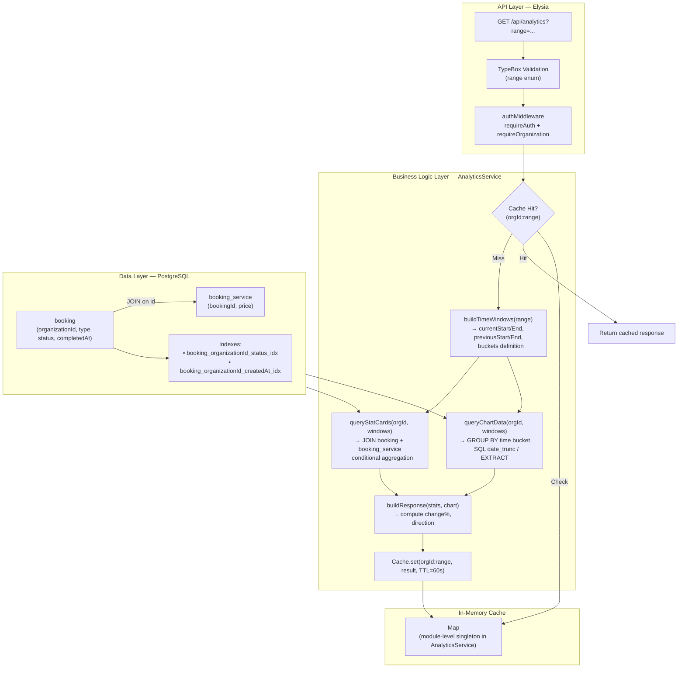
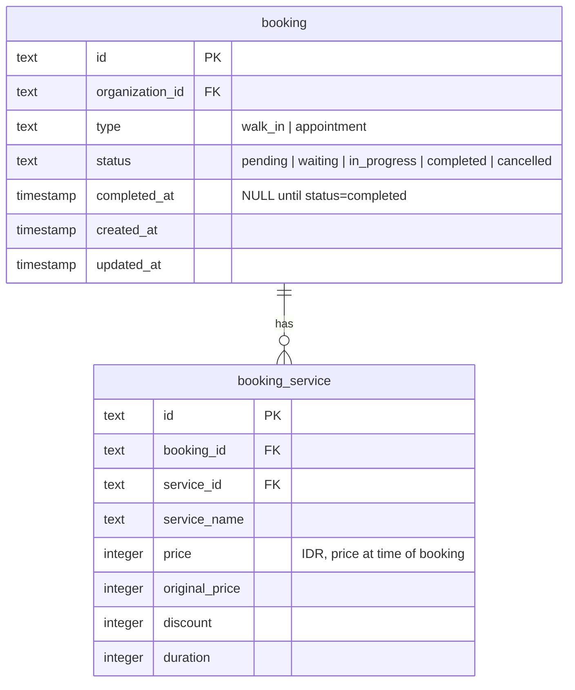

# Implementation Plan: Analytics — Sales & Booking Performance Dashboard

**Version:** 1.0  
**Date:** April 27, 2026  
**Status:** Draft  
**Feature PRD:** [prd.md](./prd.md)

---

## Goal

Implement a read-only `GET /api/analytics` endpoint that aggregates completed booking and sales data for the active organization, returning stat cards (total sales, total bookings, walk-ins, appointments) with period-over-period percentage change and a time-bucketed chart dataset. The endpoint accepts a `range` query parameter (`24h`, `week`, `month`, `6m`, `1y`) and caches results per `(organizationId, range)` for 60 seconds using an in-memory TTL cache. No new database tables are required — all data is derived from the existing `booking` and `booking_service` tables.

---

## Requirements

- `GET /api/analytics?range=<range>` where `range` ∈ `{ 24h, week, month, 6m, 1y }`.
- Endpoint is protected: `requireAuth: true`, `requireOrganization: true`.
- Returns four stat cards: **Total Sales (IDR)**, **Total Bookings**, **Appointments**, **Walk-Ins**.
- Each stat card contains: `current` value, `previous` value, `change` (percentage to 1 decimal, or `null` if previous = 0), `direction` (`up` | `down` | `neutral`).
- Returns a time-bucketed chart dataset with `label`, `sales`, and `bookings` per bucket.
- Bucket counts: `24h` → 24 hourly; `week` → 7 daily; `month` → daily per calendar month; `6m` → 6 monthly; `1y` → 12 monthly.
- Only `status = 'completed'` bookings contribute. Uses `completedAt` as the event timestamp.
- All monetary values are integers (IDR, no decimals).
- All time calculations use WIB (UTC+7) to align with existing booking logic in the codebase.
- Results cached per `(organizationId, range)` for 60 seconds using a module-level in-memory Map.
- Invalid `range` value returns `400 Bad Request` via Elysia TypeBox validation.
- Cross-tenant isolation enforced at every query with `organizationId` predicate.
- No new Drizzle migrations needed; no new database tables.

---

## Technical Considerations

### System Architecture Overview



**Technology Stack Selection:**

| Layer | Choice | Rationale |
|---|---|---|
| Caching | In-memory `Map` with TTL | No Redis in the current stack. A module-level Map is zero-infrastructure, sufficient for single-instance deployment. For horizontal scaling, this becomes a Phase 2 upgrade to Redis. |
| DB aggregation | Drizzle `sql` template literals with conditional aggregation | Drizzle's typed query builder does not cover `FILTER (WHERE ...)` clauses; raw `sql` tagged templates are the idiomatic escape hatch. All other safety guarantees (connection pooling, parameterization) are preserved. |
| Date math | Native `Date` + WIB offset constant | Matches the pattern already established in `BookingService` (`WIB_OFFSET_MS = 7 * 60 * 60 * 1000`). No external date library needed. |
| Validation | Elysia TypeBox `t.Union([t.Literal(...)])` | Consistent with all other query parameter validation in the codebase; rejects invalid ranges before hitting service layer. |

**Integration Points:**

- Reads from `booking` and `booking_service` tables (already defined in `src/modules/bookings/schema.ts`).
- Consumes `activeOrganizationId` from `authMiddleware` — no new middleware required.
- Registers handler in `src/app.ts` alongside other module handlers.

**Scalability Considerations:**

- The in-memory cache works correctly for a single Bun process. If the deployment evolves to multiple instances, replace the Map with a shared Redis cache keyed on `(organizationId, range)`.
- The SQL queries use covering indexes already present on the `booking` table. For shops with very large booking histories (>100k rows), adding a composite index on `(organizationId, status, completedAt)` would be the next performance lever.

---

### Database Schema Design

No new tables are required. The analytics feature is a pure read/aggregation layer over two existing tables.



**Existing indexes leveraged for analytics queries:**

| Index | Columns | Usage |
|---|---|---|
| `booking_organizationId_status_idx` | `organization_id, status` | Filter `status = 'completed'` per org |
| `booking_organizationId_createdAt_idx` | `organization_id, created_at` | Fallback time range filter |
| `booking_service_bookingId_idx` | `booking_id` | JOIN side of booking_service |

**Additional recommended index** (via a new migration):

| Index Name | Table | Columns | Rationale |
|---|---|---|---|
| `booking_organizationId_status_completedAt_idx` | `booking` | `(organization_id, status, completed_at)` | Covers the exact filter pattern used by analytics: `org + status='completed' + completedAt BETWEEN`. This eliminates the need to scan `createdAt` fallback and ensures p95 ≤ 2s even for large datasets. |

The migration file should be named: `bunx drizzle-kit generate --name add_analytics_completed_at_index`

---

### API Design

#### Endpoint

```
GET /api/analytics?range={range}
```

**Authentication:** `requireAuth: true`, `requireOrganization: true`  
**Tags:** `Analytics`

#### Query Parameter

| Parameter | Type | Required | Values | Default |
|---|---|---|---|---|
| `range` | string enum | Yes | `24h`, `week`, `month`, `6m`, `1y` | — |

Validation uses TypeBox `t.Union([t.Literal('24h'), t.Literal('week'), t.Literal('month'), t.Literal('6m'), t.Literal('1y')])`. Any other value produces a `400 Bad Request` before reaching the service.

#### Response Shape (TypeScript types — define in `model.ts`)

```typescript
// StatCard
interface StatCard {
    current: number          // integer IDR or count
    previous: number         // integer IDR or count
    change: number | null    // percentage, 1 decimal place; null if previous = 0
    direction: 'up' | 'down' | 'neutral'
}

// ChartBucket
interface ChartBucket {
    label: string    // e.g., "Mon", "Jan", "01", "00:00"
    sales: number    // integer IDR
    bookings: number // count
}

// AnalyticsResponse (data field)
interface AnalyticsResponse {
    range: '24h' | 'week' | 'month' | '6m' | '1y'
    stats: {
        totalSales: StatCard
        totalBookings: StatCard
        appointments: StatCard
        walkIns: StatCard
    }
    chart: {
        sales: ChartBucket[]
        bookings: ChartBucket[]
    }
}
```

Wrapped in the standard `formatResponse` envelope:

```typescript
{
    path: string
    message: string
    data: AnalyticsResponse
    status: 200
    timeStamp: string
}
```

#### Status Codes

| Code | Scenario |
|---|---|
| `200 OK` | Successful analytics response (cache hit or miss) |
| `400 Bad Request` | Invalid `range` value |
| `401 Unauthorized` | No session cookie |
| `403 Forbidden` | No active organization in session |
| `500 Internal Server Error` | Unexpected database or runtime error |

#### Multi-Tenant Scoping

Every SQL query in `AnalyticsService` must include `AND b.organization_id = $orgId` as the first predicate. The `organizationId` is derived exclusively from the authenticated session (`activeOrganizationId`) — never from query parameters or request body.

#### Caching Strategy

- **Cache key:** `${organizationId}:${range}` (string).
- **Cache store:** Module-level `Map<string, { data: AnalyticsResponse; expiresAt: number }>` in `AnalyticsService`.
- **TTL:** 60,000 ms (60 seconds).
- **On read:** Check `Date.now() < expiresAt`. If stale, delete entry and recompute.
- **On write:** Store result with `expiresAt = Date.now() + 60_000`.
- **Cache invalidation:** Relies on TTL expiry only (acceptable per PRD). No explicit invalidation on booking status change in Phase 1.

---

### File-by-File Implementation Plan

#### `src/modules/analytics/model.ts`

Define all TypeBox schemas inside a `AnalyticsModel` namespace:

- `AnalyticsRangeEnum` — `t.Union` of the 5 range literals. Used for query validation.
- `AnalyticsQueryParam` — `t.Object({ range: AnalyticsRangeEnum })`.
- `StatCardSchema` — `t.Object({ current, previous, change (nullable number), direction })`.
- `ChartBucketSchema` — `t.Object({ label, sales, bookings })`.
- `AnalyticsResponseSchema` — `t.Object({ range, stats, chart })`.
- TypeScript export types: `AnalyticsRange`, `StatCard`, `ChartBucket`, `AnalyticsResponse`.

#### `src/modules/analytics/service.ts`

`export abstract class AnalyticsService`

**Private module-level cache:** `const cache = new Map<string, { data: AnalyticsResponse; expiresAt: number }>()`

**Private static methods:**

1. `buildTimeWindows(range, now): TimeWindows`
   - Converts `now` to a WIB `Date` using the `WIB_OFFSET_MS` constant (copy the same pattern from `BookingService`).
   - Returns: `{ currentStart, currentEnd, previousStart, previousEnd, buckets: BucketDef[] }`.
   - Bucket definitions encode label format and start/end for each time bucket.
   - Time window boundaries for each range:
     - `24h`: current = `[now - 24h, now)`, previous = `[now - 48h, now - 24h)`, 24 hourly buckets.
     - `week`: current = `[startOfToday - 6d, endOfToday)`, previous same duration shifted back 7 days, 7 daily buckets.
     - `month`: current = `[startOfCalendarMonth, endOfCalendarMonth)`, previous = same for prior month, daily buckets.
     - `6m`: current = `[startOf6MonthsAgo, now)`, previous = `[startOf12MonthsAgo, startOf6MonthsAgo)`, 6 monthly buckets.
     - `1y`: current = `[startOf12MonthsAgo, now)`, previous = `[startOf24MonthsAgo, startOf12MonthsAgo)`, 12 monthly buckets.

2. `queryAggregates(organizationId, start, end): Promise<{ sales, bookings, appointments, walkIns }>`
   - Single SQL query using `sql` template literal.
   - JOINs `booking` ↔ `booking_service` on `booking.id = booking_service.booking_id`.
   - Filters: `organization_id = $orgId`, `status = 'completed'`, `completed_at >= $start AND completed_at < $end`.
   - Returns: `SUM(bs.price)` as `sales`, `COUNT(DISTINCT b.id)` as `bookings`, conditional counts for `appointments` and `walkIns`.
   - **Why `COUNT(DISTINCT b.id)` for bookings?** A single booking may have multiple `booking_service` rows; the JOIN inflates booking count without `DISTINCT`.

3. `queryChartBuckets(organizationId, buckets: BucketDef[]): Promise<ChartBucket[]>`
   - Iterates over each `BucketDef` and runs `queryAggregates` for that bucket's window.
   - For performance with many buckets (e.g., 30 daily for `month`), batches using `Promise.all` to parallelize bucket queries — acceptable since each query is small and indexed.
   - Maps results to `{ label, sales, bookings }`.

4. `computeStatCard(current: number, previous: number): StatCard`
   - Pure function: computes `change = previous === 0 ? null : ((current - previous) / previous * 100)` rounded to 1 decimal.
   - `direction`: `current > previous → 'up'`, `current < previous → 'down'`, else `'neutral'` (also `'neutral'` when `change === null`).

**Public static method:**

`static async getAnalytics(organizationId: string, range: AnalyticsRange): Promise<AnalyticsResponse>`

Pseudocode:
```
1. cacheKey = `${organizationId}:${range}`
2. cached = cache.get(cacheKey)
3. if cached && Date.now() < cached.expiresAt → return cached.data
4. if cached && expired → cache.delete(cacheKey)
5. windows = buildTimeWindows(range, new Date())
6. [currentAgg, previousAgg] = await Promise.all([
       queryAggregates(orgId, windows.currentStart, windows.currentEnd),
       queryAggregates(orgId, windows.previousStart, windows.previousEnd)
   ])
7. chartBuckets = await queryChartBuckets(orgId, windows.buckets)
8. response = {
       range,
       stats: {
           totalSales:    computeStatCard(currentAgg.sales, previousAgg.sales),
           totalBookings: computeStatCard(currentAgg.bookings, previousAgg.bookings),
           appointments:  computeStatCard(currentAgg.appointments, previousAgg.appointments),
           walkIns:       computeStatCard(currentAgg.walkIns, previousAgg.walkIns)
       },
       chart: {
           sales:    chartBuckets.map(b => ({ label: b.label, sales: b.sales, bookings: 0 })),
           bookings: chartBuckets.map(b => ({ label: b.label, sales: 0, bookings: b.bookings }))
       }
   }
   // Note: chart sales and bookings share the same buckets; returning separately for frontend flexibility
9. cache.set(cacheKey, { data: response, expiresAt: Date.now() + 60_000 })
10. return response
```

#### `src/modules/analytics/handler.ts`

```
new Elysia({ prefix: '/analytics', tags: ['Analytics'] })
    .use(authMiddleware)
    .get('/', handler, {
        requireAuth: true,
        requireOrganization: true,
        query: AnalyticsModel.AnalyticsQueryParam,
        response: FormatResponseSchema(AnalyticsModel.AnalyticsResponseSchema)
    })
```

Handler body: calls `AnalyticsService.getAnalytics(activeOrganizationId, query.range)` and wraps in `formatResponse`.

#### `src/app.ts`

Import `analyticsHandler` from `src/modules/analytics/handler.ts` and register under `.use(analyticsHandler)` alongside other module handlers. The API prefix resolves to `/api/analytics`.

#### `drizzle/schemas.ts`

No changes needed — no new tables. If the recommended index migration is added (see Database Schema Design), the `booking` table's schema definition in `src/modules/bookings/schema.ts` gains the new composite index, and `bunx drizzle-kit generate` produces the migration file automatically.

---

### Security & Performance

#### Authentication & Authorization

- `requireAuth` macro ensures a valid Better Auth session exists; throws `401` otherwise.
- `requireOrganization` macro ensures `session.activeOrganizationId` is non-null; throws `403` otherwise.
- `organizationId` is never accepted from user input — it is always sourced from the verified session.
- No owner-role enforcement at API layer beyond `requireOrganization` (PRD specifies owners; enforcing member role can be a Phase 2 addition once role-based access is standardized in the middleware).

#### Data Validation & Sanitization

- `range` is validated via TypeBox `t.Union` of exact string literals — no string injection possible.
- All SQL queries use parameterized values via Drizzle's `sql` template tag — no SQL injection risk.
- Response values are computed integers and strings; no user-controlled data is reflected in the output.

#### Performance Optimization

- The cache eliminates repeated DB round-trips within a 60s window for the same tenant + range.
- `Promise.all` for current and previous period aggregates runs both queries concurrently, halving the wall-clock time for DB round-trips.
- `Promise.all` for chart bucket queries parallelizes up to 30 small queries (for `month` range) — each query is covered by the composite index and expected to return in <10ms.
- The recommended `(organizationId, status, completedAt)` composite index ensures the analytics WHERE clause is fully covered; the query planner can execute an index-only scan for the stats aggregation.
- Monetary values kept as integers throughout (no float arithmetic) to avoid precision issues.

---

## Testing Plan

**File:** `tests/modules/analytics.test.ts`

### Setup

Use the standard Eden Treaty client with Better Auth sign-up → cookie pattern. Create an organization and set it active in `beforeAll`. Use direct `db` inserts (via Drizzle) to seed `booking` and `booking_service` rows with controlled `completedAt` timestamps and `status = 'completed'`.

### Test Cases

| # | Description | AC |
|---|---|---|
| T-1 | Returns `200` with correct `totalSales` and `totalBookings` for `range=week` with seeded data | AC-1 |
| T-2 | Returns `+100.0%` direction `up` when current bookings double previous | AC-2 |
| T-3 | Returns `change: null` and `direction: 'neutral'` when previous period has 0 bookings | AC-3 |
| T-4 | Returns correct `walkIns` and `appointments` split | AC-4 |
| T-5 | Returns exactly 7 chart buckets with `label`, `sales`, `bookings` for `range=week` | AC-5 |
| T-6 | Bookings with `status != 'completed'` do not contribute to stats | AC-6 |
| T-7 | Owner B cannot see Owner A's data (two separate org setups) | AC-7 |
| T-8 | `range=forever` returns `400 Bad Request` | AC-8 |
| T-9 | Second identical request within 60s returns same result without additional DB queries (cache hit observable via timing or spy) | AC-9 |
| T-10 | Unauthenticated request returns `401` | — |
| T-11 | Authenticated but no active org returns `403` | — |
| T-12 | `range=24h` returns exactly 24 chart buckets | — |
| T-13 | `range=6m` returns exactly 6 chart buckets | — |
| T-14 | `range=1y` returns exactly 12 chart buckets | — |

### Seeding Strategy

- Use `nanoid()` for IDs. Insert `booking` rows with explicit `completedAt` values anchored to known WIB timestamps to ensure deterministic bucket placement.
- Seed both a "current period" and "previous period" batch to validate the period-over-period logic.
- Seed `booking_service` rows with known prices to assert exact `sales` totals.
- Clean up seeded rows in `afterAll` using `db.delete(booking).where(eq(booking.organizationId, orgId))`.

---

## Implementation Order

1. Add the composite index to `src/modules/bookings/schema.ts` and generate the migration.
2. Implement `src/modules/analytics/model.ts`.
3. Implement `src/modules/analytics/service.ts` (time windows, aggregation queries, cache, stat card computation).
4. Implement `src/modules/analytics/handler.ts`.
5. Register handler in `src/app.ts`.
6. Implement `tests/modules/analytics.test.ts`.
7. Run `bun run lint:fix && bun run format`.
8. Run `bun test analytics` to validate.
