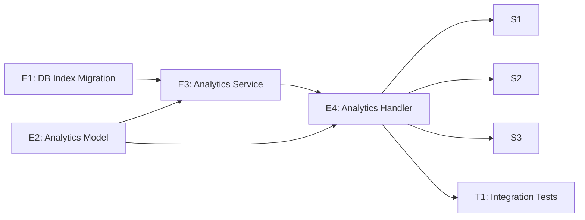

# Project Plan: Analytics — Sales & Booking Performance Dashboard

**Version:** 1.0  
**Date:** April 27, 2026  
**Status:** Draft  
**Feature PRD:** [prd.md](./prd.md)  
**Implementation Plan:** [implementation-plan.md](./implementation-plan.md)

---

## Summary

End-to-end breakdown of all GitHub issues required to deliver the Analytics feature. The feature is a read-only `GET /api/analytics` endpoint that aggregates completed booking and sales data per organization, returning stat cards with period-over-period change and time-bucketed chart data.

**Total Estimate:** 14 story points · **Size:** M

---

## Issue Hierarchy

```
Feature: Analytics Dashboard (#F)
├── Enabler: DB composite index migration              (#E1)  [P1]
├── Enabler: Analytics model definitions               (#E2)  [P1]
├── Enabler: Analytics service implementation          (#E3)  [P0] — blocked by E1, E2
├── Enabler: Analytics handler + app registration      (#E4)  [P0] — blocked by E2, E3
├── Story:   View stat cards with period comparison    (#S1)  [P1] — blocked by E4
├── Story:   Filter analytics by time range            (#S2)  [P1] — blocked by E4
├── Story:   View time-bucketed chart data             (#S3)  [P1] — blocked by E4
└── Test:    Integration tests for analytics endpoint  (#T1)  [P1] — blocked by E4
```

---

## Dependency Graph



---

## Critical Path

`E2 → E3 → E4 → T1` — the service is the most complex piece; all user stories and tests are gated on the handler registration.

---

## Issue Templates

---

### Feature Issue

```markdown
# Feature: Analytics — Sales & Booking Performance Dashboard

## Feature Description

Provide a read-only `GET /api/analytics?range=<range>` endpoint that aggregates completed
booking and sales data for the active organization. Returns four stat cards (total sales,
total bookings, walk-ins, appointments) with period-over-period percentage change and a
time-bucketed chart dataset. Results cached per `(organizationId, range)` for 60 seconds.

## User Stories in this Feature

- [ ] #{S1} - View stat cards with period comparison
- [ ] #{S2} - Filter analytics by time range
- [ ] #{S3} - View time-bucketed chart data

## Technical Enablers

- [ ] #{E1} - DB composite index migration
- [ ] #{E2} - Analytics model definitions
- [ ] #{E3} - Analytics service implementation
- [ ] #{E4} - Analytics handler + app registration

## Tests

- [ ] #{T1} - Integration tests for analytics endpoint

## Dependencies

**Blocks**: nothing  
**Blocked by**: nothing (foundational feature)

## Acceptance Criteria

- [ ] `GET /api/analytics?range=<range>` returns 200 with stat cards and chart data
- [ ] All five range values (`24h`, `week`, `month`, `6m`, `1y`) are supported
- [ ] Stat cards include `current`, `previous`, `change`, and `direction` fields
- [ ] Chart buckets match the expected count per range
- [ ] Only `status = 'completed'` bookings contribute to stats
- [ ] Organization isolation enforced — no cross-tenant data
- [ ] Invalid `range` returns 400
- [ ] Unauthenticated request returns 401
- [ ] No active org returns 403
- [ ] Results cached for 60 seconds per `(organizationId, range)`

## Definition of Done

- [ ] All user stories delivered
- [ ] All technical enablers completed
- [ ] Integration tests passing (`bun test analytics`)
- [ ] Lint and format checks passing (`bun run lint:fix && bun run format`)
- [ ] No new security vulnerabilities introduced

## Labels

`feature`, `priority-high`, `value-high`, `backend`

## Epic

#{epic-issue-number} — Cukkr Barbershop Management & Booking System

## Estimate

M (14 story points)
```

---

### Enabler Issues

---

#### E1 — DB Composite Index Migration

```markdown
# Technical Enabler: DB Composite Index for Analytics Queries

## Enabler Description

Add a composite index `(organization_id, status, completed_at)` on the `booking` table
to fully cover the analytics WHERE clause pattern. Without this index, large booking
histories require a sequential scan over the existing `(organization_id, status)` index
followed by a filter on `completed_at`, which degrades to O(n) for busy shops.

## Technical Requirements

- [ ] Add `index('booking_organizationId_status_completedAt_idx')` to `booking` table schema in
      `src/modules/bookings/schema.ts`
- [ ] Run `bunx drizzle-kit generate --name add_analytics_completed_at_index` to generate the
      migration file
- [ ] Verify the generated SQL creates the correct composite index
- [ ] Run `bunx drizzle-kit check` to validate the migration
- [ ] Apply with `bunx drizzle-kit migrate` in the target environment

## Acceptance Criteria

- [ ] Migration file created under `drizzle/`
- [ ] `bunx drizzle-kit check` passes with no warnings
- [ ] Index name is `booking_organizationId_status_completedAt_idx`
- [ ] Columns are `(organization_id, status, completed_at)` in that order

## Definition of Done

- [ ] Schema updated
- [ ] Migration file generated and committed
- [ ] `bun run lint:fix && bun run format` passing

## Labels

`enabler`, `priority-high`, `value-medium`, `backend`, `database`

## Feature

#{F}

## Estimate

1 story point
```

---

#### E2 — Analytics Model Definitions

```markdown
# Technical Enabler: Analytics Model (TypeBox Schemas & TypeScript Types)

## Enabler Description

Define all TypeBox validation schemas and exported TypeScript types for the analytics
feature in `src/modules/analytics/model.ts`. These types are shared between the handler
(for request/response validation) and the service (for type-safe return values).

## Technical Requirements

- [ ] Create `src/modules/analytics/model.ts`
- [ ] Define `AnalyticsRangeEnum` as `t.Union` of five string literals: `24h`, `week`,
      `month`, `6m`, `1y`
- [ ] Define `AnalyticsQueryParam` as `t.Object({ range: AnalyticsRangeEnum })`
- [ ] Define `StatCardSchema`: `{ current, previous, change (nullable number), direction }`
- [ ] Define `ChartBucketSchema`: `{ label, sales, bookings }`
- [ ] Define `AnalyticsResponseSchema`: `{ range, stats: { totalSales, totalBookings,
      appointments, walkIns }, chart: { sales, bookings } }`
- [ ] Export TypeScript types: `AnalyticsRange`, `StatCard`, `ChartBucket`, `AnalyticsResponse`
- [ ] Export all under an `AnalyticsModel` namespace

## Acceptance Criteria

- [ ] `AnalyticsModel.AnalyticsQueryParam` rejects values outside the five literals
- [ ] `StatCard.change` accepts both `number` and `null`
- [ ] All TypeScript types exported and used in service/handler without `any`

## Definition of Done

- [ ] `src/modules/analytics/model.ts` created
- [ ] No TypeScript errors
- [ ] `bun run lint:fix && bun run format` passing

## Labels

`enabler`, `priority-high`, `value-medium`, `backend`

## Feature

#{F}

## Estimate

1 story point
```

---

#### E3 — Analytics Service Implementation

```markdown
# Technical Enabler: Analytics Service (Time Windows, Aggregation, Cache)

## Enabler Description

Implement `src/modules/analytics/service.ts` as an abstract class `AnalyticsService`
with a module-level in-memory TTL cache. The service computes time window boundaries for
each range, executes two concurrent aggregate SQL queries (current and previous periods),
parallelises chart bucket queries, and builds the final response.

## Technical Requirements

- [ ] Create `src/modules/analytics/service.ts`
- [ ] Declare module-level `cache = new Map<string, { data: AnalyticsResponse; expiresAt: number }>()`
- [ ] Implement private static `buildTimeWindows(range, now)` returning
      `{ currentStart, currentEnd, previousStart, previousEnd, buckets: BucketDef[] }`
      — all boundaries in WIB (UTC+7) using `WIB_OFFSET_MS = 7 * 60 * 60 * 1000`
- [ ] Implement private static `queryAggregates(organizationId, start, end)` using Drizzle
      `sql` template literals with `FILTER (WHERE ...)` conditional aggregation;
      uses `COUNT(DISTINCT b.id)` for booking count to avoid JOIN inflation
- [ ] Implement private static `queryChartBuckets(organizationId, buckets)` parallelising
      bucket queries with `Promise.all`
- [ ] Implement private static `computeStatCard(current, previous): StatCard` — pure function
- [ ] Implement public static `getAnalytics(organizationId, range): Promise<AnalyticsResponse>`
      with cache read/write (TTL 60,000 ms)
- [ ] Throw `AppError` (never plain `Error`) for unexpected failures
- [ ] Never accept `organizationId` from user input — always from caller

## Time Window Boundaries

| Range   | Current Window                                 | Previous Window                                |
|---------|------------------------------------------------|------------------------------------------------|
| `24h`   | `[now - 24h, now)`                             | `[now - 48h, now - 24h)`                       |
| `week`  | `[startOfToday - 6d, endOfToday)`              | same duration shifted back 7 days              |
| `month` | `[startOfCalendarMonth, endOfCalendarMonth)`   | same for prior calendar month                  |
| `6m`    | `[startOf6MonthsAgo, now)`                     | `[startOf12MonthsAgo, startOf6MonthsAgo)`      |
| `1y`    | `[startOf12MonthsAgo, now)`                    | `[startOf24MonthsAgo, startOf12MonthsAgo)`     |

## Acceptance Criteria

- [ ] `buildTimeWindows('week', now)` returns exactly 7 `BucketDef` entries
- [ ] `buildTimeWindows('24h', now)` returns exactly 24 `BucketDef` entries
- [ ] `buildTimeWindows('month', now)` returns one entry per day in the calendar month
- [ ] `buildTimeWindows('6m', now)` returns exactly 6 `BucketDef` entries
- [ ] `buildTimeWindows('1y', now)` returns exactly 12 `BucketDef` entries
- [ ] `queryAggregates` filters by `organizationId`, `status = 'completed'`,
      and `completedAt BETWEEN start AND end`
- [ ] `computeStatCard(0, 0)` returns `{ change: null, direction: 'neutral' }`
- [ ] Cache hit returns stored value without DB query within 60s window
- [ ] Expired cache entry triggers a fresh DB query

## Definition of Done

- [ ] `src/modules/analytics/service.ts` created
- [ ] No TypeScript errors, no `any`
- [ ] `bun run lint:fix && bun run format` passing

## Labels

`enabler`, `priority-critical`, `value-high`, `backend`

## Feature

#{F}

## Estimate

5 story points
```

---

#### E4 — Analytics Handler + App Registration

```markdown
# Technical Enabler: Analytics Handler and App Registration

## Enabler Description

Create `src/modules/analytics/handler.ts` as an Elysia group and register it in
`src/app.ts`. The handler wires together `authMiddleware`, TypeBox query validation,
and `AnalyticsService.getAnalytics`, wrapping the result in `formatResponse`.

## Technical Requirements

- [ ] Create `src/modules/analytics/handler.ts`
- [ ] Instantiate `new Elysia({ prefix: '/analytics', tags: ['Analytics'] })`
- [ ] `.use(authMiddleware)` before defining routes
- [ ] Define `GET /` with `{ requireAuth: true, requireOrganization: true,
      query: AnalyticsModel.AnalyticsQueryParam }` macro options
- [ ] Call `AnalyticsService.getAnalytics(activeOrganizationId, query.range)` in handler body
- [ ] Wrap result in `formatResponse` before returning
- [ ] Import and register `analyticsHandler` in `src/app.ts` alongside other module handlers
- [ ] Resolved API path must be `/api/analytics`

## Acceptance Criteria

- [ ] `GET /api/analytics?range=week` returns 200 for authenticated org member
- [ ] Missing cookie returns 401
- [ ] No active org returns 403
- [ ] `range=forever` returns 400 (TypeBox rejects before handler body)

## Definition of Done

- [ ] `src/modules/analytics/handler.ts` created
- [ ] `src/app.ts` updated with handler registration
- [ ] No TypeScript errors
- [ ] `bun run lint:fix && bun run format` passing

## Labels

`enabler`, `priority-critical`, `value-high`, `backend`

## Feature

#{F}

## Estimate

2 story points
```

---

### User Story Issues

---

#### S1 — View Stat Cards with Period Comparison

```markdown
# User Story: View Stat Cards with Period Comparison

## Story Statement

As a **barbershop owner**, I want to view total sales, total bookings, appointments, and
walk-ins for a selected period with a percentage change vs the previous equivalent period
so that I can quickly understand my business performance trend.

## Acceptance Criteria

- [ ] Response contains `totalSales`, `totalBookings`, `appointments`, `walkIns` stat cards
- [ ] Each card has `current`, `previous`, `change` (to 1 decimal or null), and `direction`
- [ ] When previous = 0, `change` is `null` and `direction` is `neutral`
- [ ] When current > previous, `direction` is `up`; when current < previous, `direction` is `down`
- [ ] Only `status = 'completed'` bookings contribute to any stat
- [ ] All monetary values are integers (IDR, no decimals)

## Technical Tasks

- [ ] #{E3} - Analytics service (stat card computation)
- [ ] #{E4} - Analytics handler (route wiring)

## Testing Requirements

- [ ] #{T1} - T-1: correct totals; T-2: +100% direction up; T-3: null change; T-4: walk-in/appointment split; T-6: only completed bookings

## Dependencies

**Blocked by**: #{E4}

## Definition of Done

- [ ] Acceptance criteria met
- [ ] Integration tests T-1 through T-4 and T-6 passing

## Labels

`user-story`, `priority-high`, `value-high`, `backend`

## Feature

#{F}

## Estimate

2 story points
```

---

#### S2 — Filter Analytics by Time Range

```markdown
# User Story: Filter Analytics by Time Range

## Story Statement

As a **barbershop owner**, I want to select a time range (`24h`, `week`, `month`, `6m`, `1y`)
so that I can analyze my shop's performance over different periods and make informed decisions.

## Acceptance Criteria

- [ ] All five range values are accepted and produce correct time window boundaries
- [ ] Buckets in the chart data align to the correct calendar period for each range
- [ ] An unsupported range value (`range=forever`, etc.) returns `400 Bad Request`
- [ ] The previous period is always the same duration, immediately preceding the current window

## Technical Tasks

- [ ] #{E2} - Range enum definition in model
- [ ] #{E3} - `buildTimeWindows` logic in service

## Testing Requirements

- [ ] #{T1} - T-8: invalid range; T-12: 24h buckets; T-13: 6m buckets; T-14: 1y buckets

## Dependencies

**Blocked by**: #{E4}

## Definition of Done

- [ ] Acceptance criteria met
- [ ] Integration tests T-8, T-12, T-13, T-14 passing

## Labels

`user-story`, `priority-high`, `value-high`, `backend`

## Feature

#{F}

## Estimate

1 story point
```

---

#### S3 — View Time-Bucketed Chart Data

```markdown
# User Story: View Time-Bucketed Chart Data

## Story Statement

As a **barbershop owner**, I want to see a bar chart broken into time buckets so that I
can identify which days, weeks, or months drove the most revenue and bookings.

## Acceptance Criteria

- [ ] Response contains `chart.sales` and `chart.bookings` arrays
- [ ] Each bucket has `label` (human-readable), `sales` (IDR integer), `bookings` (count)
- [ ] `range=24h` returns exactly 24 buckets labelled by hour (e.g., `"00:00"`)
- [ ] `range=week` returns exactly 7 buckets labelled by short day name (e.g., `"Mon"`)
- [ ] `range=month` returns one bucket per calendar day
- [ ] `range=6m` returns exactly 6 buckets labelled by short month name
- [ ] `range=1y` returns exactly 12 buckets labelled by short month name
- [ ] Buckets with zero activity return `sales: 0` and `bookings: 0` (not omitted)

## Technical Tasks

- [ ] #{E3} - `queryChartBuckets` in service (parallel bucket queries)

## Testing Requirements

- [ ] #{T1} - T-5: 7 chart buckets for week; T-12/T-13/T-14: bucket counts for other ranges

## Dependencies

**Blocked by**: #{E4}

## Definition of Done

- [ ] Acceptance criteria met
- [ ] Integration tests T-5, T-12, T-13, T-14 passing

## Labels

`user-story`, `priority-high`, `value-high`, `backend`

## Feature

#{F}

## Estimate

2 story points
```

---

### Test Issue

---

#### T1 — Integration Tests for Analytics Endpoint

```markdown
# Test: Integration Tests for Analytics Endpoint

## Test Description

Full integration test suite for `GET /api/analytics` covering all 14 test cases defined
in the implementation plan. Uses Eden Treaty client, Better Auth sign-up + org creation
pattern, and direct Drizzle inserts to seed deterministic `booking` and `booking_service`
rows with controlled `completedAt` timestamps.

## Test Cases

| # | Description | ACs |
|---|---|---|
| T-1 | Returns 200 with correct `totalSales` and `totalBookings` for `range=week` | AC-1 |
| T-2 | Returns `+100.0%` / direction `up` when current bookings double previous | AC-2 |
| T-3 | Returns `change: null` and `direction: 'neutral'` when previous period = 0 | AC-3 |
| T-4 | Returns correct `walkIns` and `appointments` split | AC-4 |
| T-5 | Returns exactly 7 chart buckets with `label`, `sales`, `bookings` for `range=week` | AC-5 |
| T-6 | Bookings with `status != 'completed'` do not contribute | AC-6 |
| T-7 | Owner B cannot see Owner A's data (two org setups) | AC-7 |
| T-8 | `range=forever` returns 400 | AC-8 |
| T-9 | Second identical request within 60s served from cache | AC-9 |
| T-10 | Unauthenticated request returns 401 | — |
| T-11 | Authenticated but no active org returns 403 | — |
| T-12 | `range=24h` returns exactly 24 chart buckets | — |
| T-13 | `range=6m` returns exactly 6 chart buckets | — |
| T-14 | `range=1y` returns exactly 12 chart buckets | — |

## Implementation Requirements

- [ ] Create `tests/modules/analytics.test.ts`
- [ ] `beforeAll`: sign up user, create org, set org active, capture `authCookie`
- [ ] Seed `booking` rows with explicit `completedAt` anchored to known WIB timestamps
- [ ] Seed `booking_service` rows with known prices for exact `sales` assertion
- [ ] Seed both current-period and previous-period batches to validate change calculation
- [ ] `afterAll`: clean up all seeded rows via `db.delete(booking).where(eq(booking.organizationId, orgId))`
- [ ] For T-7: create a second user + org and assert data isolation
- [ ] For T-9: call endpoint twice, measure elapsed time or spy on service to confirm cache hit

## Acceptance Criteria

- [ ] All 14 test cases pass
- [ ] `bun test analytics` exits 0
- [ ] No leftover test data in the database after test run

## Definition of Done

- [ ] `tests/modules/analytics.test.ts` created
- [ ] All 14 tests passing
- [ ] `bun run lint:fix && bun run format` passing

## Labels

`test`, `priority-high`, `value-high`, `backend`

## Feature

#{F}

## Estimate

3 story points
```

---

## Sprint Plan

### Sprint Capacity Recommendation

Two-sprint delivery assuming ~10 points per sprint:

#### Sprint 1 — Foundation (8 pts)

| Issue | Title | Points |
|---|---|---|
| E1 | DB composite index migration | 1 |
| E2 | Analytics model definitions | 1 |
| E3 | Analytics service implementation | 5 |
| E4 | Analytics handler + app registration | 1 |

**Sprint Goal:** Service layer complete and handler reachable at `/api/analytics`.

#### Sprint 2 — Validation & Delivery (6 pts)

| Issue | Title | Points |
|---|---|---|
| S1 | View stat cards with period comparison | 2 |
| S2 | Filter analytics by time range | 1 |
| S3 | View time-bucketed chart data | 2 |
| T1 | Integration tests for analytics endpoint | 3 |

**Sprint Goal:** All acceptance criteria validated by passing integration tests; feature ready for release.

> Sprint 1 and Sprint 2 can overlap if the test file is started while E3 is in progress — tests can be written against the service interface before the handler is registered.

---

## Definition of Done (Feature Level)

- [ ] All 14 integration tests pass (`bun test analytics`)
- [ ] Lint and format checks pass (`bun run lint:fix && bun run format`)
- [ ] No `any` types in new code
- [ ] No `console.log` or commented-out code committed
- [ ] Migration file generated and applied
- [ ] `src/app.ts` updated with handler registration
- [ ] No new cross-tenant data access paths
- [ ] All monetary values are integers (IDR)
