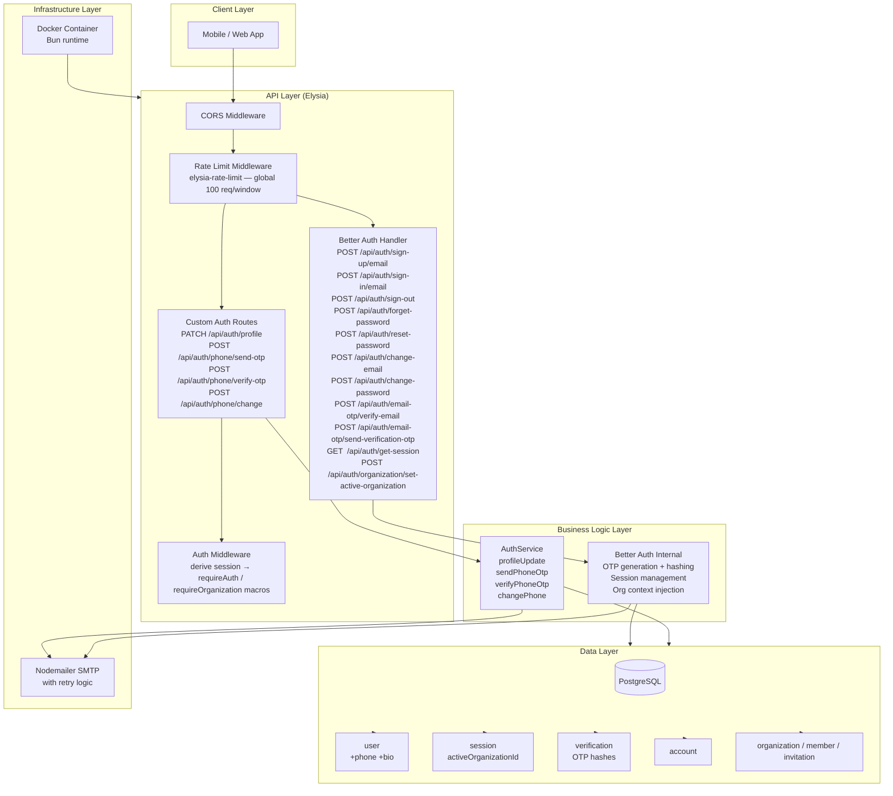
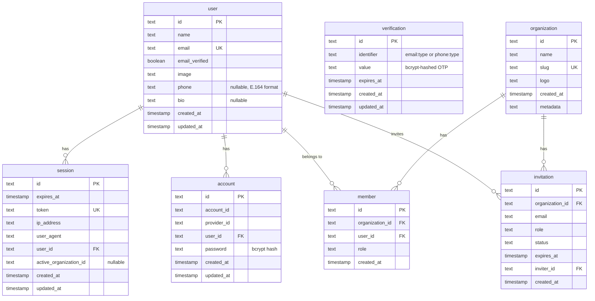

# Implementation Plan: Authentication & User Management

**Version:** 1.0  
**Date:** April 26, 2026  
**Status:** Draft  
**Feature PRD:** [prd.md](./prd.md)

---

## Goal

Deliver a production-ready authentication system for Cukkr that covers email/password registration with 4-digit OTP verification, session management via secure HTTP-only cookies, forgot-password and credential-change flows, phone number management, profile updates, and multi-tenant organization context injection. Better Auth (with `emailOTP` and `organization` plugins) handles the majority of auth mechanics; the implementation focuses on configuration hardening, schema extensions, custom endpoints for phone management and profile updates, rate-limit enforcement, and comprehensive test coverage.

---

## Requirements

- Configure Better Auth's `emailOTP` plugin: 4-digit OTPs, 5-minute expiry, 5-attempt invalidation.
- Add `phone` (E.164) and `bio` fields to the `user` table via migration.
- Implement a custom phone-change module with dual-OTP flow (old phone → new phone).
- Implement a custom profile-update endpoint (`name`, `bio`, `avatar`).
- Enforce per-IP login rate limiting (10 failures / 15 min) and per-email OTP resend rate limiting (3 resends / 15 min) at the application layer.
- Implement SMTP retry logic (up to 3 attempts on transient error) in `src/lib/mail.ts`.
- Expand the `auth.test.ts` test file to cover all PRD user stories.
- Register schema extensions in `drizzle/schemas.ts` and generate a migration.

---

## Feature Gap Analysis

The table below classifies each PRD user story against what Better Auth already provides vs. what requires custom work.

| PRD User Story | Provided By | Status | Notes |
|---|---|---|---|
| US-01 Registration | Better Auth `sign-up.email` | **Config only** | Enable email verification via `emailVerification.sendOnSignUp` |
| US-02/03 OTP (4-digit, 5-min) | Better Auth `emailOTP` plugin | **Config only** | Set `otpLength: 4`, `expiresIn: 300` |
| US-04 OTP Resend | Better Auth `email-otp/send-verification-otp` | **Config + Rate Limit** | Add resend rate limit middleware |
| US-05/06 Login + Session Cookie | Better Auth `sign-in.email` | **Already done** | Cookie attributes already configured |
| US-07 Logout | Better Auth `sign-out` | **Already done** | — |
| US-08–11 Forgot Password | Better Auth `forget-password` + emailOTP | **Config only** | OTP type `forget-password` already wired |
| US-12 Email Change | Better Auth `change-email` | **Config only** | Dual-OTP handled by plugin |
| US-13 Phone Change | Custom | **Build** | No Better Auth built-in; custom dual-OTP flow |
| US-14 Password Change | Better Auth `change-password` | **Already done** | — |
| US-15 Profile Update | Custom | **Build** | `bio` field + custom Elysia route |
| US-16/17 Org Context / Switch | Better Auth `organization` plugin | **Already done** | `activeOrganizationId` in session, `setActiveOrganization` endpoint |

---

## Technical Considerations

### System Architecture Overview



### Technology Stack Selection

| Layer | Technology | Rationale |
|---|---|---|
| Auth Framework | Better Auth v1.5 | Handles session, OTP, org, password flows out of the box with type-safe adapters |
| OTP Delivery | Nodemailer via SMTP | Already integrated; add retry wrapper |
| Rate Limiting | `elysia-rate-limit` (global) + Better Auth rate limit (auth-specific) | Global protects all routes; per-endpoint limits target auth abuse vectors specifically |
| Schema / Migration | Drizzle ORM + drizzle-kit | Consistent with existing codebase; migration-based workflow enforced |
| Validation | TypeBox (Elysia built-in) | End-to-end type safety from handler to service |

### Integration Points

- **Better Auth ↔ Drizzle**: `drizzleAdapter` already wired with the shared schema from `drizzle/schemas.ts`. Any new user fields (phone, bio) must be added to `src/modules/auth/schema.ts` and also reflected in the Better Auth `user` object via `additionalFields` config.
- **Auth Middleware ↔ Custom Routes**: Custom routes reuse `authMiddleware` with the `requireAuth` macro; no new session-extraction logic needed.
- **`sendOtpEmail` ↔ Better Auth**: Better Auth calls `sendVerificationOTP` hook; this already delegates to `sendOtpEmail`. The retry wrapper is added inside `sendOtpEmail`.

### Database Schema Design



#### Schema Changes Required

**`src/modules/auth/schema.ts` — `user` table additions:**

| Column | Type | Constraint | Notes |
|---|---|---|---|
| `phone` | `text` | nullable, unique | E.164 format; enforced at handler layer |
| `bio` | `text` | nullable | Free-text profile bio |

**Migration:**
```
bunx drizzle-kit generate --name add-user-phone-bio
bunx drizzle-kit migrate
```

#### Indexing Strategy

| Table | Index | Reason |
|---|---|---|
| `user` | `UNIQUE(phone)` | Enforce one account per phone; fast lookup on phone-change conflict check |
| `verification` | `INDEX(identifier)` | Already exists; OTP lookups are keyed by `identifier` |
| `session` | `INDEX(user_id)` | Already exists |

### API Design

All Better Auth routes are mounted at `/api/auth/*` via `auth.handler`. Custom routes are registered under the same prefix via a scoped Elysia group in `src/modules/auth/handler.ts`.

#### Better Auth Endpoints (configuration only — no new code)

| Method | Path | Auth | Description |
|---|---|---|---|
| POST | `/api/auth/sign-up/email` | — | Register; triggers OTP email |
| POST | `/api/auth/email-otp/verify-email` | — | Verify OTP → activate account |
| POST | `/api/auth/email-otp/send-verification-otp` | — | Resend OTP |
| POST | `/api/auth/sign-in/email` | — | Login |
| POST | `/api/auth/sign-out` | Session | Logout |
| GET  | `/api/auth/get-session` | — | Get current session |
| POST | `/api/auth/forget-password` | — | Initiate password reset |
| POST | `/api/auth/reset-password` | — | Complete password reset with OTP |
| POST | `/api/auth/change-email` | Session | Request email change |
| POST | `/api/auth/change-password` | Session | Change password |
| POST | `/api/auth/organization/create-organization` | Session | Create organization |
| POST | `/api/auth/organization/set-active-organization` | Session | Switch active org |

#### Custom Endpoints — Profile Update

**`PATCH /api/auth/profile`**

- Auth: `requireAuth`
- Request body:
  ```typescript
  {
    name?: string;          // min 1 char
    bio?: string;           // max 500 chars
    avatar?: string;        // URL string
  }
  ```
- Response `200`:
  ```typescript
  {
    success: true;
    data: { id: string; name: string; bio: string | null; image: string | null; };
  }
  ```
- Errors: `400` validation, `401` unauthenticated

#### Custom Endpoints — Phone Change

Phone change is a three-step flow because Better Auth has no built-in phone OTP. A temporary phone-otp record keyed by `userId` is stored in the existing `verification` table with identifier pattern `phone-change:{userId}`.

**Step 1: `POST /api/auth/phone/send-otp`**

- Auth: `requireAuth`
- Request:
  ```typescript
  { step: "old" | "new"; phone?: string; /* required when step === "new" */ }
  ```
- Behavior:
  - `step: "old"` — generates OTP, stores hashed value in `verification` with identifier `phone-change-old:{userId}`, emails it to the user's verified email address (phone SMS is out of scope for MVP; see PRD §8).
  - `step: "new"` — validates phone E.164, checks uniqueness, stores hashed OTP with identifier `phone-change-new:{userId}`, emails to verified email.
- Response `200`: `{ success: true }`
- Errors: `400` (invalid phone, already in use), `401`, `429` (rate limit)

> **Note:** PRD §8 states SMS OTP is out of scope for MVP. Phone OTP delivery falls back to the user's verified email address until SMS integration is available.

**Step 2: `POST /api/auth/phone/verify-otp`**

- Auth: `requireAuth`
- Request:
  ```typescript
  { step: "old" | "new"; otp: string; }
  ```
- Behavior:
  - Looks up `verification` record by identifier `phone-change-{step}:{userId}`.
  - Compares bcrypt hash.
  - On success for `step: "old"` → marks old-phone as verified in session context (store a short-lived `verification` record `phone-change-old-verified:{userId}` with 10-min expiry).
  - On success for `step: "new"` → confirms old-phone is verified, updates `user.phone`, deletes all phone-change verification records.
- Response `200`: `{ success: true; phoneUpdated?: boolean }`
- Errors: `400` (wrong/expired OTP), `401`, `409` (phone taken)

#### Request/Response TypeBox Schemas (model.ts)

```typescript
// UpdateProfileDto
const UpdateProfileBody = t.Object({
  name: t.Optional(t.String({ minLength: 1 })),
  bio: t.Optional(t.String({ maxLength: 500 })),
  avatar: t.Optional(t.String({ format: 'uri' })),
})

// PhoneSendOtpDto
const PhoneSendOtpBody = t.Object({
  step: t.Union([t.Literal('old'), t.Literal('new')]),
  phone: t.Optional(t.String({ pattern: '^\\+[1-9]\\d{1,14}$' })),
})

// PhoneVerifyOtpDto
const PhoneVerifyOtpBody = t.Object({
  step: t.Union([t.Literal('old'), t.Literal('new')]),
  otp: t.String({ minLength: 4, maxLength: 4, pattern: '^\\d{4}$' }),
})
```

### Better Auth Configuration Changes (`src/lib/auth.ts`)

The following changes harden the existing auth config to meet PRD requirements:

1. **OTP length and expiry** — Add to `emailOTP()`:
   ```
   otpLength: 4
   expiresIn: 300        // 5 minutes in seconds
   maxAttempts: 5        // invalidate after 5 consecutive failures
   sendVerificationOnSignUp: true
   ```

2. **Rate limiting** — Enable Better Auth's built-in rate limiter:
   ```
   rateLimit: {
     enabled: true,
     window: 900,        // 15 minutes
     max: 10             // 10 login attempts per IP
   }
   ```
   For OTP resend rate limiting, Better Auth's `emailOTP` plugin accepts a `sendVerificationOTP` hook; the resend endpoint (`send-verification-otp`) is separately rate-limited using a custom Elysia `onBeforeHandle` guard that counts per-email resends within a sliding 15-minute window using an in-memory map (sufficient for MVP single-instance). Upgrade to Redis for multi-instance.

3. **Additional user fields** — Declare `phone` and `bio` as `additionalFields` on the user model so Better Auth's type system is aware:
   ```
   user: {
     additionalFields: {
       phone: { type: 'string', nullable: true },
       bio:   { type: 'string', nullable: true }
     }
   }
   ```

### SMTP Retry Logic (`src/lib/mail.ts`)

Wrap `transporterInstance.sendMail(...)` in an exponential-backoff retry loop:

```
pseudocode:
  attempts = 0
  maxAttempts = 3
  while attempts < maxAttempts:
    try:
      await transporterInstance.sendMail(payload)
      return
    catch err:
      if isTransientSmtpError(err) and attempts < maxAttempts - 1:
        await sleep(2^attempts * 500ms)
        attempts++
      else:
        throw err

isTransientSmtpError: checks err.code in ['ECONNRESET', 'ETIMEDOUT', 'ECONNREFUSED', 'ESOCKET']
```

### Security & Performance

#### Authentication / Authorization

- All custom routes behind `requireAuth` macro; no session data accepted from request body.
- `activeOrganizationId` injected by middleware only; never accepted as a client-supplied parameter.
- Logout invalidates session server-side (Better Auth handles token deletion).

#### OTP Security

- Better Auth `emailOTP` stores OTP values hashed (the plugin handles this internally via the `verification` table's `value` column).
- `maxAttempts: 5` configured on the plugin — auto-invalidates on consecutive failures.
- OTPs are single-use: Better Auth deletes the verification record on first successful use.
- Phone-change OTPs follow the same pattern using the `verification` table with bcrypt hashing in `AuthService`.

#### Rate Limiting

| Target | Limit | Window | Mechanism | Response |
|---|---|---|---|---|
| All routes (global) | 100 req | Rolling | `elysia-rate-limit` | 429 |
| Login (`sign-in/email`) | 10 failures / IP | 15 min | Better Auth built-in rate limit | 429 |
| OTP resend | 3 req / email | 15 min | Custom `onBeforeHandle` guard in auth handler | 429 |
| Phone OTP send | 3 req / userId | 15 min | Same guard, keyed by userId | 429 |

#### User Enumeration Prevention

- `forget-password` endpoint: Better Auth always returns 200 regardless of email existence.
- Login errors: Better Auth returns a generic 401 (does not distinguish user-not-found vs wrong-password).
- Phone OTP send: always returns 200 if user is authenticated (the phone existence check is deferred to step 2).

#### Input Validation

- All custom DTOs validated via TypeBox at the Elysia handler layer.
- E.164 phone format validated by regex `^\+[1-9]\d{1,14}$` in TypeBox schema.
- Email format validated by Better Auth internally; no duplication needed.
- Password minimum length (8 chars) enforced by Better Auth `emailAndPassword.password.minLength: 8`.

#### Performance

- Session lookups are O(1) via token index on `session` table.
- `authMiddleware.derive` runs on every request; Better Auth `getSession` uses the indexed token from the cookie — acceptable overhead.
- SMTP calls are async and non-blocking; transient failures are retried with back-off and do not block the request thread (they are awaited internally but the event loop is not blocked between retries).

---

## Module File Structure

```
src/modules/auth/
  schema.ts       ← MODIFY: add phone + bio fields to user table
  handler.ts      ← CREATE: custom routes (profile update, phone change)
  model.ts        ← CREATE: TypeBox DTOs for custom endpoints
  service.ts      ← CREATE: business logic (phone OTP, profile update)

src/lib/
  auth.ts         ← MODIFY: emailOTP options, rate limit, additionalFields
  mail.ts         ← MODIFY: SMTP retry wrapper

tests/modules/
  auth.test.ts    ← MODIFY: expand to cover all PRD scenarios

drizzle/
  schemas.ts      ← already exports auth schema; re-run migration after schema change
```

---

## Implementation Steps (Ordered)

### Step 1 — Schema Extension

- **File:** `src/modules/auth/schema.ts`
- Add `phone: text('phone').unique()` (nullable) to the `user` table.
- Add `bio: text('bio')` (nullable) to the `user` table.
- Run: `bunx drizzle-kit generate --name add-user-phone-bio`
- Run: `bunx drizzle-kit migrate`

### Step 2 — Better Auth Configuration Hardening

- **File:** `src/lib/auth.ts`
- Update `emailOTP()` plugin options: `otpLength: 4`, `expiresIn: 300`, `maxAttempts: 5`, `sendVerificationOnSignUp: true`.
- Update `emailAndPassword`: add `password: { minLength: 8 }`, `requireEmailVerification: true`.
- Enable `rateLimit: { enabled: true, window: 900, max: 10 }`.
- Add `user.additionalFields` for `phone` and `bio`.

### Step 3 — SMTP Retry

- **File:** `src/lib/mail.ts`
- Wrap `sendMail` in retry loop (max 3, exponential back-off, transient errors only).

### Step 4 — DTOs

- **File:** `src/modules/auth/model.ts` (create)
- Define `UpdateProfileBody`, `PhoneSendOtpBody`, `PhoneVerifyOtpBody` TypeBox schemas.

### Step 5 — Service Layer

- **File:** `src/modules/auth/service.ts` (create)
- `updateProfile(userId, dto)` — updates `name`, `bio`, `image` on the `user` table.
- `sendPhoneOtp(userId, step, newPhone?)`:
  - Generates cryptographically random 4-digit OTP.
  - Bcrypt-hashes it.
  - Inserts into `verification` table with identifier `phone-change-{step}:{userId}`, expires in 5 minutes.
  - Calls `sendOtpEmail` with the OTP.
- `verifyPhoneOtp(userId, step, otp, newPhone?)`:
  - Fetches verification record by identifier.
  - Checks expiry.
  - Bcrypt-compares submitted OTP.
  - On `step: "old"` success: inserts `phone-change-old-verified:{userId}` record (10-min TTL).
  - On `step: "new"` success: checks old-verified record exists, checks phone uniqueness, updates `user.phone`, deletes all phone-change records.
- Per-operation rate limiting tracked via an in-memory `Map<string, { count: number; windowStart: number }>`.

### Step 6 — Handler

- **File:** `src/modules/auth/handler.ts` (create)
- Register as an Elysia group: `/auth` prefix (to be mounted under `/api` in `app.ts`).
- `PATCH /profile` → validate `UpdateProfileBody` → call `AuthService.updateProfile`.
- `POST /phone/send-otp` → rate-limit guard (3/userId/15min) → validate `PhoneSendOtpBody` → call `AuthService.sendPhoneOtp`.
- `POST /phone/verify-otp` → validate `PhoneVerifyOtpBody` → call `AuthService.verifyPhoneOtp`.
- Wire `authMiddleware` with `requireAuth`.

### Step 7 — Register Custom Handler in `app.ts`

- Import `authHandler` from `src/modules/auth/handler.ts`.
- Add `.use(authHandler)` to the `/api` group.

### Step 8 — Tests

- **File:** `tests/modules/auth.test.ts` (expand)
- Organize into `describe` blocks per user story group:
  - Registration + OTP verification
  - Login, session persistence, logout
  - Forgot password flow (send → verify → reset)
  - Email change (mocked OTPs or direct DB seeding)
  - Password change (authenticated)
  - Profile update (name, bio, avatar; partial updates)
  - Phone change — full dual-OTP flow
  - Rate limiting — assert 429 after threshold
  - Organization — create, switch active, verify `activeOrganizationId` in session
  - Unauthorized access — assert 401 without session

### Step 9 — Lint and Format

```
bun run lint:fix
bun run format
```

---

## Out of Scope (per PRD §8)

- Google / Apple / OAuth social login.
- SMS-based OTP (email delivery only for MVP).
- Two-factor authentication.
- Account deletion / GDPR erasure.
- Device management / remote session revocation.
- Invite-based barber registration.
- Admin / super-admin roles.
- Passkeys / WebAuthn.

---

*Implementation plan maintained by the Cukkr engineering team.*
