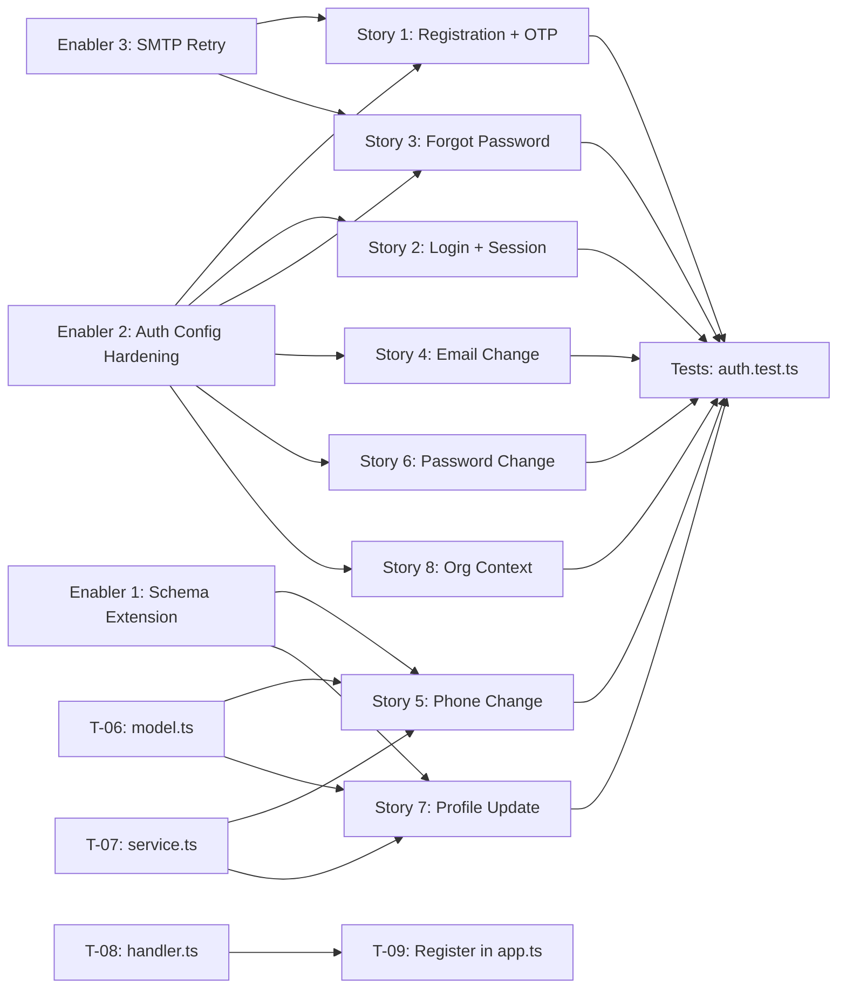

# Project Plan: Authentication & User Management

**Version:** 1.0
**Date:** April 26, 2026
**Status:** Draft
**Implementation Plan:** [implementation-plan.md](./implementation-plan.md)
**Feature PRD:** [prd.md](./prd.md)
**Parent Epic:** [Cukkr — Barbershop Management & Booking System](../epic.md)

---

## 1. Project Overview

### Feature Summary

Deliver a production-ready authentication system for Cukkr that provides secure identity management for owners, barbers, and customers. The system covers email/password registration with 4-digit OTP verification, session management via secure HTTP-only cookies, forgot-password and credential-change flows, phone number management, profile updates, and multi-tenant organization context injection. Better Auth (with `emailOTP` and `organization` plugins) handles the majority of auth mechanics; custom work focuses on configuration hardening, schema extensions, phone management, profile updates, rate-limit enforcement, SMTP retry logic, and comprehensive test coverage.

### Success Criteria

| Criterion | Target |
|---|---|
| All 17 PRD user stories implemented and tested | 100% coverage |
| Login and session validation response time (p95) | ≤ 200 ms |
| OTP email delivery retry on transient SMTP failure | Up to 3 attempts |
| Login rate limiting enforced | 10 failures / IP / 15 min → HTTP 429 |
| OTP resend rate limiting enforced | 3 resends / email / 15 min → HTTP 429 |
| All custom endpoints behind `requireAuth` | 100% |
| Lint and format checks passing | 0 errors |
| Integration test suite passing | All green |

### Key Milestones

1. **M1 — Foundation**: Schema extension migrated; Better Auth hardened; SMTP retry live.
2. **M2 — Custom Endpoints**: Profile update and phone-change module built and integrated.
3. **M3 — Test Coverage**: All PRD user stories covered by integration tests.
4. **M4 — Quality Gate**: Lint, format, and full test suite green; ready for review.

### Risk Assessment

| Risk | Likelihood | Impact | Mitigation |
|---|---|---|---|
| Better Auth `emailOTP` plugin options differ from documented API | Medium | High | Verify against Better Auth v1.5 source before implementing Step 2 |
| SMTP retry causes request timeout under slow mail provider | Low | Medium | Cap total retry window to ~3.5 s (500 ms + 1 s + 2 s); document limit |
| In-memory rate-limit map lost on restart | Low | Low | Acceptable for MVP single-instance; document Redis upgrade path |
| `additionalFields` config not reflected by Drizzle adapter type | Medium | Medium | Test after migration; fall back to raw Drizzle query in service if needed |
| Phone-change dual-OTP flow edge cases (concurrent requests, partial state) | Medium | Medium | Verification records have explicit TTL; concurrent step-2 without step-1 returns 400 |

---

## 2. Work Item Hierarchy

```mermaid
graph TD
    A[Epic: Cukkr Barbershop Management] --> B[Feature: Authentication & User Management]

    B --> E1[Enabler 1: Schema Extension — phone + bio]
    B --> E2[Enabler 2: Better Auth Config Hardening]
    B --> E3[Enabler 3: SMTP Retry Logic]

    B --> S1[Story: Registration + OTP Verification]
    B --> S2[Story: Login, Session & Logout]
    B --> S3[Story: Forgot Password Flow]
    B --> S4[Story: Email Change]
    B --> S5[Story: Phone Change]
    B --> S6[Story: Password Change]
    B --> S7[Story: Profile Update]
    B --> S8[Story: Multi-Tenant Org Context]

    E1 --> T1[Task: Add phone + bio to auth schema]
    E1 --> T2[Task: Generate + apply migration]

    E2 --> T3[Task: Update emailOTP plugin options]
    E2 --> T4[Task: Add rateLimit + additionalFields config]
    E2 --> T5[Task: Enable requireEmailVerification]

    E3 --> T6[Task: Wrap sendMail in retry loop]

    S5 --> T7[Task: Create model.ts — DTOs]
    S5 --> T8[Task: Create service.ts — phone OTP logic]
    S5 --> T9[Task: Create handler.ts — phone routes]

    S7 --> T10[Task: Add profile update DTO to model.ts]
    S7 --> T11[Task: Add updateProfile to service.ts]
    S7 --> T12[Task: Add PATCH /profile to handler.ts]

    T7 --> T13[Task: Register authHandler in app.ts]
    T9 --> T13

    B --> TST[Test: Expand auth.test.ts — all US coverage]

    E1 --> S1
    E2 --> S1
    E2 --> S2
    E3 --> S1
    E3 --> S3
    T7 --> S5
    T8 --> S5
    T9 --> S5
    T10 --> S7
    T11 --> S7
    T12 --> S7
```



---

## 3. GitHub Issues Breakdown

### Epic Issue

```markdown
# Epic: Cukkr — Barbershop Management & Booking System

## Epic Description
A multi-tenant barbershop management platform giving owners a mobile app to manage barbershops,
barbers, services, schedules, and analytics. Barbers handle daily booking queues; customers book
via a shareable web URL.

## Business Value
- **Primary Goal**: Replace informal scheduling with a structured digital system.
- **Success Metrics**: Zero double-bookings; booking completion ≤ 60 seconds; real-time analytics.
- **User Impact**: Owners gain visibility; customers gain predictable wait times.

## Epic Acceptance Criteria
- [ ] Secure multi-tenant authentication covering all user types
- [ ] Barbershop and barber management with invite flows
- [ ] Service catalog and booking engine (walk-in + appointment)
- [ ] Real-time booking queue for barbers
- [ ] Owner analytics dashboard

## Features in this Epic
- [ ] #TBD - Authentication & User Management
- [ ] #TBD - Barbershop Setup & Onboarding
- [ ] #TBD - Barber Management
- [ ] #TBD - Service Catalog
- [ ] #TBD - Booking Engine
- [ ] #TBD - Analytics

## Definition of Done
- [ ] All feature stories completed
- [ ] Integration tests passing
- [ ] Lint and format checks passing
- [ ] Docker build succeeds

## Labels
`epic`, `priority-high`, `value-high`

## Estimate
XL
```

---

### Feature Issue

```markdown
# Feature: Authentication & User Management

## Feature Description
Full-featured authentication covering email/password registration with 4-digit OTP, session
management, forgot-password, email/phone/password credential changes, profile updates, and
multi-tenant organization session context. Built on Better Auth v1.5 with custom extensions.

## User Stories in this Feature
- [ ] #TBD - Registration + OTP Verification (US-01 to US-04)
- [ ] #TBD - Login, Session & Logout (US-05 to US-07)
- [ ] #TBD - Forgot Password Flow (US-08 to US-11)
- [ ] #TBD - Email Change (US-12)
- [ ] #TBD - Phone Change (US-13)
- [ ] #TBD - Password Change (US-14)
- [ ] #TBD - Profile Update (US-15)
- [ ] #TBD - Multi-Tenant Org Context (US-16 to US-17)

## Technical Enablers
- [ ] #TBD - Schema Extension: phone + bio fields
- [ ] #TBD - Better Auth Configuration Hardening
- [ ] #TBD - SMTP Retry Logic

## Dependencies
**Blocks**: All downstream features (Booking, Services, Analytics) — they require an
             authenticated session with activeOrganizationId.
**Blocked by**: None — first feature in the epic.

## Acceptance Criteria
- [ ] All 17 user stories implemented and passing integration tests
- [ ] All custom endpoints require valid session (requireAuth)
- [ ] Rate limiting enforced at configured thresholds
- [ ] Schema migration applied cleanly

## Definition of Done
- [ ] All user stories delivered
- [ ] Technical enablers completed
- [ ] Integration tests passing
- [ ] `bun run lint:fix` and `bun run format` clean
- [ ] No console.log or dead code

## Labels
`feature`, `priority-critical`, `value-high`, `auth`

## Epic
#TBD (Epic: Cukkr Barbershop Management)

## Estimate
L (≈ 34 story points total)
```

---

### Technical Enablers

#### Enabler 1 — Schema Extension

```markdown
# Technical Enabler: Schema Extension — phone + bio fields

## Enabler Description
Add `phone` (E.164, unique, nullable) and `bio` (text, nullable) columns to the `user` table
via a Drizzle ORM migration. Register updated schema in `drizzle/schemas.ts` and declare
`additionalFields` in Better Auth config so the type system is aware.

## Technical Requirements
- [ ] Add `phone: text('phone').unique()` (nullable) to `src/modules/auth/schema.ts`
- [ ] Add `bio: text('bio')` (nullable) to `src/modules/auth/schema.ts`
- [ ] Run `bunx drizzle-kit generate --name add-user-phone-bio`
- [ ] Run `bunx drizzle-kit migrate`
- [ ] Declare `additionalFields` in `src/lib/auth.ts` for `phone` and `bio`

## Implementation Tasks
- [ ] #TBD - Add phone + bio columns to auth schema
- [ ] #TBD - Generate and apply Drizzle migration

## User Stories Enabled
- #TBD - Phone Change (US-13)
- #TBD - Profile Update (US-15)

## Acceptance Criteria
- [ ] Migration applies without errors on a clean database
- [ ] `user` table contains `phone` and `bio` columns in production schema
- [ ] Better Auth `additionalFields` config reflects new fields without TypeScript errors

## Definition of Done
- [ ] Migration file committed
- [ ] `drizzle/schemas.ts` exports updated schema
- [ ] TypeScript compiles without errors
- [ ] Code review approved

## Labels
`enabler`, `priority-critical`, `backend`, `database`

## Feature
#TBD (Feature: Authentication & User Management)

## Estimate
2 points
```

---

#### Enabler 2 — Better Auth Configuration Hardening

```markdown
# Technical Enabler: Better Auth Configuration Hardening

## Enabler Description
Update `src/lib/auth.ts` to enforce OTP length (4 digits), 5-minute expiry, 5-attempt
invalidation, email verification on sign-up, password minimum length, built-in IP rate limiting
for login, and `user.additionalFields` for phone and bio.

## Technical Requirements
- [ ] Set `emailOTP.otpLength: 4`, `expiresIn: 300`, `maxAttempts: 5`, `sendVerificationOnSignUp: true`
- [ ] Set `emailAndPassword.password.minLength: 8`
- [ ] Set `emailAndPassword.requireEmailVerification: true`
- [ ] Enable `rateLimit: { enabled: true, window: 900, max: 10 }`
- [ ] Declare `user.additionalFields: { phone, bio }`

## Implementation Tasks
- [ ] #TBD - Update emailOTP plugin options
- [ ] #TBD - Add rateLimit config + password.minLength + requireEmailVerification
- [ ] #TBD - Add user.additionalFields for phone and bio

## User Stories Enabled
- #TBD - Registration + OTP Verification (US-01 to US-04)
- #TBD - Login, Session & Logout (US-05 to US-07)
- #TBD - Forgot Password Flow (US-08 to US-11)

## Acceptance Criteria
- [ ] `auth.ts` compiles without TypeScript errors
- [ ] Sign-up triggers OTP email with 4-digit code
- [ ] Login returns 429 after 10 failed attempts from the same IP
- [ ] Registration with password < 8 chars returns 400

## Definition of Done
- [ ] Config changes committed
- [ ] Relevant tests updated and passing
- [ ] Code review approved

## Labels
`enabler`, `priority-critical`, `backend`, `auth`

## Feature
#TBD (Feature: Authentication & User Management)

## Estimate
2 points
```

---

#### Enabler 3 — SMTP Retry Logic

```markdown
# Technical Enabler: SMTP Retry Logic

## Enabler Description
Wrap `transporterInstance.sendMail(...)` in `src/lib/mail.ts` with an exponential-backoff retry
loop (max 3 attempts). Transient errors (ECONNRESET, ETIMEDOUT, ECONNREFUSED, ESOCKET) are
retried; non-transient errors fail immediately.

## Technical Requirements
- [ ] Implement `isTransientSmtpError(err)` helper checking `err.code`
- [ ] Retry with delays: 500 ms → 1 s → 2 s (2^attempt × 500 ms)
- [ ] Non-transient errors throw immediately without retry
- [ ] Retry logic does not block the event loop between attempts

## Implementation Tasks
- [ ] #TBD - Wrap sendMail in exponential-backoff retry loop

## User Stories Enabled
- #TBD - Registration + OTP Verification (US-01 to US-04)
- #TBD - Forgot Password Flow (US-08 to US-11)

## Acceptance Criteria
- [ ] Transient SMTP error triggers up to 3 total attempts
- [ ] Non-transient errors fail on first attempt without retry
- [ ] Total retry window does not exceed ~3.5 seconds
- [ ] TypeScript compiles without errors

## Definition of Done
- [ ] Implementation committed
- [ ] Unit test for retry logic written
- [ ] Code review approved

## Labels
`enabler`, `priority-high`, `backend`, `infrastructure`

## Feature
#TBD (Feature: Authentication & User Management)

## Estimate
2 points
```

---

### User Stories

#### Story 1 — Registration + OTP Verification (US-01 to US-04)

```markdown
# User Story: Registration + OTP Verification

## Story Statement
As a **new user**, I want to register with my email and password and verify my email with a
4-digit OTP so that my account is activated securely.

## Acceptance Criteria
- [ ] Valid name/email/password creates an unverified account and sends a 4-digit OTP email
- [ ] Password < 8 characters returns HTTP 400
- [ ] Duplicate email returns HTTP 409
- [ ] Valid OTP within 5 minutes activates the account and creates a session
- [ ] Expired OTP (> 5 minutes) returns HTTP 400 "code expired"
- [ ] After 5 consecutive wrong OTPs, the code is invalidated
- [ ] OTP resend succeeds up to 3 times within 15 minutes; 4th attempt returns HTTP 429

## Technical Tasks
- [ ] #TBD - Update emailOTP plugin options (Enabler 2)
- [ ] #TBD - Add requireEmailVerification to emailAndPassword config

## Testing Requirements
- [ ] #TBD - Integration tests: registration flow + OTP verification + expiry + resend rate limit

## Dependencies
**Blocked by**: Enabler 1 (schema), Enabler 2 (auth config), Enabler 3 (SMTP retry)

## Definition of Done
- [ ] Acceptance criteria met
- [ ] Code review approved
- [ ] Integration tests passing

## Labels
`user-story`, `priority-critical`, `auth`

## Feature
#TBD (Feature: Authentication & User Management)

## Estimate
3 points
```

---

#### Story 2 — Login, Session & Logout (US-05 to US-07)

```markdown
# User Story: Login, Session & Logout

## Story Statement
As a **registered user**, I want to log in with my credentials and have a persistent session
cookie, and log out when I'm done.

## Acceptance Criteria
- [ ] Valid credentials create a session and set HttpOnly/Secure/SameSite=None cookie
- [ ] Invalid credentials return HTTP 401 with a generic error (no user enumeration)
- [ ] After 10 failed login attempts from the same IP in 15 minutes, returns HTTP 429
- [ ] GET /api/auth/get-session returns current user and active organization context
- [ ] POST /api/auth/sign-out invalidates the session server-side and clears the cookie

## Technical Tasks
- [ ] #TBD - Verify cookie attributes in auth.ts config (already configured)
- [ ] #TBD - Enable rateLimit in auth.ts (Enabler 2)

## Testing Requirements
- [ ] #TBD - Integration tests: login success, 401 on bad creds, 429 on rate limit, session persistence, logout

## Dependencies
**Blocked by**: Enabler 2 (auth config)

## Definition of Done
- [ ] Acceptance criteria met
- [ ] Integration tests passing

## Labels
`user-story`, `priority-critical`, `auth`

## Feature
#TBD (Feature: Authentication & User Management)

## Estimate
2 points
```

---

#### Story 3 — Forgot Password Flow (US-08 to US-11)

```markdown
# User Story: Forgot Password Flow

## Story Statement
As a **user who forgot their password**, I want to reset it via a 4-digit OTP sent to my email
so that I can regain access securely.

## Acceptance Criteria
- [ ] POST /api/auth/forget-password always returns HTTP 200 regardless of email existence
- [ ] If email exists, a 4-digit OTP is sent
- [ ] OTP expires after 5 minutes
- [ ] After OTP verification, new password (≥ 8 chars) can be set
- [ ] Wrong/expired OTP returns HTTP 400

## Technical Tasks
- [ ] #TBD - Verify emailOTP config for forget-password type (Enabler 2)

## Testing Requirements
- [ ] #TBD - Integration tests: reset flow (send → verify → reset), enumeration prevention, OTP expiry

## Dependencies
**Blocked by**: Enabler 2 (auth config), Enabler 3 (SMTP retry)

## Definition of Done
- [ ] Acceptance criteria met
- [ ] Integration tests passing

## Labels
`user-story`, `priority-high`, `auth`

## Feature
#TBD (Feature: Authentication & User Management)

## Estimate
2 points
```

---

#### Story 4 — Email Change (US-12)

```markdown
# User Story: Email Change

## Story Statement
As a **logged-in user**, I want to change my email by verifying OTPs on both my old and new
email addresses so that both are confirmed before the update.

## Acceptance Criteria
- [ ] Requires authenticated session
- [ ] OTP sent to old email; must be verified first
- [ ] OTP then sent to new email; must be verified
- [ ] Email updated in DB only after both verifications succeed
- [ ] New email already in use returns HTTP 409

## Technical Tasks
- [ ] #TBD - Verify Better Auth change-email plugin configuration

## Testing Requirements
- [ ] #TBD - Integration tests: dual-OTP flow, 409 on duplicate, 401 unauthenticated

## Dependencies
**Blocked by**: Enabler 2 (auth config)

## Definition of Done
- [ ] Acceptance criteria met
- [ ] Integration tests passing

## Labels
`user-story`, `priority-high`, `auth`

## Feature
#TBD (Feature: Authentication & User Management)

## Estimate
2 points
```

---

#### Story 5 — Phone Change (US-13)

```markdown
# User Story: Phone Change

## Story Statement
As a **logged-in user**, I want to change my phone number by verifying OTPs for both my
current and new number so that ownership of both is confirmed.

## Acceptance Criteria
- [ ] Requires authenticated session
- [ ] POST /api/auth/phone/send-otp with step="old" sends OTP to user's email (MVP: email delivery)
- [ ] POST /api/auth/phone/verify-otp with step="old" validates OTP and marks old phone verified
- [ ] POST /api/auth/phone/send-otp with step="new" validates E.164 format, checks uniqueness, sends OTP
- [ ] POST /api/auth/phone/verify-otp with step="new" verifies OTP, confirms old-phone verified, updates user.phone
- [ ] Invalid E.164 format returns HTTP 400
- [ ] New phone already in use returns HTTP 409
- [ ] Wrong/expired OTP returns HTTP 400
- [ ] 3 send-otp requests per userId per 15 minutes; 4th returns HTTP 429

## Technical Tasks
- [ ] #TBD - Create model.ts (PhoneSendOtpBody, PhoneVerifyOtpBody DTOs)
- [ ] #TBD - Create service.ts (sendPhoneOtp, verifyPhoneOtp)
- [ ] #TBD - Create handler.ts (POST /phone/send-otp, POST /phone/verify-otp)
- [ ] #TBD - Register authHandler in app.ts

## Testing Requirements
- [ ] #TBD - Integration tests: full dual-OTP flow, E.164 validation, 409, 429, 401

## Dependencies
**Blocked by**: Enabler 1 (phone column in schema), Enabler 2 (auth config), Enabler 3 (SMTP)

## Definition of Done
- [ ] Acceptance criteria met
- [ ] Integration tests passing

## Labels
`user-story`, `priority-high`, `auth`

## Feature
#TBD (Feature: Authentication & User Management)

## Estimate
5 points
```

---

#### Story 6 — Password Change (US-14)

```markdown
# User Story: Password Change (Authenticated)

## Story Statement
As a **logged-in user**, I want to change my password by providing my current password so that
my credentials are updated securely.

## Acceptance Criteria
- [ ] Requires authenticated session
- [ ] Accepts `currentPassword` and `newPassword`
- [ ] Wrong `currentPassword` returns HTTP 400
- [ ] `newPassword` shorter than 8 chars returns HTTP 400
- [ ] On success, password is updated

## Technical Tasks
- [ ] #TBD - Verify Better Auth change-password configuration (already done)

## Testing Requirements
- [ ] #TBD - Integration tests: success, wrong current password, 400 on short new password, 401 unauthenticated

## Dependencies
**Blocked by**: Enabler 2 (auth config)

## Definition of Done
- [ ] Acceptance criteria met
- [ ] Integration tests passing

## Labels
`user-story`, `priority-medium`, `auth`

## Feature
#TBD (Feature: Authentication & User Management)

## Estimate
1 point
```

---

#### Story 7 — Profile Update (US-15)

```markdown
# User Story: Profile Update

## Story Statement
As a **logged-in user**, I want to update my display name, bio, and avatar so that my profile
reflects my current identity.

## Acceptance Criteria
- [ ] Requires authenticated session
- [ ] PATCH /api/auth/profile accepts optional name, bio (≤ 500 chars), avatar (URI)
- [ ] Only provided fields are updated (partial update)
- [ ] Returns updated user object (id, name, bio, image)
- [ ] Missing/unauthenticated request returns HTTP 401

## Technical Tasks
- [ ] #TBD - Add UpdateProfileBody DTO to model.ts
- [ ] #TBD - Add updateProfile method to service.ts
- [ ] #TBD - Add PATCH /profile route to handler.ts

## Testing Requirements
- [ ] #TBD - Integration tests: full update, partial update (each field individually), 401 unauthenticated

## Dependencies
**Blocked by**: Enabler 1 (bio column in schema)

## Definition of Done
- [ ] Acceptance criteria met
- [ ] Integration tests passing

## Labels
`user-story`, `priority-high`, `auth`

## Feature
#TBD (Feature: Authentication & User Management)

## Estimate
3 points
```

---

#### Story 8 — Multi-Tenant Org Context (US-16 to US-17)

```markdown
# User Story: Multi-Tenant Organization Context

## Story Statement
As a **member of multiple organizations**, I want my active organization tracked in my session
and to switch between organizations without logging out.

## Acceptance Criteria
- [ ] Session includes `activeOrganizationId` after setting active org
- [ ] POST /api/auth/organization/set-active-organization updates session org context
- [ ] GET /api/auth/get-session returns current `activeOrganizationId`
- [ ] Switching org does not require re-authentication
- [ ] Requires authenticated session (401 without cookie)

## Technical Tasks
- [ ] #TBD - Verify Better Auth organization plugin configuration (already done)

## Testing Requirements
- [ ] #TBD - Integration tests: create org, set active org, verify in session, switch org

## Dependencies
**Blocked by**: Enabler 2 (auth config)

## Definition of Done
- [ ] Acceptance criteria met
- [ ] Integration tests passing

## Labels
`user-story`, `priority-high`, `auth`, `multi-tenant`

## Feature
#TBD (Feature: Authentication & User Management)

## Estimate
2 points
```

---

### Implementation Tasks Summary

| # | Task | File | Story / Enabler | Estimate |
|---|---|---|---|---|
| T-01 | Add `phone` + `bio` columns to user table | `src/modules/auth/schema.ts` | Enabler 1 | 1 pt |
| T-02 | Generate and apply Drizzle migration | CLI | Enabler 1 | 1 pt |
| T-03 | Update `emailOTP` plugin options | `src/lib/auth.ts` | Enabler 2 | 1 pt |
| T-04 | Add `rateLimit`, `password.minLength`, `requireEmailVerification`, `additionalFields` | `src/lib/auth.ts` | Enabler 2 | 1 pt |
| T-05 | Wrap `sendMail` in exponential-backoff retry | `src/lib/mail.ts` | Enabler 3 | 2 pt |
| T-06 | Create `model.ts` (all three TypeBox DTOs) | `src/modules/auth/model.ts` | Stories 5, 7 | 1 pt |
| T-07 | Create `service.ts` (`updateProfile`, `sendPhoneOtp`, `verifyPhoneOtp`) | `src/modules/auth/service.ts` | Stories 5, 7 | 3 pt |
| T-08 | Create `handler.ts` (PATCH /profile, POST /phone/send-otp, POST /phone/verify-otp) | `src/modules/auth/handler.ts` | Stories 5, 7 | 3 pt |
| T-09 | Register `authHandler` in `app.ts` | `src/app.ts` | Stories 5, 7 | 1 pt |
| T-10 | Expand `auth.test.ts` — all PRD user stories | `tests/modules/auth.test.ts` | All stories | 5 pt |
| T-11 | Run `lint:fix` + `format` | CLI | Quality gate | 0 pt |

---

## 4. Priority and Value Matrix

| Issue | Priority | Value | Labels |
|---|---|---|---|
| Epic: Cukkr Barbershop Management | P0 | High | `epic`, `priority-critical`, `value-high` |
| Feature: Auth & User Management | P0 | High | `feature`, `priority-critical`, `value-high`, `auth` |
| Enabler 1: Schema Extension | P0 | High | `enabler`, `priority-critical`, `backend`, `database` |
| Enabler 2: Auth Config Hardening | P0 | High | `enabler`, `priority-critical`, `backend`, `auth` |
| Enabler 3: SMTP Retry | P1 | High | `enabler`, `priority-high`, `backend`, `infrastructure` |
| Story 1: Registration + OTP | P0 | High | `user-story`, `priority-critical`, `auth` |
| Story 2: Login + Session + Logout | P0 | High | `user-story`, `priority-critical`, `auth` |
| Story 3: Forgot Password | P1 | High | `user-story`, `priority-high`, `auth` |
| Story 4: Email Change | P1 | High | `user-story`, `priority-high`, `auth` |
| Story 5: Phone Change | P1 | High | `user-story`, `priority-high`, `auth` |
| Story 6: Password Change | P2 | Medium | `user-story`, `priority-medium`, `auth` |
| Story 7: Profile Update | P1 | High | `user-story`, `priority-high`, `auth` |
| Story 8: Multi-Tenant Org Context | P1 | High | `user-story`, `priority-high`, `auth`, `multi-tenant` |

---

## 5. Dependency Management



### Dependency Types

| From | To | Type |
|---|---|---|
| Enabler 1 | Stories 5, 7 | Blocks |
| Enabler 2 | Stories 1, 2, 3, 4, 6, 8 | Blocks |
| Enabler 3 | Stories 1, 3 | Prerequisite |
| T-06 model.ts | T-07 service.ts, T-08 handler.ts | Blocks |
| T-08 handler.ts | T-09 app.ts | Blocks |
| All stories | T-10 Tests | Prerequisite |

---

## 6. Sprint Planning

### Sprint Capacity Planning

- **Sprint Duration:** 2-week sprints
- **Buffer Allocation:** 20% for unexpected work
- **Focus Factor:** 75% of total time on planned work

### Sprint 1 — Foundation (≈ 10 points)

```markdown
## Sprint 1 Goal
**Primary Objective**: Lay the technical foundation — schema, auth config, SMTP retry.

**Stories in Sprint**:
- Enabler 1: Schema Extension (2 pts)
- Enabler 2: Better Auth Config Hardening (2 pts)
- Enabler 3: SMTP Retry Logic (2 pts)
- Story 1: Registration + OTP Verification (3 pts)
- Story 2: Login, Session & Logout (2 pts) [partial — verification relies on Enabler 2]

**Total Commitment**: 11 story points
**Success Criteria**: Schema migrated, auth config hardened, SMTP retry live, registration
                     + OTP + login integration tests green.
```

### Sprint 2 — Custom Endpoints + Credential Flows (≈ 13 points)

```markdown
## Sprint 2 Goal
**Primary Objective**: Deliver all credential-change flows and custom endpoints.

**Stories in Sprint**:
- Story 3: Forgot Password Flow (2 pts)
- Story 4: Email Change (2 pts)
- Story 5: Phone Change (5 pts) — model + service + handler + integration
- Story 6: Password Change (1 pt)
- Story 7: Profile Update (3 pts)

**Total Commitment**: 13 story points
**Success Criteria**: All credential-change and profile endpoints live with integration tests.
```

### Sprint 3 — Multi-Tenant Context + Quality Gate (≈ 9 points)

```markdown
## Sprint 3 Goal
**Primary Objective**: Org context story, full test coverage, lint/format clean.

**Stories in Sprint**:
- Story 8: Multi-Tenant Org Context (2 pts)
- T-09: Register authHandler in app.ts (1 pt, carry-over if needed)
- T-10: Expand auth.test.ts full coverage (5 pts)
- T-11: lint:fix + format + quality gate (1 pt)

**Total Commitment**: 9 story points
**Success Criteria**: All 17 PRD user stories covered by passing tests, zero lint errors.
```

---

## 7. GitHub Project Board Configuration

### Column Structure (Kanban)

| Column | Description |
|---|---|
| **Backlog** | Prioritized, ready for planning |
| **Sprint Ready** | Detailed and estimated, ready for development |
| **In Progress** | Currently being worked on |
| **In Review** | Code review or stakeholder review |
| **Testing** | QA validation and acceptance testing |
| **Done** | Completed and accepted |

### Custom Fields

| Field | Values |
|---|---|
| **Priority** | P0, P1, P2, P3 |
| **Value** | High, Medium, Low |
| **Component** | Handler, Service, Schema, Infrastructure, Testing |
| **Estimate** | 1, 2, 3, 5, 8 story points |
| **Sprint** | Sprint 1, Sprint 2, Sprint 3 |
| **Epic** | Cukkr Barbershop Management |

### Required Labels

```
epic
feature
user-story
enabler
priority-critical
priority-high
priority-medium
priority-low
value-high
value-medium
value-low
auth
database
backend
infrastructure
multi-tenant
```

---

## 8. Estimation Summary

| Category | Issues | Story Points |
|---|---|---|
| Enablers | 3 | 6 pts |
| User Stories | 8 | 20 pts |
| Tasks (implementation) | 11 | 14 pts |
| **Total** | **22** | **34 pts** |

**Feature T-shirt Size: L** (34 story points across 3 sprints)

---

*Project plan maintained by the Cukkr engineering team.*
