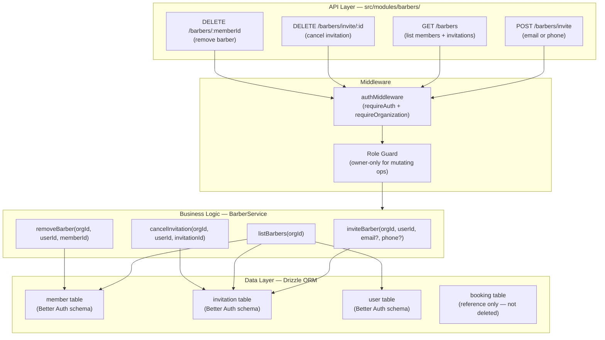
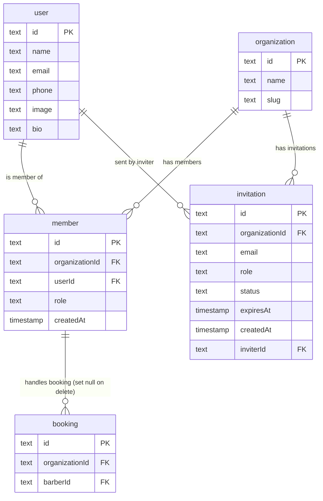

# Implementation Plan: Barber Management

**Version:** 1.0
**Date:** April 27, 2026
**Status:** Draft

- **PRD:** [barber-management/prd.md](./prd.md)
- **Epic:** [epic.md](../epic.md)

---

## Goal

Extend the existing `barbers` module (which currently only supports `POST /api/barbers/invite` via email) to a full barber management surface: list barbers + pending invitations, cancel an invitation, remove an active barber from the organization, and support inviting by phone in addition to email. The module must enforce `owner`-only access for mutating operations and respect 7-day invitation expiry semantics when returning the list.

---

## Requirements

- `GET /api/barbers` — list all active members + non-expired pending invitations for the active org.
- `POST /api/barbers/invite` — invite by **email** (already exists) or **phone** (new); guard against duplicate active invitations and already-active membership.
- `DELETE /api/barbers/invite/:invitationId` — cancel a pending invitation (owner only).
- `DELETE /api/barbers/:memberId` — remove an active barber member (owner only); preserve historical bookings.
- All mutating endpoints restricted to `owner` role; `barber` role receives `403 Forbidden`.
- Expired invitations (`expiresAt < now`) excluded from the GET list.
- No new database tables required — the feature uses existing `member` and `invitation` tables from `auth/schema.ts`.

---

## Technical Considerations

### System Architecture Overview



### Technology Stack

| Layer | Choice | Rationale |
|---|---|---|
| Routing | Elysia group (`/api/barbers`) | Consistent with all other feature modules |
| Auth enforcement | `authMiddleware` + `requireOrganization: true` | Centralised session/org validation |
| Role check | Service-level DB query (`member.role === 'owner'`) | Same pattern already used in existing `inviteBarber` |
| ORM | Drizzle (`member`, `invitation` tables) | No new tables; reuses auth schema |
| Validation | TypeBox via Elysia `t` | Consistent; keeps DTOs in `model.ts` |

### Database Schema Design

No new tables are needed. The relevant existing tables are:



#### Indexing Strategy

All required indexes already exist in `auth/schema.ts`:
- `invitation_organizationId_idx` — used in list + cancel queries.
- `invitation_email_idx` — used in duplicate-invitation check.
- `member_organizationId_idx` — used in list + role-check queries.
- `member_userId_idx` — used in role-check lookup.

**New index to consider:** `invitation_organizationId_status_expiresAt_idx` on `(organizationId, status, expiresAt)` to efficiently filter active pending invitations without a full table scan. This should be added via a Drizzle migration (do NOT use `push`).

#### Migration Strategy

1. Generate a migration: `bunx drizzle-kit generate --name add-invitation-composite-idx`
2. Validate: `bunx drizzle-kit check`
3. Apply: `bunx drizzle-kit migrate`

> The index is added to the existing `invitation` table definition in `src/modules/auth/schema.ts`.

---

### API Design

#### Endpoints

##### `GET /api/barbers`

- **Auth:** `requireAuth: true`, `requireOrganization: true`
- **Role:** Any authenticated org member (owner or barber can view the list)
- **Query params:** none
- **Response `200`:**

```typescript
{
  data: Array<{
    id: string             // member.id (for active) or invitation.id (for pending)
    userId: string | null  // null for pending invitations (user may not exist yet)
    name: string           // user.name (active) or null/email for pending
    email: string
    phone: string | null
    avatarUrl: string | null
    role: "owner" | "barber"
    status: "active" | "pending"
    createdAt: string      // ISO date
  }>
}
```

- **Logic:**
  1. Query `member` JOIN `user` WHERE `member.organizationId = activeOrganizationId`.
  2. Query `invitation` WHERE `organizationId = activeOrganizationId AND status = 'pending' AND expiresAt > now()`.
  3. Merge results: active members first (alphabetical by name), then pending invitations (most recent first).
  4. Return unified list.

##### `POST /api/barbers/invite`

- **Auth:** `requireAuth: true`, `requireOrganization: true`
- **Role:** `owner` only — service throws `AppError('FORBIDDEN')` for non-owners
- **Body:**

```typescript
{
  email?: string   // at least one of email or phone required
  phone?: string
}
```

- **Response `201`:** Same shape as existing `BarberInviteResponse` (id, email, role, status, expiresAt)
- **Error codes:**
  - `400` — neither email nor phone provided; or invalid format
  - `403` — caller is not owner
  - `409` — duplicate pending invitation or already-active member

##### `DELETE /api/barbers/invite/:invitationId`

- **Auth:** `requireAuth: true`, `requireOrganization: true`
- **Role:** `owner` only
- **Params:** `invitationId: string`
- **Response `200`:** `{ message: "Invitation cancelled" }`
- **Error codes:**
  - `403` — not owner
  - `404` — invitation not found in org, or already accepted/expired

##### `DELETE /api/barbers/:memberId`

- **Auth:** `requireAuth: true`, `requireOrganization: true`
- **Role:** `owner` only
- **Params:** `memberId: string`
- **Response `200`:** `{ message: "Barber removed successfully" }`
- **Error codes:**
  - `403` — not owner; or attempting to remove self (owner cannot remove themselves)
  - `404` — memberId not found in this org

#### Multi-Tenant Scoping

All service methods receive `organizationId` and always filter by it. The `requireOrganization: true` macro in the handler ensures `activeOrganizationId` is always present before reaching the service.

#### Role Enforcement Pattern

```
// pseudocode — same pattern as existing inviteBarber
const callerMember = await db.query.member.findFirst({
  where: and(eq(member.userId, userId), eq(member.organizationId, orgId))
})
if (!callerMember || callerMember.role !== 'owner') {
  throw new AppError('Forbidden', 'FORBIDDEN')
}
```

---

### Security & Performance

| Concern | Approach |
|---|---|
| Role enforcement | DB lookup at service layer (same as existing pattern) — no client-supplied role trusted |
| Cross-org access | All queries filter by `organizationId` from session; cross-org IDs return 404 |
| Invitation expiry | Server-side filter: `expiresAt > now()` in the list query; expired invitations invisible without explicit DB cleanup |
| Remove self guard | Service checks `callerMemberId !== memberId` before deletion; returns 403 if owner tries to remove themselves |
| Cascade safety | `booking.barberId` has `onDelete: 'set null'` — removing a barber nullifies their booking references without deleting booking history |
| Input validation | TypeBox schema validates email format, phone format, and mutual exclusion logic |
| Performance | The `invitation_organizationId_idx` + new composite index ensure sub-100ms list queries for orgs up to 1000 members |

---

## File Checklist

```
src/modules/barbers/
  handler.ts    [MODIFY]  — add GET /, DELETE /invite/:id, DELETE /:memberId routes
  model.ts      [MODIFY]  — add BarberListItem, BarberRemoveResponse, CancelInviteResponse; update BarberInviteInput to accept phone
  service.ts    [MODIFY]  — add listBarbers, cancelInvitation, removeBarber methods; update inviteBarber for phone support

src/modules/auth/schema.ts   [MODIFY]  — add composite index on invitation(organizationId, status, expiresAt)

drizzle/
  [NEW migration]  — add-invitation-composite-idx.sql (auto-generated)

tests/modules/barbers.test.ts   [NEW]  — integration tests for all 4 endpoints
```

---

## Test Plan

Test file: `tests/modules/barbers.test.ts`

| ID | Test Case | Expected |
|---|---|---|
| T-01 | `GET /barbers` returns active members | 200, list contains active member |
| T-02 | `GET /barbers` excludes expired invitations | 200, no expired entries |
| T-03 | `GET /barbers` without auth | 401 |
| T-04 | `POST /barbers/invite` with valid email (owner) | 201, invitation created |
| T-05 | `POST /barbers/invite` with valid phone (owner) | 201, invitation created |
| T-06 | `POST /barbers/invite` duplicate pending email | 409 |
| T-07 | `POST /barbers/invite` email already active member | 409 |
| T-08 | `POST /barbers/invite` called by barber role | 403 |
| T-09 | `DELETE /barbers/invite/:id` valid pending invite | 200 |
| T-10 | `DELETE /barbers/invite/:id` cross-org invite id | 404 |
| T-11 | `DELETE /barbers/invite/:id` called by barber | 403 |
| T-12 | `DELETE /barbers/:memberId` valid member | 200 |
| T-13 | `DELETE /barbers/:memberId` booking refs preserved | 200 + booking.barberId is null |
| T-14 | `DELETE /barbers/:memberId` cross-org member id | 404 |
| T-15 | `DELETE /barbers/:memberId` owner removes self | 403 |
