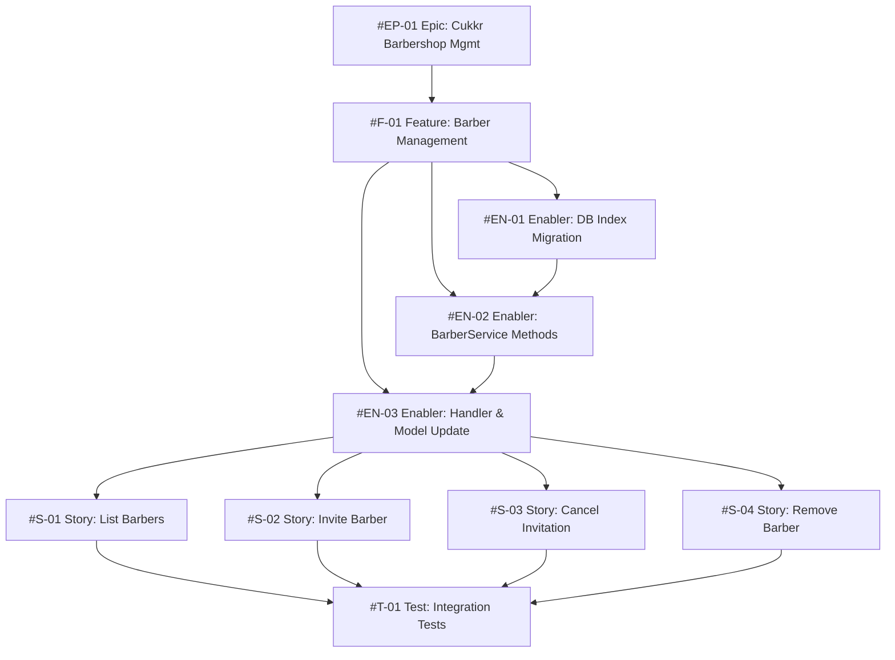

# Project Plan: Barber Management

**Feature:** Barber Management
**Epic:** Cukkr — Barbershop Management & Booking System
**Version:** 1.0
**Date:** April 27, 2026
**Status:** Draft

---

## Issue Hierarchy Overview



---

## Epic Issue — #EP-01

```markdown
# Epic: Cukkr — Barbershop Management & Booking System

## Epic Description
Cukkr is a multi-tenant barbershop management platform. Owners manage their barbershop(s),
barbers, services, schedules, and analytics via a mobile app. Barbers handle their daily
booking queue. Customers book via a zero-download web page.

## Business Value
- **Primary Goal**: Replace informal, error-prone manual barbershop operations with a
  structured digital platform.
- **Success Metrics**: Booking completion ≤ 60s; owner onboarding ≤ 5 min; availability ≥ 99.5%.
- **User Impact**: Eliminates double-bookings, provides analytics, enables frictionless CRM.

## Epic Acceptance Criteria
- [ ] Owner can onboard, create barbershop, and invite barbers within 5 minutes
- [ ] Walk-in and appointment bookings fully functional end-to-end
- [ ] All endpoints require proper auth and org scoping
- [ ] Push notifications delivered ≥ 95% success rate
- [ ] Analytics and CRM data scoped per org with no cross-tenant leakage

## Features in this Epic
- [ ] #F-01 - Barber Management
- [ ] #F-02 - Schedule & Booking Management
- [ ] #F-03 - User Profile
- [ ] #F-04 - Onboarding

## Definition of Done
- [ ] All feature stories completed
- [ ] Integration tests passing
- [ ] Lint and format checks passing
- [ ] Performance benchmarks met
- [ ] Documentation updated

## Labels
`epic`, `priority-high`, `value-high`

## Milestone
v1.0 — Cukkr MVP

## Estimate
XL
```

---

## Feature Issue — #F-01

```markdown
# Feature: Barber Management

## Feature Description
Extend the `barbers` module to a full barber management surface: list barbers + pending
invitations, cancel an invitation, remove an active barber, and invite by phone in
addition to email. All mutating operations are owner-only.

## User Stories in this Feature
- [ ] #S-01 - List Barbers (Active + Pending)
- [ ] #S-02 - Invite Barber by Email or Phone
- [ ] #S-03 - Cancel Pending Invitation
- [ ] #S-04 - Remove Active Barber

## Technical Enablers
- [ ] #EN-01 - DB Index Migration (Composite Index on `invitation`)
- [ ] #EN-02 - BarberService — Core Methods
- [ ] #EN-03 - Barber Module — Handler & Model Update

## Dependencies
**Blocks**: Schedule & Booking Management (barber removal must null booking.barberId)
**Blocked by**: Auth module (member + invitation tables must exist)

## Acceptance Criteria
- [ ] `GET /api/barbers` returns merged list of active members and non-expired pending invitations
- [ ] `POST /api/barbers/invite` accepts email or phone; 409 on duplicates/existing members
- [ ] `DELETE /api/barbers/invite/:id` cancels pending invitation (owner only)
- [ ] `DELETE /api/barbers/:memberId` removes barber; booking history preserved
- [ ] All mutating endpoints return 403 for barber-role callers
- [ ] Expired invitations excluded from all responses

## Definition of Done
- [ ] All user stories delivered
- [ ] Technical enablers completed
- [ ] Integration tests passing (all 15 in `barbers.test.ts`)
- [ ] Lint and format checks passing
- [ ] No cross-org data leakage

## Labels
`feature`, `priority-high`, `value-high`, `backend`, `barber-management`

## Epic
#EP-01

## Estimate
M (≈ 26 story points)
```

---

## Enabler Issues

### #EN-01 — DB Index Migration

```markdown
# Technical Enabler: DB Index Migration — Composite Index on `invitation`

## Enabler Description
Add composite index `(organizationId, status, expiresAt)` to the `invitation` table in
`src/modules/auth/schema.ts` for efficient pending invitation queries.

## Technical Requirements
- [ ] Add `invitation_organizationId_status_expiresAt_idx` to `src/modules/auth/schema.ts`
- [ ] Generate: `bunx drizzle-kit generate --name add-invitation-composite-idx`
- [ ] Validate: `bunx drizzle-kit check`
- [ ] Apply: `bunx drizzle-kit migrate`

## Implementation Tasks
- [ ] Modify `src/modules/auth/schema.ts`
- [ ] Generate, validate, and apply migration

## User Stories Enabled
- #S-01 - List Barbers — efficient invitation filtering
- #S-02 - Invite Barber — duplicate check performance

## Acceptance Criteria
- [ ] Index definition exists in schema
- [ ] Migration SQL file generated in `drizzle/`
- [ ] No migration conflicts

## Definition of Done
- [ ] Migration applied to DB; no tests broken; code review approved

## Labels
`enabler`, `priority-critical`, `value-high`, `backend`, `database`, `barber-management`

## Feature
#F-01

## Estimate
2 points
```

---

### #EN-02 — BarberService Core Methods

```markdown
# Technical Enabler: BarberService — Core Methods

## Enabler Description
Extend `src/modules/barbers/service.ts` with `listBarbers`, `cancelInvitation`, and
`removeBarber` methods. Update `inviteBarber` to accept optional `phone` parameter.
All methods enforce org scoping and owner role checks.

## Technical Requirements
- [ ] `listBarbers(orgId)` — joins member+user; queries non-expired pending invitations; merges and sorts
- [ ] `cancelInvitation(orgId, userId, invitationId)` — owner check; verifies pending; deletes
- [ ] `removeBarber(orgId, userId, memberId)` — owner check; no self-removal; deletes member
- [ ] Updated `inviteBarber` — phone support; at-least-one validation; duplicate check by phone
- [ ] All methods throw `AppError` (never `new Error`); filter by `organizationId`

## Implementation Tasks
- [ ] Add `listBarbers` to BarberService
- [ ] Add `cancelInvitation` to BarberService
- [ ] Add `removeBarber` to BarberService
- [ ] Update `inviteBarber` for phone support

## User Stories Enabled
- #S-01, #S-02, #S-03, #S-04

## Acceptance Criteria
- [ ] All four methods implemented and exported
- [ ] Non-owner callers receive `AppError('FORBIDDEN')`
- [ ] Self-removal guard active
- [ ] Expired invitations excluded from list
- [ ] Phone duplicate check implemented

## Definition of Done
- [ ] No `any` types; `bun run lint:fix` passes; code review approved

## Labels
`enabler`, `priority-critical`, `value-high`, `backend`, `service`, `barber-management`

## Feature
#F-01

## Estimate
5 points
```

---

### #EN-03 — Handler & Model Update

```markdown
# Technical Enabler: Barber Module — Handler & Model Update

## Enabler Description
Update `handler.ts` to register the three new routes and update `model.ts` with new DTOs.

## Technical Requirements
- [ ] `handler.ts` — add `GET /`, `DELETE /invite/:invitationId`, `DELETE /:memberId`
- [ ] `model.ts` — add `BarberListItem`, `BarberRemoveResponse`, `CancelInviteResponse`
- [ ] `model.ts` — update `BarberInviteInput` (email? + phone?, at-least-one required)
- [ ] All routes use `requireOrganization: true`; delegate entirely to service

## Implementation Tasks
- [ ] Update `src/modules/barbers/model.ts`
- [ ] Update `src/modules/barbers/handler.ts`

## Acceptance Criteria
- [ ] `GET /api/barbers` registered and returns correct shape
- [ ] `DELETE /invite/:invitationId` registered and returns `{ message }`
- [ ] `DELETE /:memberId` registered and returns `{ message }`
- [ ] TypeBox rejects invalid inputs with 400

## Definition of Done
- [ ] `bun run lint:fix && bun run format` passes; code review approved

## Labels
`enabler`, `priority-high`, `value-high`, `backend`, `handler`, `barber-management`

## Feature
#F-01

## Estimate
3 points
```

---

## User Story Issues

### #S-01 — List Barbers (Active + Pending)

```markdown
# User Story: List Barbers (Active + Pending)

## Story Statement
As a **Barbershop Owner**, I want to see a list of all my barbers with their status
(`Active` / `Pending`) so that I know who has joined and who still hasn't accepted.

## Acceptance Criteria
- [ ] `GET /api/barbers` returns 200 with unified list of active members + pending invitations
- [ ] Response includes `id`, `userId`, `name`, `email`, `phone`, `avatarUrl`, `role`, `status`, `createdAt`
- [ ] Active members first (alphabetical by name); pending most recent first
- [ ] Expired invitations excluded
- [ ] No cross-org data; unauthenticated → 401

## Technical Tasks
- [ ] #EN-01, #EN-02, #EN-03 (prerequisites)

## Testing Requirements
- [ ] T-01: GET returns active members → 200
- [ ] T-02: GET excludes expired invitations → 200
- [ ] T-03: GET without auth → 401

## Dependencies
**Blocked by**: #EN-01, #EN-02, #EN-03

## Definition of Done
- [ ] Acceptance criteria met; T-01, T-02, T-03 passing; code review approved

## Labels
`user-story`, `priority-high`, `value-high`, `backend`, `barber-management`

## Feature
#F-01

## Estimate
3 points
```

---

### #S-02 — Invite Barber by Email or Phone

```markdown
# User Story: Invite Barber by Email or Phone

## Story Statement
As a **Barbershop Owner**, I want to invite a barber by email or phone so that they can
join my barbershop and start handling bookings.

## Acceptance Criteria
- [ ] `POST /api/barbers/invite` with `{ email }` → 201, invitation created
- [ ] `POST /api/barbers/invite` with `{ phone }` → 201, invitation created
- [ ] Neither email nor phone → 400
- [ ] Duplicate pending invitation → 409
- [ ] Already active member → 409
- [ ] Barber role caller → 403; unauthenticated → 401

## Technical Tasks
- [ ] #EN-02 - Update inviteBarber for phone
- [ ] #EN-03 - Update BarberInviteInput DTO

## Testing Requirements
- [ ] T-04: valid email invite → 201
- [ ] T-05: valid phone invite → 201
- [ ] T-06: duplicate pending email → 409
- [ ] T-07: already active member → 409
- [ ] T-08: barber role → 403

## Dependencies
**Blocked by**: #EN-02, #EN-03

## Definition of Done
- [ ] Acceptance criteria met; T-04 through T-08 passing; code review approved

## Labels
`user-story`, `priority-high`, `value-high`, `backend`, `barber-management`

## Feature
#F-01

## Estimate
3 points
```

---

### #S-03 — Cancel Pending Invitation

```markdown
# User Story: Cancel Pending Invitation

## Story Statement
As a **Barbershop Owner**, I want to cancel a pending invitation before it is accepted
so that I can keep my barber list clean.

## Acceptance Criteria
- [ ] `DELETE /api/barbers/invite/:invitationId` → 200 OK
- [ ] Cancelled invitation no longer appears in GET list
- [ ] Already-accepted or expired invitation → 404
- [ ] Cross-org invitation id → 404
- [ ] Barber role → 403; unauthenticated → 401

## Technical Tasks
- [ ] #EN-02 - Implement cancelInvitation service method
- [ ] #EN-03 - Register DELETE /invite/:invitationId route

## Testing Requirements
- [ ] T-09: valid pending invite → 200
- [ ] T-10: cross-org invite id → 404
- [ ] T-11: barber role → 403

## Dependencies
**Blocked by**: #EN-02, #EN-03

## Definition of Done
- [ ] Acceptance criteria met; T-09, T-10, T-11 passing; code review approved

## Labels
`user-story`, `priority-high`, `value-medium`, `backend`, `barber-management`

## Feature
#F-01

## Estimate
2 points
```

---

### #S-04 — Remove Active Barber

```markdown
# User Story: Remove Active Barber

## Story Statement
As a **Barbershop Owner**, I want to remove a barber so that I can revoke access without
losing historical booking data.

## Acceptance Criteria
- [ ] `DELETE /api/barbers/:memberId` → 200 OK
- [ ] Historical bookings remain intact (booking.barberId set to null)
- [ ] Owner removing self → 403
- [ ] Cross-org memberId → 404
- [ ] Barber role → 403; unauthenticated → 401

## Technical Tasks
- [ ] #EN-02 - Implement removeBarber with self-removal guard
- [ ] #EN-03 - Register DELETE /:memberId route
- [ ] Confirm booking.barberId FK uses onDelete: 'set null'

## Testing Requirements
- [ ] T-12: valid member → 200
- [ ] T-13: booking refs preserved (barberId is null)
- [ ] T-14: cross-org memberId → 404
- [ ] T-15: owner removes self → 403

## Dependencies
**Blocked by**: #EN-02, #EN-03

## Definition of Done
- [ ] Acceptance criteria met; T-12 through T-15 passing; code review approved

## Labels
`user-story`, `priority-high`, `value-high`, `backend`, `barber-management`

## Feature
#F-01

## Estimate
3 points
```

---

## Test Issue — #T-01

```markdown
# Test: Integration Tests — barbers.test.ts

## Test Description
Create `tests/modules/barbers.test.ts` covering all 15 test cases. Uses Bun test runner
+ Eden Treaty. Covers owner/barber role setup, multi-org cross-access validation, and
booking preservation.

## Test Cases

| ID   | Test Case                                           | Expected                       |
|------|-----------------------------------------------------|--------------------------------|
| T-01 | GET /barbers returns active members                 | 200, active member in list     |
| T-02 | GET /barbers excludes expired invitations           | 200, no expired entries        |
| T-03 | GET /barbers without auth                           | 401                            |
| T-04 | POST /barbers/invite valid email (owner)            | 201, invitation created        |
| T-05 | POST /barbers/invite valid phone (owner)            | 201, invitation created        |
| T-06 | POST /barbers/invite duplicate pending email        | 409                            |
| T-07 | POST /barbers/invite email already active member   | 409                            |
| T-08 | POST /barbers/invite barber role                    | 403                            |
| T-09 | DELETE /barbers/invite/:id valid pending            | 200                            |
| T-10 | DELETE /barbers/invite/:id cross-org id             | 404                            |
| T-11 | DELETE /barbers/invite/:id barber role              | 403                            |
| T-12 | DELETE /barbers/:memberId valid member              | 200                            |
| T-13 | DELETE /barbers/:memberId booking refs preserved    | 200 + booking.barberId is null |
| T-14 | DELETE /barbers/:memberId cross-org id              | 404                            |
| T-15 | DELETE /barbers/:memberId owner removes self        | 403                            |

## Setup Requirements
- [ ] Owner user + org via sign-up + createOrganization
- [ ] Barber user invited + accepted into owner's org (for role tests)
- [ ] Second org for cross-org isolation (T-10, T-14)
- [ ] Booking linked to barber (T-13 preservation)

## Acceptance Criteria
- [ ] All 15 test cases pass with `bun test barbers`
- [ ] No data leakage between test cases
- [ ] Cross-org isolation verified

## Definition of Done
- [ ] All 15 tests passing
- [ ] `bun run lint:fix && bun run format` passes
- [ ] Follows patterns from `tests/modules/product-example.test.ts`

## Labels
`test`, `priority-high`, `value-high`, `backend`, `barber-management`

## Feature
#F-01

## Estimate
5 points
```

---

## Sprint Plan

### Sprint 1 — Infrastructure & Service Layer (7 pts)

| Issue | Title                    | Points |
|-------|--------------------------|--------|
| #EN-01 | DB Index Migration      | 2      |
| #EN-02 | BarberService Methods   | 5      |

**Goal**: Migration applied; all service methods callable.

### Sprint 2 — Handler, Stories & Tests (19 pts)

| Issue  | Title                        | Points |
|--------|------------------------------|--------|
| #EN-03 | Handler & Model Update       | 3      |
| #S-01  | List Barbers                 | 3      |
| #S-02  | Invite Barber                | 3      |
| #S-03  | Cancel Invitation            | 2      |
| #S-04  | Remove Barber                | 3      |
| #T-01  | Integration Tests            | 5      |

**Goal**: All endpoints live; `bun test barbers` passes all 15 cases.

---

## Priority Matrix

| Issue  | Priority | Value  | Labels                              |
|--------|----------|--------|-------------------------------------|
| #EN-01 | P0       | High   | `priority-critical`, `value-high`   |
| #EN-02 | P0       | High   | `priority-critical`, `value-high`   |
| #EN-03 | P1       | High   | `priority-high`, `value-high`       |
| #S-01  | P1       | High   | `priority-high`, `value-high`       |
| #S-02  | P1       | High   | `priority-high`, `value-high`       |
| #S-03  | P1       | Medium | `priority-high`, `value-medium`     |
| #S-04  | P1       | High   | `priority-high`, `value-high`       |
| #T-01  | P1       | High   | `priority-high`, `value-high`       |

**Total Estimate: 26 story points — Feature size: M**

---

*Sync issue numbers with GitHub after creation. Update this plan if scope changes.*
