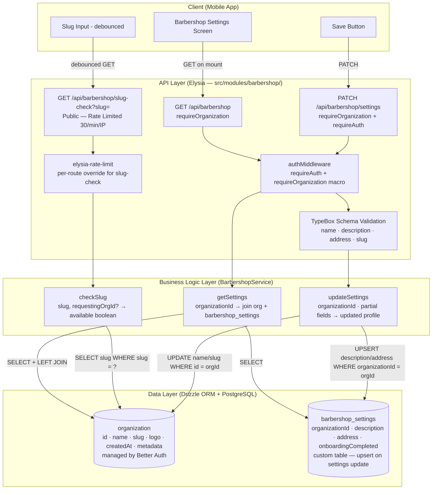
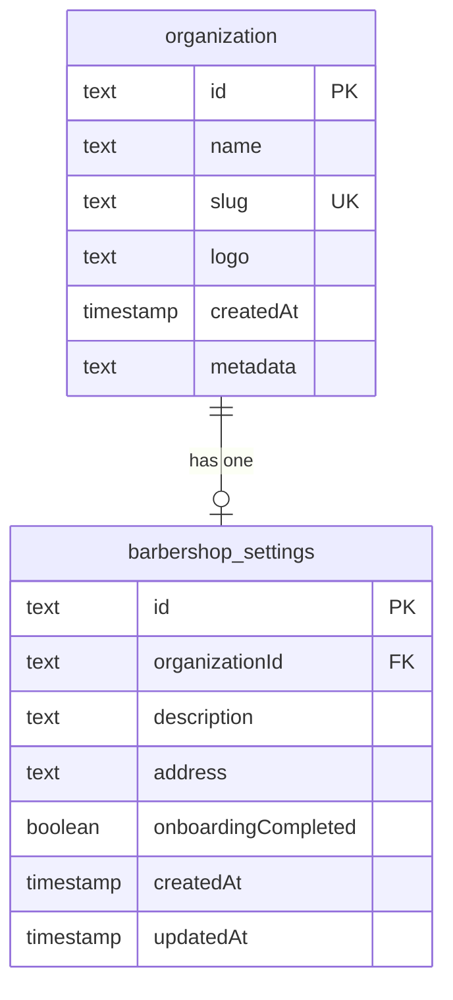

# Implementation Plan: Barbershop Settings

**Version:** 1.0
**Date:** April 26, 2026
**Status:** Draft
**Feature PRD:** [Barbershop Settings PRD](./prd.md)

---

## Goal

Implement the backend for the Barbershop Settings feature, giving barbershop owners a way to view and edit the four core profile fields of their active organization — **Name**, **Description**, **Address**, and **Booking URL (slug)** — after completing onboarding. The backend must expose a `GET /api/barbershop` endpoint to retrieve the current profile, a `PATCH /api/barbershop/settings` endpoint to persist partial updates, and a `GET /api/barbershop/slug-check` endpoint for real-time slug availability checks. All mutations are strictly tenant-scoped to the owner's `activeOrganizationId` so cross-tenant mutation is impossible by design. The slug check endpoint is rate-limited to 30 requests per minute per IP to prevent slug enumeration attacks.

---

## Requirements

- `GET /api/barbershop` returns the active organization's full profile: `id`, `name`, `slug`, `description`, `address`, and `onboardingCompleted`. Requires `requireOrganization: true`.
- `PATCH /api/barbershop/settings` accepts a partial body with any combination of `name`, `description`, `address`, `slug`. Returns `400` if the body is empty (no fields provided).
- `name`, when included in the PATCH body, must be between 2–100 characters; `description` ≤ 500 characters; `address` ≤ 300 characters.
- `slug`, when included, must match `^[a-z0-9]([a-z0-9-]*[a-z0-9])?$` (3–63 chars, no consecutive hyphens). Input is lowercased automatically before validation and persistence.
- If the provided `slug` is already owned by a **different** organization, PATCH returns `409 Conflict`.
- If the provided `slug` is the requesting organization's **own current slug**, it passes without a uniqueness error.
- Successful PATCH returns `200 OK` with the full updated profile.
- `GET /api/barbershop/slug-check?slug={value}` returns `{ available: boolean }`. Rate-limited at 30 requests/IP/min. Does not require authentication.
- Slug-check is case-insensitive (input is lowercased before the database lookup).
- If the querying user is authenticated and the slug belongs to their active organization, return `available: true`.
- All thrown errors must use `AppError` from `src/core/error.ts`. No plain `Error` throws.
- All field validation runs at the Elysia route handler level via TypeBox schemas before reaching service logic.
- No `organizationId` is accepted in any request body — always derived from `session.activeOrganizationId`.
- `name` and `slug` updates are applied to the Better Auth-managed `organization` table via Drizzle directly. `description` and `address` updates are applied to the `barbershop_settings` table (upsert semantics).
- Integration tests cover: load settings, valid partial update, empty body rejection, name validation, slug format enforcement, slug conflict (409), own-slug acceptance, unauthenticated PATCH rejection (401), rate limit on slug-check (429), and cross-tenant protection.

---

## Technical Considerations

### System Architecture Overview



**Technology Stack Selection:**

| Layer | Technology | Rationale |
|---|---|---|
| Runtime | Bun | Project standard |
| Web Framework | Elysia + TypeBox | Type-safe routing; schemas enforce validation at the route boundary |
| ORM | Drizzle ORM | Type-safe SQL; already in use; fine-grained UPDATE/UPSERT control |
| Database | PostgreSQL | Project standard; unique index on `organization.slug` enforces DB-level uniqueness |
| Auth | Better Auth + Organization plugin | Session provides `activeOrganizationId`; `organization` table owned by Better Auth but queryable via Drizzle |
| Rate Limiting | `elysia-rate-limit` | Already wired globally; override `max` per-route for the slug-check endpoint |

**Integration Points:**

- `authMiddleware` (from `src/middleware/auth-middleware.ts`) provides `user`, `session`, and the `requireOrganization` macro that resolves `activeOrganizationId`.
- `organization` table is defined in `src/modules/auth/schema.ts` and re-exported from `drizzle/schemas.ts`. The service queries it directly via Drizzle rather than calling Better Auth's API to avoid coupling business logic to the auth HTTP layer.
- `barbershop_settings` is a custom table co-located in `src/modules/barbershop/schema.ts`. It uses a one-to-one relationship with `organization`.

---

### Database Schema Design



**Table Specifications:**

**`barbershop_settings`** (new table in `src/modules/barbershop/schema.ts`):

| Column | Type | Constraints | Notes |
|---|---|---|---|
| `id` | `text` | PK | `nanoid()` generated at insert |
| `organizationId` | `text` | NOT NULL, FK → `organization.id` ON DELETE CASCADE, UNIQUE | One-to-one relationship |
| `description` | `text` | NULLABLE | Free-form shop description |
| `address` | `text` | NULLABLE | Physical address |
| `onboardingCompleted` | `boolean` | NOT NULL, DEFAULT `false` | Write-once flag; once `true` cannot be reversed via settings update |
| `createdAt` | `timestamp` | NOT NULL, DEFAULT `now()` | |
| `updatedAt` | `timestamp` | NOT NULL, DEFAULT `now()`, `$onUpdate` | |

**Note:** `name` and `slug` are **not** added to `barbershop_settings` — they live in the Better Auth-managed `organization` table. The PATCH handler updates both tables in a single service call (each table conditionally, only if those fields appear in the request body).

**Indexing Strategy:**

- `UNIQUE INDEX organization_slug_uidx` already exists on `organization.slug` — provides DB-level uniqueness enforcement as a safety net behind the service-level 409 check.
- `UNIQUE INDEX barbershop_settings_organizationId_uidx` on `barbershop_settings.organizationId` — enforces one-to-one relationship.

**Database Migration Strategy:**

1. Run `bunx drizzle-kit generate --name add_barbershop_settings` after defining the schema.
2. Inspect the generated `.sql` file to confirm the unique index and FK cascade are correct.
3. Run `bunx drizzle-kit migrate` to apply.
4. Register `barbershop_settings` in `drizzle/schemas.ts`.
5. Never use `drizzle-kit push`, `drizzle-kit up`, or `drizzle-kit drop`.

---

### API Design

#### `GET /api/barbershop`

| Property | Value |
|---|---|
| Method | GET |
| Path | `/api/barbershop` |
| Auth | `requireOrganization: true` |
| Rate Limit | Global (100 req/min) |

**Response `200 OK`:**
```typescript
{
  id: string
  name: string
  slug: string
  description: string | null
  address: string | null
  onboardingCompleted: boolean
}
```

**Error Cases:**

| Condition | Status |
|---|---|
| No active organization in session | `403 Forbidden` |
| Organization record not found | `404 Not Found` |

**Implementation Notes:**

- Query `organization` table by `activeOrganizationId` and LEFT JOIN (or separate query) with `barbershop_settings` by `organizationId`.
- If `barbershop_settings` row does not exist yet (owner has not saved any extended settings), return `null` for `description` and `address`, and `false` for `onboardingCompleted`.

---

#### `PATCH /api/barbershop/settings`

| Property | Value |
|---|---|
| Method | PATCH |
| Path | `/api/barbershop/settings` |
| Auth | `requireAuth: true` + `requireOrganization: true` |
| Rate Limit | Global (100 req/min) |

**Request Body (all optional, but at least one required):**
```typescript
{
  name?: string        // 2–100 chars
  description?: string // ≤ 500 chars; null clears the field
  address?: string     // ≤ 300 chars; null clears the field
  slug?: string        // 3–63 chars; matches slug regex; auto-lowercased
}
```

**Response `200 OK`:** Same shape as `GET /api/barbershop`.

**Error Cases:**

| Condition | Status | Message |
|---|---|---|
| Empty body (no recognized fields) | `400 Bad Request` | `"At least one field must be provided"` |
| `name` length < 2 or > 100 | `400 Bad Request` | Schema validation error |
| `description` length > 500 | `400 Bad Request` | Schema validation error |
| `address` length > 300 | `400 Bad Request` | Schema validation error |
| `slug` fails regex or length | `400 Bad Request` | Schema validation error |
| `slug` taken by a different org | `409 Conflict` | `"Slug is already taken"` |
| No valid session | `401 Unauthorized` | |
| No active org in session | `403 Forbidden` | |

**Implementation Notes:**

- The service must split the update into up to two database operations:
  1. If `name` or `slug` is in the body → `UPDATE organization SET ... WHERE id = organizationId`.
  2. If `description` or `address` is in the body → UPSERT `barbershop_settings` (INSERT … ON CONFLICT (organizationId) DO UPDATE SET …).
- Both operations should succeed or the service should surface the first error — no distributed transaction needed since these are fields on one tenant's record with low conflict probability.
- Slug uniqueness check: before updating, query `SELECT id FROM organization WHERE slug = lower(slug)`. If a row is found and `id !== activeOrganizationId`, throw `AppError('Slug is already taken', 'CONFLICT')`.
- The TypeBox schema for `slug` applies the regex pattern at the route level. The service additionally lowercases the slug before the uniqueness check and persistence.

---

#### `GET /api/barbershop/slug-check`

| Property | Value |
|---|---|
| Method | GET |
| Path | `/api/barbershop/slug-check` |
| Auth | None required |
| Rate Limit | **30 req/IP/min** (per-route override) |

**Query Parameters:**

| Param | Type | Required | Notes |
|---|---|---|---|
| `slug` | `string` | Yes | The slug to check |

**Response `200 OK`:**
```typescript
{ available: boolean }
```

**Error Cases:**

| Condition | Status |
|---|---|
| More than 30 requests/min from same IP | `429 Too Many Requests` |
| `slug` query param missing | `400 Bad Request` |

**Implementation Notes:**

- Input is lowercased before lookup.
- Query: `SELECT id FROM organization WHERE lower(slug) = lower(?)`.
- If authenticated (session present) and the found organization `id` matches `session.activeOrganizationId`, return `available: true` (own slug scenario).
- If no row found → `available: true`.
- If a row found belonging to a **different** org → `available: false`.
- The per-route rate limit is applied by wrapping the route with a second `rateLimit({ max: 30, duration: 60000 })` instance applied directly on the route group using Elysia's `use()` within a sub-group — this scopes it to the slug-check route only without affecting other barbershop routes.

---

### Module File Structure

```
src/modules/barbershop/
  handler.ts    # Elysia route group: GET /, GET /slug-check, PATCH /settings
  model.ts      # TypeBox DTOs: BarbershopResponse, BarbershopSettingsInput, SlugCheckResponse, SlugCheckQuery
  schema.ts     # Drizzle schema: barbershop_settings table + relation to organization
  service.ts    # BarbershopService: getSettings(), updateSettings(), checkSlug()

drizzle/schemas.ts        # Add: export * from "../src/modules/barbershop/schema"
tests/modules/barbershop-settings.test.ts  # Integration tests
```

**Registration in `src/app.ts`:**

Import `barbershopHandler` and register with `app.use(barbershopHandler)` alongside existing modules.

---

### Security & Performance

**Authentication / Authorization:**

- `GET /api/barbershop` and `PATCH /api/barbershop/settings` both require the `requireOrganization` macro, which aborts the request with `403` if `session.activeOrganizationId` is absent.
- `PATCH /api/barbershop/settings` additionally requires `requireAuth` to guarantee `user` is available.
- `organizationId` is **never** read from the request body or query params — always taken from `session.activeOrganizationId`. This eliminates insecure direct object reference (IDOR) for tenant scoping.
- The slug uniqueness check uses a parameterized Drizzle query (`eq(organization.slug, lowerSlug)`) — no string interpolation, no SQL injection surface.

**Input Validation & Sanitization:**

- All fields validated by TypeBox schemas at the Elysia route boundary; malformed requests are rejected before reaching the service.
- Slug is lowercased in the service layer before persistence, regardless of the input case, to guarantee case-insensitive uniqueness.
- `description` and `address` are stored as-is (no HTML sanitization required since they are displayed in a mobile app UI, not rendered as raw HTML).
- The empty-body guard (`if no field is present → throw AppError 400`) is checked in the service **after** TypeBox validation, since TypeBox cannot express a "at least one of these optional fields" constraint natively.

**Performance:**

- `PATCH /api/barbershop/settings`: Two simple primary-key-targeted writes (one UPDATE on `organization`, one UPSERT on `barbershop_settings`). Expected p95 well within the 500 ms budget.
- `GET /api/barbershop/slug-check`: Single indexed `SELECT` on `organization.slug` (unique index). Expected p95 well within the 200 ms budget.
- No caching is introduced. Settings are low-frequency reads; caching adds complexity without meaningful benefit for this feature scope.

**Rate Limiting:**

- The global `elysia-rate-limit` plugin (100 req/min) covers all routes by default.
- The slug-check route applies a **secondary, stricter** rate limiter (30 req/min per IP) by wrapping its route group with a dedicated `rateLimit` instance. This is the recommended pattern with `elysia-rate-limit` for per-route limits.

---

## Testing Plan

Test file: `tests/modules/barbershop-settings.test.ts`

**Test Setup:**

- Sign up a unique user per test suite run, create an organization, and set it as active. Capture the session cookie (`authCookie`).
- Create a second user + org to test cross-tenant isolation.

**Test Cases:**

| # | Scenario | Endpoint | Expected |
|---|---|---|---|
| T-01 | Load settings — authenticated owner | `GET /api/barbershop` | `200` with `name`, `slug`, `description: null`, `address: null` |
| T-02 | Load settings — no session | `GET /api/barbershop` | `403` |
| T-03 | Update name only | `PATCH /api/barbershop/settings` `{ name: "New Name" }` | `200` with `name: "New Name"` |
| T-04 | Update description and address | `PATCH /api/barbershop/settings` `{ description: "...", address: "..." }` | `200` with updated fields |
| T-05 | Update slug — available new value | `PATCH /api/barbershop/settings` `{ slug: "new-unique-slug-xxx" }` | `200` with updated `slug` |
| T-06 | Update slug — taken by another org | `PATCH /api/barbershop/settings` `{ slug: "<other-org-slug>" }` | `409` |
| T-07 | Update slug — own current slug (no change) | `PATCH /api/barbershop/settings` `{ slug: "<own-slug>" }` | `200` (not blocked) |
| T-08 | Empty body | `PATCH /api/barbershop/settings` `{}` | `400` |
| T-09 | Name too short (1 char) | `PATCH /api/barbershop/settings` `{ name: "A" }` | `400` |
| T-10 | Slug invalid format (contains space) | `PATCH /api/barbershop/settings` `{ slug: "my shop" }` | `400` |
| T-11 | Slug invalid format (starts with hyphen) | `PATCH /api/barbershop/settings` `{ slug: "-bad" }` | `400` |
| T-12 | Slug too short (2 chars) | `PATCH /api/barbershop/settings` `{ slug: "ab" }` | `400` |
| T-13 | Unauthenticated PATCH | `PATCH /api/barbershop/settings` (no cookie) | `401` |
| T-14 | Slug check — available slug | `GET /api/barbershop/slug-check?slug=totally-new-slug` | `{ available: true }` |
| T-15 | Slug check — taken slug | `GET /api/barbershop/slug-check?slug=<existing-org-slug>` | `{ available: false }` |
| T-16 | Slug check — own slug while authenticated | `GET /api/barbershop/slug-check?slug=<own-slug>` (with cookie) | `{ available: true }` |
| T-17 | Slug check — missing param | `GET /api/barbershop/slug-check` | `400` |
| T-18 | Cross-tenant isolation — owner A cannot overwrite owner B | PATCH with `activeOrganizationId` of Org A; verify Org B unchanged | Org B unaffected |
| T-19 | Idempotency — same PATCH twice | Two identical PATCH calls | Both return `200`; second call is a no-op |
