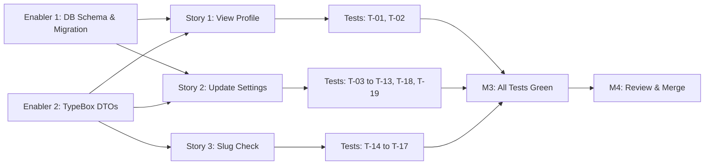

# Project Plan: Barbershop Settings

**Version:** 1.0
**Date:** April 26, 2026
**Status:** Draft
**Feature PRD:** [Barbershop Settings PRD](./prd.md)
**Implementation Plan:** [Barbershop Settings Implementation Plan](./implementation-plan.md)

---

## 1. Project Overview

### Feature Summary

The Barbershop Settings feature gives barbershop owners a way to view and update the four core profile fields of their active organization — **Name**, **Description**, **Address**, and **Booking URL (slug)** — after completing onboarding. It exposes three API endpoints: `GET /api/barbershop` (load profile), `PATCH /api/barbershop/settings` (partial updates with validation), and `GET /api/barbershop/slug-check` (real-time slug availability, public, rate-limited). All mutations are strictly tenant-scoped; `organizationId` is always derived from the session's `activeOrganizationId`, making cross-tenant mutation impossible by design.

### Success Criteria

| Criterion | Measurement |
|---|---|
| All 19 integration test cases pass | `bun test barbershop-settings` exits 0 |
| GET/PATCH respond within 500 ms at p95 | Manual or CI load test |
| Slug-check responds within 200 ms at p95 | Manual or CI load test |
| Slug-check rate limit returns 429 after 30 req/min/IP | Integration test T-18 equivalent |
| Lint and format checks pass | `bun run lint:fix && bun run format` exit 0 |
| No cross-tenant data leakage | Test T-18 (cross-tenant isolation) passes |

### Key Milestones

1. **M1 — Infrastructure Ready**: `barbershop_settings` schema defined, migration generated and verified, `drizzle/schemas.ts` updated.
2. **M2 — Core API Complete**: All three endpoints implemented, TypeBox validation wired, service logic complete.
3. **M3 — Integration Tests Green**: All 19 test cases passing, lint clean.
4. **M4 — Review & Merge**: Code reviewed, merged to main branch.

### Risk Assessment

| Risk | Likelihood | Impact | Mitigation |
|---|---|---|---|
| Better Auth `organization` table structure differs from assumed schema | Low | High | Inspect actual table columns in `auth-schema.ts` before writing the service query |
| `elysia-rate-limit` per-route override not scoping correctly | Medium | Medium | Test rate limiting isolation early (T-17 analogue); fall back to middleware-based guard if needed |
| Slug uniqueness race condition (two concurrent PATCHes) | Low | Low | DB-level `UNIQUE INDEX` on `organization.slug` catches races; service 409 path handles the error |
| `onboardingCompleted` flag accidentally reset during PATCH | Low | High | UPSERT targets only `description` and `address`; `onboardingCompleted` is excluded from the update set in the service |

---

## 2. Work Item Hierarchy

```mermaid
graph TD
    A["Epic: Cukkr — Barbershop Management & Booking System"] --> B["Feature: Barbershop Settings"]

    B --> E1["Enabler 1: barbershop_settings DB Schema & Migration"]
    B --> E2["Enabler 2: TypeBox DTOs & Model"]
    B --> S1["Story 1: View Barbershop Profile (GET /api/barbershop)"]
    B --> S2["Story 2: Update Barbershop Settings (PATCH /api/barbershop/settings)"]
    B --> S3["Story 3: Real-Time Slug Check (GET /api/barbershop/slug-check)"]

    E1 --> T01["Task: Define barbershop_settings Drizzle schema"]
    E1 --> T02["Task: Generate & verify migration"]
    E1 --> T03["Task: Register schema in drizzle/schemas.ts"]

    E2 --> T04["Task: Define BarbershopResponse, BarbershopSettingsInput, SlugCheckQuery, SlugCheckResponse in model.ts"]

    S1 --> T05["Task: Implement GET / route in handler.ts"]
    S1 --> T06["Task: Implement getSettings() in service.ts"]
    S1 --> TST1["Test: T-01 load settings authenticated"]
    S1 --> TST2["Test: T-02 load settings no session → 403"]

    S2 --> T07["Task: Implement PATCH /settings route in handler.ts"]
    S2 --> T08["Task: Implement updateSettings() with split writes in service.ts"]
    S2 --> TST3["Test: T-03 update name only"]
    S2 --> TST4["Test: T-04 update description and address"]
    S2 --> TST5["Test: T-05 update slug — available"]
    S2 --> TST6["Test: T-06 slug conflict → 409"]
    S2 --> TST7["Test: T-07 own slug → 200"]
    S2 --> TST8["Test: T-08 empty body → 400"]
    S2 --> TST9["Test: T-09 to T-12 validation failures"]
    S2 --> TST10["Test: T-13 unauthenticated PATCH → 401"]
    S2 --> TST11["Test: T-18 cross-tenant isolation"]
    S2 --> TST12["Test: T-19 idempotency"]

    S3 --> T09["Task: Implement GET /slug-check route with per-route rate limit"]
    S3 --> T10["Task: Implement checkSlug() in service.ts"]
    S3 --> TST13["Test: T-14 available slug"]
    S3 --> TST14["Test: T-15 taken slug → available: false"]
    S3 --> TST15["Test: T-16 own slug authenticated → available: true"]
    S3 --> TST16["Test: T-17 missing param → 400"]

    B --> T11["Task: Register barbershopHandler in src/app.ts"]
```



---

## 3. GitHub Issues Breakdown

### Epic Issue

```markdown
# Epic: Cukkr — Barbershop Management & Booking System

## Epic Description

Cukkr is a multi-tenant barbershop management platform. Owners manage barbershops, barbers,
services, schedules, and analytics via mobile app. Customers access a lightweight web booking
page via a unique shareable URL — no app download required.

## Business Value

- **Primary Goal**: Replace informal (WhatsApp/paper) booking with a structured digital system.
- **Success Metrics**: Zero double-bookings; customer booking time ≤ 60 seconds; real-time analytics for owners.
- **User Impact**: Owners gain control of their business operations; customers get a frictionless booking experience.

## Epic Acceptance Criteria

- [ ] Owner can onboard a barbershop end-to-end (register → setup → live)
- [ ] Owner can manage barbershop settings post-onboarding
- [ ] Barbers can handle walk-ins and appointments from their mobile view
- [ ] Customers can book via the public web landing page in ≤ 60 seconds

## Features in this Epic

- [ ] #TBD - Authentication & Onboarding
- [ ] #TBD - Barbershop Settings

## Definition of Done

- [ ] All feature stories completed and integration tests passing
- [ ] Lint and format checks passing (`bun run lint:fix && bun run format`)
- [ ] No cross-tenant data leakage confirmed by isolation tests
- [ ] API response times within specified budgets (p95)

## Labels

`epic`, `priority-high`, `value-high`

## Estimate

XL
```

---

### Feature Issue

```markdown
# Feature: Barbershop Settings

## Feature Description

Gives barbershop owners the ability to view and edit the four core profile fields of their
active organization — Name, Description, Address, and Booking URL slug — after completing
onboarding. Includes real-time slug availability checking (public, rate-limited endpoint).

## User Stories in this Feature

- [ ] #TBD - Story: View Barbershop Profile
- [ ] #TBD - Story: Update Barbershop Settings
- [ ] #TBD - Story: Real-Time Slug Check

## Technical Enablers

- [ ] #TBD - Enabler: barbershop_settings DB Schema & Migration
- [ ] #TBD - Enabler: TypeBox DTOs & Model Definitions

## Dependencies

**Blocks**: Public booking landing page (reads slug + name from organization)
**Blocked by**: Authentication & Onboarding epic feature (session + activeOrganizationId must exist)

## Acceptance Criteria

- [ ] GET /api/barbershop returns full profile for the active organization
- [ ] PATCH /api/barbershop/settings persists partial updates with full validation
- [ ] GET /api/barbershop/slug-check returns availability with 30 req/min/IP rate limit
- [ ] All 19 integration tests in `tests/modules/barbershop-settings.test.ts` pass
- [ ] No organizationId accepted from request body; always derived from session

## Definition of Done

- [ ] All user stories delivered and tests passing
- [ ] Technical enablers completed (schema, migration, DTOs)
- [ ] Integration tests green (`bun test barbershop-settings`)
- [ ] Lint and format clean
- [ ] Code review approved

## Labels

`feature`, `priority-high`, `value-high`, `backend`

## Epic

#TBD (Cukkr — Barbershop Management & Booking System)

## Estimate

M (13 story points total)
```

---

### User Story Issues

#### Story 1: View Barbershop Profile

```markdown
# User Story: View Barbershop Profile

## Story Statement

As an **owner**, I want to open the Barbershop Settings screen and see the current name,
description, address, and booking URL slug of my active barbershop so that I know what
customers are currently seeing.

## Acceptance Criteria

- [ ] GET /api/barbershop returns 200 with `{ id, name, slug, description, address, onboardingCompleted }`
- [ ] Returns 403 if no active organization in session
- [ ] Returns 404 if organization record is not found
- [ ] `description` and `address` return null if barbershop_settings row does not yet exist
- [ ] `onboardingCompleted` returns false if no settings row exists

## Technical Tasks

- [ ] #TBD - Implement GET / route in handler.ts with requireOrganization macro
- [ ] #TBD - Implement getSettings() in service.ts (JOIN organization + barbershop_settings)

## Testing Requirements

- [ ] #TBD - T-01: Load settings — authenticated owner → 200
- [ ] #TBD - T-02: Load settings — no session → 403

## Dependencies

**Blocked by**: Enabler: barbershop_settings DB Schema & Migration

## Definition of Done

- [ ] Acceptance criteria met
- [ ] Code review approved
- [ ] Integration tests T-01 and T-02 passing

## Labels

`user-story`, `priority-high`, `backend`

## Feature

#TBD (Barbershop Settings)

## Estimate

3 points
```

---

#### Story 2: Update Barbershop Settings

```markdown
# User Story: Update Barbershop Settings

## Story Statement

As an **owner**, I want to tap a "Save" button to persist any combination of name, description,
address, and slug changes so that my barbershop profile is always accurate and up to date.

## Acceptance Criteria

- [ ] PATCH /api/barbershop/settings accepts partial body (any combination of 4 fields)
- [ ] Returns 400 if body is empty
- [ ] `name` validated: 2–100 chars
- [ ] `description` validated: ≤ 500 chars
- [ ] `address` validated: ≤ 300 chars
- [ ] `slug` validated: 3–63 chars, matches `^[a-z0-9]([a-z0-9-]*[a-z0-9])?$`, auto-lowercased
- [ ] Returns 409 if slug is taken by a different org
- [ ] Returns 200 with own slug (no conflict)
- [ ] Returns 401 without a valid session
- [ ] Returns 403 without an active organization
- [ ] Returns 200 with full updated profile on success
- [ ] `organizationId` never read from request body

## Technical Tasks

- [ ] #TBD - Implement PATCH /settings route in handler.ts
- [ ] #TBD - Implement updateSettings() with split writes (org table + barbershop_settings upsert)
- [ ] #TBD - Implement slug uniqueness pre-check in service

## Testing Requirements

- [ ] #TBD - T-03 through T-13, T-18, T-19

## Dependencies

**Blocked by**: Enabler: barbershop_settings DB Schema & Migration, Enabler: TypeBox DTOs

## Definition of Done

- [ ] Acceptance criteria met
- [ ] Code review approved
- [ ] Integration tests T-03 through T-13, T-18, T-19 passing

## Labels

`user-story`, `priority-high`, `backend`

## Feature

#TBD (Barbershop Settings)

## Estimate

5 points
```

---

#### Story 3: Real-Time Slug Check

```markdown
# User Story: Real-Time Slug Check

## Story Statement

As an **owner**, I want to see real-time feedback while I type my desired slug so that I know
immediately whether it is available before I attempt to save.

## Acceptance Criteria

- [ ] GET /api/barbershop/slug-check?slug={value} returns `{ available: boolean }`
- [ ] Input is lowercased before lookup
- [ ] Returns available: true if slug is not found
- [ ] Returns available: false if slug belongs to a different org
- [ ] Returns available: true if authenticated and slug belongs to own org
- [ ] Returns 400 if slug query param is missing
- [ ] Rate limited at 30 req/IP/min; returns 429 when exceeded
- [ ] No authentication required

## Technical Tasks

- [ ] #TBD - Implement GET /slug-check route with per-route rateLimit(30 req/min) override
- [ ] #TBD - Implement checkSlug() in service.ts

## Testing Requirements

- [ ] #TBD - T-14 through T-17

## Dependencies

**Blocked by**: Enabler: TypeBox DTOs (SlugCheckQuery, SlugCheckResponse)

## Definition of Done

- [ ] Acceptance criteria met
- [ ] Code review approved
- [ ] Integration tests T-14 through T-17 passing

## Labels

`user-story`, `priority-high`, `backend`

## Feature

#TBD (Barbershop Settings)

## Estimate

3 points
```

---

### Technical Enabler Issues

#### Enabler 1: barbershop_settings DB Schema & Migration

```markdown
# Technical Enabler: barbershop_settings DB Schema & Migration

## Enabler Description

Define the `barbershop_settings` Drizzle schema, generate the database migration, verify the
generated SQL, apply the migration, and register the schema export. This is the foundational
infrastructure for all barbershop settings endpoints.

## Technical Requirements

- [ ] `barbershop_settings` table defined in `src/modules/barbershop/schema.ts`
- [ ] Columns: `id` (text PK, nanoid), `organizationId` (text, NOT NULL, FK → organization.id ON DELETE CASCADE, UNIQUE), `description` (text, nullable), `address` (text, nullable), `onboardingCompleted` (boolean, NOT NULL, DEFAULT false), `createdAt`, `updatedAt`
- [ ] UNIQUE INDEX on `organizationId` (enforces one-to-one with organization)
- [ ] Migration generated via `bunx drizzle-kit generate --name add_barbershop_settings`
- [ ] Migration SQL verified for correct FK cascade and unique index
- [ ] Migration applied via `bunx drizzle-kit migrate`
- [ ] Schema re-exported from `drizzle/schemas.ts`

## Implementation Tasks

- [ ] #TBD - Define barbershop_settings Drizzle table in schema.ts
- [ ] #TBD - Generate migration with drizzle-kit
- [ ] #TBD - Verify and apply migration
- [ ] #TBD - Register export in drizzle/schemas.ts

## User Stories Enabled

This enabler supports:

- #TBD - Story: View Barbershop Profile
- #TBD - Story: Update Barbershop Settings

## Acceptance Criteria

- [ ] Migration applies cleanly to a fresh database
- [ ] UNIQUE constraint on `organizationId` verified
- [ ] FK CASCADE DELETE verified
- [ ] `bunx drizzle-kit check` passes with no warnings

## Definition of Done

- [ ] Schema implemented
- [ ] Migration generated and verified
- [ ] Migration applied
- [ ] `drizzle/schemas.ts` updated
- [ ] Code review approved

## Labels

`enabler`, `priority-critical`, `backend`, `database`

## Feature

#TBD (Barbershop Settings)

## Estimate

2 points
```

---

#### Enabler 2: TypeBox DTOs & Model Definitions

```markdown
# Technical Enabler: TypeBox DTOs & Model Definitions

## Enabler Description

Define all request/response TypeBox schemas in `src/modules/barbershop/model.ts`. These DTOs
are the single source of truth for route-level validation and response shaping across all
three barbershop endpoints.

## Technical Requirements

- [ ] `BarbershopResponse` — response shape for GET and PATCH success: `id`, `name`, `slug`, `description`, `address`, `onboardingCompleted`
- [ ] `BarbershopSettingsInput` — PATCH body with optional `name` (2–100 chars), `description` (≤ 500), `address` (≤ 300), `slug` (3–63 chars, regex pattern, auto-lowercased note)
- [ ] `SlugCheckQuery` — query params for slug-check: `slug` (required string)
- [ ] `SlugCheckResponse` — `{ available: boolean }`
- [ ] All schemas use TypeBox (`t.Object`, `t.String`, `t.Optional`, `t.Boolean`, pattern constraints)

## Implementation Tasks

- [ ] #TBD - Define all four TypeBox schemas in model.ts

## User Stories Enabled

This enabler supports:

- #TBD - All three stories (View, Update, Slug Check)

## Acceptance Criteria

- [ ] All TypeBox schemas correctly reflect the API design spec
- [ ] Slug pattern `^[a-z0-9]([a-z0-9-]*[a-z0-9])?$` applied to the slug field in BarbershopSettingsInput and SlugCheckQuery
- [ ] minLength/maxLength constraints applied to name, description, address, slug

## Definition of Done

- [ ] model.ts complete
- [ ] No TypeScript errors
- [ ] Code review approved

## Labels

`enabler`, `priority-high`, `backend`

## Feature

#TBD (Barbershop Settings)

## Estimate

1 point
```

---

## 4. Priority and Value Matrix

| Issue | Priority | Value | Labels |
|---|---|---|---|
| Enabler: DB Schema & Migration | P0 | High | `priority-critical`, `value-high` |
| Enabler: TypeBox DTOs | P0 | High | `priority-critical`, `value-high` |
| Story: View Barbershop Profile | P1 | High | `priority-high`, `value-high` |
| Story: Update Barbershop Settings | P1 | High | `priority-high`, `value-high` |
| Story: Real-Time Slug Check | P1 | High | `priority-high`, `value-high` |
| Integration Tests (all) | P1 | High | `priority-high`, `value-high` |
| Register handler in app.ts | P1 | Medium | `priority-high`, `value-medium` |

---

## 5. Dependency Management



**Dependency Summary:**

| Dependency | Type | Notes |
|---|---|---|
| Enabler 1 → Stories 1 & 2 | Blocks | DB table must exist before service queries can run |
| Enabler 2 → All Stories | Blocks | DTOs must exist before handler routes can be typed |
| Auth/Onboarding feature | Prerequisite | `activeOrganizationId` in session is assumed to exist |
| `elysia-rate-limit` global plugin | Prerequisite | Already wired in `src/app.ts`; per-route override layered on top |

---

## 6. Estimation Summary

| Issue | Type | Estimate |
|---|---|---|
| Enabler: DB Schema & Migration | Enabler | 2 pts |
| Enabler: TypeBox DTOs | Enabler | 1 pt |
| Story: View Barbershop Profile | Story | 3 pts |
| Story: Update Barbershop Settings | Story | 5 pts |
| Story: Real-Time Slug Check | Story | 3 pts |
| Register handler in app.ts | Task | 1 pt |
| **Total** | | **15 pts** |

Feature T-Shirt Size: **M** (13–15 story points)

---

## 7. GitHub Project Board Configuration

### Column Structure

1. **Backlog** — All issues created, not yet started
2. **Sprint Ready** — Estimated, detailed, and ready for development
3. **In Progress** — Actively being worked on
4. **In Review** — Pull request open, awaiting code review
5. **Testing** — Integration tests being validated
6. **Done** — Merged, tests green

### Custom Fields

| Field | Values |
|---|---|
| Priority | P0, P1, P2 |
| Value | High, Medium, Low |
| Component | Handler, Service, Schema, Model, Tests |
| Estimate | Story points (Fibonacci) |
| Epic | Cukkr — Barbershop Management |

---

## 8. Recommended Implementation Order

1. **Enabler 1** — Schema, migration, schema registration *(blocks most work)*
2. **Enabler 2** — TypeBox DTOs in `model.ts` *(needed by handler)*
3. **Story 1** — `getSettings()` service + GET `/api/barbershop` route
4. **Story 3** — `checkSlug()` service + GET `/api/barbershop/slug-check` route *(simpler, builds confidence)*
5. **Story 2** — `updateSettings()` service + PATCH `/api/barbershop/settings` route *(most complex)*
6. **Task** — Register `barbershopHandler` in `src/app.ts`
7. **Tests** — Write and run full `tests/modules/barbershop-settings.test.ts` suite
8. **Lint & Format** — `bun run lint:fix && bun run format`
