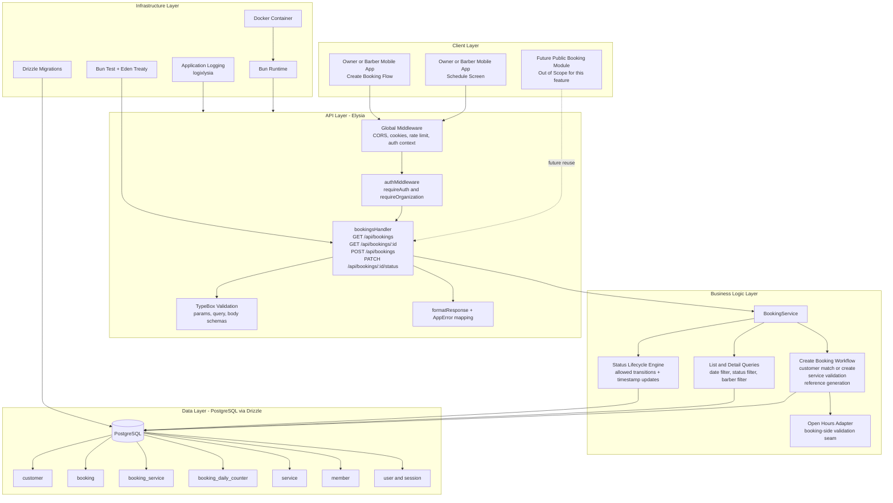
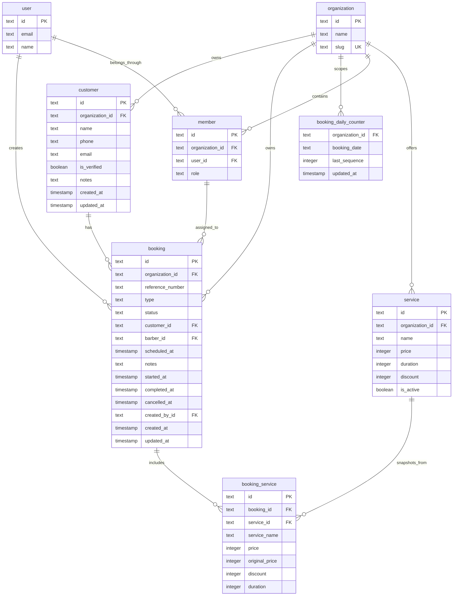

# Implementation Plan: Booking & Schedule Management

**Version:** 1.0  
**Date:** April 26, 2026  
**Status:** Draft  
**Feature PRD:** [prd.md](./prd.md)

---

## Goal

Deliver an organization-scoped booking and queue-management module that supports both walk-in and appointment workflows, customer matching, service snapshots, and a strict status lifecycle. The implementation must integrate cleanly with the existing Elysia, Better Auth, Drizzle, and Bun test patterns already present in the backend, while keeping handlers thin and business rules centralized in a dedicated service layer. The feature should provide a reliable schedule view for daily operations, generate unique customer-facing reference numbers atomically under concurrency, and preserve historical pricing data even when service definitions change later. The result should become the operational source of truth for future notification, analytics, CRM, and public-booking flows without leaking data across organizations.

---

## Requirements

- Create a new `bookings` module under `src/modules/bookings/` with `handler.ts`, `model.ts`, `schema.ts`, and `service.ts`.
- Register all new booking-related tables in `drizzle/schemas.ts` and generate a migration with `drizzle-kit generate`.
- Add tenant-owned persistence for `customer`, `booking`, `booking_service`, and a small support table for daily sequence generation.
- Expose authenticated staff endpoints for list, detail, create, and status updates under `/api/bookings`.
- Enforce multi-tenant isolation on every route with `requireOrganization: true` and `organizationId = activeOrganizationId` filtering in every query.
- Support both booking types from the PRD: `walk_in` and `appointment`.
- Automatically create or match a `customer` record during booking creation using organization-scoped phone/email matching.
- Snapshot service name, price, original price, discount, and duration into `booking_service` rows at creation time.
- Generate `referenceNumber` in the format `BK-{YYYYMMDD}-{DailySeq}-{Checksum}` using a transaction-safe per-organization daily counter.
- Implement the booking lifecycle exactly as defined in the PRD and reject invalid transitions with `400 Bad Request` through `AppError`.
- Set and clear lifecycle timestamps atomically on status transitions.
- Validate service ownership and activity, barber assignment eligibility, appointment timing, and request shape using TypeBox schemas in `model.ts`.
- Add integration coverage in `tests/modules/bookings.test.ts` for auth, tenant scoping, customer matching, reference-number generation, lifecycle transitions, list filtering, and snapshot integrity.
- Keep public booking submission, notifications, analytics, and recurring bookings out of scope for this module, but shape the internal service layer so those future modules can reuse booking reads and lifecycle events.

### Module Deliverables

| File | Responsibility |
|---|---|
| `src/modules/bookings/schema.ts` | Drizzle table definitions, indexes, relations, and inferred row types for booking data |
| `src/modules/bookings/model.ts` | TypeBox request/response schemas, status/type enums, params and query DTOs |
| `src/modules/bookings/service.ts` | Booking creation workflow, customer matching, sequence generation, lifecycle enforcement, and query composition |
| `src/modules/bookings/handler.ts` | Elysia route group, auth macros, DTO binding, formatted responses, and HTTP status mapping |
| `drizzle/schemas.ts` | Re-export new booking schemas so migrations and auth/database setup see them |
| `src/app.ts` | Register the new bookings handler under `/api` |
| `tests/modules/bookings.test.ts` | End-to-end integration coverage using Eden Treaty |
| `drizzle/*.sql` | Migration for booking tables, indexes, foreign keys, and sequence support table |

### Implementation Notes

- Use the current `services` module as the main reference for handler/service separation, TypeBox DTO organization, and tenant-scoped query patterns.
- Reuse `authMiddleware` and the Better Auth session context already supplying `user` and `activeOrganizationId`.
- Reuse `member` from `src/modules/auth/schema.ts` for `barberId` linkage instead of creating a separate barber ownership table.
- Treat `createdById` as server-controlled data sourced from the authenticated session; never accept it from clients.
- Keep all business errors in `service.ts` and throw `AppError` only.
- Prefer storing IDs as `text` to align with the existing schema style in this repository.
- Use UTC timestamps in storage and derive the organization-local `YYYYMMDD` fragment for the reference number with WIB (`UTC+7`) rules until organization-specific timezone configuration exists.

### Feature Gap Analysis

| PRD Capability | Existing Support | Status | Implementation Direction |
|---|---|---|---|
| Authenticated organization context | Better Auth session + `authMiddleware` | Reuse | Require `requireOrganization: true` on all booking routes |
| Service catalog lookup and snapshot source | `src/modules/services` + `service` table | Reuse | Validate all `serviceIds` inside tenant scope and snapshot DB values |
| Barber assignment via organization staff membership | `member` table exists | Partial | Validate `barberId` against tenant membership and barber/owner roles |
| Daily schedule route registration | Elysia module pattern | Reuse | Register `bookingsHandler` in `src/app.ts` |
| Customer entity for booking linkage | Not present | Build | Add tenant-owned `customer` table in bookings module |
| Atomic daily booking sequence | Not present | Build | Add `booking_daily_counter` table with transactional increment workflow |
| Open-hours validation for appointments | No implementation in `src/` yet | Dependency | Define booking-side interface and mark open-hours lookup as prerequisite or parallel story |
| Staff active/inactive membership state | `member` has no active flag | Gap | Use membership existence for MVP or coordinate a schema extension before enforcing true active-status semantics |
| Public appointment submission | Explicitly out of scope | Defer | Keep service methods composable for future `booking-public` module |
| Notifications on accept/decline | Explicitly out of scope | Defer | Leave lifecycle methods ready for later event emission hooks |

### Recommended Delivery Sequence

1. Add schema definitions and migration for booking tables, indexes, and relations.
2. Implement TypeBox enums and DTOs for create, list, detail, and status-update routes.
3. Build internal query helpers for tenant-safe service lookup, member validation, and customer matching.
4. Implement transactional create-booking workflow including sequence generation and service snapshots.
5. Implement list/detail/status endpoints and lifecycle rules.
6. Add integration tests for acceptance-criteria coverage, including cross-tenant rejection and snapshot integrity.
7. Run `bun run lint:fix`, `bun run format`, and targeted `bun test bookings` before broader validation.

---

## Technical Considerations

### System Architecture Overview



### Technology Stack Selection

| Layer | Technology | Rationale |
|---|---|---|
| API | Elysia | Matches existing route registration, TypeBox integration, and auth-macro usage already present in `src/app.ts` and current modules |
| Validation | TypeBox via Elysia `t` | Provides schema-driven `422` behavior and keeps DTO definitions centralized in `model.ts` |
| Business Logic | Module-local `BookingService` | Keeps handlers thin, centralizes tenant rules, and gives later modules one reusable booking workflow surface |
| Persistence | Drizzle ORM + PostgreSQL | Existing repository standard; supports transactions needed for daily sequence generation and lifecycle updates |
| Authentication | Better Auth + `authMiddleware` | Already provides `user` and `activeOrganizationId` without custom auth code |
| Observability | `logixlysia` and structured error mapping | Reuses current app-level logging and improves visibility into create/status failures |
| Testing | Bun test + Eden Treaty | Existing integration-test style validates the full HTTP contract and auth cookie behavior |
| Deployment | Bun in Docker | Aligns with current deployment model and requires no new service or worker for MVP |

### Integration Points

- `src/app.ts`: add `.use(bookingsHandler)` inside the `/api` group.
- `src/modules/services/schema.ts`: source of truth for active service validation and snapshot fields.
- `src/modules/auth/schema.ts`: reuse `member`, `user`, `session`, and `organization` references for barber assignment and creator linkage.
- `src/modules/barbers`: optional future place to expose staff lookup APIs, but not required for booking persistence.
- Future `open-hours` feature: provide an organization/day-of-week availability lookup that booking creation can call before accepting appointments.
- Future `notification` feature: consume lifecycle transitions through service-layer hooks or domain events when the team is ready to add async side effects.

### Deployment Architecture

- No new runtime service is needed for MVP; the bookings module ships inside the existing Bun application container.
- Database schema changes should be deployed first through standard Drizzle migration flow.
- Application rollout order should be migration, then backend release, then client release that consumes the new routes.
- Because booking writes depend on the new counter table and new foreign keys, do not deploy the handler before the migration lands.

### Scalability Considerations

- The PRD target of up to 200 daily bookings per organization is well within indexed PostgreSQL range without Redis or a read cache.
- Keep every booking query anchored by `organizationId` and a day-bounded predicate so list performance stays predictable.
- Use a dedicated `booking_daily_counter` row per organization per local day rather than scanning the `booking` table to derive the next sequence under concurrency.
- Return list summaries with prejoined customer and barber display data plus aggregated service names, and reserve full line-item expansion for detail reads.
- If daily booking volume grows later, the list endpoint can add pagination and materialized daily projections without changing the write model.

---

## Database Schema Design

### Entity Relationship Diagram



### Table Specifications

**Table:** `customer`

| Column | Type | Constraints | Notes |
|---|---|---|---|
| `id` | text | Primary key | Use repo-standard string IDs via `nanoid()` |
| `organizationId` | text | Not null, FK to `organization.id` | Tenant ownership |
| `name` | text | Not null | Validate `1..100` chars |
| `phone` | text | Nullable | Normalize before lookup and storage; max 20 chars |
| `email` | text | Nullable | Normalize lowercase before lookup and storage |
| `isVerified` | boolean | Not null, default `false` | Set `true` when phone or email is present |
| `notes` | text | Nullable | CRM-oriented future field, max 1000 chars |
| `createdAt` | timestamp | Not null, default now | Audit field |
| `updatedAt` | timestamp | Not null, default now, auto-update | Audit field |

**Table:** `booking`

| Column | Type | Constraints | Notes |
|---|---|---|---|
| `id` | text | Primary key | Use repo-standard string IDs |
| `organizationId` | text | Not null, FK to `organization.id` | Tenant ownership |
| `referenceNumber` | text | Not null | Unique with `organizationId` |
| `type` | text | Not null | Enum values `walk_in` or `appointment` |
| `status` | text | Not null | Enum values `pending`, `waiting`, `in_progress`, `completed`, `cancelled` |
| `customerId` | text | Not null, FK to `customer.id` | Required customer link |
| `barberId` | text | Nullable, FK to `member.id` | Assigned or preferred barber |
| `scheduledAt` | timestamp | Nullable | Required for appointments, null for walk-ins |
| `notes` | text | Nullable | Max 500 chars |
| `startedAt` | timestamp | Nullable | Set on `in_progress` |
| `completedAt` | timestamp | Nullable | Set on `completed` |
| `cancelledAt` | timestamp | Nullable | Set on `cancelled` |
| `createdById` | text | Not null, FK to `user.id` | Session user creating the booking |
| `createdAt` | timestamp | Not null, default now | Also used for walk-in day filtering |
| `updatedAt` | timestamp | Not null, default now, auto-update | Audit field |

**Table:** `booking_service`

| Column | Type | Constraints | Notes |
|---|---|---|---|
| `id` | text | Primary key | Use repo-standard string IDs |
| `bookingId` | text | Not null, FK to `booking.id` | Parent booking |
| `serviceId` | text | Not null, FK to `service.id` | Original service source |
| `serviceName` | text | Not null | Immutable snapshot |
| `price` | integer | Not null | Discounted price snapshot |
| `originalPrice` | integer | Not null | Pre-discount price snapshot |
| `discount` | integer | Not null | Snapshot percentage `0..100` |
| `duration` | integer | Not null | Snapshot duration in minutes |

**Table:** `booking_daily_counter`

| Column | Type | Constraints | Notes |
|---|---|---|---|
| `organizationId` | text | Not null, FK to `organization.id` | Tenant scope |
| `bookingDate` | text | Not null | Store local date key as `YYYYMMDD` |
| `lastSequence` | integer | Not null | Incremented transactionally |
| `updatedAt` | timestamp | Not null, default now, auto-update | Audit/debug support |

Recommended primary key or unique key for `booking_daily_counter`: `(organizationId, bookingDate)`.

### Reference Number Generation Strategy

Use the following transaction-safe workflow in `BookingService.createBooking`:

```text
1. Derive local booking date key in WIB from current timestamp.
2. In a DB transaction, upsert or lock the counter row for (organizationId, bookingDate).
3. Increment `lastSequence` and read the new value.
4. Generate a 2-character uppercase alphanumeric checksum.
5. Build `referenceNumber = BK-{bookingDate}-{seq padded to 3}-{checksum}`.
6. Insert booking and booking_service rows in the same transaction.
7. Rely on unique constraint (organizationId, referenceNumber) as final duplicate defense.
```

This avoids race conditions and prevents repeated full-table scans of `booking` when two staff create bookings concurrently.

### Indexing Strategy

| Index | Type | Rationale |
|---|---|---|
| `booking_organizationId_createdAt_idx` on `(organizationId, createdAt)` | Composite b-tree | Supports walk-in day filtering and queue ordering |
| `booking_organizationId_scheduledAt_idx` on `(organizationId, scheduledAt)` | Composite b-tree | Supports appointment day filtering and chronological ordering |
| `booking_organizationId_status_idx` on `(organizationId, status)` | Composite b-tree | Supports status filters and lifecycle-heavy schedule views |
| `booking_organizationId_barberId_scheduledAt_idx` on `(organizationId, barberId, scheduledAt)` | Composite b-tree | Speeds barber-specific appointment views |
| `booking_organizationId_referenceNumber_uidx` on `(organizationId, referenceNumber)` | Unique b-tree | Enforces booking identifier uniqueness per tenant |
| `booking_service_bookingId_idx` on `(bookingId)` | B-tree | Required for detail fetches and completion summaries |
| `customer_organizationId_phone_idx` on `(organizationId, phone)` | B-tree | Supports phone-based matching |
| `customer_organizationId_email_idx` on `(organizationId, email)` | B-tree | Supports email-based matching |
| `booking_daily_counter_org_date_uidx` on `(organizationId, bookingDate)` | Unique b-tree | Supports one sequence row per tenant per local day |

### Foreign Key Relationships and Constraints

- `booking.organizationId` must reference `organization.id` with `onDelete: cascade` only if product policy allows deleting organizations; otherwise follow existing auth-schema behavior.
- `booking.customerId` must reference `customer.id`.
- `booking.barberId` should reference `member.id` because assignment is organization-membership scoped, not global user scoped.
- `booking.createdById` must reference `user.id`.
- `booking_service.bookingId` must reference `booking.id` with cascade delete only if booking rows can ever be physically removed in maintenance scenarios.
- `booking_service.serviceId` should reference `service.id` so the original catalog item remains traceable.
- Add check constraints if desired for `status`, `type`, and non-negative numeric fields, but keep TypeBox validation as the primary application-layer gate.

### Database Migration Strategy

1. Create `src/modules/bookings/schema.ts` with all four tables and relation definitions.
2. Export the new schemas from `drizzle/schemas.ts`.
3. Generate a migration with `bunx drizzle-kit generate --name add-bookings-module`.
4. Review the generated SQL to confirm composite indexes, unique constraints, and foreign keys match the plan.
5. Apply the migration before enabling the routes in deployed environments.
6. If the team decides to add a real active/inactive member state or open-hours table first, land those migrations ahead of booking route rollout.

---

## API Design

### Route Ownership and Shape

- Module prefix: `/api/bookings`
- All routes require authenticated session context and active organization context.
- All responses should use the existing `formatResponse` wrapper.
- All errors should flow through `AppError` and current global error middleware.

### Request and Response Models

Planned TypeScript-facing DTO shapes:

```ts
type BookingType = 'walk_in' | 'appointment'

type BookingStatus =
    | 'pending'
    | 'waiting'
    | 'in_progress'
    | 'completed'
    | 'cancelled'

type BookingCreateInput = {
    type: BookingType
    customerName: string
    customerPhone?: string | null
    customerEmail?: string | null
    serviceIds: string[]
    barberId?: string | null
    scheduledAt?: string | null
    notes?: string | null
}

type BookingStatusUpdateInput = {
    status: BookingStatus
}

type BookingListQuery = {
    date: string
    status?: 'all' | BookingStatus
    barberId?: string
}
```

`model.ts` should also define:

- `BookingSummaryResponse` for list rows.
- `BookingDetailResponse` for full detail reads.
- `BookingServiceLineItemResponse` for snapshotted services.
- `CustomerResponse` and `BarberSummaryResponse` for nested detail objects.

### Endpoint Specifications

**GET `/api/bookings`**

- Purpose: return one organization-scoped day view containing walk-ins and appointments.
- Query params:
  - `date`: required `YYYY-MM-DD`
  - `status`: optional `all | pending | waiting | in_progress | completed | cancelled`, default `all`
  - `barberId`: optional member ID filter
- Query behavior:
  - appointments are filtered by `scheduledAt` falling on the requested day
  - walk-ins are filtered by `createdAt` falling on the requested day
  - results are ordered by chronological effective time ascending
- Response shape should include:
  - `id`
  - `referenceNumber`
  - `type`
  - `status`
  - `customerName`
  - `serviceSummary` or short service-name list
  - `barber` summary when assigned
  - `scheduledAt`
  - `createdAt`

**GET `/api/bookings/:id`**

- Purpose: return full booking detail for the active organization.
- Params: `id`
- Behavior:
  - verify tenant ownership before returning data
  - include nested customer, assigned barber summary, service line items, and all lifecycle timestamps
- Failure behavior:
  - `404` when ID does not exist in the active organization

**POST `/api/bookings`**

- Purpose: create walk-in or appointment bookings from staff-side flows.
- Validation rules:
  - `customerName` required, max 100
  - `serviceIds` required, min length 1
  - all services must belong to `activeOrganizationId` and be active
  - `barberId`, if present, must belong to the active organization and satisfy staff-role rules
  - `scheduledAt` required for appointments and omitted or null for walk-ins
  - appointment `scheduledAt` must be future-dated and pass open-hours validation
  - `notes` max 500
- Workflow:
  - normalize customer contact fields
  - match or create customer
  - validate services and barber
  - compute initial status `waiting`
  - generate reference number in transaction
  - insert booking and line items
- Response:
  - `201 Created` with full booking detail payload

**PATCH `/api/bookings/:id/status`**

- Purpose: advance or revert bookings inside the defined lifecycle.
- Body: `{ status: BookingStatus }`
- Allowed transitions:
  - `pending -> waiting`
  - `pending -> cancelled`
  - `waiting -> in_progress`
  - `waiting -> cancelled`
  - `in_progress -> completed`
  - `in_progress -> waiting`
  - `in_progress -> cancelled`
- Timestamp rules:
  - set `startedAt` when entering `in_progress`
  - set `completedAt` when entering `completed`
  - set `cancelledAt` when entering `cancelled`
  - clear `startedAt` when reverting `in_progress -> waiting`
- Invalid transitions return `400` with a descriptive domain message.

### Multi-Tenant Scoping Strategy

- Every route must require `activeOrganizationId` from the auth middleware.
- Every read and write query must include `organizationId = activeOrganizationId` either directly on the root table or through joined ownership.
- For detail queries, do not fetch by booking ID alone and then inspect ownership later; scope the lookup by both ID and organization in the same query.
- Barber validation must ensure the `member` row belongs to the same organization as the booking.
- Customer matching must search only within the active organization to avoid cross-tenant identity leakage.

### Error Handling Strategy

| Scenario | Status | Handling |
|---|---|---|
| Missing auth or active organization | `401` | Existing auth middleware behavior |
| Malformed body/query/params | `422` | TypeBox validation failure |
| Booking not found in org | `404` | `AppError('Booking not found', 'NOT_FOUND')` |
| Invalid service IDs or barber assignment | `422` or `400` | Prefer `422` for request-data validation failures that pass schema but fail domain existence checks |
| Invalid status transition | `400` | `AppError` with transition-specific message |
| Cross-tenant access attempt | `404` | Return not found rather than forbidden to avoid resource disclosure |
| Duplicate reference number due to rare checksum collision | `409` or internal retry | Prefer automatic retry inside the transaction before surfacing an error |

### Rate Limiting and Caching Strategy

- Reuse the application-wide rate limiter already configured in `src/app.ts`; no route-specific override is necessary for MVP.
- Do not add write-side caching for booking creation or status updates.
- Avoid application caching on `GET /api/bookings` until real traffic shows repeated identical day queries.
- If later needed, cache only organization/day list responses and invalidate on booking create/status mutation.

---

## Security & Performance

### Authentication and Authorization

- Require authenticated sessions for all booking routes.
- Require active organization selection for all booking routes.
- Restrict all persistence and queries to the active organization.
- Populate `createdById` from the session user, not from request input.
- Treat `barberId` as optional, but when present validate that the referenced member belongs to the same organization and has an allowed role.

### Data Validation and Sanitization

- Normalize phone numbers before lookup and storage so customer matching is deterministic.
- Lowercase and trim emails before lookup and storage.
- Reject duplicate or empty `serviceIds` arrays at the service layer even if TypeBox handles min length.
- Reject appointment timestamps in the past before checking open hours.
- Keep request schemas strict so unexpected properties do not silently pass through to inserts.

### Performance Optimization Strategy

- Fetch all requested services in one tenant-scoped query and compare row counts against requested IDs instead of issuing per-ID lookups.
- Use one transaction for sequence generation, booking insert, and line-item insert to avoid extra round-trips and partial writes.
- Build the list endpoint as a summary query and avoid loading full line items unless the detail endpoint is called.
- Prefer composite indexes on organization-bound filters over broader global indexes.
- If the day-view query later becomes expensive, add pagination or split walk-ins and appointments into separate list shapes without changing write behavior.

### Caching Mechanisms

- No dedicated cache is recommended for MVP.
- Rely on indexed PostgreSQL queries and lightweight summary payloads.
- If caching is introduced later, keep cache keys scoped by organization, date, status, and barber filter to avoid leakage.

### Testing and Validation Strategy

- Add integration tests covering each acceptance criterion from the PRD.
- Include explicit cross-tenant tests for list, detail, and status update endpoints.
- Add a concurrency-oriented test or service-level test harness for reference-number sequence generation.
- Verify snapshot integrity by mutating a service after booking creation and confirming the booking detail still returns the original values.
- Verify `in_progress -> waiting` clears `startedAt` and `completed` or `cancelled` states reject further transitions.
- Run `bun run lint:fix`, `bun run format`, and targeted Bun tests after implementation.

### Key Risks and Mitigations

| Risk | Impact | Mitigation |
|---|---|---|
| Open-hours validation dependency is not yet implemented | Appointment creation cannot fully satisfy PRD | Treat open-hours lookup as a prerequisite story or introduce a temporary feature flag with explicit follow-up |
| No real active/inactive staff state exists on `member` | `barberId` validation may be weaker than PRD wording | Align with product on MVP semantics or extend schema before release |
| Reference checksum collision after sequence increment | Very low but possible duplicate insert conflict | Retry checksum generation within transaction before failing |
| Summary query complexity grows with future fields | Day view slows down | Keep list payload small and index-backed, use detail endpoint for full expansion |

---

## Suggested Story Breakdown

1. Add booking persistence schema and migration.
2. Add booking DTOs and lifecycle enums.
3. Implement customer matching and normalization helpers.
4. Implement transactional booking creation with reference generation.
5. Implement booking day-list and detail reads.
6. Implement lifecycle status update endpoint.
7. Add integration tests for acceptance criteria and tenant isolation.
8. Integrate open-hours validation once the dependency surface is available.