# Project Plan: Booking & Schedule Management

**Version:** 1.0
**Date:** April 26, 2026
**Status:** Draft
**Feature PRD:** [prd.md](./prd.md)
**Implementation Plan:** [implementation-plan.md](./implementation-plan.md)
**Parent Epic:** [Cukkr — Barbershop Management & Booking System](../epic.md)

---

## 1. Project Overview

### Feature Summary

The Booking & Schedule Management feature introduces the operational booking system for each organization. Staff can list bookings for a day, inspect booking detail, create walk-in and appointment bookings, and move bookings through the supported status lifecycle. The backend stores customer records, booking rows, booking-service snapshots, and a transactional daily counter to generate unique booking reference numbers. Every read and write stays scoped to the active organization, and appointments are explicitly dependent on open-hours availability so future customer-facing booking flows can build on the same rules.

### Success Criteria

| Criterion | Measurement |
|---|---|
| Daily booking list supports operational use | `GET /api/bookings` returns correct organization-scoped results for the selected day |
| Reference numbers remain unique under concurrency | Transactional counter tests and uniqueness checks pass |
| Historical pricing is preserved | Booking detail returns snapshotted service name, price, discount, and duration after service catalog changes |
| Status lifecycle remains valid | Invalid transitions return `400` and valid transitions set timestamps atomically |
| No cross-tenant access | List, detail, create, and status tests prove organization isolation |
| Performance target met | Day-list endpoint meets p95 target `<= 300 ms` for expected load |
| Quality gate complete | Targeted tests, lint, and format all exit 0 |

### Key Milestones

1. **M1 — Data Foundation**: Booking tables, indexes, relations, and migration generated and verified.
2. **M2 — Read Surface**: Day-list and booking-detail endpoints implemented with tenant-safe queries.
3. **M3 — Create Workflows**: Walk-in and appointment creation flows implemented with customer matching, service snapshots, and reference generation.
4. **M4 — Lifecycle Complete**: Status transition endpoint and timestamp rules implemented.
5. **M5 — Quality Gate**: Integration coverage complete, dependency on open-hours documented, quality checks passing.

### Risk Assessment

| Risk | Likelihood | Impact | Mitigation |
|---|---|---|---|
| Appointment validation depends on open-hours feature landing first | High | High | Track open-hours as an explicit prerequisite or block appointment story until its reusable helper is available |
| Reference-number generation races under concurrent creates | Medium | High | Use a transaction-safe daily counter table plus DB uniqueness constraint on `(organizationId, referenceNumber)` |
| `member` table lacks an active-state flag | Medium | Medium | For MVP, validate membership existence and allowed roles; document stronger active-state enforcement as follow-up |
| List query grows too heavy as fields expand | Low | Medium | Keep list payload summary-focused and reserve full expansion for detail endpoint |
| Service or customer matching rules drift across routes | Medium | Medium | Centralize booking creation workflow inside service helpers rather than duplicating route logic |

---

## 2. Work Item Hierarchy

```mermaid
graph TD
    A["Epic: Cukkr — Barbershop Management & Booking System"] --> B["Feature: Booking & Schedule Management"]

    B --> E1["Enabler 1: Booking Persistence Schema & Migration"]
    B --> E2["Enabler 2: DTOs, Enums, and Query Contracts"]
    B --> E3["Enabler 3: Transactional Create Primitives"]

    B --> S1["Story 1: View Daily Booking Schedule"]
    B --> S2["Story 2: View Booking Detail & Snapshots"]
    B --> S3["Story 3: Create Walk-In Booking"]
    B --> S4["Story 4: Create Appointment Booking"]
    B --> S5["Story 5: Manage Booking Status Lifecycle"]

    E1 --> T01["Task: Define customer, booking, booking_service, and booking_daily_counter schemas"]
    E1 --> T02["Task: Generate and verify migration"]
    E1 --> T03["Task: Export booking schemas in drizzle/schemas.ts"]

    E2 --> T04["Task: Define booking type, status, create body, list query, detail, and status DTOs"]
    E2 --> T05["Task: Define strict params and query validation"]

    E3 --> T06["Task: Implement customer matching and normalization helpers"]
    E3 --> T07["Task: Implement transactional daily counter and reference-number generator"]
    E3 --> T08["Task: Implement service snapshot mapping for booking_service rows"]

    S1 --> T09["Task: Implement GET /api/bookings in handler.ts"]
    S1 --> T10["Task: Implement day-list query composition in service.ts"]

    S2 --> T11["Task: Implement GET /api/bookings/:id in handler.ts"]
    S2 --> T12["Task: Implement tenant-scoped detail query with nested data"]

    S3 --> T13["Task: Implement POST /api/bookings walk-in flow"]
    S3 --> T14["Task: Validate service ownership and optional barber assignment"]

    S4 --> T15["Task: Add appointment-specific scheduling validation"]
    S4 --> T16["Task: Integrate open-hours dependency for appointment acceptance"]

    S5 --> T17["Task: Implement PATCH /api/bookings/:id/status in handler.ts"]
    S5 --> T18["Task: Implement lifecycle transition engine and timestamp updates"]

    B --> T19["Task: Register bookingsHandler in src/app.ts"]
    B --> T20["Task: Add bookings integration test coverage"]
    B --> T21["Task: Run targeted tests, lint, and format"]
```



---

## 3. GitHub Issues Breakdown

### Epic Issue

```markdown
# Epic: Cukkr — Barbershop Management & Booking System

## Epic Description

Multi-tenant barbershop management platform covering authentication, shop setup, service catalog,
operating schedule, booking operations, and future customer-facing public booking.

## Business Value

- **Primary Goal**: Replace ad-hoc queue handling and manual scheduling with a structured operational system.
- **Success Metrics**: No double-booking caused by missing backend controls, predictable reference numbers, and stable daily schedule visibility for staff.
- **User Impact**: Owners and barbers manage queue and appointments from one system; customers receive consistent booking outcomes and traceable reference numbers.

## Epic Acceptance Criteria

- [ ] Core operational data is scoped per organization
- [ ] Daily schedule and booking workflows are supported end to end
- [ ] Future public booking can build on reusable internal business rules

## Features in this Epic

- [ ] #TBD - Authentication & User Management
- [ ] #TBD - Onboarding
- [ ] #TBD - Barbershop Settings
- [ ] #TBD - Service Management
- [ ] #TBD - Open Hours Configuration
- [ ] #TBD - Booking & Schedule Management

## Definition of Done

- [ ] All feature stories completed
- [ ] Integration tests passing
- [ ] Lint and format checks passing
- [ ] Documented dependencies resolved
- [ ] Performance targets met for operational endpoints

## Labels

`epic`, `priority-high`, `value-high`

## Estimate

XL
```

### Feature Issue

```markdown
# Feature: Booking & Schedule Management

## Feature Description

Deliver organization-scoped booking operations for staff: list and inspect bookings, create walk-in
and appointment bookings, generate unique reference numbers, snapshot service pricing, and update
booking statuses through a strict lifecycle.

## User Stories in this Feature

- [ ] #TBD - Story: View Daily Booking Schedule
- [ ] #TBD - Story: View Booking Detail & Snapshots
- [ ] #TBD - Story: Create Walk-In Booking
- [ ] #TBD - Story: Create Appointment Booking
- [ ] #TBD - Story: Manage Booking Status Lifecycle

## Technical Enablers

- [ ] #TBD - Enabler: Booking Persistence Schema & Migration
- [ ] #TBD - Enabler: DTOs, Enums, and Query Contracts
- [ ] #TBD - Enabler: Transactional Create Primitives

## Dependencies

**Blocks**: Future public-booking flow, booking notifications, booking analytics, and CRM history features
**Blocked by**: Service Management for catalog data and Open Hours Configuration for appointment-time validation

## Acceptance Criteria

- [ ] Staff can list organization bookings for a selected day with filters
- [ ] Staff can read full booking detail including customer and service snapshots
- [ ] Walk-in and appointment bookings create customer, booking, and booking_service records correctly
- [ ] Reference numbers are unique and follow the documented format
- [ ] Status transitions enforce the allowed lifecycle and update timestamps atomically

## Definition of Done

- [ ] All user stories delivered
- [ ] Technical enablers completed
- [ ] Integration tests passing
- [ ] `bun run lint:fix` and `bun run format` clean
- [ ] Blocking dependencies explicitly linked and tracked

## Labels

`feature`, `priority-high`, `value-high`, `backend`

## Epic

#TBD (Cukkr — Barbershop Management & Booking System)

## Estimate

L (29 story points total)
```

### Technical Enablers

#### Enabler 1 — Booking Persistence Schema & Migration

```markdown
# Technical Enabler: Booking Persistence Schema & Migration

## Enabler Description

Create the booking persistence foundation: `customer`, `booking`, `booking_service`, and
`booking_daily_counter` tables, their indexes, and all required foreign-key relationships.

## Technical Requirements

- [ ] Define all booking-related tables in `src/modules/bookings/schema.ts`
- [ ] Add indexes for organization/day, status, barber scheduling, and booking-service lookup
- [ ] Add unique constraint for `(organizationId, referenceNumber)`
- [ ] Add unique constraint for `(organizationId, bookingDate)` on `booking_daily_counter`
- [ ] Export schemas from `drizzle/schemas.ts`
- [ ] Generate and verify migration SQL

## Implementation Tasks

- [ ] #TBD - Define booking schemas and relations
- [ ] #TBD - Generate and verify migration
- [ ] #TBD - Export schemas in `drizzle/schemas.ts`

## User Stories Enabled

- #TBD - Story: View Daily Booking Schedule
- #TBD - Story: View Booking Detail & Snapshots
- #TBD - Story: Create Walk-In Booking
- #TBD - Story: Create Appointment Booking
- #TBD - Story: Manage Booking Status Lifecycle

## Acceptance Criteria

- [ ] Migration applies cleanly on a fresh database
- [ ] Required indexes exist for list and detail paths
- [ ] DB-level uniqueness constraints protect reference numbers and daily counters

## Definition of Done

- [ ] Schema and migration committed
- [ ] TypeScript compiles without schema errors
- [ ] Code review approved

## Labels

`enabler`, `priority-high`, `backend`, `database`

## Feature

#TBD (Feature: Booking & Schedule Management)

## Estimate

5 points
```

#### Enabler 2 — DTOs, Enums, and Query Contracts

```markdown
# Technical Enabler: DTOs, Enums, and Query Contracts

## Enabler Description

Define all TypeBox contracts for booking creation, status updates, list filters, params, and
response payloads so handlers remain thin and Eden Treaty clients stay type-safe.

## Technical Requirements

- [ ] Define booking type and status enums in `model.ts`
- [ ] Define create body, list query, detail response, and status-update schemas
- [ ] Constrain list query to required `date` plus optional `status` and `barberId`
- [ ] Keep malformed input behavior explicit and testable
- [ ] Ensure response DTOs reflect nested customer, barber, and service snapshot shapes

## Implementation Tasks

- [ ] #TBD - Define enums and DTOs in `model.ts`
- [ ] #TBD - Define strict params and query validation

## User Stories Enabled

- #TBD - Story: View Daily Booking Schedule
- #TBD - Story: View Booking Detail & Snapshots
- #TBD - Story: Create Walk-In Booking
- #TBD - Story: Create Appointment Booking
- #TBD - Story: Manage Booking Status Lifecycle

## Acceptance Criteria

- [ ] DTOs match the documented API contracts
- [ ] Validation errors surface predictably in integration tests
- [ ] Eden Treaty tests can call all routes without manual contract gaps beyond auth exceptions

## Definition of Done

- [ ] DTOs committed
- [ ] TypeScript compiles without contract errors
- [ ] Code review approved

## Labels

`enabler`, `priority-high`, `backend`, `api`

## Feature

#TBD (Feature: Booking & Schedule Management)

## Estimate

3 points
```

#### Enabler 3 — Transactional Create Primitives

```markdown
# Technical Enabler: Transactional Create Primitives

## Enabler Description

Build the shared service helpers for normalized customer matching, transactional daily-sequence
generation, and booking-service snapshot creation so both walk-in and appointment flows reuse the
same data integrity rules.

## Technical Requirements

- [ ] Normalize customer phone and email before matching or insert
- [ ] Match customers only within the active organization
- [ ] Increment the per-organization daily counter transactionally
- [ ] Build `BK-{YYYYMMDD}-{DailySeq}-{Checksum}` reference numbers in the same transaction
- [ ] Snapshot service name, price, discount, original price, and duration at booking time

## Implementation Tasks

- [ ] #TBD - Implement customer matching and normalization helpers
- [ ] #TBD - Implement daily counter and reference-number generator
- [ ] #TBD - Implement booking-service snapshot mapping

## User Stories Enabled

- #TBD - Story: Create Walk-In Booking
- #TBD - Story: Create Appointment Booking

## Acceptance Criteria

- [ ] Reference generation is concurrency-safe
- [ ] Customer matching never crosses organization boundaries
- [ ] Historical service snapshot data remains unchanged after later catalog updates

## Definition of Done

- [ ] Shared helpers committed
- [ ] Integration tests cover matching and reference generation
- [ ] Code review approved

## Labels

`enabler`, `priority-high`, `backend`, `service`

## Feature

#TBD (Feature: Booking & Schedule Management)

## Estimate

5 points
```

### User Story Issues

#### Story 1: View Daily Booking Schedule

```markdown
# User Story: View Daily Booking Schedule

## Story Statement

As a **barber or owner**, I want to see all bookings for a selected day so that I can manage the
queue and upcoming appointments from one schedule view.

## Acceptance Criteria

- [ ] `GET /api/bookings` requires authentication and active organization context
- [ ] Query requires `date` and optionally supports `status` and `barberId`
- [ ] Appointments are filtered by `scheduledAt` and walk-ins by `createdAt` for the selected day
- [ ] Results include summary data: reference number, type, status, customer name, service summary, barber summary, scheduled time, and created time
- [ ] Results are ordered consistently for operational use
- [ ] Cross-tenant bookings never appear in the response

## Technical Tasks

- [ ] #TBD - Implement list route in `handler.ts`
- [ ] #TBD - Implement day-list query composition in `service.ts`

## Testing Requirements

- [ ] #TBD - Integration tests for date filtering, status filtering, barber filtering, and tenant isolation

## Dependencies

**Blocked by**: Enabler 1 (schema), Enabler 2 (DTOs)

## Definition of Done

- [ ] Acceptance criteria met
- [ ] Code review approved
- [ ] Integration tests passing

## Labels

`user-story`, `priority-high`, `backend`

## Feature

#TBD (Booking & Schedule Management)

## Estimate

5 points
```

#### Story 2: View Booking Detail & Snapshots

```markdown
# User Story: View Booking Detail & Snapshots

## Story Statement

As a **barber or owner**, I want to open a booking and see the full detail including customer,
services, and timestamps so that I can act with complete context.

## Acceptance Criteria

- [ ] `GET /api/bookings/:id` requires authentication and active organization context
- [ ] Detail response includes customer data, barber summary, notes, timestamps, and all service snapshots
- [ ] Snapshotted service values reflect booking-time data rather than current catalog state
- [ ] Unknown or cross-tenant booking IDs return `404`
- [ ] Detail endpoint stays tenant-scoped in the query itself

## Technical Tasks

- [ ] #TBD - Implement detail route in `handler.ts`
- [ ] #TBD - Implement tenant-scoped detail query in `service.ts`

## Testing Requirements

- [ ] #TBD - Integration tests for successful detail read, snapshot integrity, and cross-tenant 404 behavior

## Dependencies

**Blocked by**: Enabler 1 (schema), Enabler 2 (DTOs)

## Definition of Done

- [ ] Acceptance criteria met
- [ ] Code review approved
- [ ] Integration tests passing

## Labels

`user-story`, `priority-high`, `backend`

## Feature

#TBD (Booking & Schedule Management)

## Estimate

3 points
```

#### Story 3: Create Walk-In Booking

```markdown
# User Story: Create Walk-In Booking

## Story Statement

As a **barber or owner**, I want to create a walk-in booking immediately so that the customer is
added to the live queue with the correct services and reference number.

## Acceptance Criteria

- [ ] `POST /api/bookings` supports `type = walk_in`
- [ ] Requires `customerName` and at least one valid service ID from the active organization
- [ ] Optional customer contact matches or creates a tenant-scoped customer record
- [ ] Optional `barberId` is validated against an allowed member in the active organization
- [ ] Booking is created with `status = waiting`
- [ ] A unique reference number is generated in the documented format
- [ ] `booking_service` rows store snapshotted catalog values

## Technical Tasks

- [ ] #TBD - Implement walk-in create path in `service.ts`
- [ ] #TBD - Validate services and optional barber assignment

## Testing Requirements

- [ ] #TBD - Integration tests for customer matching, invalid service IDs, optional barber assignment, and reference generation

## Dependencies

**Blocked by**: Enabler 1 (schema), Enabler 2 (DTOs), Enabler 3 (transactional create primitives), Service Management feature

## Definition of Done

- [ ] Acceptance criteria met
- [ ] Code review approved
- [ ] Integration tests passing

## Labels

`user-story`, `priority-high`, `backend`

## Feature

#TBD (Booking & Schedule Management)

## Estimate

5 points
```

#### Story 4: Create Appointment Booking

```markdown
# User Story: Create Appointment Booking

## Story Statement

As a **barber or owner**, I want to create a future appointment booking with a valid schedule time
so that the customer's place on the calendar is recorded accurately.

## Acceptance Criteria

- [ ] `POST /api/bookings` supports `type = appointment`
- [ ] Appointment requests require future `scheduledAt`
- [ ] Services and optional barber assignment are validated within the active organization
- [ ] Booking is created with `status = waiting`
- [ ] Appointment time is validated against open-hours rules before persistence
- [ ] Appointment creation reuses the same customer matching and reference-generation workflow as walk-ins

## Technical Tasks

- [ ] #TBD - Add appointment-specific scheduling validation
- [ ] #TBD - Integrate open-hours dependency for appointment acceptance

## Testing Requirements

- [ ] #TBD - Integration tests for missing `scheduledAt`, past dates, outside-open-hours rejection, and successful appointment creation

## Dependencies

**Blocked by**: Enabler 1, Enabler 2, Enabler 3, Service Management, and Open Hours Configuration

## Definition of Done

- [ ] Acceptance criteria met
- [ ] Code review approved
- [ ] Integration tests passing

## Labels

`user-story`, `priority-high`, `backend`

## Feature

#TBD (Booking & Schedule Management)

## Estimate

5 points
```

#### Story 5: Manage Booking Status Lifecycle

```markdown
# User Story: Manage Booking Status Lifecycle

## Story Statement

As a **barber or owner**, I want booking actions to follow a strict status lifecycle so that the
queue and booking history remain operationally correct.

## Acceptance Criteria

- [ ] `PATCH /api/bookings/:id/status` allows only documented transitions
- [ ] Invalid transitions return `400` with a descriptive error
- [ ] Entering `in_progress` sets `startedAt`
- [ ] Entering `completed` sets `completedAt`
- [ ] Entering `cancelled` sets `cancelledAt`
- [ ] Reverting `in_progress -> waiting` clears `startedAt`
- [ ] Completed and cancelled bookings reject further transitions

## Technical Tasks

- [ ] #TBD - Implement status route in `handler.ts`
- [ ] #TBD - Implement lifecycle engine and timestamp updates in `service.ts`

## Testing Requirements

- [ ] #TBD - Integration tests for all valid transitions, invalid transitions, and timestamp behavior

## Dependencies

**Blocked by**: Enabler 1 (schema), Enabler 2 (DTOs)

## Definition of Done

- [ ] Acceptance criteria met
- [ ] Code review approved
- [ ] Integration tests passing

## Labels

`user-story`, `priority-high`, `backend`

## Feature

#TBD (Booking & Schedule Management)

## Estimate

5 points
```

---

## 4. Recommended Sprint Plan

### Sprint 1 Goal

**Primary Objective**: Land schema, contracts, and read endpoints.

- EN-01 - Booking Persistence Schema & Migration (5 pts)
- EN-02 - DTOs, Enums, and Query Contracts (3 pts)
- S-01 - View Daily Booking Schedule (5 pts)
- S-02 - View Booking Detail & Snapshots (3 pts)

**Total Commitment**: 16 story points

### Sprint 2 Goal

**Primary Objective**: Implement booking creation primitives and walk-in workflow.

- EN-03 - Transactional Create Primitives (5 pts)
- S-03 - Create Walk-In Booking (5 pts)

**Total Commitment**: 10 story points

### Sprint 3 Goal

**Primary Objective**: Complete appointment validation, lifecycle management, and quality gates.

- S-04 - Create Appointment Booking (5 pts)
- S-05 - Manage Booking Status Lifecycle (5 pts)
- T-20 - Add bookings integration test coverage (5 pts)
- T-21 - Run targeted tests, lint, and format (1 pt)

**Total Commitment**: 16 story points