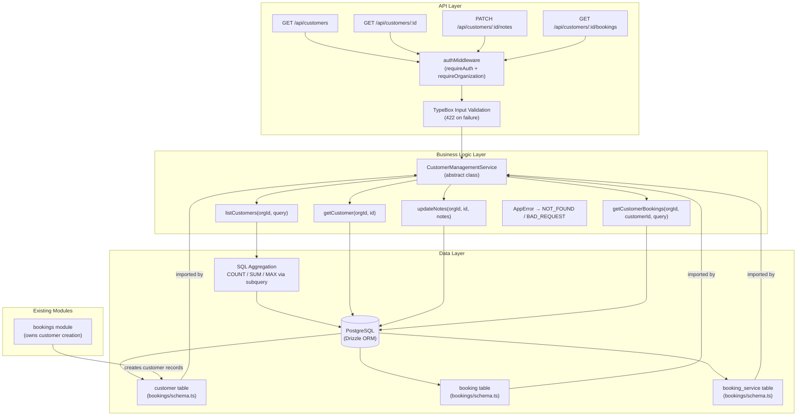
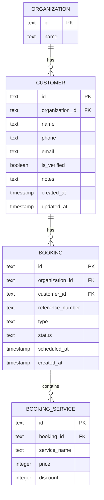

# Implementation Plan: Customer Management (CRM)

**Feature PRD:** [prd.md](./prd.md)  
**Epic:** Cukkr — Barbershop Management & Booking System  
**Module path:** `src/modules/customer-management/`

---

## Goal

Expose a set of read-only and notes-update API endpoints that allow barbershop owners and barbers to browse, search, sort, and inspect their customer base — scoped to the active organization. Customer records already exist in the database (created automatically by the booking flow in `src/modules/bookings/`); this module adds a dedicated surface for querying and annotating them. The module includes four endpoints: list customers, get customer detail, get customer booking history, and patch customer notes. No schema migration is required for the `customer` table itself, but additional indexes and a new Drizzle schema migration must be generated to cover search and sort performance requirements.

---

## Requirements

- New Elysia module at `src/modules/customer-management/` with `handler.ts`, `model.ts`, and `service.ts`. No `schema.ts` is needed — the module imports `customer`, `booking`, and `bookingService` tables directly from `src/modules/bookings/schema.ts`.
- All four endpoints require `requireAuth: true` and `requireOrganization: true`.
- `GET /api/customers` — paginated list with search (name/email/phone), sort (recent, bookings_desc, spend_desc, name_asc), page, limit.
- `GET /api/customers/:id` — full customer profile including `notes` and computed aggregates.
- `PATCH /api/customers/:id/notes` — update notes field; notes max 2000 characters; allow empty string (clears notes).
- `GET /api/customers/:id/bookings` — paginated booking history for a customer, sorted by `createdAt` descending; each item includes `referenceNumber`, `status`, `type`, services (name + price), and `totalAmount`.
- `totalBookings` counts bookings with status in `waiting`, `in_progress`, `completed` (not `cancelled` or `pending`).
- `totalSpend` sums `bookingService.price` across `completed` bookings only.
- `lastVisitAt` is the `createdAt` of the most recent booking (any status except cancelled, or all — per PRD: "most recent booking linked to this customer").
- `isVerified` is read from the stored `is_verified` column (set at booking creation time via `Boolean(phone || email)`); no recomputation needed.
- A new migration adds a composite index on `(organization_id, name)` for the `customer` table and a composite index on `(organization_id, customer_id, created_at)` for the `booking` table to support aggregation and sorting.
- Register the handler in `src/app.ts` and export new schemas (if any) from `drizzle/schemas.ts`.
- Integration tests at `tests/modules/customer-management.test.ts` covering all acceptance criteria.

---

## Technical Considerations

### System Architecture Overview



**Technology Stack Selection:**

| Layer | Technology | Rationale |
|---|---|---|
| Routing | Elysia handler group | Consistent with all other modules; prefix `/customers` |
| Validation | Elysia TypeBox (`t.Object`) | Project-wide standard; auto-generates 422 on invalid input |
| Business Logic | Abstract class service | No instance state; mirrors every other service in the project |
| Database | Drizzle ORM + raw `sql` template for aggregations | `db.query.*` covers simple lookups; `db.select()` with `sql` handles COUNT/SUM/MAX aggregations not expressible via the relational query API |
| ID generation | `nanoid` | Already used throughout the project |

**Integration Points:**
- `customer-management` imports table definitions from `../bookings/schema` — it does **not** own or migrate those tables.
- `customer-management` registers its handler in `src/app.ts` alongside all other module handlers.
- The booking service remains the sole writer of `customer` records; customer-management only reads and patches `notes`.

**Scalability Considerations:**
- The list endpoint uses a single SQL query with LEFT JOINs and GROUP BY; adding the composite indexes listed below keeps this within the ≤400ms p95 target for 10,000 customers.
- Pagination (max 100 per page) prevents large result sets.
- The booking history endpoint paginates separately; no unbounded queries.

---

### Database Schema Design

The `customer` table already exists (defined in `src/modules/bookings/schema.ts`). No table changes are required. Two new indexes must be added via a Drizzle migration.



**Table Specifications (existing — no changes):**

| Column | Type | Notes |
|---|---|---|
| `id` | `text` PK | `nanoid()` |
| `organization_id` | `text` FK → `organization.id` | `onDelete: cascade` |
| `name` | `text` NOT NULL | max 100 chars validated at booking creation |
| `phone` | `text` NULL | normalized to E.164 at booking creation |
| `email` | `text` NULL | normalized to lowercase at booking creation |
| `is_verified` | `boolean` NOT NULL default `false` | `true` if phone or email is non-null; stored at creation |
| `notes` | `text` NULL | free-text; updated by this module |
| `created_at` | `timestamp` NOT NULL | |
| `updated_at` | `timestamp` NOT NULL | auto-updated on change |

**New Indexes (migration required):**

| Index | Table | Columns | Purpose |
|---|---|---|---|
| `customer_organizationId_name_idx` | `customer` | `(organization_id, name)` | Search by name within org (ILIKE scan); sort by name_asc |
| `booking_organizationId_customerId_createdAt_idx` | `booking` | `(organization_id, customer_id, created_at)` | Aggregation of totalBookings/totalSpend/lastVisitAt per customer; booking history sort |

**Existing indexes on `customer` (already present):**
- `customer_organizationId_phone_idx` on `(organization_id, phone)` — supports search by phone
- `customer_organizationId_email_idx` on `(organization_id, email)` — supports search by email

**Database Migration Strategy:**
1. Add the two new indexes to `src/modules/bookings/schema.ts` using Drizzle's `index()` builder (alongside the existing indexes in the table definition).
2. Run `bunx drizzle-kit generate --name add_customer_management_indexes` to produce the migration SQL.
3. Run `bunx drizzle-kit migrate` to apply.
4. No data migration needed — indexes are additive.

---

### API Design

#### `GET /api/customers`

**Query parameters:**

| Param | Type | Default | Validation |
|---|---|---|---|
| `search` | `string` (optional) | — | Partial match against `name`, `email`, `phone` (ILIKE) |
| `sort` | `"recent" \| "bookings_desc" \| "spend_desc" \| "name_asc"` | `"recent"` | Enum literal union |
| `page` | `integer` | `1` | `t.Numeric()`, min 1 |
| `limit` | `integer` | `20` | `t.Numeric()`, min 1, max 100 |

**Response `200`:**
```typescript
{
  data: CustomerListItem[],
  meta: PaginationMeta  // page, limit, totalItems, totalPages, hasNext, hasPrev
}

type CustomerListItem = {
  id: string
  name: string
  email: string | null
  phone: string | null
  isVerified: boolean
  totalBookings: number
  totalSpend: number   // integer IDR; sum of bookingService.price for completed bookings
  lastVisitAt: Date | null
}
```

**Implementation approach (service layer):**

Use Drizzle's `db.select()` builder with explicit column aliases and `sql` template tags for aggregation. The query joins `customer` → `booking` → `booking_service`, groups by `customer.id`, and applies:
- `COUNT(DISTINCT booking.id) FILTER (WHERE booking.status IN ('waiting','in_progress','completed'))` → `totalBookings`
- `COALESCE(SUM(booking_service.price) FILTER (WHERE booking.status = 'completed'), 0)` → `totalSpend`
- `MAX(booking.created_at)` → `lastVisitAt`

Search condition: `OR (ILIKE name, ILIKE email, ILIKE phone)` applied in the WHERE clause before GROUP BY.

Sort is applied via `ORDER BY` on the aggregated columns using `sql` expressions:
- `recent` → `lastVisitAt DESC NULLS LAST`
- `bookings_desc` → `totalBookings DESC`
- `spend_desc` → `totalSpend DESC`
- `name_asc` → `customer.name ASC`

Pagination: `LIMIT` + `OFFSET`. A parallel `COUNT(DISTINCT customer.id)` sub-query (with the same WHERE conditions but without GROUP BY/ORDER BY) provides `totalItems` for the pagination meta.

---

#### `GET /api/customers/:id`

**Path params:** `id: string`

**Response `200`:**
```typescript
type CustomerDetailResponse = CustomerListItem & {
  notes: string | null
  createdAt: Date
}
```

Same aggregation approach as list, filtered to a single `customer.id`. Returns `404` if `organizationId` does not match.

---

#### `PATCH /api/customers/:id/notes`

**Path params:** `id: string`

**Request body:**
```typescript
{ notes: string }  // maxLength: 2000; empty string allowed (clears notes)
```

**Response `200`:** Full `CustomerDetailResponse` (same shape as GET detail).

**Logic:**
1. Query customer by `id` + `organizationId` — throw `NOT_FOUND` if missing.
2. Update `notes` field: empty string is stored as `null` (or `""` — keep consistent; treat as `null` to match DB nullable pattern).
3. Return the full customer detail (re-fetch aggregates for consistency).

---

#### `GET /api/customers/:id/bookings`

**Path params:** `id: string`

**Query parameters:** `page` (default 1), `limit` (default 20, max 100)

**Response `200`:**
```typescript
{
  data: CustomerBookingItem[],
  meta: PaginationMeta
}

type CustomerBookingItem = {
  id: string
  referenceNumber: string
  createdAt: Date
  status: BookingStatus
  type: BookingType
  services: { name: string; price: number }[]
  totalAmount: number  // sum of service prices for this booking
}
```

Returns `404` if `customerId`/`organizationId` combination is not found.

Sorted by `booking.createdAt DESC`. Uses Drizzle's `db.query.booking.findMany` with `with: { services: true }` — simple relational query, no aggregation needed.

---

### File Structure

```
src/modules/customer-management/
  handler.ts    # Elysia group; prefix "/customers"; 4 routes
  model.ts      # CustomerManagementModel namespace with all DTOs
  service.ts    # CustomerManagementService abstract class

tests/modules/
  customer-management.test.ts   # Integration tests (Eden Treaty)
```

No `schema.ts` — imports from `../bookings/schema`.

**`drizzle/schemas.ts`:** No new export needed (customer-management has no new tables).

**`src/app.ts`:** Add `import { customersHandler } from './modules/customer-management/handler'` and `.use(customersHandler)` inside the `/api` group.

**`src/modules/bookings/schema.ts`:** Add two new index definitions to the existing `customer` and `booking` table definitions, then generate and apply a migration.

---

### Security & Performance

**Authentication & Authorization:**
- All routes: `requireAuth: true`, `requireOrganization: true` via the existing `authMiddleware` macro.
- All DB queries include `eq(customer.organizationId, activeOrganizationId)` — no cross-tenant leakage.
- PATCH notes: customer ownership re-verified before update.
- No unauthenticated endpoint; `401` returned by auth middleware for missing/expired session.

**Input Validation:**
- `search`: TypeBox `t.Optional(t.String())` — no length cap needed (ILIKE is parameterized, preventing SQL injection via Drizzle's query builder).
- `sort`: `t.Union([t.Literal("recent"), ...])` — only four valid values; invalid input → 422.
- `notes`: `t.String({ maxLength: 2000 })` — Elysia enforces this at the TypeBox level → 422 if exceeded.
- `page` / `limit`: `t.Optional(t.Numeric())` consistent with other modules; `normalizePagination` clamps values.

**Performance Optimization:**
- The list aggregation query runs in a single round-trip (one `SELECT ... LEFT JOIN ... GROUP BY`). Parallel count query uses `Promise.all`.
- New indexes on `(organization_id, name)` for customer and `(organization_id, customer_id, created_at)` for booking reduce full-table scans on aggregation.
- `FILTER` clause on aggregation functions avoids sub-selects per row.
- Pagination max 100 prevents large result sets.

**Error Handling:**
- All errors thrown as `AppError` from `src/core/error.ts` — no plain `Error` objects.
- `NOT_FOUND (404)`: customer not found in active org.
- `UNPROCESSABLE_ENTITY (422)`: input validation failure (handled automatically by TypeBox).
- `UNAUTHORIZED (401)`: missing session (handled by auth middleware).

---

## Test Plan (`tests/modules/customer-management.test.ts`)

The test file uses Eden Treaty with a `beforeAll` setup block that:
1. Signs up and authenticates a test user.
2. Creates an organization via Better Auth API.
3. Sets the organization as active on the session.
4. Creates bookings (which auto-creates customers) with varied statuses and services to seed test data.

A second user + organization must be created to test multi-tenant isolation (AC-06).

**Test cases to cover:**

| ID | Description | Method + Path |
|---|---|---|
| AC-01a | List returns all customers with computed fields | `GET /api/customers` |
| AC-01b | Search by name (case-insensitive) | `GET /api/customers?search=budi` |
| AC-01c | Sort by spend_desc | `GET /api/customers?sort=spend_desc` |
| AC-01d | Pagination (page 2, limit 2) returns correct items + meta | `GET /api/customers?page=2&limit=2` |
| AC-02a | Customer with no contact → isVerified = false | `GET /api/customers` |
| AC-02b | Customer with email → isVerified = true | `GET /api/customers` |
| AC-03a | Valid id → full profile with notes, totalBookings, totalSpend | `GET /api/customers/:id` |
| AC-03b | id from different org → 404 | `GET /api/customers/:id` |
| AC-04a | 3 bookings returned with services + totalAmount + sorted desc | `GET /api/customers/:id/bookings` |
| AC-04b | Pagination on booking history | `GET /api/customers/:id/bookings?page=1&limit=2` |
| AC-05a | PATCH notes → 200, notes updated | `PATCH /api/customers/:id/notes` |
| AC-05b | PATCH notes > 2000 chars → 422 | `PATCH /api/customers/:id/notes` |
| AC-05c | PATCH notes with empty string → 200, notes cleared | `PATCH /api/customers/:id/notes` |
| AC-06 | Owner A cannot see Owner B's customers | `GET /api/customers` (org B session) |
| AC-07 | Unauthenticated requests → 401 | All routes |

---

## Implementation Steps

1. **Add indexes to `src/modules/bookings/schema.ts`**  
   Add `index('customer_organizationId_name_idx').on(table.organizationId, table.name)` to the `customer` table definition array, and `index('booking_organizationId_customerId_createdAt_idx').on(table.organizationId, table.customerId, table.createdAt)` to the `booking` table definition array.

2. **Generate and verify migration**  
   Run `bunx drizzle-kit generate --name add_customer_management_indexes`, then `bunx drizzle-kit check`.

3. **Create `src/modules/customer-management/model.ts`**  
   Define the `CustomerManagementModel` namespace with:
   - `CustomerListQuery` (search, sort enum, page, limit)
   - `CustomerListItemResponse` (id, name, email, phone, isVerified, totalBookings, totalSpend, lastVisitAt)
   - `CustomerDetailResponse` (extends list item + notes, createdAt)
   - `CustomerNotesUpdateInput` ({ notes: string, maxLength: 2000 })
   - `CustomerBookingItemResponse` (id, referenceNumber, createdAt, status, type, services[], totalAmount)
   - `CustomerIdParam` ({ id: string })

4. **Create `src/modules/customer-management/service.ts`**  
   Define `CustomerManagementService` abstract class with:
   - `listCustomers(orgId, query)` — SQL aggregation query with search/sort/pagination
   - `getCustomer(orgId, id)` — single customer aggregation; throws `NOT_FOUND` if not in org
   - `updateNotes(orgId, id, notes)` — verify ownership, update, re-fetch
   - `getCustomerBookings(orgId, customerId, query)` — paginated booking list with services

5. **Create `src/modules/customer-management/handler.ts`**  
   Elysia group with prefix `/customers`, `tags: ['Customer Management']`, using `authMiddleware`. Wire all four routes with `requireAuth: true`, `requireOrganization: true`, correct body/query/params schemas, and response schemas.

6. **Register handler in `src/app.ts`**  
   Import `customersHandler` and add `.use(customersHandler)` to the `/api` group.

7. **Write `tests/modules/customer-management.test.ts`**  
   Implement all test cases listed in the Test Plan section above.

8. **Run validation**  
   Execute `bun run lint:fix`, `bun run format`, `bun run build`, and `bun test` to confirm no regressions.
