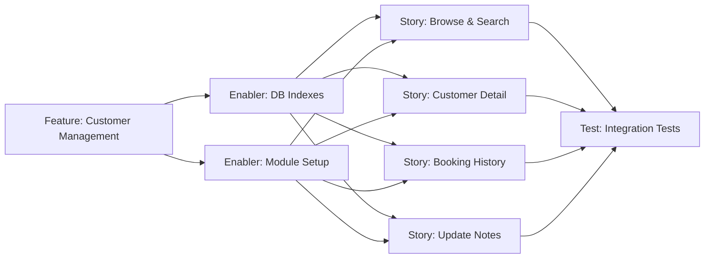

# Project Plan: Customer Management (CRM)

**Feature PRD:** [prd.md](./prd.md)
**Implementation Plan:** [implementation-plan.md](./implementation-plan.md)
**Epic:** Cukkr — Barbershop Management & Booking System

---

## Problem & Approach

Barbershop owners have no structured visibility into their customer base. This feature exposes read-only and notes-update API endpoints scoped to the active organization, allowing owners and barbers to browse, search, sort, and annotate customers. Customer records are auto-created by the booking flow; this module adds the CRM surface on top.

The implementation approach is:
1. Add two composite DB indexes via a Drizzle migration (critical path blocker).
2. Scaffold the `customer-management` module (`model.ts`, `service.ts`, `handler.ts`) and register it in `src/app.ts`.
3. Implement all four endpoints across three user-facing stories.
4. Validate with comprehensive integration tests covering all acceptance criteria.

---

## Issue Hierarchy

```
Epic: Cukkr Barbershop Management & Booking System  (#TBD — pre-existing)
└── Feature: Customer Management (CRM)              (#TBD)
    ├── Enabler: DB Indexes for Customer Management (#TBD)
    ├── Enabler: Customer Management Module Setup   (#TBD)
    ├── Story: Browse & Search Customer List        (#TBD)  ← blocked by both enablers
    ├── Story: View Customer Detail                 (#TBD)  ← blocked by both enablers
    ├── Story: View Customer Booking History        (#TBD)  ← blocked by both enablers
    ├── Story: Update Customer Notes                (#TBD)  ← blocked by both enablers
    └── Test: Customer Management Integration Tests (#TBD)  ← blocked by all stories
```

---

## Dependency Graph



---

## GitHub Issues

---

### Feature Issue

```markdown
# Feature: Customer Management (CRM)

## Feature Description

Provide a dedicated CRM surface for barbershop owners and barbers to browse, search, sort,
and annotate their customer base. Exposes four API endpoints scoped to the active organization.
Customer records are auto-created by the booking module; this feature only adds read and
notes-update capabilities on top.

## User Stories in this Feature

- [ ] #TBD - Browse & Search Customer List
- [ ] #TBD - View Customer Detail
- [ ] #TBD - View Customer Booking History
- [ ] #TBD - Update Customer Notes

## Technical Enablers

- [ ] #TBD - DB Indexes for Customer Management
- [ ] #TBD - Customer Management Module Setup

## Dependencies

**Blocks**: —
**Blocked by**: Epic — Cukkr Barbershop Management & Booking System

## Acceptance Criteria

- [ ] GET /api/customers returns paginated, searchable, sortable customer list with computed fields
- [ ] GET /api/customers/:id returns full profile with notes and aggregates
- [ ] GET /api/customers/:id/bookings returns paginated booking history with services
- [ ] PATCH /api/customers/:id/notes updates notes; 422 on >2000 chars; clears on empty string
- [ ] All endpoints require auth + active organization; 401 for unauthenticated requests
- [ ] Cross-tenant isolation: customers from other orgs are never exposed

## Definition of Done

- [ ] All user stories delivered
- [ ] Technical enablers completed
- [ ] Integration tests passing (`bun test`)
- [ ] Lint and format checks passing (`bun run lint:fix` + `bun run format`)
- [ ] Build passing (`bun run build`)

## Labels

`feature`, `priority-high`, `value-high`, `backend`, `crm`

## Epic

#TBD (Cukkr Barbershop Management & Booking System)

## Estimate

L (23 story points total)
```

---

### Enabler 1: DB Indexes for Customer Management

```markdown
# Technical Enabler: DB Indexes for Customer Management

## Enabler Description

Add two composite Drizzle indexes to existing tables to support the aggregation queries and
search/sort performance requirements of the customer management endpoints. This is a blocking
prerequisite for all four customer-management stories.

## Technical Requirements

- [ ] Add `index('customer_organizationId_name_idx').on(table.organizationId, table.name)` to the `customer` table in `src/modules/bookings/schema.ts`
- [ ] Add `index('booking_organizationId_customerId_createdAt_idx').on(table.organizationId, table.customerId, table.createdAt)` to the `booking` table in `src/modules/bookings/schema.ts`
- [ ] Run `bunx drizzle-kit generate --name add_customer_management_indexes` to produce the migration SQL
- [ ] Run `bunx drizzle-kit check` to validate the migration
- [ ] Run `bunx drizzle-kit migrate` to apply

## Implementation Tasks

- [ ] Edit `src/modules/bookings/schema.ts` — add two index definitions
- [ ] Generate and verify Drizzle migration
- [ ] Apply migration

## User Stories Enabled

This enabler supports:
- #TBD - Browse & Search Customer List
- #TBD - View Customer Detail
- #TBD - View Customer Booking History
- #TBD - Update Customer Notes

## Acceptance Criteria

- [ ] `customer_organizationId_name_idx` index exists on `(organization_id, name)`
- [ ] `booking_organizationId_customerId_createdAt_idx` index exists on `(organization_id, customer_id, created_at)`
- [ ] Migration file generated under `drizzle/` and applied successfully
- [ ] No existing indexes or data are affected

## Definition of Done

- [ ] Schema changes committed
- [ ] Migration generated and verified
- [ ] Build passing

## Labels

`enabler`, `priority-critical`, `backend`, `database`

## Feature

#TBD (Customer Management CRM)

## Estimate

2 story points
```

---

### Enabler 2: Customer Management Module Setup

```markdown
# Technical Enabler: Customer Management Module Setup

## Enabler Description

Create the `src/modules/customer-management/` directory with `model.ts`, `service.ts`, and
`handler.ts` stubs, and register the handler in `src/app.ts`. This scaffolding is the structural
prerequisite that allows all four stories to be implemented in parallel.

## Technical Requirements

- [ ] Create `src/modules/customer-management/model.ts` with the `CustomerManagementModel` namespace and all DTO types
- [ ] Create `src/modules/customer-management/service.ts` with the `CustomerManagementService` abstract class and method signatures
- [ ] Create `src/modules/customer-management/handler.ts` as an Elysia group with prefix `/customers` and `tags: ['Customer Management']`
- [ ] Register `customersHandler` in `src/app.ts` inside the `/api` group
- [ ] No new `schema.ts` — import `customer`, `booking`, `bookingService` from `../bookings/schema`

## DTO Types to Define (`model.ts`)

- `CustomerListQuery` — `{ search?, sort, page, limit }`
- `CustomerListItemResponse` — `{ id, name, email, phone, isVerified, totalBookings, totalSpend, lastVisitAt }`
- `CustomerDetailResponse` — extends `CustomerListItemResponse` + `{ notes, createdAt }`
- `CustomerNotesUpdateInput` — `{ notes: string }` (maxLength 2000)
- `CustomerBookingItemResponse` — `{ id, referenceNumber, createdAt, status, type, services[], totalAmount }`
- `CustomerIdParam` — `{ id: string }`
- `PaginatedCustomerListResponse` — `{ data: CustomerListItemResponse[], meta: PaginationMeta }`
- `PaginatedBookingHistoryResponse` — `{ data: CustomerBookingItemResponse[], meta: PaginationMeta }`

## Service Method Signatures (`service.ts`)

- `listCustomers(orgId: string, query: CustomerListQuery)`
- `getCustomer(orgId: string, id: string)`
- `updateNotes(orgId: string, id: string, notes: string)`
- `getCustomerBookings(orgId: string, customerId: string, query: PaginationQuery)`

## Acceptance Criteria

- [ ] Module directory created with all three files
- [ ] All DTOs typed; no `any`
- [ ] Handler registered and `/api/customers` routes visible
- [ ] `bun run build` passes with new module in place

## Definition of Done

- [ ] Module scaffolded and registered
- [ ] Build passing
- [ ] No lint errors

## Labels

`enabler`, `priority-critical`, `backend`, `crm`

## Feature

#TBD (Customer Management CRM)

## Estimate

3 story points
```

---

### Story 1: Browse & Search Customer List

```markdown
# User Story: Browse & Search Customer List

## Story Statement

As an **owner**, I want to see a paginated, searchable, and sortable list of all customers at my
active barbershop — with computed totals and verified badge — so that I can understand and
identify my customer base at a glance.

## Acceptance Criteria

- [ ] `GET /api/customers` returns `{ data, meta }` with correct `PaginationMeta`
- [ ] Each item includes `id`, `name`, `email`, `phone`, `isVerified`, `totalBookings`, `totalSpend`, `lastVisitAt`
- [ ] `totalBookings` counts bookings with status `waiting`, `in_progress`, or `completed` (not `cancelled`/`pending`)
- [ ] `totalSpend` sums `bookingService.price` for `completed` bookings only
- [ ] `lastVisitAt` is `createdAt` of the most recent non-cancelled booking
- [ ] `isVerified = true` when `email` or `phone` is non-null
- [ ] `search` param performs case-insensitive partial match against `name`, `email`, `phone`
- [ ] `sort=recent` orders by `lastVisitAt DESC NULLS LAST` (default)
- [ ] `sort=bookings_desc` orders by `totalBookings DESC`
- [ ] `sort=spend_desc` orders by `totalSpend DESC`
- [ ] `sort=name_asc` orders by `customer.name ASC`
- [ ] Pagination: `page` defaults to 1, `limit` defaults to 20, max 100; `hasNext`/`hasPrev` accurate
- [ ] Invalid `sort` value → 422
- [ ] `401` for unauthenticated requests; `401` for missing active organization

## Technical Tasks

- [ ] Implement `CustomerManagementService.listCustomers()` with Drizzle aggregation query
- [ ] Parallel `COUNT` sub-query for `totalItems` using `Promise.all`
- [ ] Wire `GET /api/customers` route in `handler.ts`

## Testing Requirements

- [ ] #TBD - Integration tests: AC-01a, AC-01b, AC-01c, AC-01d, AC-02a, AC-02b, AC-07

## Dependencies

**Blocked by**: #TBD (DB Indexes Enabler), #TBD (Module Setup Enabler)

## Definition of Done

- [ ] Acceptance criteria met
- [ ] Code review approved
- [ ] Integration tests passing

## Labels

`user-story`, `priority-high`, `value-high`, `backend`, `crm`

## Feature

#TBD (Customer Management CRM)

## Estimate

5 story points
```

---

### Story 2: View Customer Detail

```markdown
# User Story: View Customer Detail

## Story Statement

As an **owner**, I want to open a customer's detail page and see their full profile — including
total bookings, total spend, notes, and contact info — so that I can understand their
relationship with my barbershop.

## Acceptance Criteria

- [ ] `GET /api/customers/:id` returns `CustomerDetailResponse` (list fields + `notes` + `createdAt`)
- [ ] Same computed aggregates as the list endpoint (`totalBookings`, `totalSpend`, `lastVisitAt`, `isVerified`)
- [ ] Returns `404` if `customerId` does not belong to the active organization
- [ ] Returns `401` for unauthenticated requests

## Technical Tasks

- [ ] Implement `CustomerManagementService.getCustomer()` using single aggregation query filtered to one customer
- [ ] Wire `GET /api/customers/:id` route in `handler.ts`

## Testing Requirements

- [ ] #TBD - Integration tests: AC-03a, AC-03b, AC-07

## Dependencies

**Blocked by**: #TBD (DB Indexes Enabler), #TBD (Module Setup Enabler)

## Definition of Done

- [ ] Acceptance criteria met
- [ ] Code review approved
- [ ] Integration tests passing

## Labels

`user-story`, `priority-high`, `value-high`, `backend`, `crm`

## Feature

#TBD (Customer Management CRM)

## Estimate

3 story points
```

---

### Story 3: View Customer Booking History

```markdown
# User Story: View Customer Booking History

## Story Statement

As an **owner**, I want to see a booking history tab on the customer detail page showing all
past bookings sorted newest-first — with services, amounts, and statuses — so that I can review
what the customer has used and how much they've spent over time.

## Acceptance Criteria

- [ ] `GET /api/customers/:id/bookings` returns `{ data: CustomerBookingItem[], meta: PaginationMeta }`
- [ ] Each item includes `id`, `referenceNumber`, `createdAt`, `status`, `type`, `services[]` (name + price), `totalAmount`
- [ ] Sorted by `booking.createdAt DESC`
- [ ] Paginated: `page` defaults to 1, `limit` defaults to 20, max 100
- [ ] Returns `404` if `customerId`/`organizationId` combination is not found
- [ ] Returns `401` for unauthenticated requests

## Technical Tasks

- [ ] Implement `CustomerManagementService.getCustomerBookings()` using `db.query.booking.findMany` with `with: { services: true }`
- [ ] Wire `GET /api/customers/:id/bookings` route in `handler.ts`

## Testing Requirements

- [ ] #TBD - Integration tests: AC-04a, AC-04b, AC-07

## Dependencies

**Blocked by**: #TBD (DB Indexes Enabler), #TBD (Module Setup Enabler)

## Definition of Done

- [ ] Acceptance criteria met
- [ ] Code review approved
- [ ] Integration tests passing

## Labels

`user-story`, `priority-high`, `value-high`, `backend`, `crm`

## Feature

#TBD (Customer Management CRM)

## Estimate

3 story points
```

---

### Story 4: Update Customer Notes

```markdown
# User Story: Update Customer Notes

## Story Statement

As an **owner**, I want to add or edit a free-text note on a customer profile so that barbers
have contextual information (e.g., preferred style, allergies) before an appointment.

## Acceptance Criteria

- [ ] `PATCH /api/customers/:id/notes` with `{ notes: "Prefers fade cut" }` → 200 with updated `CustomerDetailResponse`
- [ ] `notes` > 2000 characters → 422 validation error; no update performed
- [ ] `notes = ""` → 200; notes cleared (stored as `null`)
- [ ] Returns `404` if customer does not belong to the active organization
- [ ] Returns `401` for unauthenticated requests

## Technical Tasks

- [ ] Implement `CustomerManagementService.updateNotes()` — verify ownership, update, re-fetch detail
- [ ] Wire `PATCH /api/customers/:id/notes` route in `handler.ts` with `t.String({ maxLength: 2000 })` body schema

## Testing Requirements

- [ ] #TBD - Integration tests: AC-05a, AC-05b, AC-05c, AC-07

## Dependencies

**Blocked by**: #TBD (DB Indexes Enabler), #TBD (Module Setup Enabler)

## Definition of Done

- [ ] Acceptance criteria met
- [ ] Code review approved
- [ ] Integration tests passing

## Labels

`user-story`, `priority-high`, `value-medium`, `backend`, `crm`

## Feature

#TBD (Customer Management CRM)

## Estimate

2 story points
```

---

### Test Issue: Customer Management Integration Tests

```markdown
# Test: Customer Management Integration Tests

## Test Description

Comprehensive integration test suite for all four customer-management endpoints using Eden
Treaty. Covers all 15 acceptance criteria test cases, including multi-tenant isolation and
unauthenticated access checks.

## Test File

`tests/modules/customer-management.test.ts`

## Test Cases

| ID | Test | Endpoint |
|---|---|---|
| AC-01a | List returns all customers with computed fields | GET /api/customers |
| AC-01b | Search by name (case-insensitive) | GET /api/customers?search=budi |
| AC-01c | Sort by spend_desc | GET /api/customers?sort=spend_desc |
| AC-01d | Pagination page 2 limit 2 | GET /api/customers?page=2&limit=2 |
| AC-02a | No contact → isVerified = false | GET /api/customers |
| AC-02b | Email set → isVerified = true | GET /api/customers |
| AC-03a | Valid id → full profile with notes and aggregates | GET /api/customers/:id |
| AC-03b | Cross-org id → 404 | GET /api/customers/:id |
| AC-04a | 3 bookings returned with services + sorted desc | GET /api/customers/:id/bookings |
| AC-04b | Pagination on booking history | GET /api/customers/:id/bookings?page=1&limit=2 |
| AC-05a | PATCH notes → 200, notes updated | PATCH /api/customers/:id/notes |
| AC-05b | PATCH notes > 2000 chars → 422 | PATCH /api/customers/:id/notes |
| AC-05c | PATCH notes empty string → 200, notes cleared | PATCH /api/customers/:id/notes |
| AC-06 | Owner A cannot see Owner B's customers | GET /api/customers (org B session) |
| AC-07 | Unauthenticated → 401 for all routes | All routes |

## Setup Required

- `beforeAll`: Sign up user → create org → set active org → seed bookings (with varied statuses and services)
- Second user + org required for AC-06 (multi-tenant isolation)

## Acceptance Criteria

- [ ] All 15 test cases implemented and passing
- [ ] No hardcoded IDs — use seeded data from `beforeAll`
- [ ] Tests are isolated; re-running produces same results

## Definition of Done

- [ ] Test file committed
- [ ] All tests pass with `bun test tests/modules/customer-management.test.ts`
- [ ] No lint errors

## Labels

`test`, `priority-high`, `backend`, `crm`

## Feature

#TBD (Customer Management CRM)

## Estimate

5 story points
```

---

## Priority and Value Matrix

| Issue | Type | Priority | Value | Estimate | Blocked By |
|---|---|---|---|---|---|
| Feature: Customer Management | Feature | P1 | High | L (23 pts) | Epic |
| Enabler: DB Indexes | Enabler | P0 | High | 2 pts | Feature |
| Enabler: Module Setup | Enabler | P0 | High | 3 pts | Feature |
| Story: Browse & Search List | Story | P1 | High | 5 pts | Both Enablers |
| Story: Customer Detail | Story | P1 | High | 3 pts | Both Enablers |
| Story: Booking History | Story | P1 | High | 3 pts | Both Enablers |
| Story: Update Notes | Story | P1 | Medium | 2 pts | Both Enablers |
| Test: Integration Tests | Test | P1 | High | 5 pts | All Stories |

**Total: 23 story points**

---

## Sprint Planning

### Sprint 1 Goal: Foundation + List Endpoint

**Commitment: 10 story points**

| Issue | Points |
|---|---|
| Enabler: DB Indexes | 2 |
| Enabler: Module Setup | 3 |
| Story: Browse & Search List | 5 |

**Success Criteria:** `GET /api/customers` working end-to-end with aggregation, search, sort, and pagination.

---

### Sprint 2 Goal: Detail, History, Notes + Tests

**Commitment: 13 story points**

| Issue | Points |
|---|---|
| Story: Customer Detail | 3 |
| Story: Booking History | 3 |
| Story: Update Notes | 2 |
| Test: Integration Tests | 5 |

**Success Criteria:** All four endpoints implemented, all 15 test cases passing, build green.

---

## Definition of Done (Feature-Level)

- [ ] All user stories and enablers completed
- [ ] All 15 integration tests passing (`bun test`)
- [ ] `bun run lint:fix` and `bun run format` clean
- [ ] `bun run build` produces a working binary
- [ ] No `console.log` or commented-out code
- [ ] No `any` types in TypeScript
- [ ] Handler registered in `src/app.ts`
- [ ] Migration generated and documented
