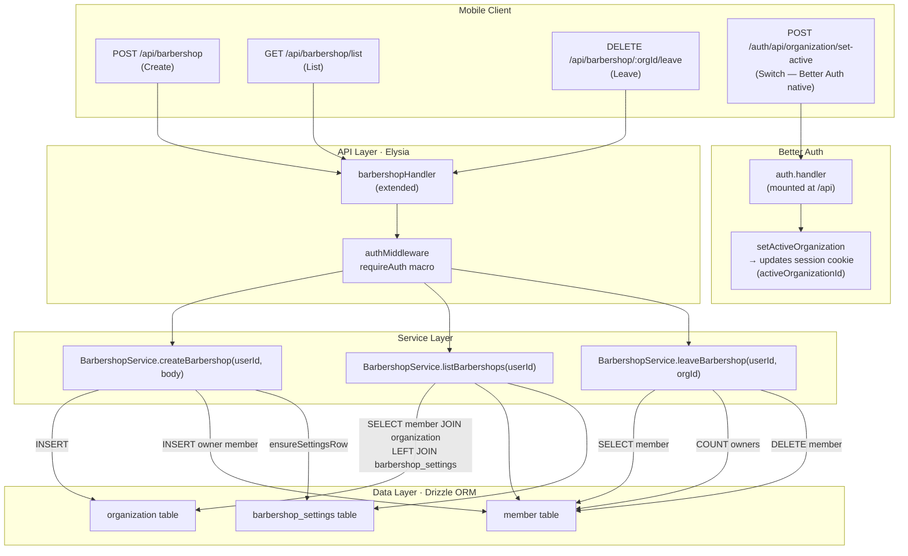

# Implementation Plan: Multi-Barbershop & Branch Management

**Feature:** Multi-Barbershop & Branch Management — Multi-Tenant Organization Switching  
**Epic:** Cukkr — Barbershop Management & Booking System  
**PRD:** [prd.md](./prd.md)  
**Date:** April 28, 2026

---

## Goal

Extend the existing `barbershop` module to support multi-organization management for authenticated users. A user (owner or barber) may belong to multiple organizations (barbershops), each fully isolated in data. The feature adds three new API endpoints — create barbershop, list barbershops, and leave barbershop — all built on top of the existing `organization`, `member`, and `barbershop_settings` database tables that are already provisioned by Better Auth's Organizations plugin.

---

## Requirements

- `POST /api/barbershop` — Authenticated users may create a new barbershop organization. Slug is validated for format and global uniqueness. The caller is assigned the `owner` role automatically. A `barbershop_settings` row is initialized for the new org.
- `GET /api/barbershop/list` — Returns all organizations the authenticated user belongs to, including their role in each and the org's onboarding status.
- `DELETE /api/barbershop/:orgId/leave` — Removes the calling user from the target organization. Sole owners are blocked with `400`. Non-members receive `404`. No active-organization prerequisite is required.
- Active organization switching (`setActiveOrganization`) remains fully delegated to Better Auth's own `/api/auth/organization/set-active` endpoint; no custom wrapper is needed.
- All new service methods must pass `userId` explicitly; no implicit session reads inside service classes (consistent with the existing pattern).
- Slug validation must reuse the same `SLUG_REGEX` (`/^[a-z0-9]([a-z0-9-]*[a-z0-9])?$/`) and length constraints (`3–60 chars`) already enforced in `updateSettings`.
- No database schema changes are required; the feature uses the existing `organization`, `member`, and `barbershop_settings` tables.
- A new migration is still generated via `bunx drizzle-kit generate --name add_multi_barbershop_indexes` to add a composite unique index on `member(userId, organizationId)` for idempotent membership guards.
- Integration tests cover all acceptance criteria from the PRD, including cross-tenant isolation and sole-owner leave rejection.

---

## Technical Considerations

### System Architecture Overview



#### Technology Stack Selection

| Layer | Technology | Rationale |
|---|---|---|
| Routing | Elysia (extended `barbershopHandler`) | Consistent with all other modules; no new handler file needed. |
| Validation | TypeBox (`t.*`) via `BarbershopModel` | Matches existing model pattern; compile-time and runtime safety. |
| Business logic | `BarbershopService` (new static methods) | Same abstract-class pattern used throughout the codebase. |
| DB queries | Drizzle ORM (direct SQL) | Consistent with the established pattern in `BarbershopService` and `BarberService`; avoids routing through Better Auth's HTTP layer. |
| Auth | `requireAuth` macro (existing) | Create/list/leave only require an authenticated session, not an active org. |
| Org switching | Better Auth native endpoint | No custom wrapper needed; client already calls this directly. |

#### Integration Points

- **`BarbershopService.checkSlug`** — The slug uniqueness query used in `createBarbershop` mirrors the existing logic in `updateSettings`; extract the shared guard into a private `validateAndCheckSlug(slug, excludeOrgId?)` helper within the service to eliminate duplication.
- **`BarbershopService.ensureSettingsRow`** — Reused as-is to initialize `barbershop_settings` after creating a new organization.
- **`authMiddleware.requireAuth` macro** — All three new endpoints use `requireAuth: true` only. `requireOrganization: true` is intentionally **not** used here, because the user may have no active org yet when creating their second barbershop, and leave/list operations are independent of the current active org.

#### Scalability Considerations

- The `listBarbershops` query is a simple indexed JOIN across three tables. With an index on `member.userId`, PostgreSQL fetches only the user's memberships first. Up to 20 orgs per user (PRD NFR) this is a single-digit millisecond operation.
- The `leaveBarbershop` DELETE is a single row removal protected by a prior count query; no locks beyond the row-level delete are needed.

---

### Database Schema Design

No new tables are required. The feature is fully served by:

```mermaid
erDiagram
    organization {
        text id PK
        text name
        text slug UK
        text logo
        timestamp createdAt
        text metadata
    }

    member {
        text id PK
        text organizationId FK
        text userId FK
        text role
        timestamp createdAt
    }

    barbershop_settings {
        text id PK
        text organizationId FK_UK
        text description
        text address
        boolean onboardingCompleted
        timestamp createdAt
        timestamp updatedAt
    }

    user {
        text id PK
        text name
        text email UK
        text phone UK
    }

    organization ||--o{ member : "has members"
    organization ||--|| barbershop_settings : "has settings"
    user ||--o{ member : "belongs to"
```

#### Existing Indexes (already present)

| Index | Table | Columns | Purpose |
|---|---|---|---|
| `organization_slug_uidx` | `organization` | `slug` | Slug uniqueness guard |
| `member_organizationId_idx` | `member` | `organizationId` | Fetch all members of an org |
| `member_userId_idx` | `member` | `userId` | Fetch all orgs for a user |

#### New Index (migration required)

| Index | Table | Columns | Purpose |
|---|---|---|---|
| `member_userId_orgId_uidx` | `member` | `(userId, organizationId)` | Composite unique index — prevents duplicate membership and speeds up the owner-count + leave queries |

This composite unique index doubles as a data-integrity guard (prevents a user being added twice to the same org, a scenario possible under concurrent invite acceptance) and improves the `leaveBarbershop` lookup.

#### Migration Strategy

```
bunx drizzle-kit generate --name add_multi_barbershop_indexes
bunx drizzle-kit check
bunx drizzle-kit migrate
```

The migration only adds an index; it is non-destructive and safe to apply without downtime.

---

### API Design

#### POST `/api/barbershop` — Create Barbershop

| Property | Value |
|---|---|
| Method | `POST` |
| Path | `/api/barbershop` |
| Auth | `requireAuth: true` |
| Status (success) | `201 Created` |

**Request Body (`CreateBarbershopInput`)**

```typescript
// model.ts
CreateBarbershopInput = t.Object({
    name: t.String({ minLength: 2, maxLength: 100 }),
    slug: t.String({ minLength: 3, maxLength: 60 }),
    description: t.Optional(t.Nullable(t.String({ maxLength: 500 }))),
    address: t.Optional(t.Nullable(t.String({ maxLength: 300 })))
})
```

**Response (`BarbershopResponse`)** — reuses the existing type.

**Error Codes**

| Scenario | Code |
|---|---|
| Invalid slug format | `400 Bad Request` |
| Slug already taken | `409 Conflict` |
| Unauthenticated | `401 Unauthorized` |

**Service pseudocode (`createBarbershop`)**

```
1. validateAndCheckSlug(slug)         ← shared private helper
2. orgId = nanoid()
3. INSERT INTO organization (id, name, slug, createdAt)
4. INSERT INTO member (id, orgId, userId, role='owner', createdAt)
5. ensureSettingsRow(orgId)           ← existing private helper
6. if description or address provided:
     UPDATE barbershop_settings SET description, address WHERE organizationId = orgId
7. return getSettings(orgId)          ← reuse existing method
```

---

#### GET `/api/barbershop/list` — List All User's Barbershops

| Property | Value |
|---|---|
| Method | `GET` |
| Path | `/api/barbershop/list` |
| Auth | `requireAuth: true` |
| Status (success) | `200 OK` |

**Response (`BarbershopListItem[]`)**

```typescript
// model.ts
BarbershopListItem = t.Object({
    id: t.String(),
    name: t.String(),
    slug: t.String(),
    description: t.Nullable(t.String()),
    address: t.Nullable(t.String()),
    onboardingCompleted: t.Boolean(),
    role: t.String()    // 'owner' | 'barber'
})

BarbershopListResponse = t.Array(BarbershopListItem)
```

**Service pseudocode (`listBarbershops`)**

```
1. SELECT
       organization.id, organization.name, organization.slug,
       barbershop_settings.description, barbershop_settings.address,
       barbershop_settings.onboardingCompleted,
       member.role
   FROM member
   INNER JOIN organization ON organization.id = member.organizationId
   LEFT JOIN barbershop_settings ON barbershop_settings.organizationId = organization.id
   WHERE member.userId = userId
   ORDER BY organization.createdAt ASC

2. For each row:
     if onboardingCompleted is null → default false
     if description is null → null
     if address is null → null

3. Return array
```

**Error Codes**

| Scenario | Code |
|---|---|
| Unauthenticated | `401 Unauthorized` |

---

#### DELETE `/api/barbershop/:orgId/leave` — Leave Organization

| Property | Value |
|---|---|
| Method | `DELETE` |
| Path | `/api/barbershop/:orgId/leave` |
| Auth | `requireAuth: true` |
| Status (success) | `200 OK` |

**Path Params (`OrgIdParam`)**

```typescript
// model.ts
OrgIdParam = t.Object({
    orgId: t.String()
})
```

**Response (`LeaveOrgResponse`)**

```typescript
// model.ts
LeaveOrgResponse = t.Object({
    message: t.String()
})
```

**Service pseudocode (`leaveBarbershop`)**

```
1. memberRow = SELECT FROM member WHERE userId = userId AND organizationId = orgId LIMIT 1
2. if not memberRow → throw AppError('Not a member of this organization', 'NOT_FOUND')

3. if memberRow.role === 'owner':
     ownerCount = SELECT COUNT(*) FROM member
                  WHERE organizationId = orgId AND role = 'owner'
     if ownerCount <= 1 → throw AppError(
         'Cannot leave: you are the sole owner. Transfer ownership or archive the barbershop first.',
         'BAD_REQUEST'
     )

4. DELETE FROM member WHERE id = memberRow.id

5. return { message: 'You have left the organization' }
```

**Error Codes**

| Scenario | Code |
|---|---|
| Not a member of target org | `404 Not Found` |
| Sole owner attempting to leave | `400 Bad Request` |
| Unauthenticated | `401 Unauthorized` |

---

#### Existing Endpoints — No Changes Required

| Endpoint | Notes |
|---|---|
| `GET /api/barbershop` | Unchanged — fetches active org profile |
| `PATCH /api/barbershop/settings` | Unchanged — updates active org settings |
| `GET /api/barbershop/slug-check` | Unchanged — reused internally by `validateAndCheckSlug` |
| `POST /auth/api/organization/set-active` | Better Auth native — no wrapper needed |

---

### Security & Performance

#### Authentication & Authorization

- All three new endpoints use `requireAuth: true`. There is no `requireOrganization: true` because these actions are org-context-independent.
- Role enforcement for `leaveBarbershop` is implicit: only owners are blocked when sole; barbers are always allowed to leave. No additional owner-only guard is needed here.
- The `orgId` path parameter is never trusted as an authorization token. Membership is always verified in the service by querying `member` with `(userId, organizationId)`.

#### Input Validation

- Slug format validated with `SLUG_REGEX` before any DB write.
- Slug length enforced at the DTO level (`minLength: 3, maxLength: 60`) and again in the service (defense in depth).
- `orgId` is a raw `text` path param; the membership query acts as an implicit existence check (no separate `SELECT FROM organization` needed).

#### Data Isolation

- `listBarbershops` filters strictly by `member.userId`; a user can only see organizations they explicitly belong to.
- `leaveBarbershop` verifies membership before any mutation; an attacker cannot remove someone else's membership by guessing an `orgId`.
- Cross-tenant isolation for all resource endpoints (services, bookings, etc.) is unaffected since they continue to use `requireOrganization: true` with `activeOrganizationId` from the session.

#### Performance

- `listBarbershops` uses `member_userId_idx` to scope the JOIN; expected sub-5ms for ≤20 orgs.
- `leaveBarbershop` issues two fast indexed queries (membership lookup + owner count) before the DELETE.
- No caching layer needed at MVP; these endpoints have low call frequency relative to resource endpoints.

---

## Files to Create / Modify

| File | Action | Change Summary |
|---|---|---|
| `src/modules/barbershop/model.ts` | **Modify** | Add `CreateBarbershopInput`, `BarbershopListItem`, `BarbershopListResponse`, `OrgIdParam`, `LeaveOrgResponse` |
| `src/modules/barbershop/service.ts` | **Modify** | Extract `validateAndCheckSlug` private helper; add `createBarbershop`, `listBarbershops`, `leaveBarbershop` static methods |
| `src/modules/barbershop/handler.ts` | **Modify** | Add `POST /`, `GET /list`, `DELETE /:orgId/leave` route definitions |
| `tests/modules/multi-barbershop.test.ts` | **Create** | New test file covering all AC from the PRD |
| `drizzle/` (migration) | **Generate** | `bunx drizzle-kit generate --name add_multi_barbershop_indexes` — adds composite unique index on `member(userId, organizationId)` |

> `drizzle/schemas.ts` does **not** require changes since no new tables are added.

---

## Integration Tests — `tests/modules/multi-barbershop.test.ts`

Each acceptance criterion maps to a named test. All tests use the existing `createUserWithOrg` helper pattern established in `barbershop-settings.test.ts`.

| Test ID | AC | Description |
|---|---|---|
| T-01 | AC-1 | `POST /barbershop` creates org, assigns owner role, returns org profile |
| T-02 | AC-2 | `POST /barbershop` with duplicate slug returns `409 Conflict` |
| T-03 | AC-1 | `POST /barbershop` with invalid slug format returns `400 Bad Request` |
| T-04 | AC-1 | `POST /barbershop` without session returns `401 Unauthorized` |
| T-05 | AC-3 | `GET /barbershop/list` returns all orgs for user (create 2 orgs, expect 2 items) |
| T-06 | AC-3 | `GET /barbershop/list` includes correct `role` field for each org |
| T-07 | AC-3 | `GET /barbershop/list` returns `[]` for a user with no orgs (edge case: fresh user before onboarding creates any org) |
| T-08 | AC-6 | `DELETE /barbershop/:orgId/leave` returns `400` when caller is sole owner |
| T-09 | AC-7 | `DELETE /barbershop/:orgId/leave` returns `200` and removes barber membership |
| T-10 | AC-7 | After leaving, org no longer appears in `GET /barbershop/list` for the ex-barber |
| T-11 | — | `DELETE /barbershop/:orgId/leave` returns `404` for non-member org ID |
| T-12 | AC-4 | After switching active org via Better Auth `set-active`, `GET /api/services` returns data scoped to the new active org only (cross-module isolation smoke test) |
| T-13 | AC-8 | User B cannot read Org A's data when Org B is active (cross-tenant isolation assertion) |

### Test Setup Pattern

```typescript
// Pseudocode — actual implementation uses Eden Treaty pattern from AGENTS.md

async function createUserWithOrg(suffix): Promise<{ authCookie, orgId, orgSlug }> {
    // sign-up → create org → set-active → capture updated session cookie
}

async function createBarberInOrg(ownerCookie, orgId): Promise<{ barberCookie }> {
    // sign-up second user → invite via POST /api/barbers/invite → accept invitation
    // via Better Auth: auth.api.organization.acceptInvitation
}
```

For AC-4 / T-12, the test should:
1. Create Owner with Org A (3 services seeded via `POST /api/services`).
2. Create Org B for the same user, seed 2 services.
3. Switch active org to Org B via `set-active`.
4. Assert `GET /api/services` returns exactly 2 items.

---

## Implementation Order

1. **Model** — Add new TypeBox types to `BarbershopModel`. No runtime risk.
2. **Service** — Extract `validateAndCheckSlug` helper, add the three new static methods. Unit-testable in isolation.
3. **Handler** — Wire the three new routes, bind models, set `requireAuth: true`.
4. **Migration** — Generate and apply the composite member index.
5. **Tests** — Write `multi-barbershop.test.ts` covering all 13 cases above.
6. **Lint & Format** — `bun run lint:fix && bun run format`.
7. **Full test suite** — `bun test` to confirm no regressions in existing modules.
