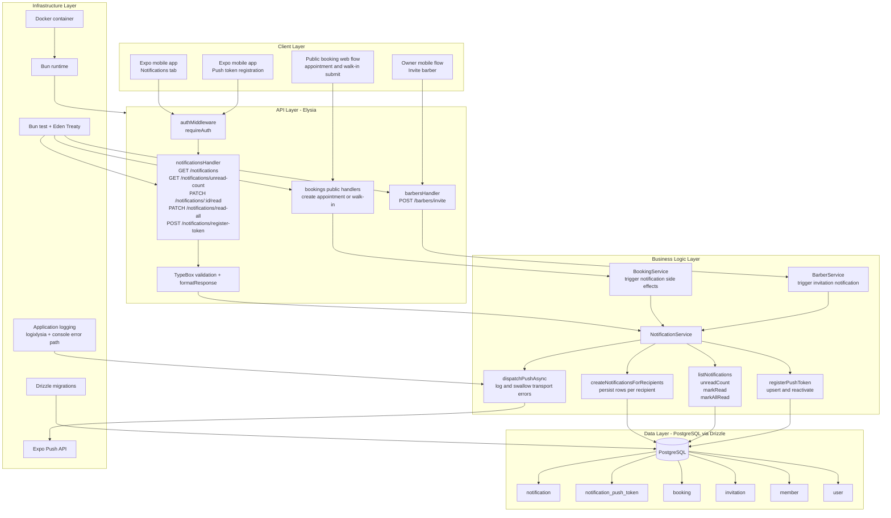
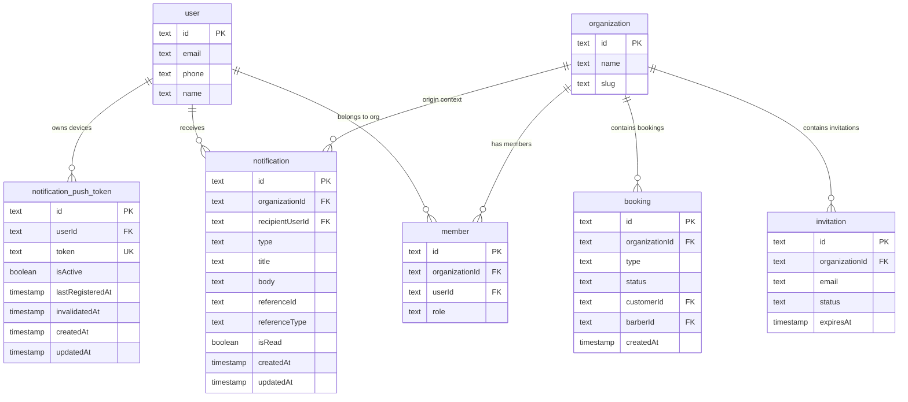

# Implementation Plan: In-App Notifications

**Version:** 1.0
**Date:** April 27, 2026
**Status:** Draft

- **PRD:** [prd.md](./prd.md)
- **Epic:** [epic.md](../epic.md)

---

## Goal

Deliver a user-scoped notification system that persists in-app alerts, exposes unread/read management APIs, and dispatches mobile push notifications through Expo without blocking core booking or invitation flows. The implementation must integrate with the existing Elysia, Better Auth, Drizzle, and Bun test patterns already used across the backend, while keeping route handlers thin and concentrating orchestration in a dedicated service layer. The feature should support three MVP notification types: appointment requests, walk-in arrivals, and barbershop invitations, with reliable ownership checks so a user can only read or mutate their own records. The resulting module should become the shared notification backbone for future reminder, broadcast, and operational-alert features without introducing cross-tenant leakage or coupling push delivery to synchronous request success.

---

## Requirements

- Create a new `notifications` module under `src/modules/notifications/` with `handler.ts`, `model.ts`, `schema.ts`, and `service.ts`.
- Register new notification tables in `drizzle/schemas.ts` and generate a migration with `drizzle-kit generate`.
- Persist user-targeted notification records for `appointment_requested`, `walk_in_arrival`, and `barbershop_invitation`.
- Persist Expo push tokens separately from notification rows so device lifecycle can be managed independently from message history.
- Expose authenticated APIs for list, unread count, mark single as read, mark all as read, and token registration.
- Scope all notification reads and writes by `recipientUserId = session.user.id`; cross-user access must return `404` for record-specific mutations.
- Store `organizationId` on notifications for deep-link context, auditability, and future org-level filtering, but do not require active membership in that organization to read invitation notifications.
- Keep push delivery fire-and-forget: notification persistence must succeed even if Expo returns an error or times out.
- Reuse existing booking status actions and Better Auth invitation actions for inline Accept/Decline flows; notifications should not own those business transitions.
- Mark notifications as read after successful inline actions, and allow read state changes directly through notification endpoints.
- Cover trigger creation through integration tests that flow through existing booking and barber invitation surfaces rather than isolated unit-only tests.

### Module Deliverables

| File | Responsibility |
|---|---|
| `src/modules/notifications/schema.ts` | Drizzle table definitions, indexes, relations, and inferred row types for notifications and Expo tokens |
| `src/modules/notifications/model.ts` | TypeBox request/response schemas, enums, query DTOs, and route params |
| `src/modules/notifications/service.ts` | Notification creation, read-state mutation, unread counting, token registration, recipient lookup, and async push dispatch |
| `src/modules/notifications/handler.ts` | Elysia route group, auth macros, DTO binding, and formatted responses |
| `src/lib/push.ts` | Thin Expo Push API client wrapper and response normalization |
| `drizzle/schemas.ts` | Re-export new notification schemas |
| `src/app.ts` | Register the notifications handler under `/api` |
| `tests/modules/notifications.test.ts` | End-to-end coverage for API contract, isolation, unread counts, and trigger flows |
| `tests/modules/bookings.test.ts` | Extend appointment and walk-in flows to assert notification side effects |
| `tests/modules/barbers.test.ts` | Extend invite flow to assert invitation notification creation for known users |

### Implementation Notes

- Use `requireAuth: true` on all notification routes.
- Do not use `requireOrganization: true` on the notifications module itself. Invitation notifications must remain visible to an invited user even before they become a member of the target organization.
- Keep `organizationId` mandatory on persisted notifications created from organization workflows; notification list endpoints stay user-scoped and may return records from multiple organizations.
- Treat notification creation as an application-level side effect owned by the domain that caused it:
  - booking public appointment submission -> notification service creates `appointment_requested`
  - walk-in PIN check-in completion -> notification service creates `walk_in_arrival`
  - barber invitation creation -> notification service creates `barbershop_invitation` when the invite target resolves to an existing user
- Persist first, then dispatch push asynchronously. The push call must never wrap the parent transaction.
- Keep all business failures in `service.ts` and throw `AppError` only.
- Use text IDs to stay aligned with the repository's current schema style.

### Feature Gap Analysis

| PRD Capability | Existing Support | Status | Implementation Direction |
|---|---|---|---|
| Authenticated user identity | Better Auth session + `authMiddleware` | Reuse | Scope notification APIs by `user.id` from session |
| Organization-aware workflows | `activeOrganizationId` exists on session | Partial | Store `organizationId` on each notification, but do not hard-require active org on read APIs |
| Appointment and walk-in creation events | `bookings` module exists | Reuse | Add notification trigger calls after successful booking creation in public/staff flows |
| Invitation creation event | `barbers` module exists | Reuse | Create invitation notifications only when the invite target resolves to an existing `user` |
| Push transport | No Expo client exists yet | Build | Add `src/lib/push.ts` with chunked send and error normalization |
| Device token persistence | No token table exists | Build | Add `notification_push_token` table and registration upsert flow |
| Inline action execution | Booking status endpoint and Better Auth invitation flow exist | Reuse | Notification payload points mobile app to existing action endpoints |
| Receipt-based token invalidation | No background worker or scheduler exists | Gap | Implement immediate invalidation on direct Expo errors; document receipt polling as a follow-up enabler or cron-backed enhancement |
| Invitee push without account | Current token registration is authenticated and user-bound | Gap | MVP supports push only for existing signed-in users; anonymous invitee push requires a separate pre-auth token association design |

### Recommended Delivery Sequence

1. Add schemas and migration for `notification` and `notification_push_token`.
2. Implement TypeBox DTOs and the notifications API surface.
3. Build notification persistence and unread/read workflows.
4. Add the Expo push client wrapper and async dispatch path.
5. Integrate notification triggers into bookings and barber invitation flows.
6. Add integration tests for notifications endpoints and trigger-producing modules.
7. Run `bun run lint:fix`, `bun run format`, and targeted Bun tests before broader validation.

---

## Technical Considerations

### System Architecture Overview



### Technology Stack Selection

| Layer | Technology | Rationale |
|---|---|---|
| API routing | Elysia route group under `/api/notifications` | Matches current module structure and keeps contracts type-safe |
| Validation | TypeBox via Elysia `t` | Consistent request validation and response typing in `model.ts` |
| Business logic | Module-local `NotificationService` | Centralizes recipient resolution, read-state rules, and push dispatch decisions |
| Persistence | Drizzle ORM + PostgreSQL | Existing repo standard; supports efficient unread-count and batch update queries |
| Auth | Better Auth session via `authMiddleware` | Already supplies `user` and optional `activeOrganizationId` safely |
| Push integration | Direct HTTPS wrapper to Expo Push API | Smallest viable MVP integration; no separate worker service required initially |
| Testing | Bun test + Eden Treaty | Validates full HTTP flow, auth cookie handling, and integration side effects |
| Deployment | Existing Bun app inside Docker | No extra service needed for baseline persistence and dispatch |

### Integration Points

- `src/app.ts`: add `.use(notificationsHandler)` inside the `/api` group.
- `src/modules/bookings/service.ts`: call `NotificationService.createBookingNotifications(...)` after public appointment and walk-in creation commits successfully.
- Public booking endpoints: if appointment and walk-in submissions are split across handlers, trigger from the final successful persistence point rather than duplicating logic in handlers.
- `src/modules/barbers/service.ts`: after invitation creation, resolve the invited user by email and create a `barbershop_invitation` notification only when a matching `user.id` exists.
- `src/lib/auth.ts`: optional future hook point for logout-driven token cleanup if Better Auth plugin hooks are adopted later.
- `src/lib/push.ts`: shared wrapper so future reminder or broadcast features do not duplicate Expo request formatting.

### Deployment Architecture

- No new standalone service is required for MVP; notifications ship inside the current Bun application container.
- Deployment order should be: database migration -> backend release -> mobile client release that registers tokens and reads notifications.
- The backend must tolerate a mixed-deploy state where the mobile app has not yet registered tokens; missing tokens should simply skip push delivery.
- If receipt polling is later added, prefer a small scheduled process in the same container or a platform cron job rather than coupling it to foreground request latency.

### Scalability Considerations

- The unread count and list endpoints should be fully index-backed on `recipientUserId`, `isRead`, and `createdAt`; no caching is required for the MVP volume described in the PRD.
- Batch inserts should be used when a single booking event fans out to all owners and barbers in the organization.
- Push sends should chunk tokens to Expo limits and execute after persistence so request throughput remains bounded by database work, not network round trips to Expo.
- If notification volume grows, pagination can remain stable because ordering is append-only on `createdAt DESC` and the API contract already includes page and page size.
- If unread-count traffic becomes hot later, a Redis counter or materialized per-user unread projection can be added without changing the write model.

---

## Database Schema Design

### Entity Relationship Diagram



### Table Specifications

#### `notification`

| Column | Type | Constraints | Notes |
|---|---|---|---|
| `id` | `text` | PK | `nanoid()` or repo-standard text ID |
| `organizationId` | `text` | FK -> `organization.id`, not null | Preserves organization context for bookings and invitations |
| `recipientUserId` | `text` | FK -> `user.id`, not null | Primary ownership boundary |
| `type` | `text` | not null | `appointment_requested`, `walk_in_arrival`, `barbershop_invitation` |
| `title` | `text` | not null | Short heading for list and push title |
| `body` | `text` | not null | Human-readable detail |
| `referenceId` | `text` | nullable | `booking.id` or `invitation.id` |
| `referenceType` | `text` | nullable | `booking` or `invitation` |
| `isRead` | `boolean` | not null, default `false` | Badge and list filtering |
| `createdAt` | `timestamp` | not null, default now | Append-only ordering |
| `updatedAt` | `timestamp` | not null, default now | Keeps parity with repo schema style |

#### `notification_push_token`

| Column | Type | Constraints | Notes |
|---|---|---|---|
| `id` | `text` | PK | Distinct row ID for auditability |
| `userId` | `text` | FK -> `user.id`, not null | Token owner |
| `token` | `text` | not null, unique | Expo token value; never returned from list APIs |
| `isActive` | `boolean` | not null, default `true` | Soft invalidation flag |
| `lastRegisteredAt` | `timestamp` | not null, default now | Supports idempotent re-registration |
| `invalidatedAt` | `timestamp` | nullable | Set on `DeviceNotRegistered` or manual cleanup |
| `createdAt` | `timestamp` | not null, default now | Audit |
| `updatedAt` | `timestamp` | not null, default now | Audit |

### Indexing Strategy

- `notification_recipientUserId_createdAt_idx` on `(recipientUserId, createdAt DESC)` for paginated list reads.
- `notification_recipientUserId_isRead_createdAt_idx` on `(recipientUserId, isRead, createdAt DESC)` for unread-only queries and unread count.
- `notification_organizationId_type_createdAt_idx` on `(organizationId, type, createdAt DESC)` for debugging, backfill scripts, and future org-level admin tooling.
- `notification_referenceType_referenceId_idx` on `(referenceType, referenceId)` to support future dedupe, deep-link reconciliation, or automatic read-state updates after actions.
- `notification_push_token_userId_isActive_idx` on `(userId, isActive, lastRegisteredAt DESC)` for delivery token lookup.
- `notification_push_token_token_uidx` unique on `token` so one physical device token maps to a single active owner at a time.

### Foreign Key Relationships

- `notification.organizationId -> organization.id` with `onDelete: cascade`.
- `notification.recipientUserId -> user.id` with `onDelete: cascade`.
- `notification_push_token.userId -> user.id` with `onDelete: cascade`.
- `referenceId` remains a soft reference because it can point to different tables depending on `referenceType`.

### Database Migration Strategy

1. Add `notification` and `notification_push_token` definitions to `src/modules/notifications/schema.ts`.
2. Re-export them from `drizzle/schemas.ts`.
3. Generate migration: `bunx drizzle-kit generate --name add-notifications-module`.
4. Validate migration ordering and schema consistency: `bunx drizzle-kit check`.
5. Apply migration with `bunx drizzle-kit migrate`.
6. Deploy backend after migration is live to avoid runtime table-not-found failures.

---

## API Design

### Endpoint Summary

| Method | Path | Purpose |
|---|---|---|
| `GET` | `/api/notifications` | Paginated notification list for current user |
| `GET` | `/api/notifications/unread-count` | Unread badge count |
| `PATCH` | `/api/notifications/:id/read` | Mark a single notification as read |
| `PATCH` | `/api/notifications/read-all` | Mark all notifications as read |
| `POST` | `/api/notifications/register-token` | Upsert Expo push token for current user |

### Request and Response Types

```typescript
type NotificationType =
    | 'appointment_requested'
    | 'walk_in_arrival'
    | 'barbershop_invitation'

type NotificationReferenceType = 'booking' | 'invitation'

type NotificationListQuery = {
    page?: number
    pageSize?: number
    unreadOnly?: boolean
}

type NotificationListItem = {
    id: string
    organizationId: string
    type: NotificationType
    title: string
    body: string
    referenceId: string | null
    referenceType: NotificationReferenceType | null
    isRead: boolean
    createdAt: string
}

type NotificationListResponse = {
    items: NotificationListItem[]
    page: number
    pageSize: number
    total: number
}

type NotificationUnreadCountResponse = {
    count: number
}

type MarkNotificationReadResponse = {
    id: string
    isRead: true
}

type MarkAllNotificationsReadResponse = {
    updatedCount: number
}

type RegisterPushTokenInput = {
    token: string
}

type RegisterPushTokenResponse = {
    tokenRegistered: true
}
```

### Endpoint Specifications

#### `GET /api/notifications`

- **Auth:** `requireAuth: true`
- **Organization requirement:** none at the handler level
- **Query params:**
  - `page` default `1`
  - `pageSize` default `20`, max `100`
  - `unreadOnly` optional boolean
- **Response `200`:** `formatResponse({ data: NotificationListResponse })`
- **Ordering:** newest first by `createdAt DESC`
- **Filtering:** `recipientUserId = user.id`; when `unreadOnly=true`, add `isRead = false`
- **Notes:** do not include push tokens or other recipient metadata

#### `GET /api/notifications/unread-count`

- **Auth:** `requireAuth: true`
- **Response `200`:** `formatResponse({ data: { count } })`
- **Query shape:** none
- **Logic:** `COUNT(*) WHERE recipientUserId = user.id AND isRead = false`

#### `PATCH /api/notifications/:id/read`

- **Auth:** `requireAuth: true`
- **Params:** `id: string`
- **Response `200`:** marked notification summary
- **Error codes:**
  - `404` when no row matches both `id` and `recipientUserId = user.id`

#### `PATCH /api/notifications/read-all`

- **Auth:** `requireAuth: true`
- **Response `200`:** `{ updatedCount: number }`
- **Logic:** batch update unread rows for the current user only

#### `POST /api/notifications/register-token`

- **Auth:** `requireAuth: true`
- **Body:** `{ token: string }`
- **Response `200`:** `{ tokenRegistered: true }`
- **Behavior:**
  1. Validate Expo token string format.
  2. Upsert by unique `token`.
  3. Reassign ownership to current user if the token already exists under another user.
  4. Set `isActive = true`, `invalidatedAt = null`, `lastRegisteredAt = now`.

### Authentication and Authorization

- Notification APIs are authenticated-user endpoints, not organization-member endpoints.
- Record access is authorized solely by `recipientUserId` ownership.
- `organizationId` remains part of the record for traceability and client deep-link context, not as the primary read permission gate.
- Trigger-producing services must still enforce their own organization and role rules before they create notifications.

### Multi-Tenant Scoping Strategy

- Creation: producer services must pass the originating `organizationId` from the validated workflow context.
- Reads: list, unread count, and mark-read operations filter by `recipientUserId` only.
- Action execution: the mobile client uses `referenceId` and existing module endpoints; those downstream endpoints continue to enforce `organizationId` and role checks.
- This approach prevents a pre-member invitee from losing access to their invitation notification while still preserving tenant context on every record.

### Error Handling and Status Codes

- `200 OK` for all successful read and mutation endpoints in this module.
- `400 Bad Request` for invalid pagination or invalid token format.
- `401 Unauthorized` when session is absent.
- `404 Not Found` when attempting to mutate a notification not owned by the caller.
- `422 Unprocessable Entity` for TypeBox validation failures handled by Elysia.
- Push delivery failures do not propagate through notification APIs or upstream booking or barber invitation APIs.

### Rate Limiting and Caching

- Reuse global Better Auth or app-level rate limiting for authenticated requests.
- Add a lightweight per-user throttle on `POST /register-token` only if token churn becomes abusive; not required for MVP.
- Do not cache list or unread-count responses server-side in MVP; indexed PostgreSQL reads should satisfy the p95 target.

---

## Notification Creation and Delivery Workflows

### Appointment Requested

1. Public appointment booking flow persists the booking successfully.
2. `BookingService` resolves all `owner` and `barber` members for the booking's organization.
3. `NotificationService` bulk-inserts one notification row per recipient with `type = 'appointment_requested'` and `referenceType = 'booking'`.
4. `NotificationService` asynchronously loads active Expo tokens for those users and submits push messages.
5. Any push transport error is logged and ignored from the HTTP response perspective.

### Walk-In Arrival

1. Walk-in PIN-verified booking flow persists the booking successfully.
2. Recipient resolution mirrors appointment flow.
3. Notification title and body are tailored to walk-in arrival semantics.
4. Push dispatch follows the same async, best-effort path.

### Barbershop Invitation

1. `BarberService.inviteBarber(...)` creates the Better Auth invitation row.
2. The service resolves a target user by normalized invitation email.
3. If no user exists, no in-app notification row is created in MVP because there is no authenticated recipient identity to own it.
4. If a user exists, create a `barbershop_invitation` notification with `referenceType = 'invitation'`.
5. Dispatch push to that user's active tokens, if any.

### Inline Actions and Read State

- Accept/Decline for appointment notifications call the existing booking status endpoint.
- Accept/Decline for invitation notifications call the existing Better Auth invitation acceptance or decline flow.
- After a successful inline action, the client should call `PATCH /api/notifications/:id/read` or the backend action handler can opportunistically mark the linked notification as read in the same request path if the mobile app passes the notification ID.
- For MVP, prefer explicit client-driven mark-as-read to keep existing booking and auth contracts unchanged.

### Push Delivery Strategy

- Create a small `push.ts` client that accepts token arrays and payloads, chunks requests to Expo limits, and returns normalized per-token outcomes.
- Dispatch via `queueMicrotask`, `Promise.resolve().then(...)`, or equivalent post-response async scheduling from the producer service after the database commit completes.
- Immediately deactivate tokens when Expo returns a direct permanent error such as `DeviceNotRegistered` in the send response.
- Store no delivery history in MVP unless the team later decides to add receipt reconciliation.

---

## Security & Performance

| Concern | Approach |
|---|---|
| Cross-user data access | Every read and mutation query filters by `recipientUserId = session.user.id`; foreign notification IDs return `404` |
| Cross-tenant leakage | Only validated producer services can create notifications with an `organizationId`; downstream action endpoints still enforce org membership |
| Token secrecy | Expo tokens are stored server-side only and never returned by notification list APIs |
| Input validation | TypeBox validates pagination bounds, boolean filters, route params, and token format |
| Push failure isolation | Persistence completes before dispatch; transport failures are logged and swallowed |
| Query performance | Composite indexes on recipient, read state, and created timestamp keep list and count queries within the PRD target |
| Batch fan-out | Multi-recipient booking notifications use single bulk inserts and grouped token fetches |
| Auditability | `organizationId`, `referenceType`, `referenceId`, and timestamps make notification origin traceable without additional joins |

### Performance Notes

- `GET /api/notifications` should use limit/offset pagination capped at 100 rows.
- `GET /api/notifications/unread-count` should execute as a narrow indexed count query.
- Batch read-all updates should target only unread rows to minimize write amplification.
- Push dispatch should deduplicate tokens before outbound API calls so users with duplicate registrations do not receive duplicate pushes.

---

## Testing Strategy

- Add `tests/modules/notifications.test.ts` to cover:
  - authenticated list retrieval
  - unread-only filter
  - unread count
  - mark single read
  - mark all read
  - cross-user isolation returning `404`
  - token registration idempotency and reassignment behavior
- Extend `tests/modules/bookings.test.ts` to verify:
  - appointment creation produces notifications for all org owners and barbers
  - walk-in creation produces notifications for all org owners and barbers
  - simulated push failure does not break booking success
- Extend `tests/modules/barbers.test.ts` to verify:
  - inviting an existing user creates a `barbershop_invitation` notification
  - inviting a non-existent email does not create a notification row
- Stub Expo HTTP calls in tests so success and failure paths can be asserted deterministically.
- Keep test setup aligned with existing Eden Treaty patterns and Better Auth session cookie handling.

---

## Delivery Risks and Decisions

### Resolved Design Decisions

- Notifications APIs are user-scoped, not organization-required, because invitation notifications must work before org membership exists.
- Inline actions reuse existing booking and invitation endpoints rather than introducing notification-owned action routes.
- Push tokens are modeled separately from notification history to support device lifecycle changes without rewriting message rows.

### Risks Requiring Follow-Through

- **Expo receipt polling:** full receipt-check-based invalidation is not naturally supported by the current single-process request architecture. MVP should ship with immediate send-error invalidation and log the gap for a follow-up cron or worker story.
- **Invitee push without account:** the PRD mentions push-only delivery if a token is known, but the current backend stores tokens only for authenticated users. Supporting anonymous invitee devices would require a new pre-auth token association model and should be treated as a separate design decision.
- **Client action/read coordination:** if the mobile app does not mark notifications as read after a successful inline action, unread counts will drift. The mobile contract must explicitly include a read-state update step unless the backend is later extended to support linked auto-read behavior.

---

## File Checklist

```text
src/modules/notifications/
  handler.ts    [NEW] - notification routes and response envelopes
  model.ts      [NEW] - TypeBox DTOs and enums
  schema.ts     [NEW] - notification and token tables
  service.ts    [NEW] - persistence, unread logic, token upsert, push dispatch

src/lib/
  push.ts       [NEW] - Expo Push API wrapper

src/modules/bookings/
  service.ts    [MODIFY] - trigger appointment and walk-in notifications

src/modules/barbers/
  service.ts    [MODIFY] - trigger invitation notification for existing users

src/
  app.ts        [MODIFY] - register notifications handler

drizzle/
  schemas.ts    [MODIFY] - export notification schemas
  *.sql         [NEW] - migration for notification tables and indexes

tests/modules/
  notifications.test.ts [NEW] - notification API and token registration coverage
  bookings.test.ts      [MODIFY] - trigger assertions
  barbers.test.ts       [MODIFY] - invitation notification assertions
```