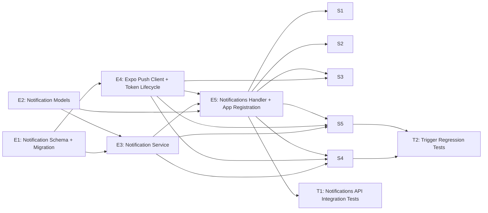

# Project Plan: Notifications — In-App Alerts & Push Delivery

**Version:** 1.0  
**Date:** April 27, 2026  
**Status:** Draft  
**Feature PRD:** [prd.md](./prd.md)  
**Implementation Plan:** [implementation-plan.md](./implementation-plan.md)

---

## Summary

End-to-end breakdown of the GitHub issues required to deliver the Notifications feature. The feature adds a user-scoped notifications module, Expo push token registration, async push dispatch, unread/read management APIs, and trigger integrations for booking and barber invitation flows.

**Total Estimate:** 29 story points · **Size:** L

---

## Issue Hierarchy

```text
Feature: In-App Notifications (#F)
├── Enabler: Notification schema + migration                    (#E1)  [P1]
├── Enabler: Notification model definitions                     (#E2)  [P1]
├── Enabler: Notification service core workflows                (#E3)  [P0] — blocked by E1, E2
├── Enabler: Expo push client + token lifecycle                 (#E4)  [P1] — blocked by E1
├── Enabler: Notifications handler + app registration           (#E5)  [P0] — blocked by E2, E3, E4
├── Story:   View notification inbox + unread count             (#S1)  [P1] — blocked by E5
├── Story:   Mark notifications read with ownership checks      (#S2)  [P1] — blocked by E5
├── Story:   Register Expo push token                           (#S3)  [P1] — blocked by E4, E5
├── Story:   Receive appointment and walk-in notifications      (#S4)  [P1] — blocked by E3, E4, E5
├── Story:   Receive barbershop invitation notifications        (#S5)  [P1] — blocked by E3, E4, E5
├── Test:    Notifications API integration tests                (#T1)  [P1] — blocked by E5
└── Test:    Booking and invitation trigger regression tests    (#T2)  [P1] — blocked by S4, S5
```

---

## Dependency Graph



---

## Critical Path

`E1 → E3 → E5 → T1` is the shortest path to a validated notifications API. `E4` runs in parallel after `E1`, but it becomes critical before token registration and end-to-end trigger stories can close.

---

## Sprint Plan

### Sprint 1 Goal

Establish the notifications backbone: schema, DTOs, service logic, push infrastructure, and authenticated routes.

- `#E1` Notification schema + migration (2 pts)
- `#E2` Notification model definitions (2 pts)
- `#E3` Notification service core workflows (5 pts)
- `#E4` Expo push client + token lifecycle (3 pts)
- `#E5` Notifications handler + app registration (2 pts)

**Total Commitment:** 14 story points  
**Success Criteria:** notifications endpoints are registered, authenticated, user-scoped, and ready for integration and test execution.

### Sprint 2 Goal

Complete end-to-end delivery: user-facing flows, booking and invitation triggers, and integration/regression coverage.

- `#S1` View notification inbox + unread count (2 pts)
- `#S2` Mark notifications read with ownership checks (2 pts)
- `#S3` Register Expo push token (1 pt)
- `#S4` Receive appointment and walk-in notifications (3 pts)
- `#S5` Receive barbershop invitation notifications (2 pts)
- `#T1` Notifications API integration tests (3 pts)
- `#T2` Booking and invitation trigger regression tests (2 pts)

**Total Commitment:** 15 story points  
**Success Criteria:** all acceptance criteria pass with Bun integration tests, and push failures are isolated from booking and invitation success paths.

---

## Issue Templates

---

### Feature Issue

```markdown
# Feature: In-App Notifications — Real-Time Booking & Invitation Alerts

## Feature Description

Deliver a user-scoped notifications system that persists in-app alerts, exposes unread/read
management APIs, stores Expo push tokens separately from notification history, and dispatches
push notifications asynchronously for booking and invitation workflows. The feature must keep
ownership checks strict (`recipientUserId = session.user.id`), preserve `organizationId`
context on each notification, and avoid coupling push transport failures to primary booking or
invitation success paths.

## User Stories in this Feature

- [ ] #{S1} - View notification inbox + unread count
- [ ] #{S2} - Mark notifications read with ownership checks
- [ ] #{S3} - Register Expo push token
- [ ] #{S4} - Receive appointment and walk-in notifications
- [ ] #{S5} - Receive barbershop invitation notifications

## Technical Enablers

- [ ] #{E1} - Notification schema + migration
- [ ] #{E2} - Notification model definitions
- [ ] #{E3} - Notification service core workflows
- [ ] #{E4} - Expo push client + token lifecycle
- [ ] #{E5} - Notifications handler + app registration

## Tests

- [ ] #{T1} - Notifications API integration tests
- [ ] #{T2} - Booking and invitation trigger regression tests

## Dependencies

**Blocks**: future reminder and broadcast notification features  
**Blocked by**: parent epic foundations already delivered (`auth`, `bookings`, `barbers`, organization context)

## Acceptance Criteria

- [ ] `GET /api/notifications` returns paginated notifications for the current user, newest first
- [ ] `GET /api/notifications?unreadOnly=true` returns only unread records for the current user
- [ ] `GET /api/notifications/unread-count` returns the correct unread badge count
- [ ] `PATCH /api/notifications/:id/read` marks an owned notification as read and returns 404 for foreign IDs
- [ ] `PATCH /api/notifications/read-all` marks all unread notifications for the current user as read
- [ ] `POST /api/notifications/register-token` validates, upserts, and reactivates Expo tokens for the current user
- [ ] Appointment bookings create `appointment_requested` notifications for owners and barbers in the organization
- [ ] Walk-in completions create `walk_in_arrival` notifications for owners and barbers in the organization
- [ ] Barber invitations create `barbershop_invitation` notifications for existing users resolved by email
- [ ] Push delivery runs after persistence and does not change booking or invitation HTTP success behavior
- [ ] Notification reads and mutations are scoped by `recipientUserId = session.user.id`
- [ ] Invitation notifications remain readable even if the recipient does not yet have active membership in the target organization

## Definition of Done

- [ ] All user stories delivered
- [ ] All technical enablers completed
- [ ] Integration tests passing (`bun test notifications bookings barbers`)
- [ ] Lint and format checks passing (`bun run lint:fix && bun run format`)
- [ ] Documentation updated for new module and migration

## Labels

`feature`, `priority-high`, `value-high`, `backend`

## Epic

#{epic-issue-number} — Cukkr Barbershop Management & Booking System

## Estimate

L (29 story points)
```

---

### Enabler Issues

---

#### E1 — Notification Schema + Migration

```markdown
# Technical Enabler: Notification Schema and Migration

## Enabler Description

Create the database foundation for in-app notifications by adding `notification` and
`notification_push_token` tables, required indexes, and Drizzle exports. This enabler defines
the ownership boundary, organization context, and token lifecycle persistence needed by all
API and trigger work.

## Technical Requirements

- [ ] Create `src/modules/notifications/schema.ts`
- [ ] Define `notification` table with text ID, `organizationId`, `recipientUserId`, `type`,
      `title`, `body`, `referenceId`, `referenceType`, `isRead`, `createdAt`, and `updatedAt`
- [ ] Define `notification_push_token` table with text ID, `userId`, unique `token`,
      `isActive`, `lastRegisteredAt`, `invalidatedAt`, `createdAt`, and `updatedAt`
- [ ] Add the four notification indexes and token lookup index described in the implementation plan
- [ ] Re-export new schemas from `drizzle/schemas.ts`
- [ ] Generate migration with `bunx drizzle-kit generate --name add-notifications-module`
- [ ] Validate migration with `bunx drizzle-kit check`

## Acceptance Criteria

- [ ] Migration file created under `drizzle/`
- [ ] Both tables use text IDs to match repo conventions
- [ ] Notification indexes cover recipient list, unread count, org/type debugging, and reference lookup paths
- [ ] Token table enforces unique `token`
- [ ] `drizzle/schemas.ts` exports the new notification schemas

## Definition of Done

- [ ] Schema file created
- [ ] Migration file generated and committed
- [ ] `bun run lint:fix && bun run format` passing

## Labels

`enabler`, `priority-high`, `value-medium`, `backend`, `database`

## Feature

#{F}

## Estimate

2 story points
```

---

#### E2 — Notification Model Definitions

```markdown
# Technical Enabler: Notification Model Definitions

## Enabler Description

Define the TypeBox request/response schemas and exported TypeScript types for the notifications
module. These contracts are shared by the handler and service and should cover list queries,
unread count, read mutations, token registration, and enum values for notification types and
reference types.

## Technical Requirements

- [ ] Create `src/modules/notifications/model.ts`
- [ ] Define `NotificationTypeEnum` for `appointment_requested`, `walk_in_arrival`, and
      `barbershop_invitation`
- [ ] Define `NotificationReferenceTypeEnum` for `booking` and `invitation`
- [ ] Define list query schema with `page`, `pageSize`, and `unreadOnly`
- [ ] Define response schemas for notification list items, unread count, single read, read-all,
      and token registration
- [ ] Export TypeScript types used by handler and service without `any`

## Acceptance Criteria

- [ ] Pagination defaults and max constraints are represented in the DTOs
- [ ] Notification list items preserve `organizationId`, `referenceId`, and `referenceType`
- [ ] Token registration body requires `token: string`
- [ ] All exported types are reused across the module rather than duplicated inline

## Definition of Done

- [ ] `src/modules/notifications/model.ts` created
- [ ] No TypeScript errors
- [ ] `bun run lint:fix && bun run format` passing

## Labels

`enabler`, `priority-high`, `value-medium`, `backend`

## Feature

#{F}

## Estimate

2 story points
```

---

#### E3 — Notification Service Core Workflows

```markdown
# Technical Enabler: Notification Service Core Workflows

## Enabler Description

Implement `src/modules/notifications/service.ts` as the orchestration layer for notification
creation, list queries, unread counts, mark-read operations, recipient lookup, and ownership
checks. This service owns business rules and must throw `AppError` only.

## Technical Requirements

- [ ] Create `NotificationService` in `src/modules/notifications/service.ts`
- [ ] Implement paginated `listNotifications(recipientUserId, query)` ordered by `createdAt DESC`
- [ ] Implement `getUnreadCount(recipientUserId)` using indexed unread filtering
- [ ] Implement `markAsRead(recipientUserId, notificationId)` returning 404 for foreign IDs
- [ ] Implement `markAllAsRead(recipientUserId)` updating unread rows only
- [ ] Implement `createNotificationsForRecipients(...)` with batch insert support
- [ ] Implement recipient lookup helper for booking notifications using organization members
- [ ] Keep all failures as `AppError`; never throw plain `Error`

## Acceptance Criteria

- [ ] Service methods accept `recipientUserId` from the caller, never from request body payloads
- [ ] `listNotifications` supports `unreadOnly` filtering and limit/offset pagination
- [ ] `markAsRead` returns a not-found business error when the notification is not owned by the caller
- [ ] `markAllAsRead` updates only unread rows and returns `updatedCount`
- [ ] Batch creation persists records before any push dispatch starts
- [ ] Invitation notifications can be listed without requiring active organization membership

## Definition of Done

- [ ] Service implemented with no `any`
- [ ] Read and write paths covered by integration tests
- [ ] `bun run lint:fix && bun run format` passing

## Labels

`enabler`, `priority-critical`, `value-high`, `backend`

## Feature

#{F}

## Estimate

5 story points
```

---

#### E4 — Expo Push Client + Token Lifecycle

```markdown
# Technical Enabler: Expo Push Client and Token Lifecycle

## Enabler Description

Build the push delivery infrastructure in `src/lib/push.ts` and token lifecycle logic in the
notifications service. This enabler validates Expo token format, chunks outbound sends,
normalizes provider responses, and deactivates permanently invalid tokens without surfacing
transport failures to feature callers.

## Technical Requirements

- [ ] Create `src/lib/push.ts` as a thin Expo Push API wrapper
- [ ] Add Expo token validation suitable for `POST /api/notifications/register-token`
- [ ] Chunk outbound notifications to Expo-safe batch sizes
- [ ] Normalize per-token success and error outcomes from Expo responses
- [ ] Deactivate tokens on direct permanent failures such as `DeviceNotRegistered`
- [ ] Ensure dispatch runs asynchronously after persistence and logs failures without throwing

## Acceptance Criteria

- [ ] Invalid token format returns a business validation error before persistence
- [ ] Duplicate token registration can reassign ownership to the current user
- [ ] Re-registered tokens are marked active and clear `invalidatedAt`
- [ ] Push wrapper can be stubbed in tests for success and failure paths
- [ ] Direct Expo failure does not roll back notification creation

## Definition of Done

- [ ] `src/lib/push.ts` created
- [ ] Token lifecycle logic implemented and testable
- [ ] `bun run lint:fix && bun run format` passing

## Labels

`enabler`, `priority-high`, `value-medium`, `backend`, `infrastructure`

## Feature

#{F}

## Estimate

3 story points
```

---

#### E5 — Notifications Handler + App Registration

```markdown
# Technical Enabler: Notifications Handler and App Registration

## Enabler Description

Create the Elysia notifications route group and register it in `src/app.ts`. The handler wires
auth middleware, TypeBox validation, service calls, and `formatResponse` across all five MVP
endpoints.

## Technical Requirements

- [ ] Create `src/modules/notifications/handler.ts`
- [ ] Add `GET /api/notifications`
- [ ] Add `GET /api/notifications/unread-count`
- [ ] Add `PATCH /api/notifications/:id/read`
- [ ] Add `PATCH /api/notifications/read-all`
- [ ] Add `POST /api/notifications/register-token`
- [ ] Apply `requireAuth: true` to all notifications routes
- [ ] Register the handler in `src/app.ts`

## Acceptance Criteria

- [ ] All notifications endpoints return authenticated 401 responses when session is absent
- [ ] Success responses use `formatResponse`
- [ ] Record-specific ownership failures map to 404 for the read mutation endpoint
- [ ] Module is mounted under `/api` and follows existing repo route conventions
- [ ] Notifications module does not require `requireOrganization: true`

## Definition of Done

- [ ] Handler file created
- [ ] App registration updated
- [ ] `bun run lint:fix && bun run format` passing

## Labels

`enabler`, `priority-critical`, `value-high`, `backend`

## Feature

#{F}

## Estimate

2 story points
```

---

### Story Issues

---

#### S1 — View Notification Inbox + Unread Count

```markdown
# User Story: View Notification Inbox + Unread Count

## Story Statement

As a **barber or barbershop owner**, I want **to view my notifications and unread badge count**
so that **I can quickly see new operational events that need attention**.

## Acceptance Criteria

- [ ] `GET /api/notifications` returns only notifications owned by the authenticated user
- [ ] Results are ordered newest first by `createdAt DESC`
- [ ] Default pagination is page 1, page size 20, with page size capped at 100
- [ ] `unreadOnly=true` returns only unread notifications
- [ ] `GET /api/notifications/unread-count` returns the correct unread count for the current user
- [ ] Notification list items include `organizationId`, `type`, `title`, `body`, `referenceId`,
      `referenceType`, `isRead`, and `createdAt`

## Technical Tasks

- [ ] Wire list and unread-count service methods into the handler
- [ ] Ensure query defaults and max page size are enforced by DTOs
- [ ] Keep invitation notifications visible even if the user has not joined the target org yet

## Testing Requirements

- [ ] #{T1} - Notifications API integration tests

## Dependencies

**Blocked by**: #{E5}

## Definition of Done

- [ ] Acceptance criteria met
- [ ] Code review approved
- [ ] Integration tests passing

## Labels

`user-story`, `priority-high`, `value-high`, `backend`

## Feature

#{F}

## Estimate

2 story points
```

---

#### S2 — Mark Notifications Read With Ownership Checks

```markdown
# User Story: Mark Notifications Read With Ownership Checks

## Story Statement

As a **barber or barbershop owner**, I want **to mark one or all of my notifications as read**
so that **my unread count stays accurate and I can manage my inbox state safely**.

## Acceptance Criteria

- [ ] `PATCH /api/notifications/:id/read` marks an owned unread notification as read
- [ ] `PATCH /api/notifications/read-all` marks all unread notifications for the current user as read
- [ ] A user receives 404 when trying to mark another user's notification as read
- [ ] Read-state updates are scoped by `recipientUserId = session.user.id`
- [ ] The unread count reflects single-read and read-all updates immediately on subsequent reads

## Technical Tasks

- [ ] Implement single-read ownership lookup in the service
- [ ] Implement batch unread update for read-all
- [ ] Return stable response envelopes for both mutations

## Testing Requirements

- [ ] #{T1} - Notifications API integration tests

## Dependencies

**Blocked by**: #{E5}

## Definition of Done

- [ ] Acceptance criteria met
- [ ] Code review approved
- [ ] Integration tests passing

## Labels

`user-story`, `priority-high`, `value-high`, `backend`

## Feature

#{F}

## Estimate

2 story points
```

---

#### S3 — Register Expo Push Token

```markdown
# User Story: Register Expo Push Token

## Story Statement

As a **barber or barbershop owner**, I want **to register my device push token** so that **I can
receive notifications while the app is backgrounded**.

## Acceptance Criteria

- [ ] `POST /api/notifications/register-token` requires authentication
- [ ] Token format is validated before insert or update
- [ ] Existing tokens are reactivated and clear `invalidatedAt`
- [ ] Duplicate token values can be reassigned to the current authenticated user
- [ ] Successful registration returns `{ tokenRegistered: true }`

## Technical Tasks

- [ ] Wire token registration DTOs and service method into the handler
- [ ] Upsert by unique token value
- [ ] Ensure token rows are never returned from notification list APIs

## Testing Requirements

- [ ] #{T1} - Notifications API integration tests

## Dependencies

**Blocked by**: #{E4}, #{E5}

## Definition of Done

- [ ] Acceptance criteria met
- [ ] Code review approved
- [ ] Integration tests passing

## Labels

`user-story`, `priority-high`, `value-high`, `backend`

## Feature

#{F}

## Estimate

1 story point
```

---

#### S4 — Receive Appointment and Walk-In Notifications

```markdown
# User Story: Receive Appointment and Walk-In Notifications

## Story Statement

As a **barber or barbershop owner**, I want **appointment-request and walk-in-arrival notifications
to be created automatically** so that **I can react quickly to new customer demand**.

## Acceptance Criteria

- [ ] Public appointment booking creation triggers `appointment_requested` notifications
- [ ] Walk-in completion triggers `walk_in_arrival` notifications
- [ ] Recipients include all owner and barber members in the organization
- [ ] Notification records include the originating `organizationId` and `referenceType = 'booking'`
- [ ] Push delivery is attempted asynchronously after persistence
- [ ] Booking success is unaffected if push transport fails

## Technical Tasks

- [ ] Integrate notification creation into the final successful booking persistence path
- [ ] Resolve recipient user IDs from organization membership
- [ ] Provide booking-specific title/body payloads for appointment and walk-in flows

## Testing Requirements

- [ ] #{T2} - Booking and invitation trigger regression tests

## Dependencies

**Blocked by**: #{E3}, #{E4}, #{E5}

## Definition of Done

- [ ] Acceptance criteria met
- [ ] Code review approved
- [ ] Integration tests passing

## Labels

`user-story`, `priority-high`, `value-high`, `backend`

## Feature

#{F}

## Estimate

3 story points
```

---

#### S5 — Receive Barbershop Invitation Notifications

```markdown
# User Story: Receive Barbershop Invitation Notifications

## Story Statement

As a **barber**, I want **an invitation notification when an owner invites me to a barbershop**
so that **I can respond promptly from the app**.

## Acceptance Criteria

- [ ] `POST /api/barbers/invite` creates `barbershop_invitation` notifications when the invite email resolves to an existing user
- [ ] Invitation notifications use `referenceType = 'invitation'`
- [ ] No notification row is created for email addresses that do not resolve to an existing user
- [ ] Push delivery is attempted for resolved users with active tokens
- [ ] Invitation notification visibility does not require active membership in the target organization

## Technical Tasks

- [ ] Resolve invited users by normalized email from the barber invitation flow
- [ ] Create invitation-specific notification title/body payloads
- [ ] Ensure missing users short-circuit without failing the invitation request

## Testing Requirements

- [ ] #{T2} - Booking and invitation trigger regression tests

## Dependencies

**Blocked by**: #{E3}, #{E4}, #{E5}

## Definition of Done

- [ ] Acceptance criteria met
- [ ] Code review approved
- [ ] Integration tests passing

## Labels

`user-story`, `priority-high`, `value-high`, `backend`

## Feature

#{F}

## Estimate

2 story points
```

---

### Test Issues

---

#### T1 — Notifications API Integration Tests

```markdown
# Test: Notifications API Integration Tests

## Test Description

Add `tests/modules/notifications.test.ts` to validate the notifications module contract end to
end using Bun test and Eden Treaty. Cover list retrieval, unread filters, unread counts,
read mutations, token registration, and cross-user ownership isolation.

## Scope

- [ ] Authenticated list retrieval with default pagination
- [ ] `unreadOnly=true` filtering
- [ ] Unread count endpoint
- [ ] Mark single read
- [ ] Mark all read
- [ ] Cross-user 404 when mutating another user's notification
- [ ] Token registration success, idempotent re-registration, and reassignment behavior
- [ ] Unauthorized requests return 401 where applicable

## Acceptance Criteria

- [ ] `tests/modules/notifications.test.ts` exists and passes
- [ ] Test setup creates at least two authenticated users to validate ownership isolation
- [ ] Token registration tests cover both first registration and token reassignment
- [ ] Assertions verify response envelopes, not only status codes

## Definition of Done

- [ ] Integration test file added
- [ ] Tests pass under Bun
- [ ] Documentation or test comments explain any push stubbing hook used

## Labels

`test`, `priority-high`, `value-high`, `backend`

## Feature

#{F}

## Estimate

3 story points
```

---

#### T2 — Booking and Invitation Trigger Regression Tests

```markdown
# Test: Booking and Invitation Trigger Regression Tests

## Test Description

Extend existing booking and barber integration suites to prove that notifications are created as
side effects of public appointment submissions, walk-in completions, and barber invitations.
The tests must also verify that push delivery failures do not break the primary flow.

## Scope

- [ ] Extend `tests/modules/bookings.test.ts` for appointment notification creation
- [ ] Extend `tests/modules/bookings.test.ts` for walk-in notification creation
- [ ] Stub push transport failure and prove booking creation still succeeds
- [ ] Extend `tests/modules/barbers.test.ts` for invitation notification creation when user exists
- [ ] Extend `tests/modules/barbers.test.ts` to confirm no notification row is created for unknown users

## Acceptance Criteria

- [ ] Booking tests assert correct recipient fan-out for owners and barbers
- [ ] Invitation tests assert existing-user notification creation and unknown-user no-op behavior
- [ ] Push transport can be stubbed to fail deterministically without breaking the upstream API response
- [ ] Existing module behavior remains green after notification assertions are added

## Definition of Done

- [ ] Existing test suites extended and passing
- [ ] No flaky push-network dependency in tests
- [ ] Regression coverage documented in the feature issue

## Labels

`test`, `priority-high`, `value-high`, `backend`

## Feature

#{F}

## Estimate

2 story points
```

---

## Definition of Ready

- [ ] PRD and implementation plan approved for the notifications feature
- [ ] Parent epic issue number available
- [ ] Team agrees that Expo push is best-effort for MVP, with receipt polling deferred
- [ ] Existing booking and barber invitation flows are stable enough for side-effect integration

---

## Definition of Done

- [ ] All issues in this plan are created in GitHub and linked to the parent epic
- [ ] Dependencies are set in GitHub for the critical path issues
- [ ] Notifications module is implemented and registered in the backend
- [ ] Targeted Bun tests pass
- [ ] Lint and format checks pass
- [ ] Migration and release ordering are documented for deployment
