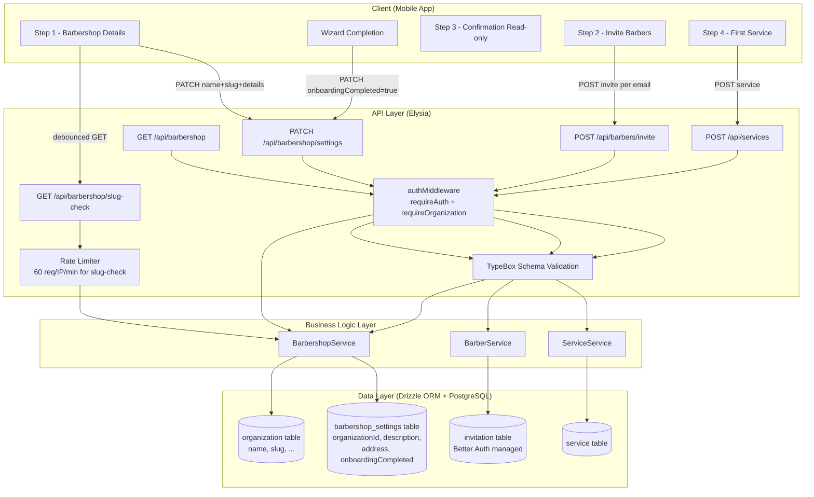
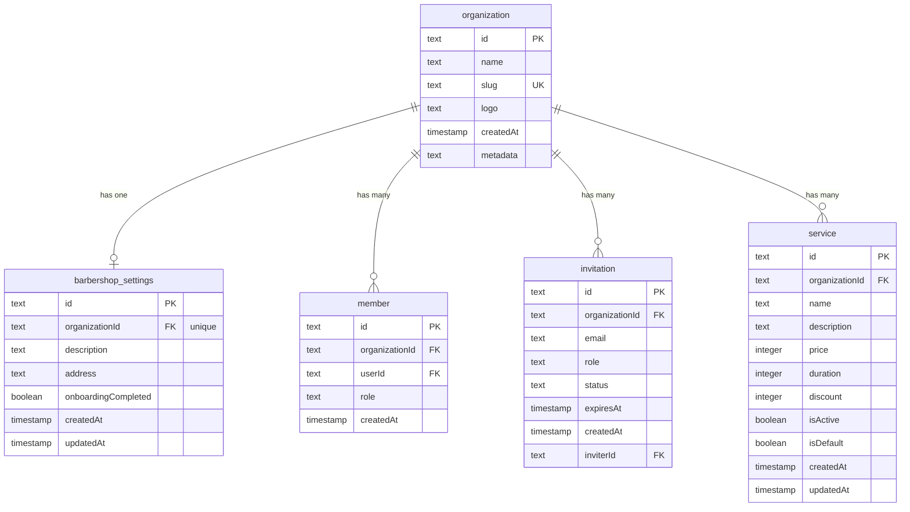

# Implementation Plan: Onboarding & Barbershop Setup

**Version:** 1.0  
**Date:** April 26, 2026  
**Status:** Draft  
**Feature PRD:** [Onboarding & Barbershop Setup PRD](./prd.md)

---

## Goal

Implement a backend that supports a 4-step guided onboarding wizard for new barbershop owners. The backend must expose endpoints to: (1) update barbershop profile settings and validate slug uniqueness; (2) invite barbers by email; (3) create the first bookable service with a default flag; and (4) mark onboarding as complete on the organization. Once complete, subsequent app launches must skip the wizard automatically based on the `onboardingCompleted` flag returned from `GET /api/barbershop`.

---

## Requirements

- Expose `GET /api/barbershop` to return full barbershop settings including `onboardingCompleted`, `slug`, `description`, and `address` — used by the client to determine wizard visibility.
- Expose `PATCH /api/barbershop/settings` to update `name`, `description`, `address`, and `slug` on the organization, and separately to set `onboardingCompleted = true` on wizard finish.
- Expose `GET /api/barbershop/slug-check?slug=<value>` as a lightweight, public-safe endpoint that returns `{ available: true/false }` — rate-limited to 60 req/IP/min, responds in ≤100 ms p95.
- Expose `POST /api/barbers/invite` to create pending invitations in the `invitation` table for each barber; restricted to users with the `owner` role.
- Expose `POST /api/services` to create a service with `isDefault = true` and `isActive = true`; restricted to owner role within the active organization.
- Slug must be validated server-side against the regex `^[a-z0-9]([a-z0-9-]*[a-z0-9])?$` with a length of 3–60 characters; duplicate slug on PATCH returns HTTP 409.
- `onboardingCompleted` is write-once: once `true`, `PATCH /api/barbershop/settings` must not allow it to be set back to `false` or modified by the client directly.
- All endpoints except `slug-check` require `requireOrganization: true` macro.
- Service `price` must be a positive integer, `duration` ≥ 5 (minutes), `discount` an integer in [0, 100].
- Invitation `expiresAt` is set to `now + 7 days`; duplicate pending invitations for the same org+email return HTTP 409.
- All inputs validated at the handler layer via Elysia TypeBox schemas before reaching service logic.
- Integration tests must cover: slug-check availability (taken and free), PATCH settings conflict, barber invite 409 duplicate, service creation validation boundaries, and onboarding completion flow end-to-end.

---

## Technical Considerations

### System Architecture Overview



**Technology Stack Selection:**

| Layer | Technology | Rationale |
|---|---|---|
| Runtime & Package Manager | Bun | Project standard; faster cold starts than Node.js |
| Web Framework | Elysia + TypeBox | Type-safe routing; end-to-end type inference with Eden Treaty |
| ORM | Drizzle ORM | Type-safe SQL; schema-first migrations; already in use |
| Database | PostgreSQL | Project standard; ACID guarantees for slug uniqueness |
| Auth | Better Auth + Organization plugin | Already wired; `invitation` table and `organization` managed by it |
| Rate Limiting | `elysia-rate-limit` | Already used globally; apply per-route override for slug-check |

**Integration Points:**

- **Better Auth Organization Plugin**: The `organization` and `invitation` tables are owned by Better Auth. The `barbershop` module interacts with the `organization` table for `name` and `slug` updates via direct Drizzle queries (not Better Auth API) to maintain control over conflict handling. Invitation creation delegates to Better Auth's `auth.api.inviteToOrganization` internally or inserts directly with validated fields.
- **Existing `authMiddleware`**: All protected endpoints reuse the `requireAuth` and `requireOrganization` macros defined in `src/middleware/auth-middleware.ts`.
- **Role Enforcement**: The `barbers/invite` and `services` endpoints must verify that the active member's role is `owner` before proceeding. This check is performed inside the service layer by querying the `member` table for the authenticated user's role in the active organization.

---

### Database Schema Design



**Table Specifications:**

##### `barbershop_settings` (new table)

| Column | Type | Constraints | Notes |
|---|---|---|---|
| `id` | `text` | PK | `nanoid()` generated |
| `organizationId` | `text` | FK → `organization.id`, unique, NOT NULL | 1:1 extension of organization |
| `description` | `text` | nullable | Max 500 chars validated at handler layer |
| `address` | `text` | nullable | Max 300 chars validated at handler layer |
| `onboardingCompleted` | `boolean` | default `false`, NOT NULL | Write-once flag; only settable to `true` |
| `createdAt` | `timestamp` | default `now()`, NOT NULL | — |
| `updatedAt` | `timestamp` | default `now()`, auto-update | — |

##### `service` (new table)

| Column | Type | Constraints | Notes |
|---|---|---|---|
| `id` | `text` | PK | `nanoid()` generated |
| `organizationId` | `text` | FK → `organization.id`, NOT NULL | Tenant scoping |
| `name` | `text` | NOT NULL | 2–100 chars validated at handler |
| `description` | `text` | nullable | Max 500 chars validated at handler |
| `price` | `integer` | NOT NULL | IDR; must be > 0 |
| `duration` | `integer` | NOT NULL | Minutes; must be ≥ 5 |
| `discount` | `integer` | default `0`, NOT NULL | 0–100; validated at handler |
| `isActive` | `boolean` | default `true`, NOT NULL | Always `true` on creation via onboarding |
| `isDefault` | `boolean` | default `false`, NOT NULL | Forced `true` on first-service creation |
| `createdAt` | `timestamp` | default `now()`, NOT NULL | — |
| `updatedAt` | `timestamp` | default `now()`, auto-update | — |

**Indexing Strategy:**

| Table | Index | Rationale |
|---|---|---|
| `barbershop_settings` | unique on `organizationId` | Enforces 1:1 with organization at DB level |
| `service` | index on `organizationId` | All service queries filter by org |
| `service` | index on `(organizationId, isDefault)` | Fast lookup of default service |
| `organization` | unique on `slug` | Already exists; enforces global slug uniqueness |

**Database Migration Strategy:**

Generate a named migration with: `bunx drizzle-kit generate --name onboarding-barbershop-setup`. This produces two new `CREATE TABLE` statements for `barbershop_settings` and `service`. Apply with `bunx drizzle-kit migrate`. Never use `push` or `drop`.

When `barbershop_settings` is first needed for an organization (e.g., on `GET /api/barbershop`), the service layer must `INSERT ... ON CONFLICT DO NOTHING` to lazily create the settings row, or check for its existence before querying. This avoids a hard dependency on a separate "create barbershop" step.

---

### API Design

#### Module: `barbershop` (`src/modules/barbershop/`)

---

**`GET /api/barbershop`**

- **Auth:** `requireOrganization: true`
- **Purpose:** Returns the organization's core profile plus barbershop-specific settings. Client uses `onboardingCompleted` to determine wizard visibility on app launch.
- **Response `200`:**
```typescript
{
  id: string               // organizationId
  name: string
  slug: string
  description: string | null
  address: string | null
  onboardingCompleted: boolean
}
```
- **Implementation note:** Joins `organization` and `barbershop_settings`. If no `barbershop_settings` row exists yet, lazily inserts one with defaults before returning.

---

**`GET /api/barbershop/slug-check?slug=<value>`**

- **Auth:** None (public-safe — no org data exposed)
- **Rate limit:** 60 requests/IP/min (override `elysia-rate-limit` locally)
- **Query param:** `slug` — validated server-side against slug regex before DB lookup
- **Response `200`:**
```typescript
{ available: boolean }
```
- **Response `400`:** Slug format invalid (fails regex or length check)
- **Implementation note:** Queries `organization` table with `eq(organization.slug, slug)`. Returns `{ available: false }` if any row is found regardless of which org owns it. Does not expose org metadata.

---

**`PATCH /api/barbershop/settings`**

- **Auth:** `requireAuth: true`, `requireOrganization: true`
- **Role check:** Caller must be `owner` in the active organization (checked in service layer via `member` table)
- **Body (all fields optional):**
```typescript
{
  name?: string              // 2–100 chars
  description?: string       // max 500 chars
  address?: string           // max 300 chars
  slug?: string              // 3–60 chars, regex validated
  onboardingCompleted?: true // Only `true` accepted; false is rejected with 400
}
```
- **Response `200`:** Updated barbershop settings (same shape as `GET /api/barbershop` response)
- **Response `400`:** Validation failure (invalid slug format, onboardingCompleted=false attempt)
- **Response `403`:** Caller is not an `owner`
- **Response `409`:** Slug already taken by another organization
- **Implementation notes:**
  - Slug update performs an `UPDATE organization SET slug = ? WHERE id = ?` within a Drizzle transaction.
  - Catches unique constraint violation on `slug` and re-throws as `AppError('Slug already taken', 'CONFLICT')`.
  - `onboardingCompleted` is handled separately: if already `true` in DB, the field is ignored on subsequent PATCHes (idempotent).
  - Slug is never changed if the new slug is identical to the current slug (no-op, no 409).

---

#### Module: `barbers` (`src/modules/barbers/`)

---

**`POST /api/barbers/invite`**

- **Auth:** `requireAuth: true`, `requireOrganization: true`
- **Role check:** Caller must be `owner`
- **Body:**
```typescript
{
  email: string   // valid email format (t.String({ format: 'email' }))
}
```
- **Response `201`:**
```typescript
{
  id: string
  email: string
  role: "barber"
  status: "pending"
  expiresAt: Date
}
```
- **Response `400`:** Invalid email format
- **Response `403`:** Caller is not `owner`
- **Response `409`:** Active pending invitation for this email+org already exists
- **Implementation notes:**
  - Before inserting, query `invitation` table for an existing row where `organizationId = activeOrganizationId AND email = body.email AND status = 'pending'`. Throw `AppError('Invitation already pending', 'CONFLICT')` if found.
  - Set `expiresAt = new Date(Date.now() + 7 * 24 * 60 * 60 * 1000)`.
  - Set `role = 'barber'`, `status = 'pending'`.
  - Notification dispatch (push/email) is fire-and-forget — failure must not block the HTTP response. Wrap notification call in a try/catch; log failures for retry.

---

#### Module: `services` (`src/modules/services/`)

---

**`POST /api/services`**

- **Auth:** `requireAuth: true`, `requireOrganization: true`
- **Role check:** Caller must be `owner`
- **Body:**
```typescript
{
  name: string            // 2–100 chars
  price: number           // integer > 0 (IDR)
  duration: number        // integer >= 5 (minutes)
  description?: string    // max 500 chars
  discount?: number       // integer 0–100, default 0
}
```
- **Response `201`:**
```typescript
{
  id: string
  name: string
  description: string | null
  price: number
  duration: number
  discount: number
  isActive: boolean       // always true
  isDefault: boolean      // always true when created via onboarding
  createdAt: Date
  updatedAt: Date
}
```
- **Response `400`:** Validation failure (price ≤ 0, duration < 5, discount out of range)
- **Response `403`:** Caller is not `owner`
- **Implementation notes:**
  - Force `isActive = true` and `isDefault = true` regardless of request body.
  - `price` and `duration` are stored as `integer`. TypeBox `t.Integer({ minimum: 1 })` for price and `t.Integer({ minimum: 5 })` for duration.
  - `discount` defaults to `0` if omitted; `t.Integer({ minimum: 0, maximum: 100 })`.

---

### Security & Performance

#### Authentication & Authorization

- All mutating endpoints use both `requireAuth` and `requireOrganization` macros so an unauthenticated or org-less request is rejected at the middleware layer (401/403) before reaching the service.
- Role enforcement (owner-only) is performed inside `service.ts` — not the handler — to keep the handler thin. The service queries `member` table with `eq(member.userId, userId) AND eq(member.organizationId, organizationId)` and checks `row.role === 'owner'`; if not, throws `AppError('Forbidden', 'FORBIDDEN')`.
- `onboardingCompleted` is write-once at the service layer: if the current DB value is already `true`, the update is silently skipped (idempotent).

#### Data Validation & Sanitization

- All request bodies validated by Elysia TypeBox schemas in `model.ts` before the handler body executes — invalid payloads return 400 automatically by Elysia.
- Slug regex enforced via `t.String({ pattern: '^[a-z0-9]([a-z0-9-]*[a-z0-9])?$', minLength: 3, maxLength: 60 })` in the TypeBox schema.
- Slug-check endpoint validates the `slug` query param with the same pattern before touching the DB, returning 400 on format violation.
- Price, duration, and discount validated as integers with minimum/maximum constraints in TypeBox to prevent negative or out-of-range values reaching the DB.

#### Rate Limiting

- The global `elysia-rate-limit` (100 req/global) is already applied. The `slug-check` endpoint must have a tighter per-IP limit of 60 req/min to prevent slug enumeration attacks.
- Apply a scoped rate-limit plugin instance within the `barbershop` handler group specifically for the `slug-check` route.

#### Performance Optimization

- `GET /api/barbershop/slug-check` hits a single indexed unique column (`organization.slug`). Query plan is an index scan — expected sub-10 ms at typical load.
- `GET /api/barbershop` fetches two rows (organization + barbershop_settings) via a single Drizzle `with` relation or a `leftJoin` — no N+1 risk.
- The lazy upsert for `barbershop_settings` uses `INSERT ... ON CONFLICT (organizationId) DO NOTHING` followed by a `SELECT`, eliminating a separate existence check round-trip.
- Invitation duplicate check is a single indexed lookup (`invitation_organizationId_idx` + `invitation_email_idx`).

---

## Module File Map

```
src/modules/barbershop/
  handler.ts   # Routes: GET /, GET /slug-check, PATCH /settings
  model.ts     # BarbershopSettingsInput, BarbershopSettingsResponse, SlugCheckResponse
  schema.ts    # barbershop_settings table + relations
  service.ts   # BarbershopService: getSettings, updateSettings, checkSlugAvailability

src/modules/barbers/
  handler.ts   # Routes: POST /invite
  model.ts     # BarberInviteInput, BarberInviteResponse
  service.ts   # BarberService: inviteBarber (no new schema — uses invitation from auth/schema)

src/modules/services/
  handler.ts   # Routes: POST /
  model.ts     # ServiceCreateInput, ServiceResponse
  schema.ts    # service table + relations
  service.ts   # ServiceService: createService

drizzle/schemas.ts   # Add exports for barbershop_settings + service

tests/modules/onboarding.test.ts   # Full wizard flow integration test
```

> Note: `barbers` module has no `schema.ts` — it reuses the `invitation` table from `src/modules/auth/schema.ts`.

---

## Implementation Steps

### Phase 1 — Database

1. Create `src/modules/barbershop/schema.ts` with the `barbershop_settings` table definition.
2. Create `src/modules/services/schema.ts` with the `service` table definition.
3. Register both in `drizzle/schemas.ts`.
4. Run `bunx drizzle-kit generate --name onboarding-barbershop-setup` to generate the migration.
5. Run `bunx drizzle-kit migrate` to apply.

### Phase 2 — Barbershop Module

6. Create `src/modules/barbershop/model.ts` with TypeBox schemas for all request/response shapes.
7. Create `src/modules/barbershop/service.ts` implementing `BarbershopService` with `getSettings`, `updateSettings`, and `checkSlugAvailability` methods.
8. Create `src/modules/barbershop/handler.ts` wiring up the three routes with auth macros.
9. Register `barbershopHandler` in `src/app.ts` under the `/api` group.

### Phase 3 — Barbers Module

10. Create `src/modules/barbers/model.ts` with invite request/response TypeBox schemas.
11. Create `src/modules/barbers/service.ts` implementing `BarberService.inviteBarber` using the existing `invitation` table.
12. Create `src/modules/barbers/handler.ts` for `POST /invite`.
13. Register `barbersHandler` in `src/app.ts`.

### Phase 4 — Services Module

14. Create `src/modules/services/model.ts` with service create request/response TypeBox schemas.
15. Create `src/modules/services/service.ts` implementing `ServiceService.createService`.
16. Create `src/modules/services/handler.ts` for `POST /`.
17. Register `servicesHandler` in `src/app.ts`.

### Phase 5 — Testing

18. Create `tests/modules/onboarding.test.ts` covering the full wizard flow and edge cases (see test plan below).

### Phase 6 — Lint & Format

19. Run `bun run lint:fix` and `bun run format`.

---

## Test Plan (`tests/modules/onboarding.test.ts`)

### Setup

- `beforeAll`: sign up a new owner, create + set active organization.
- Helper: `getOwnerCookie()` — returns auth cookie with active org.

### Slug Check Tests

| Scenario | Expected |
|---|---|
| Valid, available slug | `200 { available: true }` |
| Slug already taken (same slug as owner's org) | `200 { available: false }` |
| Invalid slug format (uppercase) | `400` |
| Slug starting with hyphen | `400` |
| Slug shorter than 3 chars | `400` |

### Barbershop Settings Tests

| Scenario | Expected |
|---|---|
| PATCH with valid name + slug (available) | `200` — updated record returned |
| PATCH with slug already taken | `409` |
| PATCH with invalid slug format | `400` |
| PATCH without auth | `401` |
| PATCH without active org | `403` |
| PATCH to set `onboardingCompleted = true` | `200` |
| PATCH to set `onboardingCompleted = false` (after true) | `400` |

### Barber Invite Tests

| Scenario | Expected |
|---|---|
| Invite valid email as owner | `201` — invitation record returned |
| Invite same email twice | `409` |
| Invite with invalid email format | `400` |
| Invite without auth | `401` |
| Invite without active org | `403` |

### Service Creation Tests

| Scenario | Expected |
|---|---|
| Create service with valid fields | `201` — `isDefault = true`, `isActive = true` |
| Create with `price = 0` | `400` |
| Create with `price = -1` | `400` |
| Create with `duration = 4` (< 5) | `400` |
| Create with `discount = 101` | `400` |
| Create without `name` | `400` |
| Create without auth | `401` |

### Full Wizard Flow Test

| Step | Action | Expected |
|---|---|---|
| 1 | Check slug availability | `{ available: true }` |
| 1 | PATCH barbershop settings (name + slug) | `200` |
| 2 | POST barbers/invite (valid email) | `201` |
| 3 | (Read-only — no API call) | — |
| 4 | POST services (valid service) | `201` |
| Finish | PATCH onboardingCompleted = true | `200` |
| Verify | GET /api/barbershop | `onboardingCompleted: true` |
