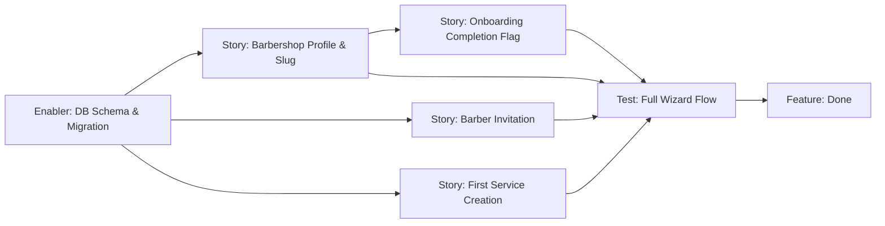

# Project Plan: Onboarding & Barbershop Setup

**Version:** 1.0
**Date:** April 26, 2026
**Status:** Draft
**Feature PRD:** [Onboarding & Barbershop Setup PRD](./prd.md)
**Implementation Plan:** [Implementation Plan](./implementation-plan.md)

---

## 1. Project Overview

### Feature Summary

Implement a backend that supports a 4-step guided onboarding wizard for new barbershop owners. The system exposes endpoints to configure barbershop profile settings (with slug uniqueness validation), invite barbers by email, create the first bookable service, and mark onboarding as complete. After completion, the `onboardingCompleted` flag allows the client to skip the wizard on subsequent app launches.

### Success Criteria

- `GET /api/barbershop` returns `onboardingCompleted`, `slug`, `description`, and `address` within 100 ms p95.
- `GET /api/barbershop/slug-check` responds in ≤100 ms p95 and is rate-limited to 60 req/IP/min.
- `PATCH /api/barbershop/settings` returns 409 on duplicate slug and 400 on `onboardingCompleted = false` attempt.
- `POST /api/barbers/invite` returns 409 on duplicate pending invitation.
- `POST /api/services` enforces `isDefault = true` and `isActive = true` on creation.
- All integration tests in `tests/modules/onboarding.test.ts` pass with 0 failures.
- `bun run lint:fix` and `bun run format` pass with no errors.

### Key Milestones

1. **Database Layer Ready** — `barbershop_settings` and `service` tables migrated.
2. **Barbershop Module Complete** — All three barbershop routes implemented and tested.
3. **Barbers Module Complete** — Invite endpoint implemented and tested.
4. **Services Module Complete** — Service creation endpoint implemented and tested.
5. **Full Wizard Integration Test Passing** — End-to-end test covering all 4 steps + completion.
6. **Lint & Format Clean** — All code passes `lint:fix` and `format`.

### Risk Assessment

| Risk | Likelihood | Impact | Mitigation |
|---|---|---|---|
| Better Auth `invitation` table schema incompatibility | Low | High | Inspect `src/modules/auth/schema.ts` before inserting directly; fall back to Better Auth API if schema differs |
| Slug uniqueness race condition on concurrent PATCHes | Low | Medium | Rely on DB-level unique constraint; catch `23505` PostgreSQL error code and re-throw as `AppError` |
| `onboardingCompleted` write-once logic bypassed | Low | High | Service layer reads current DB value before any update; idempotent guard is unit-tested |
| Rate limiter not applied per-route for slug-check | Medium | Medium | Verify `elysia-rate-limit` per-route override in handler after implementation; add test |

---

## 2. Work Item Hierarchy

```mermaid
graph TD
    A[Epic: Cukkr Barbershop Management] --> B[Feature: Onboarding & Barbershop Setup]

    B --> E1[Enabler: Database Schema & Migration]
    B --> S1[Story: Barbershop Profile & Slug Management]
    B --> S2[Story: Barber Invitation]
    B --> S3[Story: First Service Creation]
    B --> S4[Story: Onboarding Completion Flag]

    E1 --> T1[Task: barbershop_settings schema]
    E1 --> T2[Task: service schema]
    E1 --> T3[Task: Register in drizzle/schemas.ts]
    E1 --> T4[Task: Generate & apply migration]

    S1 --> T5[Task: barbershop model.ts]
    S1 --> T6[Task: BarbershopService - getSettings]
    S1 --> T7[Task: BarbershopService - checkSlugAvailability]
    S1 --> T8[Task: BarbershopService - updateSettings]
    S1 --> T9[Task: barbershop handler.ts - GET / + GET /slug-check + PATCH /settings]
    S1 --> T10[Task: Register barbershopHandler in app.ts]
    S1 --> TST1[Test: Slug check scenarios]
    S1 --> TST2[Test: PATCH settings scenarios]

    S2 --> T11[Task: barbers model.ts]
    S2 --> T12[Task: BarberService - inviteBarber]
    S2 --> T13[Task: barbers handler.ts - POST /invite]
    S2 --> T14[Task: Register barbersHandler in app.ts]
    S2 --> TST3[Test: Barber invite scenarios]

    S3 --> T15[Task: services model.ts]
    S3 --> T16[Task: ServiceService - createService]
    S3 --> T17[Task: services handler.ts - POST /]
    S3 --> T18[Task: Register servicesHandler in app.ts]
    S3 --> TST4[Test: Service creation scenarios]

    S4 --> TST5[Test: Full wizard flow end-to-end]
```



---

## 3. GitHub Issues Breakdown

### Epic Issue

```markdown
# Epic: Cukkr Barbershop Management

## Epic Description

Enable barbershop owners to fully set up and manage their barbershop profile,
staff, and service catalog through a guided onboarding wizard and subsequent
management endpoints.

## Business Value

- **Primary Goal**: Reduce time-to-first-booking for new barbershop owners.
- **Success Metrics**: 100% of new owners complete onboarding within 10 minutes; onboarding completion rate ≥ 80%.
- **User Impact**: Owners arrive in the app with a fully operational barbershop profile, at least one barber invited, and a bookable service ready.

## Epic Acceptance Criteria

- [ ] New owners can configure barbershop name, slug, description, and address.
- [ ] Owners can invite barbers by email during or after onboarding.
- [ ] Owners can create bookable services.
- [ ] `onboardingCompleted` flag prevents repeated wizard display.
- [ ] All endpoints enforce role and organization scoping.

## Features in this Epic

- [ ] #TBD - Onboarding & Barbershop Setup
- [ ] #TBD - Barbershop Settings Management (post-onboarding)

## Definition of Done

- [ ] All feature stories completed
- [ ] Integration tests passing (bun test)
- [ ] Lint and format checks passing
- [ ] No console.log or dead code present

## Labels

`epic`, `priority-high`, `value-high`

## Estimate

L (≈ 30–40 story points across all features)
```

---

### Feature Issue

```markdown
# Feature: Onboarding & Barbershop Setup

## Feature Description

A 4-step backend-supported wizard allowing new barbershop owners to configure
their profile, invite barbers, create a first service, and mark onboarding complete.
The wizard is skipped on subsequent launches when `onboardingCompleted = true`.

## User Stories in this Feature

- [ ] #TBD - Barbershop Profile & Slug Management
- [ ] #TBD - Barber Invitation
- [ ] #TBD - First Service Creation
- [ ] #TBD - Onboarding Completion Flag

## Technical Enablers

- [ ] #TBD - Database Schema & Migration (barbershop_settings + service)

## Dependencies

**Blocks**: Barbershop Settings Management (post-onboarding)
**Blocked by**: Authentication & Multi-Tenancy (Better Auth + Organizations plugin) — must be complete

## Acceptance Criteria

- [ ] GET /api/barbershop returns onboardingCompleted, slug, description, address.
- [ ] PATCH /api/barbershop/settings validates slug regex and enforces uniqueness.
- [ ] POST /api/barbers/invite creates pending invitations with 7-day expiry.
- [ ] POST /api/services forces isDefault=true, isActive=true.
- [ ] onboardingCompleted is write-once (only settable to true).
- [ ] All endpoints except slug-check require active organization.

## Definition of Done

- [ ] All user stories delivered
- [ ] Technical enablers completed
- [ ] tests/modules/onboarding.test.ts passing
- [ ] bun run lint:fix and bun run format clean
- [ ] No magic strings; AppError used throughout

## Labels

`feature`, `priority-high`, `value-high`, `backend`

## Epic

#TBD (Cukkr Barbershop Management epic)

## Estimate

M (≈ 21 story points)
```

---

### Enabler: Database Schema & Migration

```markdown
# Technical Enabler: Database Schema & Migration

## Enabler Description

Create and migrate the `barbershop_settings` and `service` tables.
Register both in `drizzle/schemas.ts` and generate the named migration
`onboarding-barbershop-setup`.

## Technical Requirements

- [ ] `barbershop_settings` table with id, organizationId (unique FK), description, address, onboardingCompleted, createdAt, updatedAt.
- [ ] `service` table with id, organizationId (FK), name, description, price, duration, discount, isActive, isDefault, createdAt, updatedAt.
- [ ] Indexes: unique on `barbershop_settings.organizationId`; index on `service.organizationId`; composite index on `(service.organizationId, service.isDefault)`.
- [ ] Both schemas exported from `drizzle/schemas.ts`.

## Implementation Tasks

- [ ] #TBD - Create src/modules/barbershop/schema.ts
- [ ] #TBD - Create src/modules/services/schema.ts
- [ ] #TBD - Register in drizzle/schemas.ts
- [ ] #TBD - Generate migration: bunx drizzle-kit generate --name onboarding-barbershop-setup
- [ ] #TBD - Apply migration: bunx drizzle-kit migrate

## User Stories Enabled

This enabler supports all stories in the Onboarding & Barbershop Setup feature.

## Acceptance Criteria

- [ ] `bunx drizzle-kit check` reports no pending migration conflicts.
- [ ] Both tables exist in the target database after migrate.
- [ ] Unique constraint on `barbershop_settings.organizationId` enforced at DB level.
- [ ] Unique constraint on `organization.slug` confirmed present.

## Definition of Done

- [ ] Migration files generated and committed.
- [ ] Migration applied successfully to dev database.
- [ ] Schemas exported and importable from drizzle/schemas.ts.
- [ ] Code review approved.

## Labels

`enabler`, `priority-critical`, `backend`, `database`

## Feature

#TBD (Onboarding & Barbershop Setup feature)

## Estimate

3 story points
```

---

### Story 1: Barbershop Profile & Slug Management

```markdown
# User Story: Barbershop Profile & Slug Management

## Story Statement

As a **barbershop owner**, I want **to configure my barbershop's name, slug,
description, and address, and check slug availability in real time** so that
**my barbershop has a unique identity and customers can find me**.

## Acceptance Criteria

- [ ] GET /api/barbershop returns { id, name, slug, description, address, onboardingCompleted } for the active org.
- [ ] GET /api/barbershop/slug-check?slug=<value> returns { available: true/false } without exposing org metadata.
- [ ] Slug-check returns 400 for slugs failing regex ^[a-z0-9]([a-z0-9-]*[a-z0-9])?$ or outside 3–60 chars.
- [ ] PATCH /api/barbershop/settings updates name, description, address, slug (all optional).
- [ ] PATCH returns 409 when the new slug is already owned by another organization.
- [ ] PATCH returns 400 for invalid slug format.
- [ ] PATCH returns 403 for non-owner callers.
- [ ] PATCH returns 401 when unauthenticated.
- [ ] Slug-check is rate-limited to 60 req/IP/min.
- [ ] barbershop_settings row is lazily created on first GET if not present.

## Technical Tasks

- [ ] #TBD - Create src/modules/barbershop/model.ts
- [ ] #TBD - Implement BarbershopService (getSettings, checkSlugAvailability, updateSettings)
- [ ] #TBD - Create src/modules/barbershop/handler.ts
- [ ] #TBD - Register barbershopHandler in src/app.ts

## Testing Requirements

- [ ] #TBD - Test: Slug check availability (free, taken, invalid format, hyphen prefix, too short)
- [ ] #TBD - Test: PATCH settings (valid, slug conflict 409, invalid format 400, no auth 401, no org 403)

## Dependencies

**Blocked by**: Enabler — Database Schema & Migration

## Definition of Done

- [ ] Acceptance criteria met
- [ ] Code review approved
- [ ] Integration tests passing

## Labels

`user-story`, `priority-high`, `backend`, `barbershop`

## Feature

#TBD

## Estimate

5 story points
```

---

### Story 2: Barber Invitation

```markdown
# User Story: Barber Invitation

## Story Statement

As a **barbershop owner**, I want **to invite barbers by email** so that
**my team can access the platform and serve customers**.

## Acceptance Criteria

- [ ] POST /api/barbers/invite creates a pending invitation with role=barber and expiresAt = now + 7 days.
- [ ] Returns 201 with { id, email, role, status, expiresAt }.
- [ ] Returns 409 when a pending invitation for the same org+email already exists.
- [ ] Returns 400 for invalid email format.
- [ ] Returns 403 for non-owner callers.
- [ ] Returns 401 when unauthenticated.
- [ ] Notification failure does not block the HTTP response.

## Technical Tasks

- [ ] #TBD - Create src/modules/barbers/model.ts
- [ ] #TBD - Implement BarberService.inviteBarber
- [ ] #TBD - Create src/modules/barbers/handler.ts
- [ ] #TBD - Register barbersHandler in src/app.ts

## Testing Requirements

- [ ] #TBD - Test: Invite valid email (201), duplicate email (409), invalid email (400), no auth (401), no org (403)

## Dependencies

**Blocked by**: Enabler — Database Schema & Migration (needs invitation table from auth schema)

## Definition of Done

- [ ] Acceptance criteria met
- [ ] Code review approved
- [ ] Integration tests passing

## Labels

`user-story`, `priority-high`, `backend`, `barbers`

## Feature

#TBD

## Estimate

3 story points
```

---

### Story 3: First Service Creation

```markdown
# User Story: First Service Creation

## Story Statement

As a **barbershop owner**, I want **to create my first bookable service during
onboarding** so that **customers can immediately book an appointment**.

## Acceptance Criteria

- [ ] POST /api/services creates a service with isDefault=true and isActive=true (forced, regardless of body).
- [ ] Returns 201 with full service record including isDefault and isActive.
- [ ] price must be an integer > 0; returns 400 if price ≤ 0.
- [ ] duration must be an integer ≥ 5; returns 400 if duration < 5.
- [ ] discount must be integer 0–100; returns 400 if outside range.
- [ ] name is required (2–100 chars); returns 400 if missing or invalid.
- [ ] description is optional (max 500 chars).
- [ ] Returns 403 for non-owner callers.
- [ ] Returns 401 when unauthenticated.

## Technical Tasks

- [ ] #TBD - Create src/modules/services/model.ts
- [ ] #TBD - Implement ServiceService.createService
- [ ] #TBD - Create src/modules/services/handler.ts
- [ ] #TBD - Register servicesHandler in src/app.ts

## Testing Requirements

- [ ] #TBD - Test: Valid creation (201, isDefault=true), price=0 (400), price=-1 (400), duration=4 (400), discount=101 (400), missing name (400), no auth (401)

## Dependencies

**Blocked by**: Enabler — Database Schema & Migration (service table)

## Definition of Done

- [ ] Acceptance criteria met
- [ ] Code review approved
- [ ] Integration tests passing

## Labels

`user-story`, `priority-high`, `backend`, `services`

## Feature

#TBD

## Estimate

3 story points
```

---

### Story 4: Onboarding Completion Flag

```markdown
# User Story: Onboarding Completion Flag

## Story Statement

As a **barbershop owner**, I want **the app to know I have completed onboarding**
so that **I am not shown the wizard again on subsequent app launches**.

## Acceptance Criteria

- [ ] PATCH /api/barbershop/settings with { onboardingCompleted: true } sets the flag in barbershop_settings.
- [ ] Subsequent GET /api/barbershop returns onboardingCompleted: true.
- [ ] PATCH with { onboardingCompleted: false } returns 400 (write-once enforcement).
- [ ] Once true, further PATCHes with onboardingCompleted: true are idempotent (200, no error).
- [ ] Client cannot directly set onboardingCompleted to false via any endpoint.

## Technical Tasks

Covered by the updateSettings task in Story 1 (shared handler and service).

## Testing Requirements

- [ ] #TBD - Test: Set onboardingCompleted=true (200), attempt false (400), idempotent true (200), full wizard flow end-to-end

## Dependencies

**Blocked by**: Story 1 — Barbershop Profile & Slug Management

## Definition of Done

- [ ] Acceptance criteria met
- [ ] Code review approved
- [ ] Integration tests passing (including full wizard flow)

## Labels

`user-story`, `priority-high`, `backend`, `barbershop`

## Feature

#TBD

## Estimate

2 story points
```

---

## 4. Priority and Value Matrix

| Issue | Type | Priority | Value | Labels |
|---|---|---|---|---|
| Database Schema & Migration | Enabler | P0 | High | `priority-critical`, `value-high`, `database` |
| Barbershop Profile & Slug Management | Story | P1 | High | `priority-high`, `value-high`, `backend` |
| Barber Invitation | Story | P1 | High | `priority-high`, `value-high`, `backend` |
| First Service Creation | Story | P1 | High | `priority-high`, `value-high`, `backend` |
| Onboarding Completion Flag | Story | P1 | High | `priority-high`, `value-high`, `backend` |
| Integration Test Suite (onboarding.test.ts) | Test | P1 | High | `priority-high`, `value-high`, `testing` |
| Lint & Format Pass | Task | P2 | Medium | `priority-medium`, `value-medium`, `chore` |

---

## 5. Estimation Summary

| Work Item | Type | Estimate |
|---|---|---|
| Database Schema & Migration | Enabler | 3 pts |
| Barbershop Profile & Slug Management | Story | 5 pts |
| Barber Invitation | Story | 3 pts |
| First Service Creation | Story | 3 pts |
| Onboarding Completion Flag | Story | 2 pts |
| Integration Test Suite | Test | 5 pts |
| **Total** | | **21 pts (M)** |

---

## 6. Dependency Map



| Dependency | Type | Notes |
|---|---|---|
| Auth & Org plugin (Better Auth) | Prerequisite | Must be running; `invitation` and `organization` tables must exist |
| DB Schema & Migration | Blocks S1, S2, S3 | All three service modules depend on new tables |
| Story 1 (updateSettings) | Blocks Story 4 | Write-once flag logic lives in BarbershopService |
| Stories 1–4 | Blocks full wizard test | End-to-end test requires all endpoints operational |

---

## 7. Sprint Planning

### Sprint Goal

**Primary Objective**: Deliver all backend endpoints required for the 4-step onboarding wizard, fully tested and lint-clean.

### Recommended Sprint Breakdown (2-week sprint)

**Week 1 — Foundation & Core Modules**

| Issue | Points |
|---|---|
| Enabler: DB Schema & Migration | 3 |
| Story 1: Barbershop Profile & Slug Management | 5 |
| Story 2: Barber Invitation | 3 |
| **Sub-total** | **11** |

**Week 2 — Services, Completion & Testing**

| Issue | Points |
|---|---|
| Story 3: First Service Creation | 3 |
| Story 4: Onboarding Completion Flag | 2 |
| Integration Test Suite | 5 |
| Lint & Format Pass | — |
| **Sub-total** | **10** |

**Total Sprint Commitment**: 21 story points

---

## 8. GitHub Project Board Configuration

### Column Structure

| Column | Purpose |
|---|---|
| **Backlog** | All issues created, awaiting prioritization |
| **Sprint Ready** | Detailed, estimated, and scheduled for current sprint |
| **In Progress** | Actively being developed (WIP limit: 2 per developer) |
| **In Review** | PR open, awaiting code review |
| **Testing** | Integration tests being written or validated |
| **Done** | Merged, tests passing, lint clean |

### Custom Fields

| Field | Values |
|---|---|
| Priority | P0, P1, P2, P3 |
| Value | High, Medium, Low |
| Component | Schema, Service, Handler, Test, Infra |
| Estimate | 1, 2, 3, 5, 8 (story points) |
| Sprint | Sprint 1, Sprint 2, ... |
| Epic | Cukkr Barbershop Management |

---

## 9. Definition of Done (Feature Level)

- [ ] All 4 user stories and 1 enabler marked Done.
- [ ] `tests/modules/onboarding.test.ts` — all scenarios pass with `bun test`.
- [ ] `bun run lint:fix` exits with code 0.
- [ ] `bun run format` exits with code 0.
- [ ] No `console.log`, commented-out code, or `any` types in committed files.
- [ ] `AppError` used for all error cases; no `new Error(...)` usage.
- [ ] All new endpoints registered in `src/app.ts`.
- [ ] `drizzle/schemas.ts` exports updated with new table schemas.
- [ ] Migration files committed to repository.
