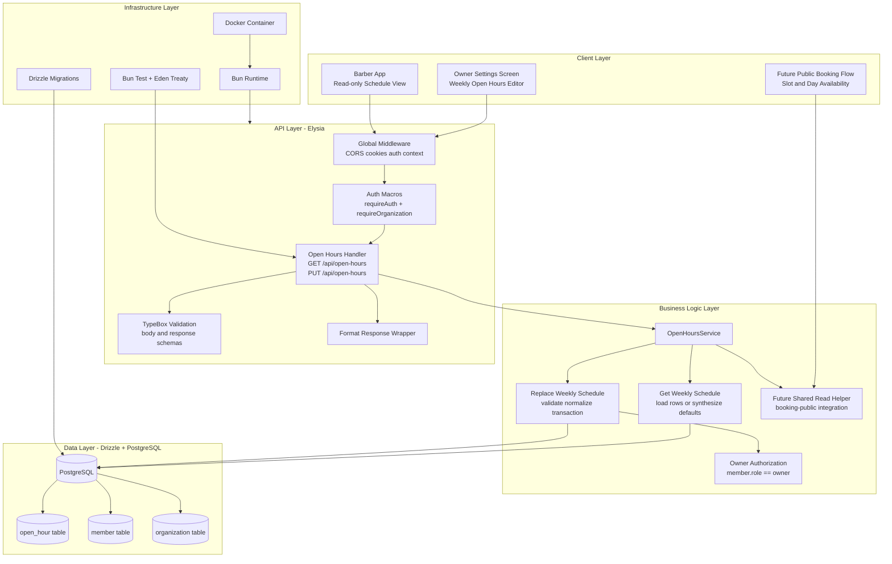
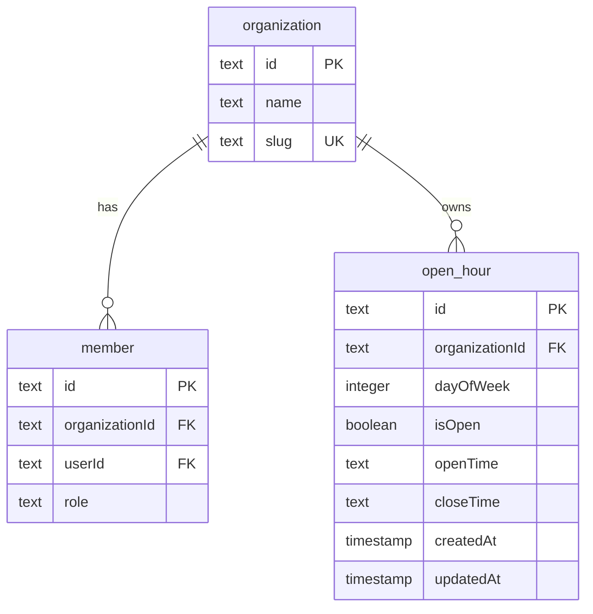

# Implementation Plan: Open Hours Configuration

**Version:** 1.0  
**Date:** April 26, 2026  
**Status:** Draft  
**Feature PRD:** [prd.md](./prd.md)

---

## Goal

Implement an organization-scoped open-hours module that lets barbershop teams retrieve and manage a full weekly operating schedule. The backend must expose a read endpoint for authenticated organization members and a write endpoint restricted to organization owners, with strict tenant isolation and transactional weekly replacement semantics. The schedule data must be reliable enough to become the source of truth for future public booking slot generation without embedding booking logic into this feature. The result should stay consistent with the repo's existing Elysia, Better Auth, and Drizzle patterns while remaining simple to reason about and cheap to query.

---

## Requirements

- Create a new `open-hours` module under `src/modules/open-hours/` with `handler.ts`, `model.ts`, `schema.ts`, and `service.ts`.
- Register the new schema in `drizzle/schemas.ts` and add a migration for the new table and indexes.
- Expose `GET /api/open-hours` for authenticated organization members. Require both `requireAuth: true` and `requireOrganization: true` so unauthenticated calls fail as `401` instead of falling through to organization-only checks.
- Expose `PUT /api/open-hours` for authenticated organization owners only. The request body must contain exactly 7 day entries representing the full weekly schedule.
- Store schedule rows in a new `open_hour` table keyed by `organizationId` and `dayOfWeek`, with a unique composite index to prevent duplicate rows for the same day in the same tenant.
- Use `dayOfWeek` as an integer `0-6` to align with the PRD and keep sorting, validation, and querying straightforward.
- When `isOpen = true`, require both `openTime` and `closeTime` in `HH:MM` format and reject `closeTime <= openTime`.
- When `isOpen = false`, normalize `openTime` and `closeTime` to `null` before persistence. This satisfies AC-11 without punishing harmless client over-posting.
- Treat missing database rows as an unconfigured schedule. `GET /api/open-hours` must synthesize 7 closed days without writing to the database.
- Make `PUT /api/open-hours` atomic by wrapping delete-and-reinsert or upsert behavior in a single Drizzle transaction.
- Enforce owner-only writes by checking the caller's `member.role` in the active organization, following the same pattern already used in the `barbers` module.
- Keep all queries tenant-scoped via `activeOrganizationId`. No endpoint may accept an organization ID from the client.
- Keep the open-hours service reusable for future booking workflows by exposing a read method that returns a normalized weekly schedule for a given organization.
- Add integration tests in `tests/modules/open-hours.test.ts` covering auth, role enforcement, default closed state, successful weekly save, invalid payloads, atomic rollback, and tenant isolation.

### Module Deliverables

| File | Responsibility |
|---|---|
| `src/modules/open-hours/schema.ts` | Drizzle table definition, indexes, and inferred types |
| `src/modules/open-hours/model.ts` | TypeBox schemas for request and response payloads |
| `src/modules/open-hours/service.ts` | Business rules, transaction handling, normalization, and role checks |
| `src/modules/open-hours/handler.ts` | Elysia route group, auth macros, DTO binding, and HTTP surface |
| `drizzle/schemas.ts` | Re-export the open-hours schema for database tooling |
| `tests/modules/open-hours.test.ts` | End-to-end coverage using Eden Treaty |
| `drizzle/*.sql` | Migration for the new table and indexes |

### Implementation Notes

- Reuse the repo's `formatResponse` envelope so the new module matches existing API responses.
- Throw `AppError` for all business-rule failures such as forbidden writes, invalid time ordering, duplicate day payloads, and missing weekly entries.
- Keep framework-level shape validation in `model.ts`, then perform cross-field validation in `service.ts` where day uniqueness, full-week coverage, and time ordering can be validated coherently.
- If strict `400 Bad Request` is required for TypeBox validation failures, add a local or shared validation-error mapper because Elysia's default schema failures commonly surface as `422`. Without that mapping, AC-4, AC-5, and AC-6 may fail on status-code expectations even if the validation logic is correct.
- Do not persist synthetic default rows on read. The write path remains the first moment actual schedule records are created.

---

## Feature Gap Analysis

| PRD Capability | Existing Support | Status | Implementation Direction |
|---|---|---|---|
| Organization-scoped auth context | Better Auth session + `authMiddleware` macros | Reuse | Require auth and active organization on both endpoints |
| Owner role enforcement | `BarberService.inviteBarber` checks `member.role` | Reuse pattern | Apply the same check for `PUT /api/open-hours` |
| Weekly tenant-owned settings table | No existing schedule table | Build | Add new `open_hour` table keyed by org and day |
| Whole-week atomic replacement | No existing weekly config module | Build | Validate all 7 entries, then replace inside one transaction |
| Default all-closed schedule | Not present | Build | Synthesize 7 closed entries when no rows exist |
| Booking slot integration | Booking public module not yet implemented here | Prepare | Expose reusable read helper for future slot filtering |
| Short-lived caching | No feature-local cache layer today | Optional | Ship uncached initially; reserve a small read-through cache if profiling proves necessary |

---

## Technical Considerations

### System Architecture Overview



### Technology Stack Selection

| Layer | Technology | Rationale |
|---|---|---|
| API | Elysia | Matches the existing handler and macro structure already used by `barbershop` and `services` |
| Validation | TypeBox via Elysia | Keeps request and response schemas co-located with the module and compatible with Eden Treaty |
| Business Logic | Module-local service class or static service | Keeps handlers thin and centralizes cross-field validation and role checks |
| Persistence | Drizzle ORM + PostgreSQL | Type-safe queries and transaction support already standardized in this repo |
| Auth and Tenant Context | Better Auth + `authMiddleware` | Reuses session-derived `activeOrganizationId` without new auth plumbing |
| Testing | Bun test + Eden Treaty | Current end-to-end test pattern already covers authenticated feature modules |
| Deployment | Bun in Docker | No feature-specific runtime divergence is needed |

### Integration Points

- `src/app.ts`: register the new `open-hours` handler under the `/api` namespace.
- `src/middleware/auth-middleware.ts`: reuse `requireAuth` and `requireOrganization` macros. The open-hours handler should explicitly use both to satisfy unauthenticated access rules.
- `src/modules/auth/schema.ts`: reuse `organization` for tenancy and `member` for owner-role checks.
- Future booking module: consume a shared `OpenHoursService.getWeeklyScheduleForOrganization(organizationId)` helper rather than querying `open_hour` directly from booking code.
- Existing frontend clients: consume the weekly array in sorted day order so a stable Monday-Sunday or Sunday-Saturday layout can be rendered without extra sorting logic on the client.

### Deployment Architecture

- No new service, queue, or worker is required.
- Ship the feature inside the existing Bun application container.
- Rollout order should remain migration first, then application deployment.
- Because reads can synthesize defaults when the table is empty, deployment is backward-safe for organizations that have not configured open hours yet.

### Scalability Considerations

- The steady-state read path is a 7-row tenant-scoped query, so PostgreSQL alone is sufficient for MVP and comfortably supports the PRD's response target.
- Keep the table small and queries predictable with a composite unique key on `(organizationId, dayOfWeek)` and a read index that starts with `organizationId`.
- Avoid premature caching. If production profiling later shows heavy repeat reads from booking traffic, add a simple 60-second read-through cache keyed by `organizationId`, invalidated immediately on successful `PUT`.
- Use a single transaction for weekly replacement so concurrent owner updates cannot leave a half-written schedule.

---

## Database Schema Design

### Entity Relationship Diagram



### Table Specifications

**Table:** `open_hour`

| Column | Type | Constraints | Notes |
|---|---|---|---|
| `id` | `text` | Primary key | Use `nanoid()` to match existing text-key tables |
| `organizationId` | `text` | Not null, FK -> `organization.id`, indexed | Tenant scoping key |
| `dayOfWeek` | `integer` | Not null | Values `0-6`; app validation enforces range |
| `isOpen` | `boolean` | Not null, default `false` | Day-level open or closed flag |
| `openTime` | `text` | Nullable | Store `HH:MM`; null for closed days |
| `closeTime` | `text` | Nullable | Store `HH:MM`; null for closed days |
| `createdAt` | `timestamp` | Not null, default now | Audit field |
| `updatedAt` | `timestamp` | Not null, default now, auto-update | Audit field |

### Constraints and Business Safeguards

- Add a foreign key from `open_hour.organizationId` to `organization.id` with `onDelete: 'cascade'`.
- Add a unique composite index or unique constraint on `(organizationId, dayOfWeek)` so an organization cannot have duplicate rows for the same day.
- Optionally add a DB-level `CHECK` on `dayOfWeek BETWEEN 0 AND 6` as defense in depth.
- Keep `openTime` and `closeTime` as nullable text rather than SQL `time` to stay aligned with the current repo's simple schema style and to make response mapping trivial. Application validation still enforces strict `HH:MM` format.
- Do not rely only on the database for `closeTime > openTime`; keep that validation in service logic where the comparison is explicit and testable.

### Indexing Strategy

| Index | Type | Rationale |
|---|---|---|
| `(organizationId, dayOfWeek)` | Unique b-tree | Prevent duplicate per-day rows and support ordered weekly reads |
| `(organizationId)` | B-tree | Speeds the common tenant-scoped fetch path |

### Database Migration Strategy

1. Add `src/modules/open-hours/schema.ts` with the new `open_hour` definition and indexes.
2. Re-export the schema from `drizzle/schemas.ts`.
3. Generate the migration with `bunx drizzle-kit generate --name add-open-hours-table`.
4. Review the generated SQL to confirm the foreign key, unique constraint, and indexes are present.
5. Apply the migration with `bunx drizzle-kit migrate`.

---

## API Design

### Route Registration and Ownership

- All routes live under `/api/open-hours`.
- Both routes require authenticated session context and active organization context.
- `GET` is available to any member of the active organization.
- `PUT` is restricted to `member.role = 'owner'` within the active organization.

### DTO Shapes

```typescript
type OpenHoursDay = {
    dayOfWeek: number
    isOpen: boolean
    openTime: string | null
    closeTime: string | null
}

type UpdateOpenHoursBody = {
    days: OpenHoursDay[]
}
```

### Endpoint Specifications

**`GET /api/open-hours`**

- **Auth:** `requireAuth: true`, `requireOrganization: true`
- **Purpose:** Return the active organization's full weekly schedule in deterministic day order.
- **Behavior:**
  - Load rows for the active organization ordered by `dayOfWeek`.
  - If no rows exist, return 7 synthesized entries, all closed, with `openTime` and `closeTime` as `null`.
  - If some but not all rows exist because of legacy or manual data drift, treat the dataset as corrupt and either synthesize missing closed days after logging or fail loudly with `500`. The safer implementation is to fill missing days in memory while keeping the write path responsible for restoring consistency.
- **Response `200`:**

```typescript
{
    data: OpenHoursDay[]
}
```

**`PUT /api/open-hours`**

- **Auth:** `requireAuth: true`, `requireOrganization: true`
- **Role:** Owner only, enforced in `service.ts` via the `member` table
- **Purpose:** Replace the full weekly schedule atomically.
- **Request validation:**
  - Require exactly 7 entries.
  - Require unique `dayOfWeek` values covering all integers `0-6`.
  - For open days, require both times and validate `closeTime > openTime`.
  - For closed days, normalize both times to `null`.
- **Write strategy:**
  - Start a transaction.
  - Validate the caller's owner role.
  - Delete existing rows for the organization and insert the normalized 7-row payload, or perform deterministic upserts for all 7 rows.
  - Commit only if all 7 rows pass validation and persistence.
- **Response `200`:** return the normalized weekly schedule.

### Multi-Tenant Scoping Strategy

- The handler must never accept `organizationId` from params, query, or body.
- All reads and writes are keyed exclusively from `activeOrganizationId` derived from the session.
- Owner-role checks must include both `userId` and `activeOrganizationId` so a user who owns one organization cannot write another organization's schedule.

### Error Handling Strategy and Status Codes

| Scenario | Status | Source |
|---|---|---|
| Missing or invalid session | `401` | `requireAuth` macro |
| Authenticated but no active organization | `403` | `requireOrganization` macro |
| Authenticated non-owner attempts `PUT` | `403` | `AppError('Forbidden', 'FORBIDDEN')` |
| Bad semantic payload such as duplicate days or invalid time ordering | `400` | `AppError('BAD_REQUEST')` |
| Organization data drift or unexpected persistence failure | `500` | Unhandled internal error path |

### Validation and Status-Code Decision

- TypeBox should validate shape-level requirements such as field presence, array item types, booleans, integers, and nullable strings.
- Service-level validation should enforce weekly completeness, day uniqueness, and cross-field time rules.
- If the team needs literal `400` for malformed bodies instead of Elysia's default validation response, add a response-mapping layer for schema validation errors in this feature or globally.

### Rate Limiting and Caching Strategy

- No route-specific rate limiting is required for authenticated internal endpoints.
- `GET /api/open-hours` should ship without caching initially because the query cost is minimal.
- If booking traffic later reuses the same read helper heavily, add a small per-organization cache with a 60-second TTL and invalidate it on `PUT`.

---

## Security and Performance

### Authentication and Authorization

- Require authenticated session context for both endpoints.
- Require active organization context for both endpoints.
- Enforce owner-only mutation rights using `member.role` lookup in the active organization.
- Keep all authorization checks server-side; do not trust client-submitted role hints.

### Data Validation and Sanitization

- Validate times against a strict `HH:MM` 24-hour regex before business-rule comparison.
- Normalize closed days to `openTime = null` and `closeTime = null` before persistence.
- Reject duplicate day entries and incomplete week payloads before any database writes occur.
- Optionally trim string inputs for times if the handler accepts raw user-entered values; otherwise reject whitespace-padded values to keep the API strict.

### Performance Optimization

- Fetch schedules with a single tenant-scoped query ordered by `dayOfWeek`.
- Replace the weekly schedule in one transaction to avoid repeated round-trips and inconsistent intermediate states.
- Keep the response payload fixed at 7 rows, which makes latency predictable and small.
- Avoid joins on the read path unless owner-role verification is needed for `PUT`.

### Atomicity and Idempotency

- Use a single transaction for each `PUT` request.
- Validate the full payload before mutating rows whenever possible.
- A repeated identical `PUT` must produce the same persisted state and the same normalized response.
- If any row fails validation or insertion, roll back the full transaction so no partial weekly schedule is visible.

### Testing Strategy

- Add `tests/modules/open-hours.test.ts` using the same authenticated-org setup pattern already used in `tests/modules/barbershop-settings.test.ts`.
- Cover owner read and write success paths.
- Cover barber read success and barber write rejection.
- Cover unauthenticated `GET` and `PUT` expectations.
- Cover default all-closed reads when no rows exist.
- Cover partial payload rejection, duplicate day rejection, open day missing times rejection, invalid time ordering rejection, and closed-day normalization.
- Cover tenant isolation with two organizations holding different schedules.
- Cover atomic rollback by attempting a payload where one entry fails validation and asserting no rows changed after the failed `PUT`.

---

## Recommended Implementation Sequence

1. Add the new `open_hour` schema and export it from `drizzle/schemas.ts`.
2. Generate and review the migration.
3. Implement `model.ts` for day DTOs, weekly request body, and response schema.
4. Implement `service.ts` with read synthesis, owner-role validation, normalization, and transaction-backed weekly replacement.
5. Implement `handler.ts` with `GET` and `PUT` routes, auth macros, and response envelopes.
6. Register the new handler in `src/app.ts`.
7. Add `tests/modules/open-hours.test.ts` and cover the acceptance criteria.
8. Run `bun test`, `bun run lint:fix`, and `bun run format` after implementation.