# Project Plan: Open Hours Configuration

**Version:** 1.0
**Date:** April 26, 2026
**Status:** Draft
**Feature PRD:** [prd.md](./prd.md)
**Implementation Plan:** [implementation-plan.md](./implementation-plan.md)
**Parent Epic:** [Cukkr — Barbershop Management & Booking System](../epic.md)

---

## 1. Project Overview

### Feature Summary

The Open Hours Configuration feature gives each organization a single weekly operating schedule that can be read by all authenticated members and updated only by owners. The backend exposes `GET /api/open-hours` to return a normalized 7-day schedule and `PUT /api/open-hours` to replace the full week atomically. The implementation introduces a tenant-owned `open_hour` table, owner-only write authorization, strict weekly validation, and a reusable service method that future booking flows can call to filter appointment availability.

### Success Criteria

| Criterion | Measurement |
|---|---|
| Weekly schedule always returns 7 entries | `GET /api/open-hours` returns 7 sorted days in all cases |
| Owner-only writes enforced | Non-owner `PUT` returns `403` |
| Invalid weekly payloads rejected without partial writes | Validation and rollback tests pass |
| No cross-tenant data leakage | Tenant isolation tests pass |
| Open-hours read path remains lightweight | p95 read response target `<= 200 ms` |
| Quality gate complete | `bun test open-hours`, `bun run lint:fix`, and `bun run format` exit 0 |

### Key Milestones

1. **M1 — Persistence Ready**: `open_hour` schema defined, migration generated, and schema export wired.
2. **M2 — API Surface Complete**: GET and PUT handlers implemented with auth macros and response envelopes.
3. **M3 — Business Rules Complete**: Weekly validation, owner-role enforcement, transactional replacement, and normalization implemented.
4. **M4 — Quality Gate**: Integration tests green, lint/format clean, ready for review.

### Risk Assessment

| Risk | Likelihood | Impact | Mitigation |
|---|---|---|---|
| Elysia body validation returns `422` instead of required `400` for malformed weekly payloads | Medium | Medium | Add a local or shared validation-error mapper early and test status codes explicitly |
| Partial or corrupt legacy data exists in `open_hour` | Low | Medium | Service synthesizes missing closed days on read and keeps write path responsible for restoring consistency |
| Owner-role check diverges from existing member-role conventions | Low | High | Reuse the same organization member lookup pattern already used by the barbers module |
| Future booking module needs reusable schedule reads | Medium | Medium | Expose a normalized service helper instead of embedding access only in the handler |

---

## 2. Work Item Hierarchy

```mermaid
graph TD
    A["Epic: Cukkr — Barbershop Management & Booking System"] --> B["Feature: Open Hours Configuration"]

    B --> E1["Enabler 1: open_hour Schema & Migration"]
    B --> E2["Enabler 2: DTOs & Validation Mapping"]

    B --> S1["Story 1: Read Weekly Open Hours"]
    B --> S2["Story 2: Replace Weekly Schedule as Owner"]
    B --> S3["Story 3: Preserve Consistency for Booking Reuse"]

    E1 --> T01["Task: Define open_hour Drizzle schema"]
    E1 --> T02["Task: Generate and verify migration"]
    E1 --> T03["Task: Export schema in drizzle/schemas.ts"]

    E2 --> T04["Task: Define weekly request and response DTOs"]
    E2 --> T05["Task: Add validation-error mapping for 400 semantics"]

    S1 --> T06["Task: Implement GET /api/open-hours in handler.ts"]
    S1 --> T07["Task: Implement getWeeklySchedule() in service.ts"]
    S1 --> T08["Task: Register openHoursHandler in src/app.ts"]

    S2 --> T09["Task: Implement PUT /api/open-hours in handler.ts"]
    S2 --> T10["Task: Implement replaceWeeklySchedule() transaction"]
    S2 --> T11["Task: Implement owner-role authorization check"]

    S3 --> T12["Task: Expose reusable getWeeklyScheduleForOrganization() helper"]
    S3 --> T13["Task: Fill missing days in memory without persisting defaults"]

    B --> T14["Task: Add open-hours integration tests"]
    B --> T15["Task: Run lint, format, and targeted tests"]
```



---

## 3. GitHub Issues Breakdown

### Epic Issue

```markdown
# Epic: Cukkr — Barbershop Management & Booking System

## Epic Description

Multi-tenant barbershop management platform covering authentication, onboarding, settings,
services, schedules, bookings, and future customer-facing booking flows.

## Business Value

- **Primary Goal**: Give barbershops a reliable operational backend for managing daily work.
- **Success Metrics**: No cross-tenant data leakage, booking inputs constrained by valid business rules, and feature-level quality gates passing.
- **User Impact**: Owners and barbers manage shop configuration and schedules consistently; customers only see valid booking availability.

## Epic Acceptance Criteria

- [ ] Core organization settings and operating schedule are configurable
- [ ] Service catalog and booking workflows are tenant-safe and test-covered
- [ ] Authenticated staff can manage daily operations with predictable API contracts

## Features in this Epic

- [ ] #TBD - Authentication & User Management
- [ ] #TBD - Onboarding
- [ ] #TBD - Barbershop Settings
- [ ] #TBD - Service Management
- [ ] #TBD - Open Hours Configuration
- [ ] #TBD - Booking & Schedule Management

## Definition of Done

- [ ] All feature stories completed
- [ ] Integration tests passing
- [ ] Lint and format checks passing
- [ ] Performance targets met for shipped endpoints
- [ ] Documentation updated

## Labels

`epic`, `priority-high`, `value-high`

## Estimate

XL
```

### Feature Issue

```markdown
# Feature: Open Hours Configuration

## Feature Description

Deliver an organization-scoped weekly operating schedule with read access for authenticated
members and owner-only write access. The feature stores one row per day, returns synthesized
closed defaults when unconfigured, and replaces the full week atomically.

## User Stories in this Feature

- [ ] #TBD - Story: Read Weekly Open Hours
- [ ] #TBD - Story: Replace Weekly Schedule as Owner
- [ ] #TBD - Story: Preserve Consistency for Booking Reuse

## Technical Enablers

- [ ] #TBD - Enabler: open_hour Schema & Migration
- [ ] #TBD - Enabler: DTOs & Validation Mapping

## Dependencies

**Blocks**: Appointment-slot generation and appointment validation in Booking & Schedule Management
**Blocked by**: Authentication and organization-context features must already provide `requireAuth`, `requireOrganization`, and member-role context.

## Acceptance Criteria

- [ ] `GET /api/open-hours` returns a stable 7-day schedule for the active organization
- [ ] `PUT /api/open-hours` accepts only valid full-week payloads and replaces the schedule atomically
- [ ] Non-owner writes fail with `403`
- [ ] Invalid weekly payloads fail without changing stored rows
- [ ] Open-hours service exposes a reusable normalized weekly read helper for downstream booking work

## Definition of Done

- [ ] All user stories delivered
- [ ] Technical enablers completed
- [ ] Integration tests passing
- [ ] `bun run lint:fix` and `bun run format` clean
- [ ] No tenant leakage or partial-write regressions

## Labels

`feature`, `priority-high`, `value-high`, `backend`

## Epic

#TBD (Cukkr — Barbershop Management & Booking System)

## Estimate

M (13 story points total)
```

### Technical Enablers

#### Enabler 1 — open_hour Schema & Migration

```markdown
# Technical Enabler: open_hour Schema & Migration

## Enabler Description

Add the tenant-owned `open_hour` table with one row per organization per day of week, plus the
required unique constraint and read index. Export the schema for Drizzle tooling and generate the
matching migration.

## Technical Requirements

- [ ] Add `src/modules/open-hours/schema.ts` with `id`, `organizationId`, `dayOfWeek`, `isOpen`, `openTime`, `closeTime`, `createdAt`, and `updatedAt`
- [ ] Add FK to `organization.id` with tenant ownership semantics
- [ ] Add unique constraint or index on `(organizationId, dayOfWeek)`
- [ ] Add organization-scoped read index
- [ ] Export the schema from `drizzle/schemas.ts`
- [ ] Generate and review the migration SQL

## Implementation Tasks

- [ ] #TBD - Define `open_hour` Drizzle schema
- [ ] #TBD - Generate and verify migration
- [ ] #TBD - Export schema in `drizzle/schemas.ts`

## User Stories Enabled

- #TBD - Story: Read Weekly Open Hours
- #TBD - Story: Replace Weekly Schedule as Owner

## Acceptance Criteria

- [ ] Migration applies cleanly on a fresh database
- [ ] Duplicate `(organizationId, dayOfWeek)` rows are prevented at the DB layer
- [ ] Schema export is visible to Drizzle tooling

## Definition of Done

- [ ] Schema and migration committed
- [ ] TypeScript compiles without schema errors
- [ ] Code review approved

## Labels

`enabler`, `priority-high`, `backend`, `database`

## Feature

#TBD (Feature: Open Hours Configuration)

## Estimate

3 points
```

#### Enabler 2 — DTOs & Validation Mapping

```markdown
# Technical Enabler: DTOs & Validation Mapping

## Enabler Description

Define the TypeBox request and response contracts for the weekly schedule and ensure malformed
payloads can be surfaced as `400` when the feature needs stricter validation semantics than the
framework default.

## Technical Requirements

- [ ] Add `OpenHoursDay`, `OpenHoursWeekResponse`, and `UpdateOpenHoursBody` schemas in `model.ts`
- [ ] Constrain `dayOfWeek` to integer values `0-6`
- [ ] Validate time fields as nullable strings in `HH:MM` format
- [ ] Keep cross-field weekly validation in the service layer
- [ ] Add local or shared validation-error mapping if needed to satisfy `400` acceptance criteria

## Implementation Tasks

- [ ] #TBD - Define weekly DTOs in `model.ts`
- [ ] #TBD - Add validation-error mapping for schema failures

## User Stories Enabled

- #TBD - Story: Read Weekly Open Hours
- #TBD - Story: Replace Weekly Schedule as Owner
- #TBD - Story: Preserve Consistency for Booking Reuse

## Acceptance Criteria

- [ ] DTOs match the documented API contract
- [ ] Invalid shape-level payloads fail predictably
- [ ] Response envelope and body schemas stay compatible with Eden Treaty tests

## Definition of Done

- [ ] DTOs committed
- [ ] Validation behavior documented in tests or implementation notes
- [ ] Code review approved

## Labels

`enabler`, `priority-high`, `backend`, `api`

## Feature

#TBD (Feature: Open Hours Configuration)

## Estimate

2 points
```

### User Story Issues

#### Story 1: Read Weekly Open Hours

```markdown
# User Story: Read Weekly Open Hours

## Story Statement

As an **owner or barber**, I want to retrieve my organization's weekly open-hours schedule so that
I can see which days the shop is open or closed.

## Acceptance Criteria

- [ ] `GET /api/open-hours` requires authentication and active organization context
- [ ] Returns exactly 7 entries sorted by `dayOfWeek`
- [ ] If no rows exist, returns 7 synthesized closed days with `openTime = null` and `closeTime = null`
- [ ] Barbers can read successfully
- [ ] Unauthenticated requests fail with `401`
- [ ] Returned data is scoped only to the active organization

## Technical Tasks

- [ ] #TBD - Implement GET route in `handler.ts`
- [ ] #TBD - Implement normalized weekly read in `service.ts`
- [ ] #TBD - Register `openHoursHandler` in `src/app.ts`

## Testing Requirements

- [ ] #TBD - Integration tests for owner read, barber read, default closed state, and unauthenticated access

## Dependencies

**Blocked by**: Enabler 1 (schema), Enabler 2 (DTOs and validation mapping)

## Definition of Done

- [ ] Acceptance criteria met
- [ ] Code review approved
- [ ] Integration tests passing

## Labels

`user-story`, `priority-high`, `backend`

## Feature

#TBD (Open Hours Configuration)

## Estimate

3 points
```

#### Story 2: Replace Weekly Schedule as Owner

```markdown
# User Story: Replace Weekly Schedule as Owner

## Story Statement

As an **owner**, I want to save the full weekly schedule in one action so that all operating days
and times are updated atomically.

## Acceptance Criteria

- [ ] `PUT /api/open-hours` requires authentication and active organization context
- [ ] Only owners may write; non-owner members receive `403`
- [ ] Payload must contain exactly 7 unique day entries covering `0-6`
- [ ] Open days require `openTime` and `closeTime` and reject `closeTime <= openTime`
- [ ] Closed days normalize `openTime` and `closeTime` to `null`
- [ ] Writes occur in a single transaction and rollback fully on failure
- [ ] Subsequent `GET /api/open-hours` returns the updated normalized schedule

## Technical Tasks

- [ ] #TBD - Implement PUT route in `handler.ts`
- [ ] #TBD - Implement transactional weekly replacement in `service.ts`
- [ ] #TBD - Implement owner-role authorization check using `member.role`

## Testing Requirements

- [ ] #TBD - Integration tests for owner write success, barber write rejection, duplicate day rejection, partial payload rejection, invalid time range, and atomic rollback

## Dependencies

**Blocked by**: Enabler 1 (schema), Enabler 2 (DTOs and validation mapping)

## Definition of Done

- [ ] Acceptance criteria met
- [ ] Code review approved
- [ ] Integration tests passing

## Labels

`user-story`, `priority-high`, `backend`

## Feature

#TBD (Open Hours Configuration)

## Estimate

5 points
```

#### Story 3: Preserve Consistency for Booking Reuse

```markdown
# User Story: Preserve Consistency for Booking Reuse

## Story Statement

As a **future booking consumer**, I want open-hours reads to stay normalized and tenant-safe so
that downstream appointment logic can trust the schedule as a source of truth.

## Acceptance Criteria

- [ ] Service exposes a reusable weekly read helper keyed by organization ID
- [ ] Missing days are filled in memory rather than written as default DB rows
- [ ] Corrupt partial datasets do not leak incomplete schedules to callers
- [ ] Tenant isolation is preserved for all helper-driven reads
- [ ] Future booking code can depend on the helper instead of querying `open_hour` directly

## Technical Tasks

- [ ] #TBD - Expose `getWeeklyScheduleForOrganization()` helper
- [ ] #TBD - Fill missing days in memory without persistence side effects

## Testing Requirements

- [ ] #TBD - Integration tests for tenant isolation and stable normalized output after failed writes

## Dependencies

**Blocked by**: Story 1 and Story 2

## Definition of Done

- [ ] Acceptance criteria met
- [ ] Code review approved
- [ ] Integration tests passing

## Labels

`user-story`, `priority-medium`, `backend`

## Feature

#TBD (Open Hours Configuration)

## Estimate

2 points
```

---

## 4. Recommended Sprint Plan

### Sprint 1 Goal

**Primary Objective**: Land the persistence foundation and GET read path.

- EN-01 - open_hour Schema & Migration (3 pts)
- EN-02 - DTOs & Validation Mapping (2 pts)
- S-01 - Read Weekly Open Hours (3 pts)

**Total Commitment**: 8 story points

### Sprint 2 Goal

**Primary Objective**: Ship the owner write flow with atomic replacement and validation.

- S-02 - Replace Weekly Schedule as Owner (5 pts)
- T-14 - Add open-hours integration tests (3 pts)

**Total Commitment**: 8 story points

### Sprint 3 Goal

**Primary Objective**: Finalize downstream reuse readiness and close quality gates.

- S-03 - Preserve Consistency for Booking Reuse (2 pts)
- T-15 - Run lint, format, and targeted tests (1 pt)

**Total Commitment**: 3 story points