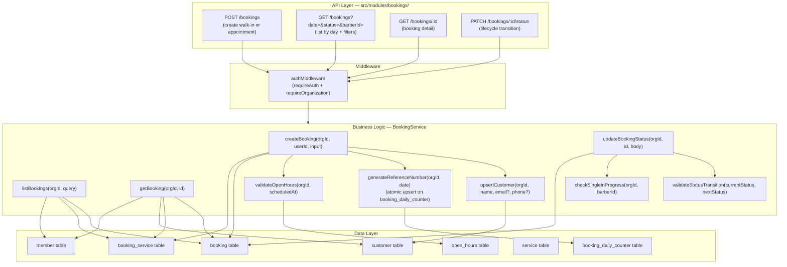
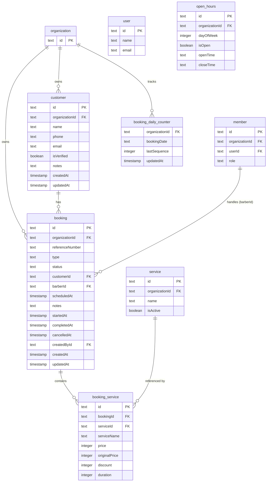

# Implementation Plan: Schedule & Booking Management

**Version:** 1.0
**Date:** April 27, 2026
**Status:** Draft

- **PRD:** [schedule-booking-management/prd.md](./prd.md)
- **Epic:** [epic.md](../epic.md)

---

## Goal

The `bookings` module already has foundational endpoints (`POST /`, `GET /`, `GET /:id`, `PATCH /:id/status`). This implementation plan covers what remains to complete the full Schedule & Booking Management surface as defined in the PRD: validating status transitions server-side, enforcing the single-in-progress constraint per barber, aligning the booking list query with the schedule (date-based pagination), ensuring the reference number generation is atomic, and writing a comprehensive integration test suite. No new tables are needed — the existing `booking`, `booking_service`, `customer`, and `booking_daily_counter` tables cover all requirements.

---

## Requirements

- **Status transition validation:** Server enforces legal transitions only (e.g. `in_progress → completed` ✓, `completed → cancelled` ✗). Illegal transitions return `400 Bad Request`.
- **Single-in-progress constraint:** A barber can have at most one `in_progress` booking at any time within the org; attempting a second returns `409 Conflict`.
- **Walk-in booking:** `POST /api/bookings` with `type = walk_in`; `serviceIds` multi-select; `scheduledAt` optional.
- **Appointment booking:** `POST /api/bookings` with `type = appointment`; `scheduledAt` required; open-hours check before creation.
- **Booking list by date:** `GET /api/bookings?date=YYYY-MM-DD` already implemented; `status` filter and `barberId` filter are already wired. Verify no gaps.
- **Reference number atomicity:** `bookingDailyCounter` table used with an upsert + increment pattern (already in `service.ts` — verify correctness under concurrency).
- **Booking detail:** `GET /api/bookings/:id` already returns full detail — verify response shape matches PRD.
- **Status update:** `PATCH /api/bookings/:id/status` must timestamp `startedAt`, `completedAt`, `cancelledAt` based on the target status.
- **Customer upsert:** On booking creation, upsert the `customer` record by `(organizationId, email)` or `(organizationId, phone)` or create a new name-only record.

---

## Technical Considerations

### System Architecture Overview



### Technology Stack

| Layer | Choice | Rationale |
|---|---|---|
| Routing | Elysia group (`/api/bookings`) | Consistent with all modules |
| Auth | `authMiddleware` + `requireOrganization: true` | Mandatory org scoping |
| ORM | Drizzle — existing `booking`, `booking_service`, `customer`, `booking_daily_counter` tables | No new tables; schema already complete |
| Reference number | `bookingDailyCounter` upsert with `lastSequence` increment | Atomic counter pattern already implemented; verify under concurrent load |
| Open hours validation | Query `open_hours` table on appointment creation | Prevents bookings outside business hours |
| Customer upsert | Lookup by `(orgId, email)` or `(orgId, phone)` before insert | Deduplicates walk-in customers who return |

### Database Schema Design

All tables already exist. The complete ER diagram relevant to this module:



#### Indexing Strategy

Existing indexes cover all query patterns:
- `booking_organizationId_createdAt_idx` — default sort on list.
- `booking_organizationId_scheduledAt_idx` — appointment date queries.
- `booking_organizationId_status_idx` — status filter queries.
- `booking_organizationId_barberId_scheduledAt_idx` — per-barber schedule queries.
- `booking_organizationId_referenceNumber_uidx` — reference uniqueness.
- `booking_service_bookingId_idx` — joining services to a booking.

**Potential gap:** No index on `booking(organizationId, status, barberId)` for the single-in-progress check. Consider adding `booking_orgId_status_barberId_idx` on `(organizationId, status, barberId)` if the check becomes a hotspot.

#### Migration Strategy

If a new index is added:
1. `bunx drizzle-kit generate --name add-booking-status-barberId-idx`
2. `bunx drizzle-kit check`
3. `bunx drizzle-kit migrate`

---

### API Design

#### Status Transition Rules

```
VALID TRANSITIONS:
  pending      → waiting    (internal: auto on walk-in or after PIN validation)
  waiting      → in_progress   (Handle This)
  waiting      → cancelled     (Cancel — from waiting)
  in_progress  → completed     (Swipe-to-Complete)
  in_progress  → waiting       (Mark as Waiting / revert)
  in_progress  → cancelled     (Cancel — from in-progress)

INVALID (return 400):
  completed → any
  cancelled → any
  in_progress → pending
  waiting → completed  (must go through in_progress first)
```

Server-side validation pseudocode:
```
const VALID_TRANSITIONS: Record<BookingStatus, BookingStatus[]> = {
  pending:     ['waiting'],
  waiting:     ['in_progress', 'cancelled'],
  in_progress: ['completed', 'waiting', 'cancelled'],
  completed:   [],
  cancelled:   []
}

if (!VALID_TRANSITIONS[current].includes(next)) {
  throw new AppError(`Cannot transition from ${current} to ${next}`, 'BAD_REQUEST')
}
```

#### Timestamp Automation on Status Change

| Target Status | Field to Set |
|---|---|
| `in_progress` | `startedAt = now()` |
| `completed` | `completedAt = now()` |
| `cancelled` | `cancelledAt = now()` |
| `waiting` (revert) | `startedAt = null` |

#### Reference Number Generation

```
pseudocode: generateReferenceNumber(orgId, date)
  dateStr = date.toISOString().slice(0, 10).replace(/-/g, '')  // "20260427"
  
  // Atomic upsert:
  INSERT INTO booking_daily_counter (organizationId, bookingDate, lastSequence)
  VALUES (orgId, dateStr, 1)
  ON CONFLICT (organizationId, bookingDate)
  DO UPDATE SET lastSequence = booking_daily_counter.lastSequence + 1
  RETURNING lastSequence

  seq = lastSequence.toString().padStart(3, '0')  // "001"
  checksum = randomAlphanumeric(2).toUpperCase()  // "A7"
  return `BK-${dateStr}-${seq}-${checksum}`       // "BK-20260427-001-A7"
```

#### Customer Upsert Logic

```
pseudocode: upsertCustomer(orgId, name, email?, phone?)
  if (email) lookup customer by (orgId, email)
  else if (phone) lookup customer by (orgId, phone)
  else lookup = null (name-only walk-in)

  if (existing) return existing.id
  
  insert new customer:
    id = nanoid()
    organizationId = orgId
    name = name
    email = email ?? null
    phone = phone ?? null
    isVerified = !!(email || phone)
  
  return new customer.id
```

#### Appointment Open-Hours Validation

```
pseudocode: validateOpenHours(orgId, scheduledAt)
  dayOfWeek = scheduledAt.getDay()  // 0=Sun, 6=Sat
  openHour = await db.query.openHours.findFirst({ where: ... dayOfWeek })
  
  if (!openHour || !openHour.isOpen) {
    throw AppError('Barbershop is closed on this day', 'BAD_REQUEST')
  }
  
  timeStr = formatHHMM(scheduledAt)
  if (timeStr < openHour.openTime || timeStr >= openHour.closeTime) {
    throw AppError('Scheduled time is outside open hours', 'BAD_REQUEST')
  }
```

#### Single In-Progress Constraint

```
pseudocode: checkSingleInProgress(orgId, barberId)
  if (!barberId) return  // no barber assigned → skip check

  existingInProgress = await db.query.booking.findFirst({
    where: and(
      eq(booking.organizationId, orgId),
      eq(booking.barberId, barberId),
      eq(booking.status, 'in_progress')
    )
  })
  
  if (existingInProgress) {
    throw AppError('Barber already has a booking in progress', 'CONFLICT')
  }
```

#### Full Endpoint Specs

| Method | Path | Body / Query | Response | Auth |
|---|---|---|---|---|
| `POST` | `/api/bookings` | `BookingCreateInput` (union walk_in \| appointment) | `201 BookingDetailResponse` | auth + org |
| `GET` | `/api/bookings` | `?date=YYYY-MM-DD&status=...&barberId=...` | `200 BookingSummaryResponse[]` | auth + org |
| `GET` | `/api/bookings/:id` | — | `200 BookingDetailResponse` | auth + org |
| `PATCH` | `/api/bookings/:id/status` | `{ status: BookingStatus }` | `200 BookingDetailResponse` | auth + org |

---

### Security & Performance

| Concern | Approach |
|---|---|
| Tenant isolation | All queries filter by `activeOrganizationId` from session |
| Cross-org access | Booking lookup always includes `organizationId` condition; unknown IDs return `404` |
| Service ownership | Service IDs are validated against the org's active services before insertion |
| Barber membership | `barberId` is validated as an active `member` of the org before assignment |
| Atomic counter | `bookingDailyCounter` upsert uses DB-level atomic increment; safe under concurrent inserts |
| Concurrency on status change | Status update should use a DB-level check within a transaction: fetch booking → validate transition → update in one operation |
| Input validation | TypeBox union schema (`WalkInBookingCreateInput \| AppointmentBookingCreateInput`) enforced by Elysia |
| Performance | Date-based filter uses `scheduledAt` or `createdAt` index; status filter uses `status` index |
| List response time | Target ≤ 1.5s (p95) for a single day's bookings — ensured by compound indexes |

---

## File Checklist

```
src/modules/bookings/
  handler.ts    [VERIFY]  — all 4 routes already registered; confirm params schema applied
  model.ts      [MODIFY]  — ensure BookingStatusUpdateInput includes all valid statuses;
                            add BookingStatusUpdateInput with optional cancelReason
  service.ts    [MODIFY]  — add: validateStatusTransition, checkSingleInProgress,
                             validateOpenHours, timestamp fields on status change
                             verify: generateReferenceNumber atomicity, upsertCustomer correctness

drizzle/
  [NEW migration — if index added]

tests/modules/bookings.test.ts   [NEW / EXTEND]  — comprehensive coverage
```

---

## Test Plan

Test file: `tests/modules/bookings.test.ts`

| ID | Test Case | Expected |
|---|---|---|
| T-01 | `POST /bookings` walk-in — valid input | 201, referenceNumber present |
| T-02 | `POST /bookings` walk-in — missing customerName | 422 |
| T-03 | `POST /bookings` walk-in — invalid serviceId | 400 |
| T-04 | `POST /bookings` appointment — valid input with scheduledAt | 201 |
| T-05 | `POST /bookings` appointment — scheduledAt on closed day | 400 |
| T-06 | `POST /bookings` appointment — scheduledAt outside open hours | 400 |
| T-07 | `POST /bookings` without auth | 401 |
| T-08 | `GET /bookings?date=2026-04-27` — returns bookings for day | 200, array |
| T-09 | `GET /bookings?date=2026-04-27&status=waiting` — filter works | 200, all waiting |
| T-10 | `GET /bookings/:id` — valid id | 200, full detail |
| T-11 | `GET /bookings/:id` — cross-org id | 404 |
| T-12 | `PATCH /bookings/:id/status` waiting → in_progress | 200, startedAt set |
| T-13 | `PATCH /bookings/:id/status` in_progress → completed | 200, completedAt set |
| T-14 | `PATCH /bookings/:id/status` in_progress → waiting (revert) | 200, startedAt null |
| T-15 | `PATCH /bookings/:id/status` completed → cancelled (illegal) | 400 |
| T-16 | `PATCH /bookings/:id/status` second in_progress for same barber | 409 |
| T-17 | Two simultaneous walk-ins — unique reference numbers | 201 × 2, different refs |
| T-18 | Reference number daily seq resets across dates | format correct per day |
| T-19 | Customer upsert — same email creates one customer record | one customer, two bookings |
