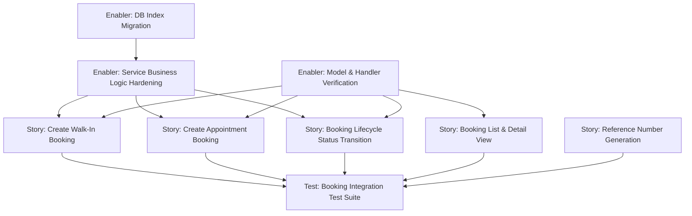

# Project Plan: Schedule & Booking Management

**Feature:** Schedule & Booking Management
**Epic:** Cukkr — Barbershop Management & Booking System
**Version:** 1.0
**Date:** April 27, 2026

---

## Issue Hierarchy Overview

```
Epic: Cukkr — Barbershop Management & Booking System
└── Feature: Schedule & Booking Management
    ├── Enabler: Booking Service Business Logic Hardening
    ├── Enabler: Booking Model & Handler Verification
    ├── Story: Create Walk-In Booking
    ├── Story: Create Appointment Booking with Open-Hours Validation
    ├── Story: Booking Lifecycle — Status Transition Management
    ├── Story: Booking List & Detail View
    ├── Story: Booking Reference Number Generation
    └── Test: Booking Integration Test Suite
```

---

## Dependency Graph



---

## Epic Issue

---

### EPIC-01: Cukkr — Barbershop Management & Booking System

#### Epic Description

A multi-tenant SaaS platform for barbershops to manage barbers, schedule bookings, and streamline the full daily workflow from walk-in queue management to appointment lifecycle tracking.

#### Business Value

- **Primary Goal:** Eliminate double-bookings and verbal scheduling errors by providing a digital booking system scoped per organization.
- **Success Metrics:** 100% of bookings tracked digitally; ≤1.5s list load time (p95); zero cross-org data leakage incidents.
- **User Impact:** Barbers and owners gain a single screen for the full daily workflow; customers can trust reserved appointment slots.

#### Epic Acceptance Criteria

- [ ] Barber management (invite, profile, availability) is fully functional.
- [ ] Walk-in and appointment booking creation works end-to-end with valid reference numbers.
- [ ] Full booking lifecycle (waiting → in_progress → completed / cancelled) is enforced server-side.
- [ ] All booking endpoints are organization-scoped and require authentication.
- [ ] Integration test suite covers all critical paths with ≥ 90% scenario coverage.

#### Features in this Epic

- [ ] #TBD — Schedule & Booking Management
- [ ] #TBD — Barber Management
- [ ] #TBD — User Profile

#### Definition of Done

- [ ] All feature stories completed and accepted
- [ ] Integration tests passing (`bun test`)
- [ ] Lint and format checks passing (`bun run lint:fix && bun run format`)
- [ ] No cross-org data leakage verified
- [ ] Documentation updated

#### Labels

`epic`, `priority-critical`, `value-high`

#### Milestone

v1.0 — MVP Release

#### Estimate

XL

---

## Feature Issue

---

### FEAT-01: Schedule & Booking Management

#### Feature Description

Provide API endpoints and business logic to support the full booking lifecycle for barbershops: creating walk-in and appointment bookings, transitioning booking statuses with server-side validation, generating atomic reference numbers, and retrieving booking lists and details scoped to an organization. The `bookings` module already has foundational endpoints; this feature hardens the business logic and adds comprehensive test coverage.

#### User Stories in this Feature

- [ ] #S-01 — Create Walk-In Booking
- [ ] #S-02 — Create Appointment Booking with Open-Hours Validation
- [ ] #S-03 — Booking Lifecycle — Status Transition Management
- [ ] #S-04 — Booking List & Detail View
- [ ] #S-05 — Booking Reference Number Generation

#### Technical Enablers

- [ ] #E-01 — Booking Service Business Logic Hardening
- [ ] #E-02 — Booking Model & Handler Verification
- [ ] #E-03 — DB Index: `booking_orgId_status_barberId_idx` (optional, if hotspot)

#### Dependencies

**Blocks:** User Profile feature (customer upsert depends on verified identity patterns)
**Blocked by:** Barber Management (barberId validation requires member records to exist)

#### Acceptance Criteria

- [ ] `POST /api/bookings` (walk_in and appointment) returns `201` with referenceNumber.
- [ ] `PATCH /api/bookings/:id/status` enforces legal transitions; illegal ones return `400`.
- [ ] A barber cannot have two simultaneous `in_progress` bookings (`409 Conflict`).
- [ ] `GET /api/bookings?date=YYYY-MM-DD` returns all bookings for the day with correct filters.
- [ ] `GET /api/bookings/:id` returns full booking detail; cross-org IDs return `404`.
- [ ] Reference numbers are unique per day per organization.

#### Definition of Done

- [ ] All user stories delivered
- [ ] Technical enablers completed
- [ ] `bun test` passes for all 19 test cases in `tests/modules/bookings.test.ts`
- [ ] `bun run lint:fix && bun run format` passes
- [ ] Performance: list endpoint ≤ 1.5s (p95), status transition ≤ 500ms (p95)

#### Labels

`feature`, `priority-critical`, `value-high`, `backend`, `bookings`

#### Epic

#EPIC-01

#### Estimate

L (≈ 34 story points)

---

## Technical Enabler Issues

---

### E-01: Booking Service Business Logic Hardening

#### Enabler Description

Implement the missing business logic functions in `src/modules/bookings/service.ts`:
- `validateStatusTransition(currentStatus, nextStatus)` — enforces the legal transition matrix.
- `checkSingleInProgress(orgId, barberId)` — prevents concurrent in-progress bookings for one barber.
- `validateOpenHours(orgId, scheduledAt)` — blocks appointments outside business hours.
- Timestamp automation on status change (`startedAt`, `completedAt`, `cancelledAt`, `startedAt = null` on revert).
- Verify `generateReferenceNumber` atomicity under concurrent load.
- Verify `upsertCustomer` correctness for email/phone/name-only scenarios.

#### Technical Requirements

- [ ] `VALID_TRANSITIONS` map defined as a typed constant; throws `AppError` on illegal transition.
- [ ] `checkSingleInProgress` queries `booking` table filtered by `(organizationId, barberId, status = 'in_progress')`; throws `AppError` with `CONFLICT` code.
- [ ] `validateOpenHours` queries `open_hours` by `dayOfWeek`; throws `AppError('BAD_REQUEST')` if closed or outside hours.
- [ ] `updateBookingStatus` sets timestamp fields based on target status within a single DB transaction.
- [ ] `upsertCustomer` correctly handles email-only, phone-only, and name-only customer creation.

#### Implementation Tasks

- [ ] #TASK-E01-1 — Implement `validateStatusTransition` with typed transition map
- [ ] #TASK-E01-2 — Implement `checkSingleInProgress` query
- [ ] #TASK-E01-3 — Implement `validateOpenHours` query against `open_hours` table
- [ ] #TASK-E01-4 — Add timestamp automation to `updateBookingStatus`
- [ ] #TASK-E01-5 — Verify and fix `generateReferenceNumber` atomicity (upsert pattern)
- [ ] #TASK-E01-6 — Verify and fix `upsertCustomer` for all three lookup paths

#### User Stories Enabled

This enabler supports:
- #S-01 — Create Walk-In Booking
- #S-02 — Create Appointment Booking
- #S-03 — Booking Lifecycle Status Transition Management

#### Acceptance Criteria

- [ ] Illegal status transitions throw `AppError` with `BAD_REQUEST` code.
- [ ] Concurrent `in_progress` attempt throws `AppError` with `CONFLICT` code.
- [ ] Appointment outside open hours throws `AppError` with `BAD_REQUEST` code.
- [ ] `startedAt` is set on transition to `in_progress`; cleared on revert to `waiting`.
- [ ] `completedAt` is set on transition to `completed`.
- [ ] `cancelledAt` is set on transition to `cancelled`.

#### Definition of Done

- [ ] Implementation completed and reviewed
- [ ] All related unit-level assertions in `bookings.test.ts` pass
- [ ] No `any` types introduced
- [ ] `bun run lint:fix` passes

#### Labels

`enabler`, `priority-critical`, `backend`, `bookings`, `value-high`

#### Feature

#FEAT-01

#### Estimate

5 points

---

### E-02: Booking Model & Handler Verification

#### Enabler Description

Audit and update `src/modules/bookings/model.ts` and `handler.ts` to ensure all DTOs and route registrations align with the PRD and implementation plan:
- `BookingStatusUpdateInput` supports all valid statuses and includes optional `cancelReason`.
- Walk-in vs. appointment TypeBox union schema (`type` discriminant) is correctly enforced.
- All 4 routes (`POST /`, `GET /`, `GET /:id`, `PATCH /:id/status`) are registered with correct params/query/body schemas.

#### Technical Requirements

- [ ] `BookingStatusUpdateInput` DTO includes `cancelReason?: string` (max 500 chars).
- [ ] `BookingCreateInput` is a TypeBox union: `WalkInBookingCreateInput | AppointmentBookingCreateInput`.
- [ ] `AppointmentBookingCreateInput` requires `scheduledAt: string` (ISO date-time).
- [ ] Handler verifies all 4 routes registered; `requireOrganization: true` applied to all.

#### Implementation Tasks

- [ ] #TASK-E02-1 — Update `BookingStatusUpdateInput` to add `cancelReason` optional field
- [ ] #TASK-E02-2 — Verify/fix TypeBox union schema for walk-in vs. appointment
- [ ] #TASK-E02-3 — Audit all 4 routes in `handler.ts` for correct schema application

#### User Stories Enabled

This enabler supports:
- #S-01 — Create Walk-In Booking
- #S-02 — Create Appointment Booking
- #S-03 — Booking Lifecycle Status Transition
- #S-04 — Booking List & Detail View

#### Acceptance Criteria

- [ ] `PATCH /api/bookings/:id/status` accepts `cancelReason` in body without validation error.
- [ ] Walk-in booking missing `scheduledAt` is accepted; appointment missing `scheduledAt` returns `422`.
- [ ] All 4 routes return `401` without auth and `401/403` without active organization.

#### Definition of Done

- [ ] Handler and model audit complete
- [ ] DTO changes reviewed
- [ ] `bun run lint:fix && bun run format` passes

#### Labels

`enabler`, `priority-high`, `backend`, `bookings`, `value-high`

#### Feature

#FEAT-01

#### Estimate

3 points

---

### E-03: DB Index — booking_orgId_status_barberId_idx

#### Enabler Description

Add a composite index on `(organizationId, status, barberId)` to optimize the `checkSingleInProgress` query. This is a conditional enabler — implement if profiling shows the query becomes a hotspot under load.

#### Technical Requirements

- [ ] Add index definition in `src/modules/bookings/schema.ts`.
- [ ] Generate migration: `bunx drizzle-kit generate --name add-booking-status-barberId-idx`.
- [ ] Validate: `bunx drizzle-kit check`.
- [ ] Apply: `bunx drizzle-kit migrate`.

#### Implementation Tasks

- [ ] #TASK-E03-1 — Add index to schema
- [ ] #TASK-E03-2 — Generate and apply migration

#### User Stories Enabled

- #S-03 — Booking Lifecycle Status Transition (single in-progress check performance)

#### Acceptance Criteria

- [ ] Migration applies cleanly without errors.
- [ ] `checkSingleInProgress` query uses the new index (verify via `EXPLAIN ANALYZE`).

#### Definition of Done

- [ ] Schema updated, migration generated and applied
- [ ] No data loss verified

#### Labels

`enabler`, `priority-medium`, `backend`, `bookings`, `database`, `value-medium`

#### Feature

#FEAT-01

#### Estimate

2 points

---

## User Story Issues

---

### S-01: Create Walk-In Booking

#### Story Statement

As a **Barber / Owner**, I want to create a walk-in booking with a customer name, optional contact, service selection, and optional barber assignment so that the customer is added to the day's waiting queue immediately.

#### Acceptance Criteria

- [ ] `POST /api/bookings` with `type = walk_in`, `customerName`, and at least one `serviceId` returns `201 Created`.
- [ ] Response includes `referenceNumber` matching format `BK-{YYYYMMDD}-{3DigitSeq}-{2CharChecksum}`.
- [ ] Booking appears with `status = waiting` for the current day.
- [ ] Missing `customerName` returns `422 Unprocessable Entity`.
- [ ] Invalid `serviceId` (not belonging to org) returns `400 Bad Request`.
- [ ] Request without auth returns `401 Unauthorized`.
- [ ] Customer is upserted (not duplicated) when email or phone matches an existing customer.

#### Technical Tasks

- [ ] #TASK-E01-6 — Verify `upsertCustomer` (from E-01)
- [ ] #TASK-E02-2 — Verify walk-in union schema (from E-02)
- [ ] #TASK-S01-1 — Validate `serviceIds` belong to active services in the org
- [ ] #TASK-S01-2 — Validate `barberId` is an active `member` of the org (if provided)

#### Testing Requirements

- [ ] T-01: `POST /bookings` walk-in — valid input → 201, referenceNumber present
- [ ] T-02: `POST /bookings` walk-in — missing customerName → 422
- [ ] T-03: `POST /bookings` walk-in — invalid serviceId → 400
- [ ] T-07: `POST /bookings` without auth → 401
- [ ] T-19: Customer upsert — same email creates one customer, two bookings

#### Dependencies

**Blocked by:** E-01 (service business logic), E-02 (model/handler verification)

#### Definition of Done

- [ ] Walk-in creation end-to-end works
- [ ] T-01, T-02, T-03, T-07, T-19 all pass
- [ ] Code review approved

#### Labels

`user-story`, `priority-critical`, `value-high`, `backend`, `bookings`

#### Feature

#FEAT-01

#### Estimate

3 points

---

### S-02: Create Appointment Booking with Open-Hours Validation

#### Story Statement

As a **Barber / Owner**, I want to create an appointment booking for a customer with a specific date and time so that I can reserve a future slot — and the system should prevent bookings outside business hours.

#### Acceptance Criteria

- [ ] `POST /api/bookings` with `type = appointment` and valid `scheduledAt` returns `201 Created`.
- [ ] Missing `scheduledAt` on appointment type returns `422 Unprocessable Entity`.
- [ ] `scheduledAt` on a day the barbershop is closed returns `400 Bad Request`.
- [ ] `scheduledAt` outside open hours (but on an open day) returns `400 Bad Request`.
- [ ] Multi-service selection stores all services in `booking_service` table.
- [ ] Request without auth returns `401 Unauthorized`.

#### Technical Tasks

- [ ] #TASK-E01-3 — Implement `validateOpenHours` (from E-01)
- [ ] #TASK-E02-2 — Verify appointment union schema (from E-02)
- [ ] #TASK-S02-1 — Wire `validateOpenHours` call into `createBooking` for appointment type

#### Testing Requirements

- [ ] T-04: `POST /bookings` appointment — valid input with scheduledAt → 201
- [ ] T-05: `POST /bookings` appointment — scheduledAt on closed day → 400
- [ ] T-06: `POST /bookings` appointment — scheduledAt outside open hours → 400

#### Dependencies

**Blocked by:** E-01 (open-hours validation logic), E-02 (schema enforcement)

#### Definition of Done

- [ ] Appointment creation with open-hours validation works end-to-end
- [ ] T-04, T-05, T-06 all pass
- [ ] Code review approved

#### Labels

`user-story`, `priority-high`, `value-high`, `backend`, `bookings`

#### Feature

#FEAT-01

#### Estimate

3 points

---

### S-03: Booking Lifecycle — Status Transition Management

#### Story Statement

As a **Barber / Owner**, I want to transition a booking through its lifecycle (waiting → in_progress → completed / cancelled) so that the team always has an accurate view of which bookings are active, and illegal transitions are prevented.

#### Acceptance Criteria

- [ ] `PATCH /api/bookings/:id/status` with `waiting → in_progress` returns `200` with `startedAt` set.
- [ ] `PATCH /api/bookings/:id/status` with `in_progress → completed` returns `200` with `completedAt` set.
- [ ] `PATCH /api/bookings/:id/status` with `in_progress → waiting` returns `200` with `startedAt = null`.
- [ ] `PATCH /api/bookings/:id/status` with `completed → cancelled` returns `400 Bad Request`.
- [ ] If the barber already has an `in_progress` booking, starting another returns `409 Conflict`.
- [ ] Optional `cancelReason` is stored when status is `cancelled`.

#### Technical Tasks

- [ ] #TASK-E01-1 — Implement `validateStatusTransition` (from E-01)
- [ ] #TASK-E01-2 — Implement `checkSingleInProgress` (from E-01)
- [ ] #TASK-E01-4 — Timestamp automation on status change (from E-01)
- [ ] #TASK-E02-1 — Update `BookingStatusUpdateInput` DTO with `cancelReason` (from E-02)

#### Testing Requirements

- [ ] T-12: `PATCH /bookings/:id/status` waiting → in_progress → 200, startedAt set
- [ ] T-13: `PATCH /bookings/:id/status` in_progress → completed → 200, completedAt set
- [ ] T-14: `PATCH /bookings/:id/status` in_progress → waiting (revert) → 200, startedAt null
- [ ] T-15: `PATCH /bookings/:id/status` completed → cancelled (illegal) → 400
- [ ] T-16: `PATCH /bookings/:id/status` second in_progress for same barber → 409

#### Dependencies

**Blocked by:** E-01 (transition validation, single in-progress check), E-02 (model update)

#### Definition of Done

- [ ] All status transition paths enforced server-side
- [ ] T-12 through T-16 all pass
- [ ] Code review approved

#### Labels

`user-story`, `priority-critical`, `value-high`, `backend`, `bookings`

#### Feature

#FEAT-01

#### Estimate

5 points

---

### S-04: Booking List & Detail View

#### Story Statement

As a **Barber / Owner**, I want to retrieve a day's bookings with optional status and barber filters, and view the full detail of any booking, so that I have complete context for the daily schedule.

#### Acceptance Criteria

- [ ] `GET /api/bookings?date=YYYY-MM-DD` returns all bookings for the day as an array.
- [ ] `?status=waiting` filter returns only waiting bookings.
- [ ] `?barberId=...` filter returns only bookings assigned to that barber.
- [ ] `GET /api/bookings/:id` returns full booking detail (services, prices, notes, customer info, timestamps, reference number).
- [ ] Cross-organization booking ID returns `404 Not Found`.
- [ ] Request without auth returns `401 Unauthorized`.

#### Technical Tasks

- [ ] #TASK-S04-1 — Verify list endpoint query covers date, status, and barberId filters
- [ ] #TASK-S04-2 — Verify detail endpoint response shape matches PRD spec
- [ ] #TASK-E02-3 — Audit handler route registrations (from E-02)

#### Testing Requirements

- [ ] T-08: `GET /bookings?date=2026-04-27` → 200, array of bookings for day
- [ ] T-09: `GET /bookings?date=2026-04-27&status=waiting` → 200, all waiting
- [ ] T-10: `GET /bookings/:id` valid id → 200, full detail
- [ ] T-11: `GET /bookings/:id` cross-org id → 404

#### Dependencies

**Blocked by:** E-02 (handler/model verification)

#### Definition of Done

- [ ] List and detail endpoints verified and working
- [ ] T-08, T-09, T-10, T-11 all pass
- [ ] Code review approved

#### Labels

`user-story`, `priority-high`, `value-high`, `backend`, `bookings`

#### Feature

#FEAT-01

#### Estimate

3 points

---

### S-05: Booking Reference Number Generation

#### Story Statement

As a **Barber / Owner**, I want every booking to have a unique, human-readable reference number in the format `BK-{YYYYMMDD}-{DailySeq}-{Checksum}` so that I can quickly identify and communicate about any booking.

#### Acceptance Criteria

- [ ] Every new booking response includes `referenceNumber` matching `BK-{YYYYMMDD}-{DailySeq}-{Checksum}`.
- [ ] Two bookings on the same day for the same org have different `DailySeq` values.
- [ ] Two bookings on different days reset the daily sequence (each starts at `001`).
- [ ] Two simultaneous walk-in bookings produce unique reference numbers.

#### Technical Tasks

- [ ] #TASK-E01-5 — Verify `generateReferenceNumber` atomicity (from E-01)
- [ ] #TASK-S05-1 — Concurrency smoke test for simultaneous reference number generation

#### Testing Requirements

- [ ] T-17: Two simultaneous walk-ins → 201 × 2, different ref numbers
- [ ] T-18: Reference number daily seq resets across dates → format correct per day

#### Dependencies

**Blocked by:** E-01 (atomicity verification of `generateReferenceNumber`)

#### Definition of Done

- [ ] Reference number generation verified atomic and correct
- [ ] T-17, T-18 pass
- [ ] Code review approved

#### Labels

`user-story`, `priority-high`, `value-high`, `backend`, `bookings`

#### Feature

#FEAT-01

#### Estimate

3 points

---

## Test Issue

---

### TEST-01: Booking Integration Test Suite

#### Test Description

Implement a comprehensive integration test suite in `tests/modules/bookings.test.ts` covering all 19 test cases defined in the implementation plan. Tests use `bun:test` with Eden Treaty typed client. A test organization and auth session are set up in `beforeAll`.

#### Test Cases

| ID | Scenario | Expected |
|---|---|---|
| T-01 | `POST /bookings` walk-in — valid input | 201, referenceNumber present |
| T-02 | `POST /bookings` walk-in — missing customerName | 422 |
| T-03 | `POST /bookings` walk-in — invalid serviceId | 400 |
| T-04 | `POST /bookings` appointment — valid + scheduledAt | 201 |
| T-05 | `POST /bookings` appointment — scheduledAt on closed day | 400 |
| T-06 | `POST /bookings` appointment — scheduledAt outside hours | 400 |
| T-07 | `POST /bookings` without auth | 401 |
| T-08 | `GET /bookings?date=...` | 200, array |
| T-09 | `GET /bookings?date=...&status=waiting` | 200, all waiting |
| T-10 | `GET /bookings/:id` valid id | 200, full detail |
| T-11 | `GET /bookings/:id` cross-org id | 404 |
| T-12 | `PATCH /bookings/:id/status` waiting → in_progress | 200, startedAt set |
| T-13 | `PATCH /bookings/:id/status` in_progress → completed | 200, completedAt set |
| T-14 | `PATCH /bookings/:id/status` in_progress → waiting | 200, startedAt null |
| T-15 | `PATCH /bookings/:id/status` completed → cancelled | 400 |
| T-16 | `PATCH /bookings/:id/status` 2nd in_progress same barber | 409 |
| T-17 | Two simultaneous walk-ins | 201 × 2, different refs |
| T-18 | Reference number daily seq resets | format correct per day |
| T-19 | Customer upsert — same email | one customer, two bookings |

#### Dependencies

**Blocked by:** S-01, S-02, S-03, S-04, S-05 (all stories must be implemented before full test run)

#### Definition of Done

- [ ] All 19 test cases implemented and passing
- [ ] `bun test bookings` exits with 0 failures
- [ ] Test setup uses unique email/org per run to avoid state pollution

#### Labels

`test`, `priority-critical`, `backend`, `bookings`, `value-high`

#### Feature

#FEAT-01

#### Estimate

8 points

---

## Sprint Planning

### Sprint 1 — Foundation (Enablers)

**Goal:** Harden the bookings service layer and verify the model/handler before story work begins.

| Issue | Title | Points |
|---|---|---|
| E-01 | Booking Service Business Logic Hardening | 5 |
| E-02 | Booking Model & Handler Verification | 3 |
| E-03 | DB Index (conditional) | 2 |

**Total Commitment:** 10 story points
**Success Criteria:** All enabler tasks complete; `bun run build` succeeds.

---

### Sprint 2 — Core Stories

**Goal:** Deliver walk-in creation, appointment creation, and lifecycle management end-to-end.

| Issue | Title | Points |
|---|---|---|
| S-01 | Create Walk-In Booking | 3 |
| S-02 | Create Appointment Booking | 3 |
| S-03 | Booking Lifecycle Status Transition | 5 |
| S-05 | Reference Number Generation | 3 |

**Total Commitment:** 14 story points
**Success Criteria:** T-01 through T-07 and T-12 through T-19 passing.

---

### Sprint 3 — List/Detail & Test Coverage

**Goal:** Complete the list/detail view and full integration test suite.

| Issue | Title | Points |
|---|---|---|
| S-04 | Booking List & Detail View | 3 |
| TEST-01 | Booking Integration Test Suite | 8 |

**Total Commitment:** 11 story points
**Success Criteria:** All 19 test cases pass; `bun run lint:fix && bun run format` clean.

---

## Total Estimate Summary

| Type | Count | Story Points |
|---|---|---|
| Enablers | 3 | 10 |
| User Stories | 5 | 17 |
| Test | 1 | 8 |
| **Total** | **9** | **35** |

**Feature T-Shirt Size:** L
