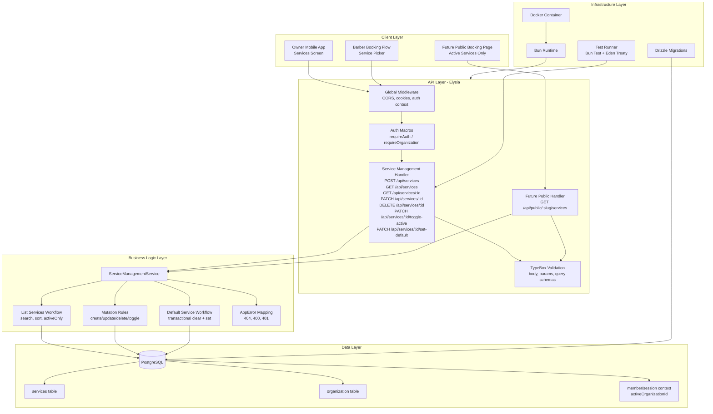
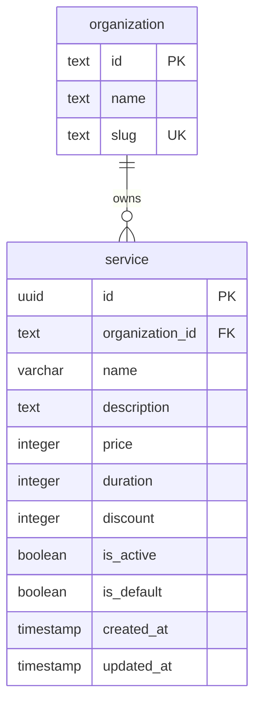

# Implementation Plan: Service Management

**Version:** 1.0  
**Date:** April 26, 2026  
**Status:** Draft  
**Feature PRD:** [prd.md](./prd.md)

---

## Goal

Deliver a production-ready service-catalog module that lets barbershop owners manage organization-scoped services used by booking workflows and public booking discovery. The implementation must support full CRUD, search, sort, activation toggling, and a single default service per organization with strict transactional integrity. The feature should align with the existing Elysia, Better Auth, and Drizzle patterns already used in this backend, with no cross-tenant leakage and no plain `Error` usage. The result should provide a stable internal API for future booking, onboarding, and public-booking features while remaining fast for organizations with up to 100 services.

---

## Requirements

- Create a new `service-management` module under `src/modules/service-management/` with `handler.ts`, `model.ts`, `schema.ts`, and `service.ts`.
- Register the new service table in `drizzle/schemas.ts` and generate a migration using `drizzle-kit generate`.
- Add a `services` table with organization ownership, business fields, `isActive`, `isDefault`, and timestamps.
- Enforce multi-tenant isolation on every owner/barber endpoint via `requireOrganization: true` and `organizationId = activeOrganizationId` filtering.
- Implement owner-facing endpoints for create, list, get, partial update, delete, toggle-active, and set-default.
- Prevent `isDefault` mutation through the general update endpoint; default assignment must flow through a dedicated endpoint.
- Clear `isDefault` automatically when a default service is deactivated.
- Reject deletion of the default service until another default is selected or the default is cleared by business action.
- Make `set-default` transactional so only one service per organization can hold `isDefault = true` after completion.
- Support list filtering with `search`, `sort`, and `activeOnly` query params.
- Keep validation in `model.ts` using Elysia TypeBox schemas with the PRD constraints: `name <= 100`, `description <= 500`, `price >= 0`, `duration >= 1`, `discount 0-100`.
- Add integration tests in `tests/modules/service-management.test.ts` for auth, organization scoping, CRUD behavior, list behavior, toggle behavior, default-service business rules, and unauthenticated rejection.
- Prepare for future public-booking read access by structuring the service layer so an active-only public query can be added without rewriting owner-scoped logic.

### Module Deliverables

| File | Responsibility |
|---|---|
| `src/modules/service-management/schema.ts` | Drizzle table definition, indexes, and inferred row/select types |
| `src/modules/service-management/model.ts` | Request/response DTO schemas, query param schemas, sort enum |
| `src/modules/service-management/service.ts` | Business rules, DB queries, transactional default management, AppError handling |
| `src/modules/service-management/handler.ts` | Elysia route group, auth/organization macros, DTO binding, HTTP status mapping |
| `drizzle/schemas.ts` | Re-export service schema for auth/database setup |
| `tests/modules/service-management.test.ts` | End-to-end integration test coverage using Eden Treaty |
| `drizzle/*.sql` | Migration for the new service table and indexes |

### Implementation Notes

- Use the existing `product-example` module as a structural template only; do not modify it.
- Follow the repository convention of throwing `AppError` from `src/core/error.ts` for all business-rule failures.
- Keep table and DTO names aligned around the noun `service` to reduce ambiguity with the service-layer concept.
- Prefer integer storage for `price`, `duration`, and `discount` to preserve deterministic business behavior and avoid floating-point issues.
- Use a dedicated service sort enum so handlers reject unsupported sort values at validation time rather than branching on raw strings.

---

## Feature Gap Analysis

| PRD Capability | Existing Support | Status | Implementation Direction |
|---|---|---|---|
| Organization-scoped auth context | Better Auth organization plugin + auth middleware | Reuse | Require active organization on all non-public routes |
| Generic route registration | Elysia app/module pattern | Reuse | Register new handler in `src/app.ts` |
| Database access and migration flow | Drizzle + shared database client | Reuse | Add schema, export it, generate migration |
| CRUD patterns | Product example module | Reuse pattern | Adapt to service-specific validation and filtering |
| Single default per organization | Not present | Build | Transactional reset-then-set flow in service layer |
| Search and sort | Not present in a dedicated list endpoint | Build | Compose Drizzle query conditions/order clauses |
| Public active-service listing | Not present in this PRD scope | Defer-ready | Design service-layer helper for later read-only endpoint |

---

## Technical Considerations

### System Architecture Overview



### Technology Stack Selection

| Layer | Technology | Rationale |
|---|---|---|
| API | Elysia | Matches the existing route/macro architecture and keeps request typing close to handlers |
| Validation | TypeBox via Elysia | Supports strict request validation with consistent 422 responses |
| Business Logic | Module-local service class/functions | Keeps handlers thin and centralizes tenant and business-rule enforcement |
| Persistence | Drizzle ORM + PostgreSQL | Type-safe SQL generation and migration-driven schema management already adopted in the repo |
| Auth & Tenant Context | Better Auth + existing auth middleware | Reuses session and active organization state without duplicating auth logic |
| Testing | Bun test + Eden Treaty | Matches current integration-test style and verifies the full HTTP surface |
| Deployment | Bun in Docker | Already standardized in the project; no feature-specific infrastructure divergence needed |

### Integration Points

- `src/app.ts`: register the new service-management handler under the existing `/api` namespace.
- `src/lib/auth.ts` and `src/middleware/auth-middleware.ts`: reuse session and organization context; no auth-stack changes required.
- `drizzle/schemas.ts`: export the service schema so database initialization and tooling see the new table.
- Future booking modules: consume service IDs and possibly default service lookup through service-layer helpers rather than reimplementing lookup queries.
- Future public booking module: call an active-only, organization-scoped read method from the same service layer or a small shared query helper.

### Deployment Architecture

- No new container or background worker is required for MVP.
- The feature ships inside the existing Bun application container.
- Schema changes deploy via standard Drizzle migration flow before or during application rollout.
- Rollout order: deploy migration, then deploy application code that depends on the new table.

### Scalability Considerations

- For the stated scale of up to 100 services per organization, direct indexed PostgreSQL queries are sufficient; no cache is required.
- Add composite indexes supporting organization-bound list queries to keep `GET /api/services` within the PRD performance target.
- Keep list queries selective by always filtering on `organizationId`; optionally also on `isActive` when `activeOnly=true`.
- Use deterministic ordering for `recent` based on `createdAt DESC` and a secondary `id DESC` tie-breaker if needed.
- Keep the `set-default` flow transactional to avoid race conditions during concurrent updates from multiple clients.

---

## Database Schema Design

### Entity Relationship Diagram



### Table Specifications

**Table:** `services`

| Column | Type | Constraints | Notes |
|---|---|---|---|
| `id` | UUID | Primary key, default random | Use the repo's standard UUID strategy for new records |
| `organizationId` | text/UUID | Not null, FK to `organization.id` | Required for multi-tenant isolation |
| `name` | varchar(100) or text | Not null | Application validation enforces non-empty and max 100 |
| `description` | varchar(500) or text | Nullable | Application validation caps at 500 chars |
| `price` | integer | Not null, default optional none | Stored in whole rupiah |
| `duration` | integer | Not null | Stored in minutes |
| `discount` | integer | Not null, default 0 | Integer percentage from 0 to 100 |
| `isActive` | boolean | Not null, default `false` | New services start inactive |
| `isDefault` | boolean | Not null, default `false` | Single true value per organization enforced by app logic |
| `createdAt` | timestamp | Not null, default now | Audit field |
| `updatedAt` | timestamp | Not null, default now, update on mutation | Audit field |

### Constraints and Business Safeguards

- Add a foreign key from `services.organizationId` to `organization.id`.
- Optionally add database-level `CHECK` constraints for `price >= 0`, `duration >= 1`, and `discount BETWEEN 0 AND 100` if the team wants DB-level defense in depth.
- The repository already prefers app-layer validation, but these checks are low-risk and align with immutable domain rules.
- Do not rely solely on a database partial unique index for `isDefault`; the feature explicitly requires an atomic clear-and-set workflow in application code.

### Indexing Strategy

| Index | Type | Rationale |
|---|---|---|
| `(organizationId, isActive)` | Composite b-tree | Required by PRD for fast active/inactive filtering inside tenant scope |
| `(organizationId, createdAt)` | Composite b-tree | Supports `recent` sorting within tenant scope |
| `(organizationId, name)` | Composite b-tree | Helps tenant-scoped alphabetical sorts and case-insensitive name lookups |
| `(organizationId, isDefault)` | Composite b-tree | Makes default-service fetch and reset query cheap |

### Search Strategy

- Use case-insensitive partial matching on `name`.
- At the application/query layer, normalize search to a single `ILIKE` pattern such as `%term%`.
- Because the expected dataset is small per organization, a simple indexed tenant filter plus `ILIKE` is adequate for MVP.
- If search volume or cardinality increases later, add `pg_trgm` and a trigram index as a follow-up optimization rather than pre-optimizing now.

### Database Migration Strategy

1. Add `services` schema in `src/modules/service-management/schema.ts`.
2. Re-export it from `drizzle/schemas.ts`.
3. Generate a migration with `bunx drizzle-kit generate --name add-services-table`.
4. Review generated SQL to confirm indexes and constraints align with the plan.
5. Apply the migration with `bunx drizzle-kit migrate` in environments that need it.

---

## API Design

### Route Registration and Ownership

- All management routes live under `/api/services`.
- All management routes require authenticated session context and active organization context.
- Owner-specific mutation permissions can initially rely on organization membership and current app conventions; if owner-only enforcement exists elsewhere, mirror that pattern here.
- Barber read access can be introduced either through the same list/get endpoints with membership-based authorization or through a narrower read-only route if the product later distinguishes permissions more explicitly.

### Data Contracts

#### Core Service Response Shape

```text
ServiceDto {
    id: string
    organizationId: string
    name: string
    description: string | null
    price: number
    duration: number
    discount: number
    isActive: boolean
    isDefault: boolean
    createdAt: string
    updatedAt: string
}
```

#### Create Request

```text
CreateServiceRequest {
    name: string
    description?: string
    price: number
    duration: number
    discount?: number
}
```

#### Update Request

```text
UpdateServiceRequest {
    name?: string
    description?: string | null
    price?: number
    duration?: number
    discount?: number
    isActive?: boolean
    isDefault?: never
}
```

#### List Query

```text
ListServicesQuery {
    search?: string
    sort?: "name_asc" | "name_desc" | "price_asc" | "price_desc" | "recent"
    activeOnly?: boolean
}
```

### Endpoint Specifications

#### `POST /api/services`

- Auth: required
- Organization context: required
- Purpose: create a new service in the active organization
- Behavior:
  - Persists `organizationId` from session context, never from client input.
  - Defaults `isActive = false`, `isDefault = false`, `discount = 0` when omitted.
  - Returns `201` with the created service.
- Failure cases:
  - `401` if unauthenticated
  - `422` for schema validation failure

#### `GET /api/services`

- Auth: required
- Organization context: required
- Purpose: list services in the active organization
- Query behavior:
  - `search` filters by partial service name match
  - `sort` selects ordering
  - `activeOnly=true` limits to active services
- Returns `200` with an array of `ServiceDto`
- Failure cases:
  - `401` if unauthenticated
  - `422` for invalid query values

#### `GET /api/services/:id`

- Auth: required
- Organization context: required
- Purpose: fetch a single service owned by the active organization
- Returns `200` with `ServiceDto`
- Failure cases:
  - `404` when no matching service exists in the active organization

#### `PATCH /api/services/:id`

- Auth: required
- Organization context: required
- Purpose: partially update editable service fields
- Behavior:
  - Reject `isDefault` in payload with `400`
  - Allow `isActive` only if the team wants general-update parity with the PRD; otherwise keep active state changes exclusively in toggle endpoint to simplify behavior. Recommended approach: accept descriptive field updates and keep active-state changes in the dedicated toggle endpoint.
  - Always refresh `updatedAt`
- Returns `200` with updated `ServiceDto`
- Failure cases:
  - `400` when `isDefault` is included
  - `404` when service is not found in the active organization
  - `422` for invalid field values

#### `DELETE /api/services/:id`

- Auth: required
- Organization context: required
- Purpose: permanently delete a service
- Behavior:
  - Reject deletion if `isDefault = true`
- Returns `200` with deletion confirmation or deleted resource payload depending on existing API style
- Failure cases:
  - `400` with message `Cannot delete the default service. Please set a new default first.`
  - `404` when service is not found in the active organization

#### `PATCH /api/services/:id/toggle-active`

- Auth: required
- Organization context: required
- Purpose: flip active state quickly from list or detail views
- Behavior:
  - Toggle the current `isActive` boolean
  - If toggling from active to inactive while `isDefault = true`, also clear `isDefault`
  - Persist both state changes in one mutation path
- Returns `200` with updated `ServiceDto`
- Failure cases:
  - `404` when service is not found in the active organization

#### `PATCH /api/services/:id/set-default`

- Auth: required
- Organization context: required
- Purpose: set a single organization-wide default service
- Behavior:
  - Read candidate service in the active organization
  - Reject if inactive
  - In one DB transaction:
    - clear `isDefault` on any existing default service in the same organization
    - set `isDefault = true` on the target service
    - update timestamps for changed rows as needed
- Returns `200` with updated `ServiceDto`
- Failure cases:
  - `400` with message `Service must be active to be set as default`
  - `404` when service is not found in the active organization

### Authorization Strategy

- Primary enforcement is tenant isolation through `requireOrganization: true`.
- If owner-only permissions are already represented in org membership roles, mutation endpoints should check for owner role and return `403` for non-owner members.
- If no reusable owner-role helper exists yet, document the gap and ship MVP with authenticated organization-member access only if that matches current authorization conventions; otherwise implement the explicit owner-role check in the handler/service boundary.

### Error Handling Strategy

| Scenario | Status | Error Message |
|---|---|---|
| Unauthenticated request | `401` | Existing auth middleware response |
| No active organization or access denied by macro | `401` or existing macro response | Existing auth middleware response |
| Service not found in current organization | `404` | `Service not found` |
| Attempt to update `isDefault` via generic update | `400` | `Default service must be updated via set-default endpoint` |
| Attempt to set inactive service as default | `400` | `Service must be active to be set as default` |
| Attempt to delete default service | `400` | `Cannot delete the default service. Please set a new default first.` |
| Validation failure | `422` | TypeBox field-level validation details |

### Rate Limiting and Caching

- No feature-specific rate limit is required for MVP because the endpoints are authenticated internal management APIs and global API protections already exist.
- No caching is required for owner-facing list and detail endpoints at current scale.
- Public active-service listing, when implemented later, can consider short-lived cache headers or in-process caching if booking traffic warrants it.

---

## Security & Performance

### Authentication and Authorization

- Reuse the existing session cookie and auth middleware.
- Require active organization context on all management routes.
- Never accept `organizationId` from request payloads or query strings for write operations.
- Resolve target resources using both `id` and `organizationId` so cross-tenant object references always fail as `404`.

### Data Validation and Sanitization

- Validate all bodies, params, and query strings with TypeBox schemas.
- Trim incoming `name` and `description` in the service layer or handler before persistence.
- Reject empty or whitespace-only names after trimming.
- Keep `price`, `duration`, and `discount` integer-only at the validation layer.
- Treat omitted optional fields differently from explicit `null` when designing update semantics; define that clearly in the DTOs.

### Performance Optimization

- Use tenant-first indexed filters for all list/detail queries.
- Keep list response payload flat and minimal; no joins are required for MVP.
- Avoid unnecessary preflight fetches by folding toggle and set-default logic into single, purpose-specific service methods.
- Use a single transaction for default-service reassignment to reduce race windows and inconsistent reads.

### Concurrency and Consistency

- The `set-default` operation is the highest-risk concurrency point.
- Implement it inside a single Drizzle transaction scoped to the active organization.
- Prefer a clear-then-set approach within the transaction, using organization-scoped predicates on both updates.
- If concurrent set-default requests are expected, rely on transaction isolation and optionally add a follow-up guard query to confirm the final default row is the intended target.

### Observability

- Reuse the project's existing error propagation and logging conventions.
- Avoid adding feature-specific logs unless an operational requirement emerges.
- If logs are added, never log session cookies or other sensitive auth material.

---

## Implementation Phases

### Phase 1: Schema and DTO Foundation

- Create `src/modules/service-management/schema.ts` with the `services` table and indexes.
- Add DTO schemas in `model.ts` for params, list query, create body, update body, and standard response shape.
- Export schema from `drizzle/schemas.ts`.
- Generate and review the migration.

### Phase 2: Service-Layer Business Logic

- Implement organization-scoped lookup helpers.
- Implement create, list, get, update, delete, toggle-active, and set-default methods.
- Centralize all business-rule exceptions as `AppError`.
- Implement the default-service transaction and default-clearing-on-deactivate behavior.

### Phase 3: HTTP Handler Integration

- Register all routes in `handler.ts` using the existing Elysia grouping style.
- Bind TypeBox schemas to body, params, and query inputs.
- Enforce `requireOrganization: true` on all management endpoints.
- Register the module in `src/app.ts`.

### Phase 4: Integration Tests

- Add `tests/modules/service-management.test.ts`.
- Cover unauthenticated access, organization creation/setup, CRUD success paths, validation failures, search/sort/activeOnly behavior, default-service rules, toggle side effects, and cross-tenant isolation.
- Use at least two organizations to verify resource invisibility across tenant boundaries.

### Phase 5: Validation and Cleanup

- Run `bun test tests/modules/service-management.test.ts` or equivalent narrow pattern first.
- Run `bun run lint:fix`.
- Run `bun run format`.
- If needed, run a broader targeted test sweep touching auth and organization behavior.

---

## Test Plan

| Test Area | Scenario |
|---|---|
| Authentication | `401` for unauthenticated `POST`, `PATCH`, `DELETE` requests |
| Organization Context | Request fails without active organization when route requires organization context |
| Create | Valid create returns `201`, defaults `isActive=false`, `isDefault=false`, `discount=0` |
| Create Validation | Missing `name`, negative `price`, zero `duration`, invalid `discount` return `422` |
| List | Returns all tenant services by default |
| List Filtering | `activeOnly=true` returns only active services |
| List Search | Case-insensitive partial name filter works |
| List Sorting | `name_asc`, `name_desc`, `price_asc`, `price_desc`, `recent` each produce correct order |
| Get | Returns a tenant-owned service by ID |
| Update | Partial update changes only supplied fields and refreshes `updatedAt` |
| Update Guard | Including `isDefault` in generic update returns `400` |
| Toggle Active | Inactive service becomes active |
| Toggle Default Active | Deactivating the default service also clears `isDefault` |
| Set Default | Active target becomes sole default in the organization |
| Set Default Guard | Inactive target returns `400` and does not become default |
| Delete | Non-default service deletes successfully |
| Delete Guard | Default service deletion returns `400` |
| Tenant Isolation | Org A cannot read, update, toggle, set-default, or delete Org B service IDs |

---

## Open Decisions

- Confirm whether owner-only role enforcement is required in the backend for mutation routes in MVP, or whether any authenticated organization member may manage services for now.
- Confirm whether the generic update endpoint should allow `isActive` updates or whether active-state changes should be restricted to the dedicated toggle endpoint only. The cleaner implementation is to keep `isActive` out of generic updates and use `toggle-active` exclusively.
- Decide whether to add DB-level `CHECK` constraints for numeric business rules in addition to TypeBox validation.
- Decide whether a future public active-service endpoint should live in this module or in a booking-public module that depends on a shared read helper.

---

## Recommended Implementation Order

1. Add schema, indexes, and migration.
2. Add DTO schemas and service-layer methods.
3. Wire routes into the app.
4. Build integration tests for the full owner flow and tenant isolation.
5. Run targeted tests, then lint and format.
