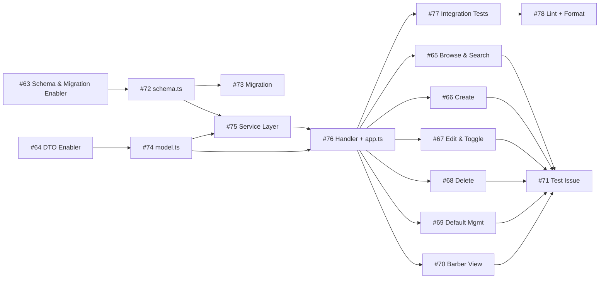

# Project Plan: Service Management

**Version:** 1.0  
**Date:** April 26, 2026  
**Status:** Draft  
**Feature PRD:** [prd.md](./prd.md)  
**Implementation Plan:** [implementation-plan.md](./implementation-plan.md)

---

## Work Item Hierarchy

```
Epic: Cukkr — Barbershop Management & Booking System
└── Feature: Service Management (#62)
    ├── Enabler: services Table DB Schema & Migration (#63)
    ├── Enabler: TypeBox DTOs & Model Definitions for Service Management (#64)
    ├── User Story: Browse & Search Services (#65)
    ├── User Story: Create a Service (#66)
    ├── User Story: Edit & Toggle a Service (#67)
    ├── User Story: Delete a Service (#68)
    ├── User Story: Default Service Management (#69)
    ├── User Story: Barber View Active Services (#70)
    └── Test: Service Management Integration Tests (#71)
        ├── Task: Create src/modules/service-management/schema.ts (#72)
        ├── Task: Generate & apply migration (add-services-table) (#73)
        ├── Task: Create src/modules/service-management/model.ts (#74)
        ├── Task: Implement ServiceManagementService (#75)
        ├── Task: Create src/modules/service-management/handler.ts + register in app.ts (#76)
        ├── Task: Create tests/modules/service-management.test.ts (#77)
        └── Task: Run lint:fix + format — service management quality gate (#78)
```

---

## Issue Breakdown

### Feature: Service Management — #62

```markdown
# Feature: Service Management

## Feature Description

Provide barbershop owners with a complete service catalog management system. Owners can create,
edit, activate/deactivate, delete, and mark a single default service per organization. Services
are multi-tenant isolated via organizationId and directly feed into the booking workflow as the
canonical source of service names, prices, durations, and discounts.

## User Stories in this Feature

- [ ] #65 — Browse & Search Services
- [ ] #66 — Create a Service
- [ ] #67 — Edit & Toggle a Service
- [ ] #68 — Delete a Service
- [ ] #69 — Default Service Management
- [ ] #70 — Barber View Active Services

## Technical Enablers

- [ ] #63 — services Table DB Schema & Migration
- [ ] #64 — TypeBox DTOs & Model Definitions for Service Management

## Dependencies

**Blocked by**: #28 (Feature: Onboarding — org context must exist before services can be scoped)

## Acceptance Criteria

- [ ] All 7 CRUD + business-rule endpoints exist under /api/services and respond as specified in the PRD
- [ ] Multi-tenant isolation: every DB query filters by organizationId from session context
- [ ] isDefault is never mutated via the generic PATCH update endpoint
- [ ] set-default transition is atomic (single DB transaction)
- [ ] Deactivating the default service also clears isDefault
- [ ] Deleting the default service returns 400
- [ ] All endpoints return 401 for unauthenticated requests
- [ ] All endpoints return the correct HTTP status codes per the PRD error-handling table

## Definition of Done

- [ ] All user stories delivered
- [ ] Technical enablers completed
- [ ] Integration tests passing (bun test tests/modules/service-management.test.ts)
- [ ] Lint and format checks passing (bun run lint:fix && bun run format)
- [ ] Migration generated, reviewed, and applied

## Labels

`feature`, `priority-high`, `value-high`, `backend`

## Epic

Cukkr — Barbershop Management & Booking System

## Estimate

L (≈ 25–30 story points total)
```

---

### Enabler: services Table DB Schema & Migration — #63

```markdown
# Technical Enabler: services Table DB Schema & Migration

## Enabler Description

Create the Drizzle table definition for the `services` entity, register it in
`drizzle/schemas.ts`, generate the migration, and apply it. This table is the
persistence foundation for every service-management endpoint.

## Technical Requirements

- [ ] Define `services` table in `src/modules/service-management/schema.ts`:
      id (UUID PK), organizationId (FK → organization.id), name (varchar 100, not null),
      description (text, nullable), price (integer, not null), duration (integer, not null),
      discount (integer, not null, default 0), isActive (boolean, default false),
      isDefault (boolean, default false), createdAt, updatedAt (timestamps, default now)
- [ ] Add composite b-tree indexes: (organizationId, isActive), (organizationId, createdAt),
      (organizationId, name), (organizationId, isDefault)
- [ ] Export schema from `drizzle/schemas.ts`
- [ ] Generate migration with `bunx drizzle-kit generate --name add-services-table`
- [ ] Validate generated SQL with `bunx drizzle-kit check`
- [ ] Apply migration with `bunx drizzle-kit migrate`

## Implementation Tasks

- [ ] #72 — Create src/modules/service-management/schema.ts
- [ ] #73 — Generate & apply migration (add-services-table)

## User Stories Enabled

This enabler supports:

- #65 — Browse & Search Services
- #66 — Create a Service
- #67 — Edit & Toggle a Service
- #68 — Delete a Service
- #69 — Default Service Management
- #70 — Barber View Active Services

## Acceptance Criteria

- [ ] `services` table exists in the database after migration
- [ ] All four composite indexes are present
- [ ] Foreign key from `organizationId` to `organization.id` is enforced
- [ ] `drizzle-kit check` passes without conflicts
- [ ] TypeScript types inferred from schema compile without errors

## Definition of Done

- [ ] Implementation completed
- [ ] Migration applied in dev environment
- [ ] Schema exported and visible to drizzle tooling
- [ ] Code review approved

## Labels

`enabler`, `priority-high`, `backend`, `database`

## Feature

#62

## Estimate

3 points
```

---

### Enabler: TypeBox DTOs & Model Definitions for Service Management — #64

```markdown
# Technical Enabler: TypeBox DTOs & Model Definitions for Service Management

## Enabler Description

Define all request/response TypeBox schemas in `src/modules/service-management/model.ts`.
These DTOs are the single source of truth for validation constraints, HTTP shape, and
TypeScript inference across handler and service layers.

## Technical Requirements

- [ ] `CreateServiceBody`: name (string, minLength 1, maxLength 100), description? (maxLength 500),
      price (integer, minimum 0), duration (integer, minimum 1), discount? (integer, 0–100)
- [ ] `UpdateServiceBody`: all fields from CreateServiceBody optional; `isDefault` must be
      explicitly absent (use `Omit` or exclude from schema)
- [ ] `ListServicesQuery`: search? (string), sort? (enum: name_asc|name_desc|price_asc|price_desc|recent),
      activeOnly? (boolean)
- [ ] `ServiceIdParam`: id (string UUID)
- [ ] `ServiceDto` response shape: full service record (id, organizationId, name, description,
      price, duration, discount, isActive, isDefault, createdAt, updatedAt)

## Implementation Tasks

- [ ] #74 — Create src/modules/service-management/model.ts

## User Stories Enabled

All service-management user stories (#65–#70).

## Acceptance Criteria

- [ ] All schemas compile under strict TypeScript
- [ ] Validation errors on missing name, negative price, out-of-range discount return 422
- [ ] `isDefault` is not present in UpdateServiceBody
- [ ] Sort enum values match PRD exactly

## Definition of Done

- [ ] Implementation completed
- [ ] No `any` types used
- [ ] Code review approved

## Labels

`enabler`, `priority-high`, `backend`

## Feature

#62

## Estimate

2 points
```

---

### User Story: Browse & Search Services — #65

```markdown
# User Story: Browse & Search Services

## Story Statement

As an **owner**, I want to see a filterable, searchable, sortable list of all services in
my active barbershop so that I can review, find, and manage the service catalog efficiently.

## Acceptance Criteria

- [ ] GET /api/services returns all services scoped to the active organization (200)
- [ ] GET /api/services?activeOnly=true returns only services with isActive = true
- [ ] GET /api/services?search=haircut returns only services whose name contains "haircut" (case-insensitive)
- [ ] GET /api/services?sort=price_asc returns services ordered by price ascending
- [ ] GET /api/services?sort=price_desc, name_asc, name_desc, recent each produce correct ordering
- [ ] GET /api/services/:id returns a single service owned by the active org (200)
- [ ] GET /api/services/:id for an ID owned by another org returns 404
- [ ] 401 for unauthenticated requests

## Technical Tasks

- [ ] #75 — Implement ServiceManagementService (listServices, getService methods)
- [ ] #76 — Create handler routes: GET /api/services, GET /api/services/:id

## Testing Requirements

- [ ] #77 — Cover all list-filtering, sort, search, and get scenarios

## Dependencies

**Blocked by**: #63 (schema), #64 (DTOs)

## Definition of Done

- [ ] Acceptance criteria met
- [ ] Code review approved
- [ ] Integration tests passing

## Labels

`user-story`, `priority-high`, `backend`

## Feature

#62

## Estimate

3 points
```

---

### User Story: Create a Service — #66

```markdown
# User Story: Create a Service

## Story Statement

As an **owner**, I want to create a new service with a name, description, price, duration,
and optional discount so that customers can see and select it during booking.

## Acceptance Criteria

- [ ] POST /api/services with valid name, price, duration returns 201 with full ServiceDto
- [ ] Created service has isActive = false, isDefault = false, discount = 0 by default
- [ ] organizationId is taken from the session (never from the request body)
- [ ] POST with missing name returns 422
- [ ] POST with price < 0 returns 422
- [ ] POST with duration < 1 returns 422
- [ ] POST with discount outside 0–100 returns 422
- [ ] 401 for unauthenticated requests

## Technical Tasks

- [ ] #75 — Implement ServiceManagementService.createService
- [ ] #76 — Create handler route: POST /api/services

## Testing Requirements

- [ ] #77 — Cover valid create, validation failures

## Dependencies

**Blocked by**: #63 (schema), #64 (DTOs)

## Definition of Done

- [ ] Acceptance criteria met
- [ ] Code review approved
- [ ] Integration tests passing

## Labels

`user-story`, `priority-high`, `backend`

## Feature

#62

## Estimate

2 points
```

---

### User Story: Edit & Toggle a Service — #67

```markdown
# User Story: Edit & Toggle a Service

## Story Statement

As an **owner**, I want to partially update a service's editable fields and quickly toggle its
active state so that I can keep the catalog current and control service visibility.

## Acceptance Criteria

- [ ] PATCH /api/services/:id with a subset of fields updates only those fields; updatedAt refreshed
- [ ] PATCH /api/services/:id with isDefault in body returns 400 ("Default service must be updated via set-default endpoint")
- [ ] PATCH /api/services/:id for an ID not in the active org returns 404
- [ ] PATCH /api/services/:id/toggle-active flips isActive (inactive → active and active → inactive)
- [ ] PATCH /api/services/:id/toggle-active on the default service when deactivating also clears isDefault = false
- [ ] toggle-active for an ID not in the active org returns 404
- [ ] 401 for unauthenticated requests on both endpoints

## Technical Tasks

- [ ] #75 — Implement ServiceManagementService.updateService, toggleActive
- [ ] #76 — Create handler routes: PATCH /api/services/:id, PATCH /api/services/:id/toggle-active

## Testing Requirements

- [ ] #77 — Cover partial update, isDefault guard, toggle scenarios, toggle-default side effect

## Dependencies

**Blocked by**: #63 (schema), #64 (DTOs), #66 (create — needs services to update)

## Definition of Done

- [ ] Acceptance criteria met
- [ ] Code review approved
- [ ] Integration tests passing

## Labels

`user-story`, `priority-high`, `backend`

## Feature

#62

## Estimate

3 points
```

---

### User Story: Delete a Service — #68

```markdown
# User Story: Delete a Service

## Story Statement

As an **owner**, I want to delete a service that is no longer offered so that the catalog stays
clean, with a safeguard preventing accidental deletion of the current default service.

## Acceptance Criteria

- [ ] DELETE /api/services/:id for a non-default service returns 200 and service is permanently removed
- [ ] DELETE /api/services/:id for the current default service returns 400 ("Cannot delete the default service. Please set a new default first.")
- [ ] DELETE /api/services/:id for an ID not in the active org returns 404
- [ ] 401 for unauthenticated requests

## Technical Tasks

- [ ] #75 — Implement ServiceManagementService.deleteService
- [ ] #76 — Create handler route: DELETE /api/services/:id

## Testing Requirements

- [ ] #77 — Cover non-default delete, default-delete guard, 404 path

## Dependencies

**Blocked by**: #63 (schema), #64 (DTOs)

## Definition of Done

- [ ] Acceptance criteria met
- [ ] Code review approved
- [ ] Integration tests passing

## Labels

`user-story`, `priority-high`, `backend`

## Feature

#62

## Estimate

2 points
```

---

### User Story: Default Service Management — #69

```markdown
# User Story: Default Service Management

## Story Statement

As an **owner**, I want to mark exactly one active service as the organization default so that
it is pre-selected when a new booking is created, and I want the system to prevent invalid
default states automatically.

## Acceptance Criteria

- [ ] PATCH /api/services/:id/set-default on an active service returns 200; the target gets isDefault = true
- [ ] Any previously default service in the same org has isDefault cleared to false in the same transaction
- [ ] PATCH /api/services/:id/set-default on an inactive service returns 400 ("Service must be active to be set as default")
- [ ] set-default for an ID not in the active org returns 404
- [ ] Only one service per organization can have isDefault = true after any set-default call
- [ ] 401 for unauthenticated requests

## Technical Tasks

- [ ] #75 — Implement ServiceManagementService.setDefault (transactional clear + set)
- [ ] #76 — Create handler route: PATCH /api/services/:id/set-default

## Testing Requirements

- [ ] #77 — Cover active→default promotion, previous default clearing, inactive guard

## Dependencies

**Blocked by**: #63 (schema), #64 (DTOs), #66 (needs at least one service to operate on)

## Definition of Done

- [ ] Acceptance criteria met
- [ ] Transactional integrity verified
- [ ] Code review approved
- [ ] Integration tests passing

## Labels

`user-story`, `priority-high`, `backend`

## Feature

#62

## Estimate

3 points
```

---

### User Story: Barber View Active Services — #70

```markdown
# User Story: Barber View Active Services

## Story Statement

As a **barber**, I want to view the active services of my organization when creating a booking
so that I can select the correct service for a customer.

## Acceptance Criteria

- [ ] GET /api/services?activeOnly=true returns only active services for an authenticated barber in the active org
- [ ] 401 for unauthenticated requests
- [ ] Barber cannot see services from another organization

## Technical Tasks

- [ ] #76 — Reuse GET /api/services handler (no additional endpoint needed for MVP; activeOnly filter covers this)

## Testing Requirements

- [ ] #77 — Cover barber-authenticated list request with activeOnly=true

## Dependencies

**Blocked by**: #63 (schema), #64 (DTOs), #65 (list endpoint)

## Definition of Done

- [ ] Acceptance criteria met
- [ ] Code review approved
- [ ] Integration tests passing

## Labels

`user-story`, `priority-medium`, `backend`

## Feature

#62

## Estimate

1 point
```

---

### Test: Service Management Integration Tests — #71

```markdown
# Test: Service Management Integration Tests

## Test Description

End-to-end integration test suite for all service-management endpoints using Bun test runner
and Eden Treaty. Two independent organizations are created to verify cross-tenant isolation.

## Test Scenarios

| Area | Scenario |
|---|---|
| Authentication | 401 for unauthenticated POST, PATCH, DELETE |
| Org context | Request without active org fails |
| Create (valid) | Returns 201, defaults isActive=false, isDefault=false, discount=0 |
| Create (invalid) | Missing name → 422; price < 0 → 422; duration < 1 → 422; discount > 100 → 422 |
| List (all) | Returns all org services |
| List (activeOnly) | Returns only isActive=true services |
| List (search) | Case-insensitive partial name match |
| List (sort) | name_asc, name_desc, price_asc, price_desc, recent each produce correct order |
| Get (found) | Returns the correct service |
| Get (404) | Cross-org ID returns 404 |
| Update (partial) | Only supplied fields change; updatedAt refreshes |
| Update (isDefault guard) | Including isDefault in body returns 400 |
| Toggle (inactive → active) | isActive becomes true |
| Toggle (default → inactive) | isActive becomes false AND isDefault cleared |
| Set default (active target) | Target becomes sole default; previous default cleared |
| Set default (inactive guard) | Returns 400 |
| Delete (non-default) | Service is removed (200) |
| Delete (default guard) | Returns 400 |
| Tenant isolation | Org A cannot read/write/toggle/delete/set-default Org B service IDs |

## Implementation Tasks

- [ ] #77 — Create tests/modules/service-management.test.ts

## Dependencies

**Blocked by**: #72, #73, #74, #75, #76 (all implementation tasks)

## Acceptance Criteria

- [ ] All scenarios in the table above have a corresponding test case
- [ ] Two separate organizations are used for isolation tests
- [ ] bun test tests/modules/service-management.test.ts passes with 0 failures

## Definition of Done

- [ ] All test scenarios covered
- [ ] Tests pass in CI
- [ ] No skipped tests

## Labels

`test`, `priority-high`, `backend`

## Feature

#62

## Estimate

5 points
```

---

### Task Issues (#72–#78)

| # | Title | Priority | Est | Blocked by |
|---|---|---|---|---|
| #72 | Task: Create src/modules/service-management/schema.ts | high | 1 pt | — |
| #73 | Task: Generate & apply migration (add-services-table) | high | 1 pt | #72 |
| #74 | Task: Create src/modules/service-management/model.ts | high | 1 pt | — |
| #75 | Task: Implement ServiceManagementService (list, get, create, update, delete, toggle-active, set-default) | high | 5 pt | #72, #74 |
| #76 | Task: Create src/modules/service-management/handler.ts + register in app.ts | high | 3 pt | #74, #75 |
| #77 | Task: Create tests/modules/service-management.test.ts (full suite) | high | 5 pt | #75, #76 |
| #78 | Task: Run lint:fix + format — service management quality gate | high | 1 pt | #77 |

---

## Dependency Graph



---

## Sprint Plan

### Sprint 1 — Foundation (8 story points)

**Goal:** Schema, DTOs, and service-layer business logic ready; no HTTP surface yet.

| Issue | Title | Points |
|---|---|---|
| #72 | Create schema.ts | 1 |
| #73 | Generate & apply migration | 1 |
| #74 | Create model.ts | 1 |
| #75 | Implement ServiceManagementService | 5 |

**Success Criteria:** Migration applied, all service-layer methods unit-verifiable in isolation.

### Sprint 2 — HTTP Surface + Tests (14 story points)

**Goal:** All endpoints live, integration tests passing, lint clean.

| Issue | Title | Points |
|---|---|---|
| #76 | Create handler.ts + register in app.ts | 3 |
| #77 | Create service-management.test.ts | 5 |
| #78 | Lint + format quality gate | 1 |
| #65 | Browse & Search Services story | 3 |
| #66 | Create a Service story | 2 |

**Success Criteria:** `bun test tests/modules/service-management.test.ts` passes; feature-ready for review.

### Sprint 3 — Business Rules Verification (9 story points)

**Goal:** Delete, toggle, and default management stories verified and signed off.

| Issue | Title | Points |
|---|---|---|
| #67 | Edit & Toggle a Service story | 3 |
| #68 | Delete a Service story | 2 |
| #69 | Default Service Management story | 3 |
| #70 | Barber View Active Services story | 1 |

**Success Criteria:** All AC scenarios passing; feature marked done.

---

## Definition of Done — Feature Level

- [ ] All 7 API endpoints respond as specified (201/200/400/401/404/422)
- [ ] Multi-tenant isolation confirmed by cross-org tests
- [ ] `set-default` is transactional
- [ ] Deactivating the default service auto-clears `isDefault`
- [ ] Deleting the default service returns 400
- [ ] Migration applied and validated
- [ ] `bun test tests/modules/service-management.test.ts` → 0 failures
- [ ] `bun run lint:fix` → 0 errors
- [ ] `bun run format` → no uncommitted formatting changes
- [ ] No `any` types in new code
- [ ] No plain `Error` throws (only `AppError`)
