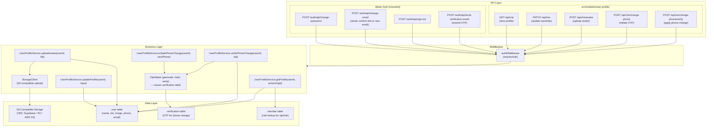
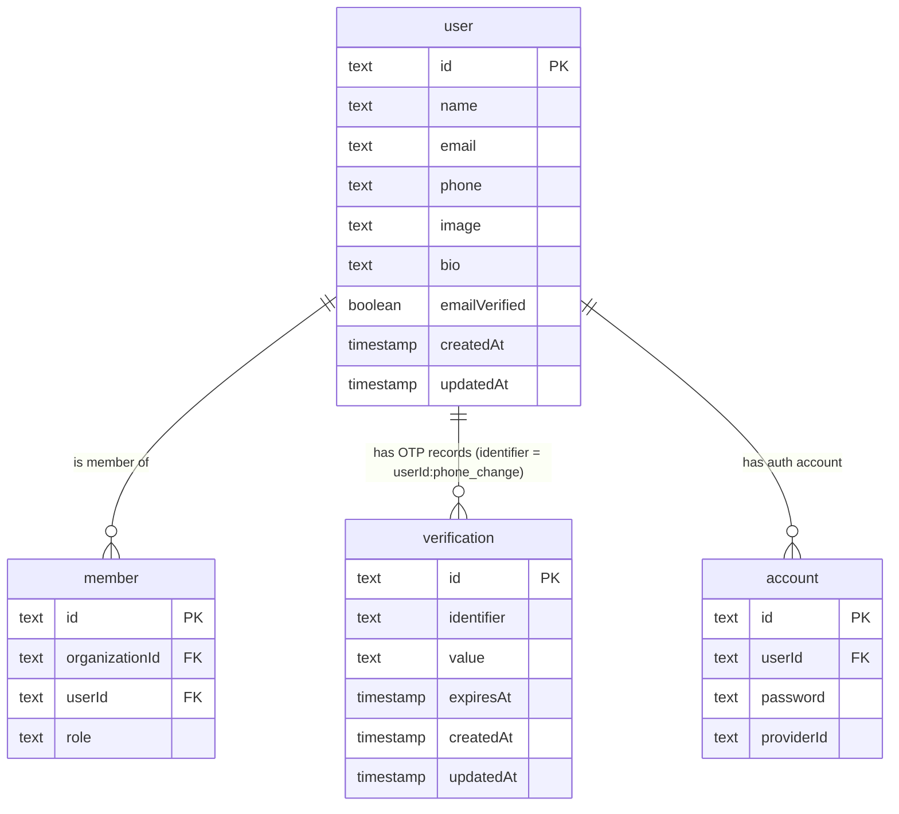

# Implementation Plan: User Profile

**Version:** 1.0
**Date:** April 27, 2026
**Status:** Draft

- **PRD:** [user-profile/prd.md](./prd.md)
- **Epic:** [epic.md](../epic.md)

---

## Goal

Create a new `user-profile` module (`src/modules/user-profile/`) that exposes self-service profile management endpoints for both owners and barbers. The module provides: view and update profile (name, bio), avatar upload to S3-compatible storage, change password, change email (OTP-verified), change phone (OTP-verified), and logout. Most credential management operations (change password, change email, logout) are already handled by Better Auth's built-in endpoints — this module wraps and augments them with the custom `name`, `bio`, `phone`, and `avatarUrl` fields stored on the `user` table.

---

## Requirements

- `GET /api/me` — return current user profile (name, bio, avatarUrl, email, phone, role in active org).
- `PATCH /api/me` — update `name` and/or `bio` on the `user` record.
- `POST /api/me/avatar` — upload avatar image; store in S3-compatible storage; update `user.image` URL.
- Change password → delegate to Better Auth: `POST /auth/api/change-password`.
- Change email → delegate to Better Auth: `POST /auth/api/change-email` (OTP flow already configured in `src/lib/auth.ts` with `updateEmailWithoutVerification: true`).
- Change phone → custom OTP flow via `POST /api/me/change-phone` + `POST /api/me/change-phone/verify`.
- Logout → delegate to Better Auth: `POST /auth/api/sign-out`.
- No new database tables. The `user` table already has `name`, `email`, `phone`, `image`, `bio` columns.

---

## Technical Considerations

### System Architecture Overview



### Technology Stack

| Layer | Choice | Rationale |
|---|---|---|
| Routing | Elysia group `/api/me` | Standard module pattern |
| Auth | `authMiddleware` + `requireAuth: true` | No org scope needed — profile is user-level |
| Change password / email / logout | Better Auth built-in endpoints | Already configured; no re-implementation needed |
| Phone OTP | Custom — `verification` table + `src/lib/mail.ts` (or SMS future) | Better Auth `emailOTP` plugin handles email OTPs; phone OTPs need a thin custom layer using the same `verification` table |
| Avatar storage | S3-compatible client (`@aws-sdk/client-s3` or Supabase SDK) | TBD per Open Question #8; abstract behind a `StorageClient` interface for swappability |
| File validation | Server-side MIME check + size check via Elysia file upload | Consistent with AGENTS.md security requirements |

### Database Schema Design

No new tables. The existing `user` and `verification` tables cover all requirements.



#### Phone OTP Storage Convention

The `verification` table (managed by Better Auth) uses an `identifier` field to key OTP records. For the custom phone-change flow:

- `identifier` = `phone_change:{userId}:{newPhone}` — scopes the OTP to the user + new phone combination.
- `value` = bcrypt hash of the 6-digit OTP.
- `expiresAt` = `now() + 5 minutes`.
- On verify: fetch by identifier, bcrypt compare, check expiry, update `user.phone`, delete the verification record.

#### Migration Strategy

No schema migrations needed. The `user` table already has `phone` and `bio` columns (confirmed in `src/modules/auth/schema.ts`). If avatar storage URL format requires a schema change, it is already covered by `user.image`.

---

### API Design

#### `GET /api/me`

- **Auth:** `requireAuth: true` (no org required)
- **Response `200`:**

```typescript
{
  data: {
    id: string
    name: string
    bio: string | null
    avatarUrl: string | null   // maps to user.image
    email: string
    phone: string | null
    emailVerified: boolean
    role: "owner" | "barber" | null   // role in activeOrganizationId, null if no active org
    createdAt: string
    updatedAt: string
  }
}
```

- **Logic:** Query `user` by session `userId`. If `activeOrganizationId` present in session, also query `member` to get role.

#### `PATCH /api/me`

- **Auth:** `requireAuth: true`
- **Body:**

```typescript
{
  name?: string   // minLength: 1, maxLength: 100
  bio?: string    // maxLength: 300, nullable
}
```

- **Response `200`:** Updated user profile (same shape as `GET /api/me` response)
- **Error codes:**
  - `422` — name empty or exceeds 100 chars; bio exceeds 300 chars

#### `POST /api/me/avatar`

- **Auth:** `requireAuth: true`
- **Body:** `multipart/form-data` with `file` field
- **Validations (server-side):**
  - MIME type must be `image/jpeg`, `image/png`, or `image/webp`
  - File size ≤ 5 MB (5,242,880 bytes)
- **Logic:**
  1. Validate MIME + size.
  2. Generate a unique object key: `avatars/{userId}/{nanoid()}.{ext}`.
  3. Upload to S3-compatible storage.
  4. Update `user.image = publicUrl`.
  5. Return `{ avatarUrl }`.
- **Response `200`:** `{ data: { avatarUrl: string } }`
- **Error codes:**
  - `422` — invalid MIME type or file exceeds 5 MB

#### `POST /api/me/change-phone`

- **Auth:** `requireAuth: true`
- **Body:** `{ phone: string }` — E.164 format or local Indonesian format
- **Logic:**
  1. Validate phone format.
  2. Check that `phone` is not already registered to another user.
  3. Generate 6-digit OTP; bcrypt hash it.
  4. Upsert `verification` record with `identifier = phone_change:{userId}:{phone}`, `value = hash`, `expiresAt = now() + 5min`.
  5. Send OTP to new phone (SMS or in-app notification — channel TBD; log to console in MVP).
  6. Also send OTP to current phone for old-contact verification.
- **Response `202`:** `{ message: "OTP sent to both old and new phone numbers" }`
- **Error codes:**
  - `400` — invalid phone format
  - `409` — phone already registered to another user

#### `POST /api/me/change-phone/verify`

- **Auth:** `requireAuth: true`
- **Body:** `{ phone: string, otp: string }` — the new phone and the OTP entered
- **Logic:**
  1. Fetch `verification` by `identifier = phone_change:{userId}:{phone}`.
  2. Check `expiresAt > now()`.
  3. bcrypt compare `otp` with stored hash.
  4. On success: update `user.phone = phone`, delete verification record.
  5. On failure: track failed attempts (use a simple counter in verification metadata or a separate in-memory map for MVP); after 5 failures, delete verification record and return `429`.
- **Response `200`:** Updated user profile
- **Error codes:**
  - `400` — invalid OTP or expired
  - `429` — too many failed attempts

#### Better Auth Endpoints (Delegated — No Custom Code)

| Endpoint | Purpose | Notes |
|---|---|---|
| `POST /auth/api/change-password` | Change password | Requires `currentPassword` + `newPassword`. Min 8 chars enforced by Better Auth config. |
| `POST /auth/api/change-email` | Initiate email change | Configured with `updateEmailWithoutVerification: true` + `sendChangeEmailConfirmation` callback in `src/lib/auth.ts`. Sends confirmation link to new email. |
| `POST /auth/api/sign-out` | Logout | Clears session cookie. |

> The mobile app calls these Better Auth routes directly. The custom `user-profile` module does NOT re-wrap them.

#### Multi-Tenant Scoping

User profile is **user-level, not org-level**. No `organizationId` filtering. The role field in `GET /api/me` is a derived field from `member` using the current `activeOrganizationId` in the session — it is informational only and does not restrict access.

---

### Security & Performance

| Concern | Approach |
|---|---|
| Session authentication | All endpoints require `requireAuth: true`; unauthenticated returns `401` |
| Password change | Fully delegated to Better Auth; `currentPassword` is verified server-side before update |
| OTP security | 6-digit OTP stored bcrypt-hashed in `verification` table; raw OTP never logged or returned |
| OTP brute-force | Max 5 failed verification attempts; 6th attempt returns `429` and invalidates the OTP session |
| OTP expiry | 5-minute expiry enforced at verify time; expired OTPs return `400` |
| Phone uniqueness | Before sending OTP, check `user.phone` uniqueness; conflict returns `409` |
| Avatar upload security | Server validates MIME type by inspecting file bytes (not just Content-Type header); max 5 MB enforced |
| Avatar URL guessing | Object keys use `nanoid()` randomization — not guessable |
| Self-modification only | Service always uses `userId` from the session — users cannot modify other users' profiles |
| Performance | `GET /api/me` is a single PK lookup on `user` table — ≤ 50ms; `PATCH /api/me` is a single PK update |
| Avatar upload performance | Target ≤ 2s for 5 MB on 4G — handled by streaming the upload directly to S3 without buffering in memory |

---

## File Checklist

```
src/modules/user-profile/
  handler.ts    [NEW]  — GET /me, PATCH /me, POST /me/avatar,
                         POST /me/change-phone, POST /me/change-phone/verify
  model.ts      [NEW]  — UserProfileResponse, UpdateProfileInput,
                         AvatarUploadResponse, ChangePhoneInput, VerifyPhoneInput
  service.ts    [NEW]  — getProfile, updateProfile, uploadAvatar,
                         initiatePhoneChange, verifyPhoneChange

src/lib/storage.ts   [NEW]  — StorageClient abstraction (upload, getPublicUrl)
                               wraps S3-compatible SDK; configured via env vars

src/app.ts   [MODIFY]  — register userProfileHandler

tests/modules/user-profile.test.ts   [NEW]  — integration tests
```

> No `schema.ts` needed — this module has no new tables.

---

## Test Plan

Test file: `tests/modules/user-profile.test.ts`

| ID | Test Case | Expected |
|---|---|---|
| T-01 | `GET /api/me` authenticated | 200, full profile |
| T-02 | `GET /api/me` unauthenticated | 401 |
| T-03 | `PATCH /api/me` update name | 200, name updated |
| T-04 | `PATCH /api/me` update bio | 200, bio updated |
| T-05 | `PATCH /api/me` empty name | 422 |
| T-06 | `PATCH /api/me` name > 100 chars | 422 |
| T-07 | `PATCH /api/me` bio > 300 chars | 422 |
| T-08 | `POST /api/me/avatar` valid JPEG ≤ 5 MB | 200, avatarUrl returned |
| T-09 | `POST /api/me/avatar` invalid MIME type | 422 |
| T-10 | `POST /api/me/avatar` file > 5 MB | 422 |
| T-11 | `POST /api/me/change-phone` valid phone | 202 |
| T-12 | `POST /api/me/change-phone` phone already taken | 409 |
| T-13 | `POST /api/me/change-phone/verify` correct OTP | 200, phone updated |
| T-14 | `POST /api/me/change-phone/verify` wrong OTP | 400 |
| T-15 | `POST /api/me/change-phone/verify` expired OTP | 400 |
| T-16 | Better Auth `POST /auth/api/change-password` correct password | 200 |
| T-17 | Better Auth `POST /auth/api/change-password` wrong current password | 400 |
| T-18 | Better Auth `POST /auth/api/sign-out` | 200, session cleared |
