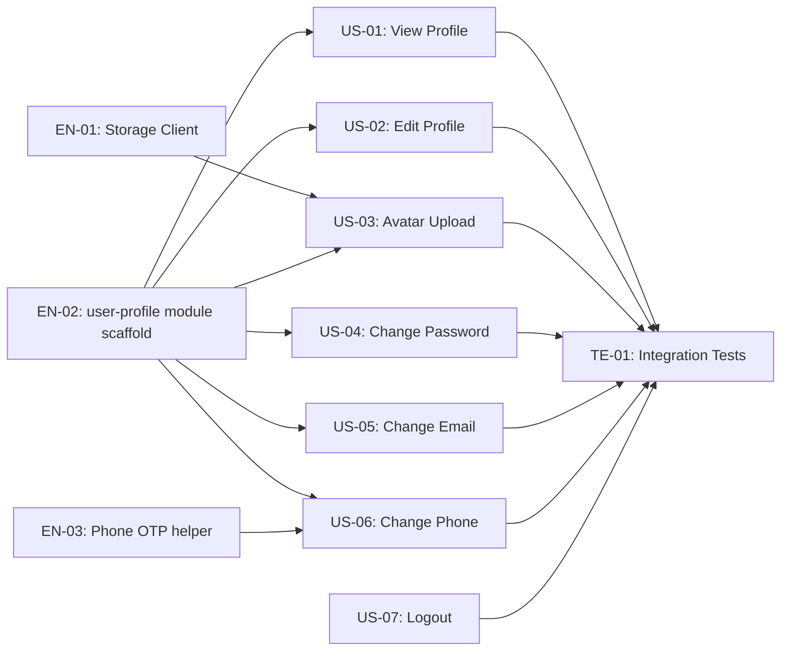

# Project Plan: User Profile

**Version:** 1.0
**Date:** April 27, 2026
**Feature:** User Profile
**Epic:** Cukkr — Barbershop Management & Booking System

---

## Overview

This plan breaks down the **User Profile** feature into a full GitHub Issues hierarchy following the Agile work item structure: Epic → Feature → Story/Enabler → Task/Test. It covers all self-service profile management capabilities for owners and barbers: view/edit profile, avatar upload, change password/email/phone (OTP-verified), and logout.

---

## Dependency Graph



---

## Issue Hierarchy

### EPIC — Issue #E-01

```markdown
# Epic: Cukkr — Barbershop Management & Booking System

## Epic Description

A multi-tenant SaaS backend for barbershop owners and barbers built on Bun + Elysia + PostgreSQL. The system covers onboarding, barber management, scheduling & booking, service management, and full user profile self-service — all scoped to organizations (barbershops) and secured via Better Auth sessions.

## Business Value

- **Primary Goal**: Deliver a complete operational platform for barbershop businesses to manage their teams, schedules, and bookings end-to-end.
- **Success Metrics**: All core modules (barber, booking, services, user-profile) pass integration tests; API latency p95 ≤ 300ms on profile endpoints.
- **User Impact**: Owners and barbers gain a single, reliable app for daily operations without requiring manual support for credential or data changes.

## Epic Acceptance Criteria

- [ ] All feature modules are implemented and registered in `src/app.ts`
- [ ] All integration test suites pass (`bun test`)
- [ ] No lint or format errors (`bun run lint:fix && bun run format`)
- [ ] API documentation is up to date

## Features in this Epic

- [ ] #F-01 - User Profile (self-service profile management)
- [ ] #F-02 - Barber Management
- [ ] #F-03 - Schedule & Booking Management
- [ ] #F-04 - Service Management

## Definition of Done

- [ ] All feature stories completed
- [ ] Integration tests passing
- [ ] Lint and format checks passing
- [ ] Performance benchmarks met
- [ ] Documentation updated

## Labels

`epic`, `priority-high`, `value-high`

## Milestone

v1.0 — Cukkr MVP

## Estimate

XL
```

---

### FEATURE — Issue #F-01

```markdown
# Feature: User Profile

## Feature Description

Self-service profile management for both owners and barbers. Provides view/edit of name and bio, avatar upload to S3-compatible storage, OTP-verified phone change, password and email management delegated to Better Auth, and logout. All operations are user-scoped (no org isolation required).

## User Stories in this Feature

- [ ] #US-01 - View Profile
- [ ] #US-02 - Edit Name & Bio
- [ ] #US-03 - Upload Avatar
- [ ] #US-04 - Change Password
- [ ] #US-05 - Change Email
- [ ] #US-06 - Change Phone (OTP)
- [ ] #US-07 - Logout

## Technical Enablers

- [ ] #EN-01 - Storage Client abstraction (S3-compatible)
- [ ] #EN-02 - user-profile module scaffold (handler, model, service)
- [ ] #EN-03 - Phone OTP helper (generate, hash, verify via verification table)

## Dependencies

**Blocks**: None
**Blocked by**: Better Auth session middleware already configured in `src/lib/auth.ts`

## Acceptance Criteria

- [ ] `GET /api/me` returns full user profile for authenticated user; 401 for unauthenticated
- [ ] `PATCH /api/me` updates name and/or bio with proper validation (422 on invalid input)
- [ ] `POST /api/me/avatar` accepts JPEG/PNG/WebP ≤ 5 MB; stores in S3; returns avatarUrl
- [ ] `POST /api/me/change-phone` + `POST /api/me/change-phone/verify` complete the OTP phone-change flow
- [ ] Better Auth routes (`change-password`, `change-email`, `sign-out`) work via existing mount
- [ ] All 18 test cases in `tests/modules/user-profile.test.ts` pass

## Definition of Done

- [ ] All user stories delivered
- [ ] Technical enablers completed
- [ ] Integration tests passing (`bun test user-profile`)
- [ ] Lint and format checks passing
- [ ] No console.log or dead code

## Labels

`feature`, `priority-high`, `value-high`, `backend`

## Epic

#E-01

## Estimate

L (≈ 28 story points)
```

---

### TECHNICAL ENABLERS

#### Enabler #EN-01 — Storage Client Abstraction

```markdown
# Technical Enabler: Storage Client Abstraction (S3-Compatible)

## Enabler Description

Create `src/lib/storage.ts` — a thin `StorageClient` interface wrapping an S3-compatible SDK (`@aws-sdk/client-s3` or Supabase Storage SDK). Abstracts upload and public URL generation so the storage backend can be swapped without changing service code.

## Technical Requirements

- [ ] Define `StorageClient` interface with `upload(key, buffer, mimeType): Promise<string>` and `getPublicUrl(key): string`
- [ ] Implement concrete class backed by environment variables (`STORAGE_ENDPOINT`, `STORAGE_BUCKET`, `STORAGE_ACCESS_KEY`, `STORAGE_SECRET_KEY`)
- [ ] Export singleton `storageClient` instance
- [ ] Add required env vars to `src/lib/env.ts` and `.env.example`

## Implementation Tasks

- [ ] #T-01 - Create `src/lib/storage.ts` with interface + implementation
- [ ] #T-02 - Update `src/lib/env.ts` to expose storage env vars
- [ ] #T-03 - Add storage vars to `.env.example`

## User Stories Enabled

This enabler supports:

- #US-03 - Upload Avatar

## Acceptance Criteria

- [ ] `storageClient.upload()` uploads a buffer and returns the public URL
- [ ] Storage credentials sourced exclusively from `src/lib/env.ts` (never `process.env` directly)
- [ ] Interface is swappable without touching `UserProfileService`

## Definition of Done

- [ ] Implementation completed
- [ ] Unit tests written (mocked storage)
- [ ] Integration tests passing
- [ ] Documentation updated in `.env.example`
- [ ] Code review approved

## Labels

`enabler`, `priority-high`, `backend`, `infrastructure`

## Feature

#F-01

## Estimate

3 points
```

---

#### Enabler #EN-02 — user-profile Module Scaffold

```markdown
# Technical Enabler: user-profile Module Scaffold

## Enabler Description

Bootstrap the `src/modules/user-profile/` directory following the canonical `product-example` pattern. Create empty-but-typed `handler.ts`, `model.ts`, and `service.ts` files; register the handler in `src/app.ts`.

## Technical Requirements

- [ ] `handler.ts` — Elysia group at `/api/me` with `requireAuth: true` on all routes
- [ ] `model.ts` — TypeBox DTOs: `UserProfileResponse`, `UpdateProfileInput`, `AvatarUploadResponse`, `ChangePhoneInput`, `VerifyPhoneInput`
- [ ] `service.ts` — `UserProfileService` class with method stubs
- [ ] Register handler in `src/app.ts`

## Implementation Tasks

- [ ] #T-04 - Scaffold `src/modules/user-profile/model.ts`
- [ ] #T-05 - Scaffold `src/modules/user-profile/handler.ts`
- [ ] #T-06 - Scaffold `src/modules/user-profile/service.ts`
- [ ] #T-07 - Register `userProfileHandler` in `src/app.ts`

## User Stories Enabled

This enabler supports:

- #US-01 - View Profile
- #US-02 - Edit Name & Bio
- #US-03 - Upload Avatar
- #US-04 - Change Password
- #US-05 - Change Email
- #US-06 - Change Phone (OTP)

## Acceptance Criteria

- [ ] Module directory structure matches canonical `product-example` pattern
- [ ] All DTOs are defined with proper TypeBox types (no `any`)
- [ ] Handler registered in `src/app.ts` and server starts without errors
- [ ] `bun run build` succeeds

## Definition of Done

- [ ] Implementation completed
- [ ] Build passes
- [ ] Code review approved

## Labels

`enabler`, `priority-critical`, `backend`, `scaffold`

## Feature

#F-01

## Estimate

2 points
```

---

#### Enabler #EN-03 — Phone OTP Helper

```markdown
# Technical Enabler: Phone OTP Helper

## Enabler Description

Implement a reusable OTP helper that integrates with Better Auth's `verification` table for the custom phone-change flow. Covers generation, bcrypt hashing, upsert, verification, attempt tracking, and expiry.

## Technical Requirements

- [ ] `generateOtp(): string` — cryptographically random 6-digit code
- [ ] `hashOtp(otp): Promise<string>` — bcrypt hash with cost 10
- [ ] `storeOtp(db, identifier, hashedOtp, expiresAt)` — upsert to `verification` table
- [ ] `verifyOtp(db, identifier, otp): Promise<'ok' | 'invalid' | 'expired' | 'too_many_attempts'>` — fetch, bcrypt compare, check expiry, track attempts
- [ ] Identifier convention: `phone_change:{userId}:{newPhone}`
- [ ] Max 5 failed attempts before invalidation

## Implementation Tasks

- [ ] #T-08 - Implement OTP helper in `src/utils/otp.ts`
- [ ] #T-09 - Write unit tests for OTP helper

## User Stories Enabled

This enabler supports:

- #US-06 - Change Phone (OTP)

## Acceptance Criteria

- [ ] OTP stored as bcrypt hash; raw OTP never logged or returned
- [ ] Expiry enforced at verify time (5-minute window)
- [ ] 6th attempt returns `too_many_attempts` and deletes verification record
- [ ] Unit tests cover all result variants

## Definition of Done

- [ ] Implementation completed
- [ ] Unit tests written and passing
- [ ] Code review approved

## Labels

`enabler`, `priority-high`, `backend`, `security`

## Feature

#F-01

## Estimate

3 points
```

---

### USER STORIES

#### Story #US-01 — View Profile

```markdown
# User Story: View Profile

## Story Statement

As a **User (Owner / Barber)**, I want to view my current profile information so that I can confirm my name, bio, avatar, email, phone, and role at a glance.

## Acceptance Criteria

- [ ] `GET /api/me` returns `{ id, name, bio, avatarUrl, email, phone, emailVerified, role, createdAt, updatedAt }` for the authenticated user
- [ ] `role` reflects the user's role in their active organization (`owner` or `barber`); `null` if no active org
- [ ] Unauthenticated request returns `401 Unauthorized`
- [ ] Response time ≤ 50ms (single PK lookup on `user` + optional `member` join)

## Technical Tasks

- [ ] #T-10 - Implement `UserProfileService.getProfile(userId, activeOrgId)` — query `user` + optional `member` join
- [ ] #T-11 - Implement `GET /api/me` handler

## Testing Requirements

- [ ] #TE-01 - T-01: `GET /api/me` authenticated → 200, full profile shape
- [ ] #TE-01 - T-02: `GET /api/me` unauthenticated → 401

## Dependencies

**Blocked by**: #EN-02 (module scaffold)

## Definition of Done

- [ ] Acceptance criteria met
- [ ] Code review approved
- [ ] Unit tests written and passing
- [ ] Integration tests passing

## Labels

`user-story`, `priority-high`, `backend`

## Feature

#F-01

## Estimate

2 points
```

---

#### Story #US-02 — Edit Name & Bio

```markdown
# User Story: Edit Name & Bio

## Story Statement

As a **User**, I want to update my name and bio so that my profile reflects accurate, up-to-date personal information.

## Acceptance Criteria

- [ ] `PATCH /api/me` with `{ name, bio }` returns `200 OK` with updated profile
- [ ] `name` is required; empty string returns `422`
- [ ] `name` > 100 characters returns `422`
- [ ] `bio` > 300 characters returns `422`
- [ ] Only the provided fields are updated (partial update supported)

## Technical Tasks

- [ ] #T-12 - Implement `UserProfileService.updateProfile(userId, input)` — PK update on `user` table
- [ ] #T-13 - Implement `PATCH /api/me` handler with TypeBox validation

## Testing Requirements

- [ ] #TE-01 - T-03: update name → 200
- [ ] #TE-01 - T-04: update bio → 200
- [ ] #TE-01 - T-05: empty name → 422
- [ ] #TE-01 - T-06: name > 100 chars → 422
- [ ] #TE-01 - T-07: bio > 300 chars → 422

## Dependencies

**Blocked by**: #EN-02 (module scaffold), #US-01 (profile shape established)

## Definition of Done

- [ ] Acceptance criteria met
- [ ] Code review approved
- [ ] Integration tests passing

## Labels

`user-story`, `priority-high`, `backend`

## Feature

#F-01

## Estimate

2 points
```

---

#### Story #US-03 — Upload Avatar

```markdown
# User Story: Upload Avatar

## Story Statement

As a **User**, I want to upload or replace my avatar photo so that I appear with a recognizable image in the app.

## Acceptance Criteria

- [ ] `POST /api/me/avatar` with a valid JPEG, PNG, or WebP file ≤ 5 MB returns `200 OK` with `{ avatarUrl }`
- [ ] Unsupported MIME type returns `422 Unprocessable Entity`
- [ ] File > 5 MB returns `422 Unprocessable Entity`
- [ ] The new `avatarUrl` is reflected in subsequent `GET /api/me` responses
- [ ] Object key uses `nanoid()` randomization: `avatars/{userId}/{nanoid()}.{ext}`

## Technical Tasks

- [ ] #T-14 - Implement `UserProfileService.uploadAvatar(userId, file)` — validate → upload → update `user.image`
- [ ] #T-15 - Implement `POST /api/me/avatar` handler (multipart/form-data)

## Testing Requirements

- [ ] #TE-01 - T-08: valid JPEG ≤ 5 MB → 200, avatarUrl returned
- [ ] #TE-01 - T-09: invalid MIME type → 422
- [ ] #TE-01 - T-10: file > 5 MB → 422

## Dependencies

**Blocked by**: #EN-01 (Storage Client), #EN-02 (module scaffold)

## Definition of Done

- [ ] Acceptance criteria met
- [ ] Code review approved
- [ ] Integration tests passing

## Labels

`user-story`, `priority-high`, `backend`, `storage`

## Feature

#F-01

## Estimate

5 points
```

---

#### Story #US-04 — Change Password

```markdown
# User Story: Change Password

## Story Statement

As a **User**, I want to change my password by providing my current password and a new one so that I can keep my account secure without losing my session.

## Acceptance Criteria

- [ ] `POST /auth/api/change-password` with correct `currentPassword` and valid `newPassword` (≥ 8 chars) returns `200 OK`
- [ ] Incorrect `currentPassword` returns `400 Bad Request` with descriptive message
- [ ] `newPassword` with fewer than 8 characters returns `422 Unprocessable Entity`
- [ ] Session remains active after a successful password change (no forced re-login)

## Technical Tasks

- [ ] #T-16 - Verify Better Auth `change-password` is correctly mounted in `src/lib/auth.ts` and reachable; no custom code needed

## Testing Requirements

- [ ] #TE-01 - T-16: correct current password → 200
- [ ] #TE-01 - T-17: wrong current password → 400

## Dependencies

**Blocked by**: Better Auth session already configured (pre-existing)

## Definition of Done

- [ ] Acceptance criteria met
- [ ] Integration tests passing

## Labels

`user-story`, `priority-high`, `backend`, `security`

## Feature

#F-01

## Estimate

1 point
```

---

#### Story #US-05 — Change Email

```markdown
# User Story: Change Email

## Story Statement

As a **User**, I want to change my email address with OTP verification so that my account stays secure when updating contact information.

## Acceptance Criteria

- [ ] `POST /auth/api/change-email` sends confirmation to new email and returns `202` (Better Auth handles this)
- [ ] New email already registered by another user returns `409 Conflict`
- [ ] Invalid or expired OTP returns `400 Bad Request`
- [ ] 6th failed OTP attempt returns `429 Too Many Requests`
- [ ] Session cookie refreshed with new email after successful verification

## Technical Tasks

- [ ] #T-17 - Confirm `updateEmailWithoutVerification: true` + `sendChangeEmailConfirmation` callback in `src/lib/auth.ts`; document flow for team

## Testing Requirements

- [ ] #TE-01 - (Covered via Better Auth route smoke tests in integration suite)

## Dependencies

**Blocked by**: Better Auth email OTP plugin configured (pre-existing)

## Definition of Done

- [ ] Acceptance criteria met
- [ ] Integration tests passing

## Labels

`user-story`, `priority-medium`, `backend`, `security`

## Feature

#F-01

## Estimate

1 point
```

---

#### Story #US-06 — Change Phone (OTP)

```markdown
# User Story: Change Phone (OTP)

## Story Statement

As a **User**, I want to change my phone number using OTP verification so that I can update my contact without risking loss of account access.

## Acceptance Criteria

- [ ] `POST /api/me/change-phone` with a valid phone returns `202 Accepted` and sends OTP
- [ ] New phone already registered to another user returns `409 Conflict`
- [ ] Invalid phone format returns `400 Bad Request`
- [ ] `POST /api/me/change-phone/verify` with correct OTP returns `200 OK` and updates `user.phone`
- [ ] Invalid or expired OTP returns `400 Bad Request`
- [ ] 6th failed attempt returns `429 Too Many Requests` and invalidates OTP session

## Technical Tasks

- [ ] #T-18 - Implement `UserProfileService.initiatePhoneChange(userId, newPhone)` — validate uniqueness → generate OTP → store in `verification` table
- [ ] #T-19 - Implement `POST /api/me/change-phone` handler
- [ ] #T-20 - Implement `UserProfileService.verifyPhoneChange(userId, phone, otp)` — fetch, verify, update `user.phone`, delete record
- [ ] #T-21 - Implement `POST /api/me/change-phone/verify` handler

## Testing Requirements

- [ ] #TE-01 - T-11: valid phone → 202
- [ ] #TE-01 - T-12: phone already taken → 409
- [ ] #TE-01 - T-13: correct OTP → 200, phone updated
- [ ] #TE-01 - T-14: wrong OTP → 400
- [ ] #TE-01 - T-15: expired OTP → 400

## Dependencies

**Blocked by**: #EN-02 (module scaffold), #EN-03 (Phone OTP helper)

## Definition of Done

- [ ] Acceptance criteria met
- [ ] Code review approved
- [ ] Integration tests passing

## Labels

`user-story`, `priority-high`, `backend`, `security`

## Feature

#F-01

## Estimate

5 points
```

---

#### Story #US-07 — Logout

```markdown
# User Story: Logout

## Story Statement

As a **User**, I want to log out so that I can securely end my session without accidentally being signed out.

## Acceptance Criteria

- [ ] `POST /auth/api/sign-out` clears the session cookie and returns `200 OK`
- [ ] Subsequent authenticated API calls with the cleared cookie return `401 Unauthorized`

## Technical Tasks

- [ ] #T-22 - Verify Better Auth `sign-out` endpoint is reachable; no custom code needed

## Testing Requirements

- [ ] #TE-01 - T-18: sign-out → 200, session cleared

## Dependencies

**Blocked by**: Better Auth session (pre-existing)

## Definition of Done

- [ ] Acceptance criteria met
- [ ] Integration tests passing

## Labels

`user-story`, `priority-medium`, `backend`

## Feature

#F-01

## Estimate

1 point
```

---

### TEST ISSUE

#### Test #TE-01 — User Profile Integration Test Suite

```markdown
# Test: User Profile Integration Test Suite

## Test Description

Implement the full integration test suite in `tests/modules/user-profile.test.ts` covering all 18 test cases defined in the implementation plan test plan (T-01 through T-18).

## Test Cases

| ID | Endpoint | Expected |
|---|---|---|
| T-01 | `GET /api/me` authenticated | 200, full profile |
| T-02 | `GET /api/me` unauthenticated | 401 |
| T-03 | `PATCH /api/me` update name | 200, name updated |
| T-04 | `PATCH /api/me` update bio | 200, bio updated |
| T-05 | `PATCH /api/me` empty name | 422 |
| T-06 | `PATCH /api/me` name > 100 chars | 422 |
| T-07 | `PATCH /api/me` bio > 300 chars | 422 |
| T-08 | `POST /api/me/avatar` valid JPEG ≤ 5 MB | 200, avatarUrl returned |
| T-09 | `POST /api/me/avatar` invalid MIME type | 422 |
| T-10 | `POST /api/me/avatar` file > 5 MB | 422 |
| T-11 | `POST /api/me/change-phone` valid phone | 202 |
| T-12 | `POST /api/me/change-phone` phone already taken | 409 |
| T-13 | `POST /api/me/change-phone/verify` correct OTP | 200, phone updated |
| T-14 | `POST /api/me/change-phone/verify` wrong OTP | 400 |
| T-15 | `POST /api/me/change-phone/verify` expired OTP | 400 |
| T-16 | `POST /auth/api/change-password` correct password | 200 |
| T-17 | `POST /auth/api/change-password` wrong current password | 400 |
| T-18 | `POST /auth/api/sign-out` | 200, session cleared |

## Implementation Tasks

- [ ] #T-23 - Create `tests/modules/user-profile.test.ts` with `beforeAll` auth setup
- [ ] #T-24 - Implement T-01 to T-07 (profile view & edit)
- [ ] #T-25 - Implement T-08 to T-10 (avatar upload — use mock or small test image)
- [ ] #T-26 - Implement T-11 to T-15 (phone OTP flow)
- [ ] #T-27 - Implement T-16 to T-18 (Better Auth delegated endpoints)

## Acceptance Criteria

- [ ] All 18 test cases pass: `bun test user-profile`
- [ ] Test file follows pattern from `tests/modules/product-example.test.ts`
- [ ] Uses Eden Treaty (`treaty(app)`) for typed HTTP calls
- [ ] Auth cookie captured in `beforeAll` for authenticated test cases

## Definition of Done

- [ ] All test cases written and passing
- [ ] Code review approved

## Labels

`test`, `priority-high`, `backend`

## Feature

#F-01

## Estimate

5 points
```

---

## Sprint Plan

### Sprint 1 — Infrastructure & Core Profile (13 pts)

**Primary Objective**: Scaffold module, build storage client, and deliver view/edit profile endpoints.

| Issue | Title | Points |
|---|---|---|
| #EN-02 | user-profile module scaffold | 2 |
| #EN-01 | Storage Client abstraction | 3 |
| #EN-03 | Phone OTP helper | 3 |
| #US-01 | View Profile | 2 |
| #US-02 | Edit Name & Bio | 2 |
| #TE-01 (partial) | Tests T-01 → T-07 | 1 |

**Total Commitment**: 13 story points

---

### Sprint 2 — Avatar, Phone OTP & Delegated Auth (15 pts)

**Primary Objective**: Complete avatar upload, phone-change OTP flow, and verify all delegated Better Auth endpoints.

| Issue | Title | Points |
|---|---|---|
| #US-03 | Upload Avatar | 5 |
| #US-06 | Change Phone (OTP) | 5 |
| #US-04 | Change Password | 1 |
| #US-05 | Change Email | 1 |
| #US-07 | Logout | 1 |
| #TE-01 (full) | Tests T-08 → T-18 | 2 |

**Total Commitment**: 15 story points

---

## Total Estimate Summary

| Level | Count | Points |
|---|---|---|
| Technical Enablers | 3 | 8 pts |
| User Stories | 7 | 17 pts |
| Tests | 1 | 3 pts |
| **Total** | **11** | **28 pts** |

**Feature Size**: **L** (28 story points across 2 sprints)
