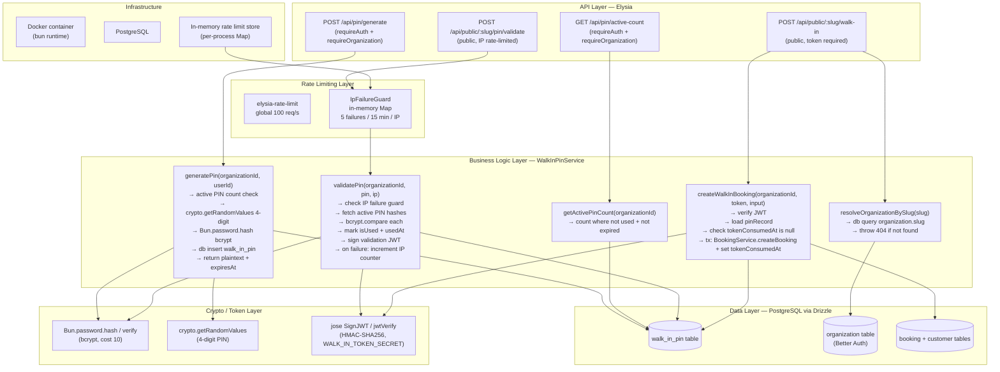
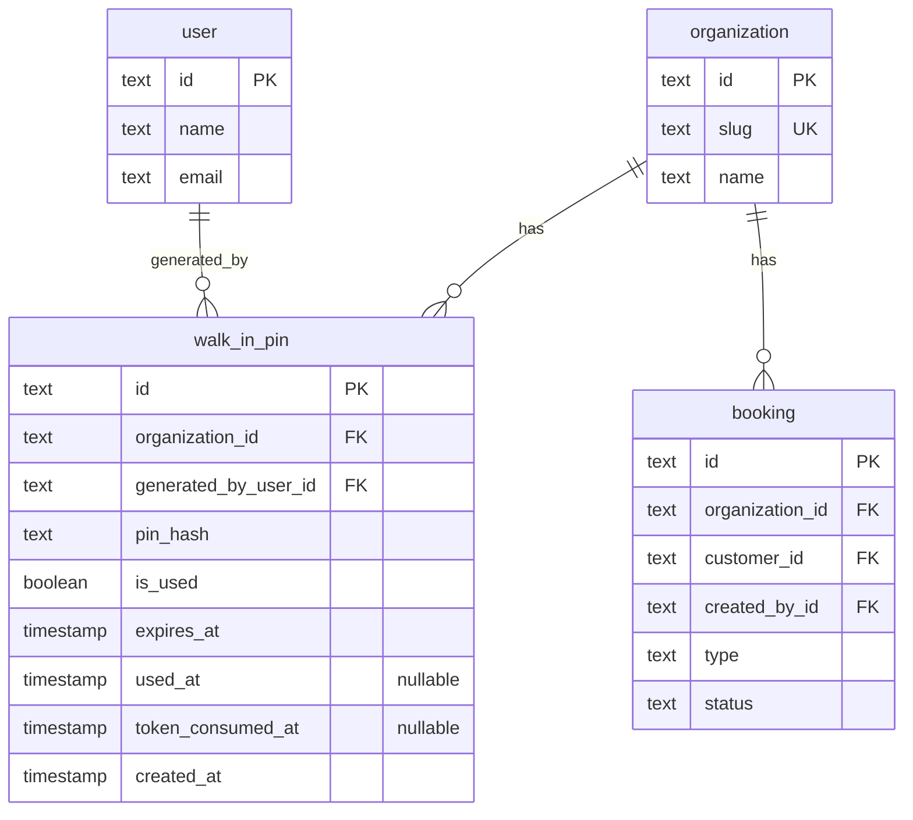

# Implementation Plan: Walk-In PIN System

**Feature PRD:** [prd.md](./prd.md)
**Epic:** Cukkr — Barbershop Management & Booking System

---

## Goal

Implement a presence-verification gate for walk-in self-registration on the public barbershop booking page. A barber or owner generates a short-lived 4-digit PIN from the authenticated mobile app; the customer enters it on the public web booking page to prove physical presence and unlock the walk-in booking form. Validated PINs are single-use and bcrypt-hashed; the system issues a short-lived, single-use JWT validation token on success. A dedicated public endpoint accepts the token and customer details to create the walk-in booking.

---

## Requirements

- New module `src/modules/walk-in-pin/` following the standard `handler.ts / model.ts / schema.ts / service.ts` structure.
- New Drizzle table `walk_in_pin` with fields for hash, lifecycle state (`isUsed`, `expiresAt`, `usedAt`, `tokenConsumedAt`), and tenant/audit metadata.
- Two authentication surfaces in the module:
  - **Authenticated routes** (`/api/pin/*`): barber/owner PIN generation and active-count query — require `requireAuth: true` + `requireOrganization: true`.
  - **Public routes** (`/api/public/:slug/*`): PIN validation and walk-in booking submission — no auth, rate-limited per IP.
- PIN plaintext generated via `crypto.getRandomValues`, hashed with `Bun.password.hash()` (bcrypt, cost ≥ 10), **never persisted nor logged**.
- Active PIN limit: 10 per organization (non-expired + non-used). Returns `429` when at capacity.
- Validation token: signed JWT (HMAC-SHA256, 15-minute expiry) embedding `pinId` and `organizationId`. Signed with a new `WALK_IN_TOKEN_SECRET` env variable.
- Single-use token enforcement: `tokenConsumedAt` field on the `walk_in_pin` record; set atomically when the walk-in booking is created.
- IP-based brute-force protection for the validate endpoint: in-memory `Map` tracking per-IP failed attempt count within a 15-minute sliding window. Returns `429` on 6th attempt (≥ 5 failures).
- Slug-to-`organizationId` resolution utility shared between the two public endpoints.
- New dependency: `jose` for JWT sign/verify (Bun-compatible via Web Crypto).
- New `WALK_IN_TOKEN_SECRET` variable added to `src/lib/env.ts` (string, min length 32).
- Walk-in booking creation reuses existing `BookingService.createBooking` logic but is invoked from the public handler after token validation, using the organization's system user or a dedicated `createdById` derived from the PIN record's `generatedByUserId`.
- Integration tests in `tests/modules/walk-in-pin.test.ts` covering all acceptance criteria (AC-01 through AC-12).

---

## Technical Considerations

### System Architecture Overview



**Technology Stack Selection:**

| Layer | Choice | Rationale |
|---|---|---|
| PIN hashing | `Bun.password.hash()` (bcrypt) | Native Bun API; no extra dependency; cost factor 10 meets PRD requirement |
| PIN entropy | `crypto.getRandomValues` | Cryptographically random; built into Bun's Web Crypto |
| JWT signing | `jose` (new dep) | Bun Web Crypto-native; typed; well-audited; avoids rolling custom HMAC-JWT |
| Rate limiting (IP failure) | In-memory `Map` utility class | PRD explicitly allows in-memory for MVP; avoids Redis dependency |
| Route grouping | Elysia `.group()` within two handlers | Follows existing pattern (`barbershopHandler`) |
| Slug resolution | Shared private service method | Avoids code duplication between validate + walk-in endpoints |

---

### Database Schema Design



#### Table: `walk_in_pin`

| Column | Type | Constraints | Notes |
|---|---|---|---|
| `id` | `text` | PK | `nanoid()` |
| `organization_id` | `text` | NOT NULL, FK `organization.id` CASCADE | Tenant scoping |
| `generated_by_user_id` | `text` | NOT NULL, FK `user.id` RESTRICT | Audit trail only |
| `pin_hash` | `text` | NOT NULL | bcrypt hash, cost ≥ 10 |
| `is_used` | `boolean` | NOT NULL, DEFAULT `false` | Marks PIN as consumed |
| `expires_at` | `timestamp` | NOT NULL | `createdAt + 30 min` |
| `used_at` | `timestamp` | NULLABLE | Set when `is_used = true` |
| `token_consumed_at` | `timestamp` | NULLABLE | Set when validation token is consumed for booking creation |
| `created_at` | `timestamp` | NOT NULL, DEFAULT `now()` | Record creation time |

**Indexing Strategy:**

| Index | Columns | Type | Rationale |
|---|---|---|---|
| `wip_org_active_idx` | `(organization_id, is_used, expires_at)` | Composite | Active PIN count query and validation lookup — both filter on all three |
| `wip_org_created_idx` | `(organization_id, created_at)` | Composite | Future cleanup jobs ordering by creation time |

**Migration Strategy:**
- Generate via `bunx drizzle-kit generate --name add_walk_in_pin_table`
- Apply via `bunx drizzle-kit migrate`
- Register schema export in `drizzle/schemas.ts`

---

### API Design

#### `POST /api/pin/generate`

**Authentication:** `requireAuth: true`, `requireOrganization: true`

**Request body:** _(none)_

**Response `200`:**
```typescript
{
  pin: string          // 4-digit numeric string, e.g. "0472" — returned ONCE
  expiresAt: Date      // ISO timestamp 30 minutes from now
  activeCount: number  // count of active PINs after creation (for UI display)
}
```

**Response `429`:**
```json
{ "message": "Active PIN limit reached (10). Wait for existing PINs to expire or be used." }
```

**Logic:**
1. Count active PINs for `activeOrganizationId` where `isUsed = false AND expiresAt > now`.
2. If count ≥ 10, throw `AppError('Active PIN limit reached ...', 'TOO_MANY_REQUESTS')`.
3. Generate 4-digit PIN: `String(crypto.getRandomValues(new Uint16Array(1))[0] % 10000).padStart(4, '0')`.
4. Hash with `Bun.password.hash(pin, { algorithm: 'bcrypt', cost: 10 })`.
5. Insert `walk_in_pin` record with `expiresAt = now + 30min`.
6. Return plaintext PIN (never stored).

---

#### `GET /api/pin/active-count`

**Authentication:** `requireAuth: true`, `requireOrganization: true`

**Response `200`:**
```typescript
{
  activeCount: number  // PINs not used and not expired
  limit: number        // always 10
}
```

---

#### `POST /api/public/:slug/pin/validate`

**Authentication:** None (public)

**Rate limiting:** Custom `IpFailureGuard` — blocks IP after 5 cumulative failures within 15-minute window.

**Params:** `slug: string`

**Request body:**
```typescript
{
  pin: string  // exactly 4 numeric digits (TypeBox: t.String({ pattern: '^\\d{4}$' }))
}
```

**Response `200`:**
```typescript
{
  validationToken: string  // signed JWT, 15-minute expiry
}
```

**Response `400`:**
```json
{ "message": "Invalid or expired PIN" }
```

**Response `429`:**
```json
{ "message": "Too many failed attempts. Try again later." }
```

**Logic:**
1. Check `IpFailureGuard` for requesting IP. If ≥ 5 failures within window → `429`.
2. Resolve `organizationId` from `slug` (throw `404` if slug not found).
3. Fetch all `walk_in_pin` rows where `organizationId = X AND isUsed = false AND expiresAt > now`.
4. Iterate records, calling `Bun.password.verify(pin, record.pinHash)` for each.
5. **On match:**
   - Update record: `isUsed = true`, `usedAt = now`.
   - Sign JWT: `{ sub: record.id, org: organizationId }` with 15-minute expiry using `WALK_IN_TOKEN_SECRET`.
   - Return `{ validationToken }`.
6. **On no match:**
   - Increment IP failure counter.
   - Throw `AppError('Invalid or expired PIN', 'BAD_REQUEST')`.

**bcrypt performance note:** With up to 10 active PINs, worst-case is 10 sequential `bcrypt.verify` calls (~400ms total at cost 10 — within the 400ms p95 PRD target). Fail-fast on first match.

---

#### `POST /api/public/:slug/walk-in`

**Authentication:** None (public); requires valid `validationToken` in request body.

**Params:** `slug: string`

**Request body:**
```typescript
{
  validationToken: string
  customerName: string        // 1-100 chars
  customerPhone?: string | null
  customerEmail?: string | null
  serviceIds: string[]        // min 1, unique
  barberId?: string | null
  notes?: string | null
}
```

**Response `201`:**
```typescript
// Same shape as BookingDetailResponse
```

**Response `401`:**
```json
{ "message": "Unauthorized" }
```

**Logic:**
1. Resolve `organizationId` from `slug`.
2. Verify JWT signature and expiry using `WALK_IN_TOKEN_SECRET`.
3. Extract `pinId` (`sub` claim) and verify `org` claim matches resolved `organizationId`.
4. Load `walk_in_pin` record by `pinId` — must exist, `isUsed = true`, `tokenConsumedAt = null`.
5. Throw `AppError('Unauthorized', 'UNAUTHORIZED')` on any token validation failure.
6. In a database transaction:
   a. Call `BookingService.createBooking(organizationId, generatedByUserId, { type: 'walk_in', ... })` (reuse existing booking logic).
   b. Set `walk_in_pin.tokenConsumedAt = now`.
7. Return booking detail.

---

### Security & Performance

#### Authentication & Authorization

| Surface | Mechanism |
|---|---|
| PIN generation | Better Auth session cookie (`requireAuth`) + active organization session (`requireOrganization`) |
| Active count read | Same as generation |
| PIN validation | No auth; rate-limited by IP failure count |
| Walk-in booking | Signed short-lived JWT (HMAC-SHA256) + single-use enforcement |

#### Data Validation & Sanitization

- PIN input validated as `t.String({ pattern: '^\\d{4}$' })` via TypeBox on both generate (format check on response) and validate (body).
- `slug` param validated as `t.String({ minLength: 3, maxLength: 60 })`.
- Walk-in booking body mirrors `WalkInBookingCreateInput` from `BookingModel` (reuse existing types).
- `additionalProperties: false` on all TypeBox objects.

#### Security Controls

| Control | Implementation |
|---|---|
| PIN never persisted in plaintext | Only returned in generate response; stored as bcrypt hash immediately |
| PIN never logged | Service method must not log `pin` variable; use structured logging only for `pinId` |
| Token scoped to organization | `org` claim in JWT verified against slug-resolved `organizationId` |
| Token single-use | `tokenConsumedAt` checked atomically in transaction before booking creation |
| Brute-force protection | `IpFailureGuard` — in-memory, per-IP, sliding 15-minute window, max 5 failures |
| Cross-tenant isolation | All PIN lookups filter by `organizationId` resolved from slug |
| JWT secret rotation | Use `WALK_IN_TOKEN_SECRET` (separate from `BETTER_AUTH_SECRET`) for independent rotation |

#### Performance Optimization

| Concern | Approach |
|---|---|
| Active PIN count query | Covered by `wip_org_active_idx (organizationId, is_used, expires_at)` |
| bcrypt comparison fan-out | Fetch only active, non-expired hashes (filtered by index); fail-fast on first match |
| Slug resolution (public endpoints) | Single indexed lookup on `organization.slug` (Better Auth creates a unique index) |
| In-memory rate-limit map | Prune stale entries during check (entries older than 15 min are removed lazily) |

---

## Module File Layout

```
src/modules/walk-in-pin/
  handler.ts    # walkInPinHandler (/pin routes) + publicWalkInHandler (/public/:slug routes)
  model.ts      # DTOs: GeneratePinResponse, ActiveCountResponse, ValidatePinRequest,
                #        ValidatePinResponse, WalkInBookingRequest
  schema.ts     # walk_in_pin Drizzle table + relations + inferred types
  service.ts    # WalkInPinService (abstract class, static methods)

src/utils/ip-failure-guard.ts   # IpFailureGuard class (in-memory IP failure tracking)

drizzle/schemas.ts              # Add: export * from "../src/modules/walk-in-pin/schema"
src/lib/env.ts                  # Add: WALK_IN_TOKEN_SECRET z.string().min(32)
src/app.ts                      # Register: walkInPinHandler + publicWalkInHandler under /api

tests/modules/walk-in-pin.test.ts  # Integration tests (AC-01 through AC-12)
```

---

## Detailed Implementation Steps

### Step 1 — Add `jose` dependency

```
bun add jose
```

`jose` is a Web Crypto-native JWT library (no Node.js crypto shim needed). It provides `SignJWT` and `jwtVerify` with full TypeScript types.

### Step 2 — Update `src/lib/env.ts`

Add `WALK_IN_TOKEN_SECRET` to the Zod schema:

```
WALK_IN_TOKEN_SECRET: z.string().min(32)
```

Update `.env.example` to document the new variable.

### Step 3 — Create `src/utils/ip-failure-guard.ts`

Implement `IpFailureGuard` as a class with a static or instance in-memory `Map<string, { count: number; windowStart: number }>`. Key methods:

- `isBlocked(ip: string): boolean` — returns true if count ≥ 5 within 15-minute window; prunes stale entries.
- `recordFailure(ip: string): void` — increments count or initializes window.

### Step 4 — Create `src/modules/walk-in-pin/schema.ts`

Define `walkInPin` pgTable with all fields from the schema design above. Include:

- `walkInPinRelations` for `organization` (one) and `user` (one via `generatedByUserId`).
- Exported inferred types: `WalkInPin`, `NewWalkInPin`.

### Step 5 — Update `drizzle/schemas.ts`

Add `export * from "../src/modules/walk-in-pin/schema"`.

### Step 6 — Generate and apply migration

```
bunx drizzle-kit generate --name add_walk_in_pin_table
bunx drizzle-kit migrate
```

### Step 7 — Create `src/modules/walk-in-pin/model.ts`

Define TypeBox schemas in the `WalkInPinModel` namespace:

- `GeneratePinResponse` — `{ pin: string, expiresAt: Date, activeCount: number }`
- `ActiveCountResponse` — `{ activeCount: number, limit: number }`
- `ValidatePinBody` — `{ pin: t.String({ pattern: '^\\d{4}$' }) }` with `additionalProperties: false`
- `ValidatePinResponse` — `{ validationToken: string }`
- `WalkInBookingBody` — `{ validationToken: string, ...walk-in fields }` (mirrors `WalkInBookingCreateInput` from BookingModel, minus `type`)
- `SlugParam` — `{ slug: t.String({ minLength: 3, maxLength: 60 }) }`

### Step 8 — Create `src/modules/walk-in-pin/service.ts`

`WalkInPinService` abstract class with static methods:

```
resolveOrganizationBySlug(slug) → Promise<string>   // returns organizationId
generatePin(organizationId, userId) → Promise<GeneratePinResponse>
getActivePinCount(organizationId) → Promise<ActiveCountResponse>
validatePin(organizationId, pin, ip) → Promise<ValidatePinResponse>
createWalkInBooking(organizationId, token, input) → Promise<BookingDetailResponse>
```

**`generatePin` pseudocode:**
```
count = SELECT COUNT(*) FROM walk_in_pin
        WHERE organization_id = orgId
          AND is_used = false
          AND expires_at > NOW()

if count >= 10: throw AppError(..., 'TOO_MANY_REQUESTS')

pin = String(crypto.getRandomValues(new Uint16Array(1))[0] % 10000).padStart(4, '0')
hash = await Bun.password.hash(pin, { algorithm: 'bcrypt', cost: 10 })
expiresAt = new Date(Date.now() + 30 * 60 * 1000)

INSERT INTO walk_in_pin { id: nanoid(), organizationId, generatedByUserId: userId,
                          pinHash: hash, isUsed: false, expiresAt, createdAt: now }

return { pin, expiresAt, activeCount: count + 1 }
```

**`validatePin` pseudocode:**
```
if IpFailureGuard.isBlocked(ip): throw AppError(..., 'TOO_MANY_REQUESTS')

organizationId = await resolveOrganizationBySlug(slug)

rows = SELECT * FROM walk_in_pin
       WHERE organization_id = orgId
         AND is_used = false
         AND expires_at > NOW()

matchedRow = null
for row in rows:
    if await Bun.password.verify(pin, row.pinHash):
        matchedRow = row
        break

if matchedRow is null:
    IpFailureGuard.recordFailure(ip)
    throw AppError('Invalid or expired PIN', 'BAD_REQUEST')

UPDATE walk_in_pin SET is_used = true, used_at = NOW()
WHERE id = matchedRow.id AND is_used = false   // safe guard against race

validationToken = await new SignJWT({ org: organizationId })
    .setSubject(matchedRow.id)
    .setIssuedAt()
    .setExpirationTime('15m')
    .sign(hmacKey)   // derived from WALK_IN_TOKEN_SECRET

return { validationToken }
```

**`createWalkInBooking` pseudocode:**
```
organizationId = await resolveOrganizationBySlug(slug)

payload = await jwtVerify(token, hmacKey)   // throws on invalid/expired
if payload.org !== organizationId: throw AppError('Unauthorized', 'UNAUTHORIZED')

pinRecord = db.query.walkInPin.findFirst({ where: eq(walkInPin.id, payload.sub) })
if not pinRecord OR not pinRecord.isUsed OR pinRecord.tokenConsumedAt is not null:
    throw AppError('Unauthorized', 'UNAUTHORIZED')

await db.transaction(async tx => {
    booking = await BookingService.createBooking(
        organizationId,
        pinRecord.generatedByUserId,
        { type: 'walk_in', ...input }
    )

    await tx.update(walkInPin)
        .set({ tokenConsumedAt: new Date() })
        .where(
            and(
                eq(walkInPin.id, pinRecord.id),
                isNull(walkInPin.tokenConsumedAt)   // atomic single-use guard
            )
        )
})

return booking
```

### Step 9 — Create `src/modules/walk-in-pin/handler.ts`

Export two Elysia instances:

**`walkInPinHandler`** — prefix `/pin`, tags `['Walk-In PIN']`:
```
.use(authMiddleware)
.post('/', generatePin, { requireAuth: true, requireOrganization: true, ... })
.get('/active-count', getActivePinCount, { requireAuth: true, requireOrganization: true, ... })
```

**`publicWalkInHandler`** — prefix `/public/:slug`, tags `['Public Walk-In']`:
Apply a scoped `elysia-rate-limit` group for general flood protection.
```
.post('/pin/validate', validatePin, { params: SlugParam, body: ValidatePinBody, ... })
.post('/walk-in', createWalkInBooking, { params: SlugParam, body: WalkInBookingBody, ... })
```

Extract client IP from `request.headers.get('x-forwarded-for')` or `server.requestIP()` for the validate endpoint.

### Step 10 — Register handlers in `src/app.ts`

```typescript
import { walkInPinHandler } from './modules/walk-in-pin/handler'
import { publicWalkInHandler } from './modules/walk-in-pin/handler'

// Inside .group('/api', app => app
.use(walkInPinHandler)
.use(publicWalkInHandler)
```

### Step 11 — Write integration tests in `tests/modules/walk-in-pin.test.ts`

Test suite structure:

```
describe('Walk-In PIN System')
  beforeAll: sign up owner, create org, set active org, set org slug

  describe('PIN Generation (AC-01, AC-02)')
    it AC-01: authenticated owner generates PIN → 200, 4-digit pin, expiresAt ~30min
    it AC-02: after 10 active PINs, next generate → 429

  describe('PIN Validation (AC-03 through AC-09)')
    it AC-03: valid PIN → 200, validationToken returned
    it AC-04: expired PIN → 400 "Invalid or expired PIN"
    it AC-05: used PIN → 400 "Invalid or expired PIN"
    it AC-06: wrong PIN → 400, increments failure counter
    it AC-07: 6th attempt after 5 failures → 429 (skip in CI if rate limit disabled)
    it AC-09: PIN from org A rejected at org B slug → 400

  describe('Walk-In Booking (AC-08, AC-11, AC-12)')
    it AC-11: missing/no token → 401
    it AC-08: valid token creates booking; same PIN resubmit → 400
    it AC-12: same validationToken used twice → second attempt 401

  describe('PIN never returned (AC-10)')
    it: GET /api/pin/active-count response contains no pin field
```

**Multi-tenant test pattern:** Create two separate organizations (owner A + owner B) in `beforeAll` to test AC-09 cross-tenant isolation.

**Rate-limit bypass in tests:** Follow existing convention — `elysia-rate-limit` calls `skip: () => env.NODE_ENV === 'test'`. The `IpFailureGuard` must also expose a `.reset(ip)` method (or a `.resetAll()` for test teardown) so tests for AC-07 can be isolated.

---

## Acceptance Criteria Mapping

| AC | Covered By |
|---|---|
| AC-01 | `generatePin` — success path test |
| AC-02 | `generatePin` — 10-PIN limit test |
| AC-03 | `validatePin` — success path test + token returned |
| AC-04 | DB seed: expired PIN (`expiresAt` in past) + validate → 400 |
| AC-05 | After AC-03 consumes PIN; retry same PIN → 400 |
| AC-06 | Wrong PIN input → 400 + failure counter incremented |
| AC-07 | 5 failures then 6th → 429 |
| AC-08 | After booking created, same PIN re-submitted → 400 (`isUsed = true`) |
| AC-09 | Generate PIN for org A, submit to org B slug → 400 |
| AC-10 | No `pin` field in `active-count` or any list endpoint response |
| AC-11 | Walk-in booking without `validationToken` → 401 |
| AC-12 | Walk-in booking with same token twice → second attempt 401 |

---

## Out of Scope (for this implementation)

- QR code alternative (Phase 2)
- Owner dashboard with full PIN history
- Barber-facing active PIN list
- PIN revocation by barber/owner
- SMS/email PIN delivery
- Configurable PIN length, expiry duration, or active limit
- Persistent rate-limit storage across server restarts
