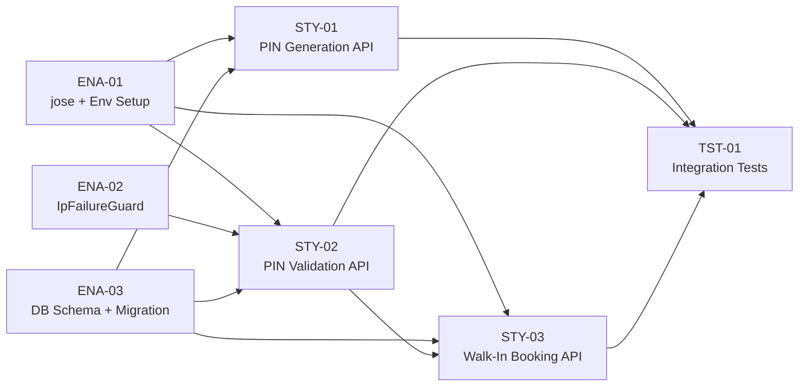

# Project Plan: Walk-In PIN System

**Feature PRD:** [prd.md](./prd.md)
**Implementation Plan:** [implementation-plan.md](./implementation-plan.md)
**Epic:** Cukkr — Barbershop Management & Booking System

> **Note on issue references:** Placeholder IDs (e.g., `#{FEAT-01}`, `#{ENA-01}`) must be replaced with actual GitHub issue numbers after creation. See [issues-checklist.md](./issues-checklist.md) to track creation status.

---

## Issue Hierarchy Overview

```
Epic: Cukkr — Barbershop Management & Booking System  [#{EPIC}]
└── Feature: Walk-In PIN System  [#{FEAT-01}]
    ├── Technical Enablers
    │   ├── ENA-01: Add jose dependency + WALK_IN_TOKEN_SECRET env variable  [#{ENA-01}]
    │   ├── ENA-02: Create IpFailureGuard utility  [#{ENA-02}]
    │   └── ENA-03: Create walk_in_pin Drizzle schema + migration  [#{ENA-03}]
    ├── User Stories
    │   ├── STY-01: PIN Generation & Active Count API  [#{STY-01}]
    │   ├── STY-02: PIN Validation API with IP Rate Limiting  [#{STY-02}]
    │   └── STY-03: Walk-In Booking Creation API  [#{STY-03}]
    └── Tests
        └── TST-01: Integration tests (AC-01 through AC-12)  [#{TST-01}]
```

---

## Dependency Graph



---

## Sprint Plan

| Sprint | Issues | Story Points |
|---|---|---|
| Sprint 1 | ENA-01, ENA-02, ENA-03, STY-01, STY-02 | 13 pts |
| Sprint 2 | STY-03, TST-01 | 10 pts |

**Total Estimate:** 23 story points — Feature size: **L**

---

## Issues

---

### FEAT-01: Feature — Walk-In PIN System

```markdown
# Feature: Walk-In PIN System

## Feature Description

Implement a presence-verification gate for walk-in self-registration on the public barbershop
booking page. A barber or owner generates a short-lived 4-digit PIN from the authenticated mobile
app; the customer enters it on the public web booking page to prove physical presence and unlock
the walk-in booking form. Validated PINs are single-use and bcrypt-hashed; the system issues a
short-lived, single-use JWT validation token on success. A dedicated public endpoint accepts the
token and customer details to create the walk-in booking.

## User Stories in this Feature

- [ ] #{STY-01} - PIN Generation & Active Count API
- [ ] #{STY-02} - PIN Validation API with IP Rate Limiting
- [ ] #{STY-03} - Walk-In Booking Creation API

## Technical Enablers

- [ ] #{ENA-01} - Add jose dependency + WALK_IN_TOKEN_SECRET environment variable
- [ ] #{ENA-02} - Create IpFailureGuard utility
- [ ] #{ENA-03} - Create walk_in_pin Drizzle schema + migration

## Tests

- [ ] #{TST-01} - Integration tests (AC-01 through AC-12)

## Dependencies

**Blocks**: None
**Blocked by**: None (self-contained feature)

## Acceptance Criteria

- [ ] Authenticated barber/owner can generate a 4-digit PIN via `POST /api/pin/generate`
- [ ] PIN generation is blocked with 429 when 10 active PINs already exist
- [ ] Authenticated barber/owner can query active PIN count via `GET /api/pin/active-count`
- [ ] Walk-in customer can validate a PIN via `POST /api/public/:slug/pin/validate`; receives a JWT validation token on success
- [ ] Expired, used, or wrong PINs return 400; IP blocked after 5 failures within 15 minutes
- [ ] Walk-in customer can create a booking via `POST /api/public/:slug/walk-in` using the validation token
- [ ] Validation token is single-use; second use returns 401
- [ ] PIN plaintext is never returned by any endpoint other than the initial generate response
- [ ] Cross-tenant isolation: PIN from Org A cannot be validated at Org B's slug

## Definition of Done

- [ ] All user stories delivered
- [ ] Technical enablers completed
- [ ] Integration tests passing (AC-01 through AC-12)
- [ ] Lint and format checks passing (`bun run lint:fix` + `bun run format`)
- [ ] No plaintext PINs in logs or non-generate API responses

## Labels

`feature`, `priority-high`, `value-high`, `backend`, `security`

## Epic

#{EPIC}

## Estimate

L (23 story points total)
```

---

### ENA-01: Enabler — Add jose Dependency + WALK_IN_TOKEN_SECRET Environment Variable

```markdown
# Technical Enabler: Add jose Dependency + WALK_IN_TOKEN_SECRET Environment Variable

## Enabler Description

Install the `jose` JWT library (Web Crypto-native, Bun-compatible) and register the new
`WALK_IN_TOKEN_SECRET` environment variable in `src/lib/env.ts`. This is the foundational
dependency required by all three user stories.

## Technical Requirements

- [ ] Run `bun add jose` to add the dependency
- [ ] Add `WALK_IN_TOKEN_SECRET: z.string().min(32)` to the Zod env schema in `src/lib/env.ts`
- [ ] Document `WALK_IN_TOKEN_SECRET` in `.env.example` with a description
- [ ] Verify `jose` imports resolve without errors in the Bun runtime

## Implementation Tasks

- [ ] `bun add jose`
- [ ] Update `src/lib/env.ts` — add `WALK_IN_TOKEN_SECRET` to Zod schema
- [ ] Update `.env.example` — document `WALK_IN_TOKEN_SECRET` variable

## User Stories Enabled

This enabler supports:

- #{STY-01} - PIN Generation & Active Count API
- #{STY-02} - PIN Validation API with IP Rate Limiting
- #{STY-03} - Walk-In Booking Creation API

## Acceptance Criteria

- [ ] `jose` package present in `package.json` dependencies
- [ ] `env.WALK_IN_TOKEN_SECRET` is accessible across the codebase via `src/lib/env.ts`
- [ ] Server fails to start with a descriptive error when `WALK_IN_TOKEN_SECRET` is missing or < 32 chars
- [ ] `.env.example` documents the new variable with min-length guidance

## Definition of Done

- [ ] Implementation completed
- [ ] Lint and format checks passing
- [ ] Code review approved

## Labels

`enabler`, `priority-critical`, `backend`, `infrastructure`

## Feature

#{FEAT-01}

## Estimate

1 point
```

---

### ENA-02: Enabler — Create IpFailureGuard Utility

```markdown
# Technical Enabler: Create IpFailureGuard Utility

## Enabler Description

Implement the `IpFailureGuard` class in `src/utils/ip-failure-guard.ts` — an in-memory, per-IP
sliding-window failure tracker used to enforce the 5-failures-per-15-minutes brute-force
protection on the PIN validation endpoint.

## Technical Requirements

- [ ] Class stored in `src/utils/ip-failure-guard.ts`
- [ ] Backing store: in-memory `Map<string, { count: number; windowStart: number }>`
- [ ] `isBlocked(ip: string): boolean` — returns `true` if IP has ≥ 5 failures within 15-minute window; prunes stale entries lazily
- [ ] `recordFailure(ip: string): void` — increments count or initializes a new window entry
- [ ] `reset(ip: string): void` — resets an individual IP (for test isolation)
- [ ] `resetAll(): void` — resets all entries (for test teardown)
- [ ] Sliding window logic: if `Date.now() - windowStart > 15 min`, reset window before checking/recording
- [ ] No external dependencies; pure in-memory

## Implementation Tasks

- [ ] Create `src/utils/ip-failure-guard.ts` with `IpFailureGuard` class
- [ ] Export a singleton `ipFailureGuard` instance for use in `WalkInPinService`

## User Stories Enabled

This enabler supports:

- #{STY-02} - PIN Validation API with IP Rate Limiting

## Acceptance Criteria

- [ ] `isBlocked` returns `false` for a fresh IP
- [ ] `isBlocked` returns `true` after 5 `recordFailure` calls within the same window
- [ ] Stale window entries (> 15 min old) are pruned on next access
- [ ] `reset(ip)` clears an IP so it can attempt again (used in test teardown)
- [ ] No imports of `process.env` or external rate-limit libraries

## Definition of Done

- [ ] Implementation completed
- [ ] Lint and format checks passing
- [ ] Code review approved

## Labels

`enabler`, `priority-high`, `backend`, `security`

## Feature

#{FEAT-01}

## Estimate

2 points
```

---

### ENA-03: Enabler — Create walk_in_pin Drizzle Schema + Migration

```markdown
# Technical Enabler: Create walk_in_pin Drizzle Schema + Migration

## Enabler Description

Define the `walk_in_pin` Drizzle ORM table schema with all required columns, indexes, and
relations. Generate and apply the database migration. Register the schema export in
`drizzle/schemas.ts`.

## Technical Requirements

- [ ] New file: `src/modules/walk-in-pin/schema.ts`
- [ ] Table columns: `id` (text PK, nanoid), `organizationId` (text NOT NULL FK → organization.id CASCADE), `generatedByUserId` (text NOT NULL FK → user.id RESTRICT), `pinHash` (text NOT NULL), `isUsed` (boolean NOT NULL DEFAULT false), `expiresAt` (timestamp NOT NULL), `usedAt` (timestamp nullable), `tokenConsumedAt` (timestamp nullable), `createdAt` (timestamp NOT NULL DEFAULT now)
- [ ] Composite index `wip_org_active_idx` on `(organization_id, is_used, expires_at)`
- [ ] Composite index `wip_org_created_idx` on `(organization_id, created_at)`
- [ ] Drizzle relations: `organization` (one), `user` via `generatedByUserId` (one)
- [ ] Exported inferred types: `WalkInPin`, `NewWalkInPin`
- [ ] Schema re-exported from `drizzle/schemas.ts`

## Implementation Tasks

- [ ] Create `src/modules/walk-in-pin/schema.ts` with pgTable definition, indexes, and relations
- [ ] Add `export * from "../src/modules/walk-in-pin/schema"` to `drizzle/schemas.ts`
- [ ] Run `bunx drizzle-kit generate --name add_walk_in_pin_table`
- [ ] Run `bunx drizzle-kit migrate`

## User Stories Enabled

This enabler supports:

- #{STY-01} - PIN Generation & Active Count API
- #{STY-02} - PIN Validation API with IP Rate Limiting
- #{STY-03} - Walk-In Booking Creation API

## Acceptance Criteria

- [ ] `walk_in_pin` table created in the database with all required columns
- [ ] Both composite indexes (`wip_org_active_idx`, `wip_org_created_idx`) present in the migration SQL
- [ ] `drizzle/schemas.ts` exports the new schema
- [ ] `bunx drizzle-kit check` passes with no warnings
- [ ] TypeScript types `WalkInPin` and `NewWalkInPin` are exported and usable

## Definition of Done

- [ ] Schema implementation completed
- [ ] Migration generated and applied
- [ ] Lint and format checks passing
- [ ] Code review approved

## Labels

`enabler`, `priority-critical`, `backend`, `database`

## Feature

#{FEAT-01}

## Estimate

2 points
```

---

### STY-01: User Story — PIN Generation & Active Count API

```markdown
# User Story: PIN Generation & Active Count API

## Story Statement

As a **barber or barbershop owner**, I want to generate a short-lived 4-digit PIN from the
authenticated API and check how many active PINs my organization has, so that I can authorize
walk-in customers to self-register in the queue.

## Acceptance Criteria

- [ ] `POST /api/pin/generate` requires a valid session cookie and an active organization — returns 401/403 without them
- [ ] Response body includes `pin` (4-digit numeric string), `expiresAt` (ISO timestamp ~30 min from now), and `activeCount`
- [ ] PIN value is cryptographically random (`crypto.getRandomValues`)
- [ ] `walk_in_pin` record is inserted with only the bcrypt hash (cost 10); plaintext is never persisted
- [ ] `expiresAt` is set to exactly `now + 30 minutes`
- [ ] Returns 429 with descriptive message when organization already has 10 active PINs (AC-02)
- [ ] `GET /api/pin/active-count` returns `{ activeCount: number, limit: 10 }` — no `pin` field in response (AC-10)

## Technical Tasks

- [ ] Implement `WalkInPinService.generatePin(organizationId, userId)` in `service.ts`
- [ ] Implement `WalkInPinService.getActivePinCount(organizationId)` in `service.ts`
- [ ] Define `GeneratePinResponse` and `ActiveCountResponse` TypeBox schemas in `model.ts`
- [ ] Implement `walkInPinHandler` Elysia group (`/pin`) with `requireAuth: true, requireOrganization: true` in `handler.ts`
- [ ] Register `walkInPinHandler` in `src/app.ts`

## Testing Requirements

- [ ] #{TST-01} — AC-01: Successful PIN generation returns 4-digit pin + expiresAt
- [ ] #{TST-01} — AC-02: 10-active-PIN limit enforced with 429
- [ ] #{TST-01} — AC-10: `GET /api/pin/active-count` response has no `pin` field

## Dependencies

**Blocked by**: #{ENA-01} (jose + env), #{ENA-03} (schema + migration)

## Definition of Done

- [ ] Acceptance criteria met
- [ ] Code review approved
- [ ] `bun run lint:fix` and `bun run format` pass
- [ ] Integration tests passing

## Labels

`user-story`, `priority-high`, `value-high`, `backend`

## Feature

#{FEAT-01}

## Estimate

3 points
```

---

### STY-02: User Story — PIN Validation API with IP Rate Limiting

```markdown
# User Story: PIN Validation API with IP Rate Limiting

## Story Statement

As a **walk-in customer**, I want to enter a 4-digit PIN on the public booking page so that the
system can verify my physical presence and issue me a validation token to proceed with booking,
while being protected from brute-force abuse via IP-based rate limiting.

## Acceptance Criteria

- [ ] `POST /api/public/:slug/pin/validate` is public (no auth required)
- [ ] On valid PIN: `isUsed` set to `true`, `usedAt` set to now, and a 15-minute signed JWT is returned
- [ ] JWT payload contains `sub` = `pinId`, `org` = `organizationId`, signed with `WALK_IN_TOKEN_SECRET` (HMAC-SHA256)
- [ ] Expired PIN returns 400 with "Invalid or expired PIN" (AC-04)
- [ ] Already-used PIN returns 400 with "Invalid or expired PIN" (AC-05)
- [ ] Wrong PIN returns 400 and increments IP failure counter (AC-06)
- [ ] 6th attempt from same IP within 15-minute window returns 429 (AC-07)
- [ ] PIN from Org A cannot be validated against Org B's slug (AC-09)
- [ ] Unknown slug returns 404

## Technical Tasks

- [ ] Implement `WalkInPinService.resolveOrganizationBySlug(slug)` — throws 404 if not found
- [ ] Implement `WalkInPinService.validatePin(organizationId, pin, ip)` with bcrypt fan-out + JWT signing
- [ ] Define `ValidatePinBody` and `ValidatePinResponse` TypeBox schemas in `model.ts`
- [ ] Define `SlugParam` TypeBox schema (`t.String({ minLength: 3, maxLength: 60 })`)
- [ ] Implement `publicWalkInHandler` Elysia group (`/public/:slug`) with validate route
- [ ] Extract client IP from `x-forwarded-for` header or `server.requestIP()` fallback

## Testing Requirements

- [ ] #{TST-01} — AC-03: Valid PIN validates and returns token
- [ ] #{TST-01} — AC-04: Expired PIN rejected
- [ ] #{TST-01} — AC-05: Already-used PIN rejected
- [ ] #{TST-01} — AC-06: Wrong PIN increments failure counter
- [ ] #{TST-01} — AC-07: IP blocked on 6th attempt
- [ ] #{TST-01} — AC-09: Cross-tenant isolation enforced

## Dependencies

**Blocked by**: #{ENA-01} (jose + env), #{ENA-02} (IpFailureGuard), #{ENA-03} (schema + migration)

## Definition of Done

- [ ] Acceptance criteria met
- [ ] Code review approved
- [ ] `bun run lint:fix` and `bun run format` pass
- [ ] Integration tests passing

## Labels

`user-story`, `priority-high`, `value-high`, `backend`, `security`

## Feature

#{FEAT-01}

## Estimate

5 points
```

---

### STY-03: User Story — Walk-In Booking Creation API

```markdown
# User Story: Walk-In Booking Creation API

## Story Statement

As a **walk-in customer**, I want to submit my details and selected services along with a PIN
validation token so that a walk-in booking is created on my behalf, with the token enforced as
single-use to prevent replay attacks.

## Acceptance Criteria

- [ ] `POST /api/public/:slug/walk-in` is public (no auth required)
- [ ] Request body includes `validationToken`, `customerName`, optional `customerPhone`/`customerEmail`, `serviceIds`, optional `barberId` and `notes`
- [ ] JWT is verified for signature, expiry, and `org` claim matching the slug-resolved `organizationId`
- [ ] `pinRecord.isUsed = true` and `pinRecord.tokenConsumedAt = null` are validated before booking creation (AC-12)
- [ ] Booking creation and `tokenConsumedAt` update are executed in a single database transaction
- [ ] Walk-in booking is created by delegating to `BookingService.createBooking` with `type: 'walk_in'` and `createdById = pinRecord.generatedByUserId`
- [ ] Returns 201 with booking detail on success
- [ ] Missing or invalid token returns 401 (AC-11)
- [ ] Token already consumed returns 401 (AC-12)

## Technical Tasks

- [ ] Implement `WalkInPinService.createWalkInBooking(organizationId, token, input)` with JWT verify + DB transaction
- [ ] Define `WalkInBookingBody` TypeBox schema in `model.ts` (mirrors walk-in fields from BookingModel)
- [ ] Add `POST /walk-in` route to `publicWalkInHandler` Elysia group
- [ ] Register `publicWalkInHandler` in `src/app.ts`

## Testing Requirements

- [ ] #{TST-01} — AC-08: Valid token creates booking; same PIN resubmit rejected
- [ ] #{TST-01} — AC-11: Missing/invalid token returns 401
- [ ] #{TST-01} — AC-12: Same token used twice — second attempt returns 401

## Dependencies

**Blocked by**: #{ENA-01} (jose + env), #{ENA-03} (schema + migration), #{STY-02} (validates token issued by PIN validation)

## Definition of Done

- [ ] Acceptance criteria met
- [ ] Code review approved
- [ ] `bun run lint:fix` and `bun run format` pass
- [ ] Integration tests passing

## Labels

`user-story`, `priority-high`, `value-high`, `backend`, `security`

## Feature

#{FEAT-01}

## Estimate

5 points
```

---

### TST-01: Test — Integration Tests for Walk-In PIN System (AC-01 through AC-12)

```markdown
# Test: Integration Tests — Walk-In PIN System (AC-01 through AC-12)

## Test Description

Write a full integration test suite in `tests/modules/walk-in-pin.test.ts` covering all 12
acceptance criteria defined in the PRD. Uses Bun's built-in test runner with Eden Treaty for
end-to-end typed HTTP calls.

## Test Scope

### Setup (beforeAll)
- [ ] Sign up an owner user; capture session cookie
- [ ] Create an organization via `auth.api.organization.create`
- [ ] Set the organization as active
- [ ] Set a unique slug on the organization (for public endpoint testing)
- [ ] Create a second organization (owner B + slug B) for cross-tenant isolation tests (AC-09)

### Test Cases

| Test | AC | Assertion |
|---|---|---|
| Authenticated owner generates PIN → 200, 4-digit pin, expiresAt ~30 min | AC-01 | `status === 200`, `pin.length === 4`, `/^\d{4}$/.test(pin)` |
| After 10 active PINs, next generate → 429 | AC-02 | Loop: generate 10; 11th returns `status === 429` |
| Valid PIN validates → 200, validationToken returned | AC-03 | `status === 200`, `validationToken` present |
| Expired PIN (seed `expiresAt` in past) → 400 | AC-04 | Direct DB insert with past `expiresAt`; validate → `status === 400` |
| Already-used PIN → 400 | AC-05 | Use PIN from AC-03; re-validate same PIN → `status === 400` |
| Wrong PIN → 400, failure counter incremented | AC-06 | Submit `"0000"` against different org → `status === 400` |
| 6th attempt after 5 failures → 429 | AC-07 | `ipFailureGuard.resetAll()` in beforeEach; 5 wrong PINs + 1 more → `status === 429` |
| Valid token creates booking; same PIN resubmit → 400 | AC-08 | Create booking with token; attempt same PIN validation → 400 |
| PIN from org A rejected at org B slug | AC-09 | Generate PIN for org A; validate against slug B → `status === 400` |
| `GET /api/pin/active-count` response has no `pin` field | AC-10 | Assert `response.pin === undefined` |
| Walk-in booking without token → 401 | AC-11 | Submit walk-in body without `validationToken` → `status === 401` |
| Same validation token used twice → second 401 | AC-12 | Create booking once; reuse same token → `status === 401` |

## Implementation Tasks

- [ ] Create `tests/modules/walk-in-pin.test.ts`
- [ ] Implement `beforeAll` with dual-org setup (owner A + owner B)
- [ ] Implement `afterEach` calling `ipFailureGuard.resetAll()` to isolate AC-07
- [ ] Add `ipFailureGuard.reset()` / `resetAll()` export to `src/utils/ip-failure-guard.ts` (test-only escape hatch)
- [ ] Ensure `IpFailureGuard` check is skipped when `NODE_ENV === 'test'` OR expose `resetAll` for per-test teardown

## Dependencies

**Blocked by**: #{STY-01}, #{STY-02}, #{STY-03}

## Definition of Done

- [ ] All 12 ACs covered with passing tests
- [ ] `bun test walk-in-pin` exits 0
- [ ] No hardcoded credentials or plaintext PINs in assertions
- [ ] Code review approved

## Labels

`test`, `priority-high`, `backend`

## Feature

#{FEAT-01}

## Estimate

5 points
```

---

## Summary Table

| Ref | Type | Title | Points | Priority | Blocked By |
|---|---|---|---|---|---|
| FEAT-01 | Feature | Walk-In PIN System | L (23 pts) | P1 / High | — |
| ENA-01 | Enabler | Add jose + WALK_IN_TOKEN_SECRET | 1 | P0 | — |
| ENA-02 | Enabler | IpFailureGuard utility | 2 | P0 | — |
| ENA-03 | Enabler | walk_in_pin schema + migration | 2 | P0 | — |
| STY-01 | Story | PIN Generation & Active Count API | 3 | P1 | ENA-01, ENA-03 |
| STY-02 | Story | PIN Validation API with IP Rate Limiting | 5 | P1 | ENA-01, ENA-02, ENA-03 |
| STY-03 | Story | Walk-In Booking Creation API | 5 | P1 | ENA-01, ENA-03, STY-02 |
| TST-01 | Test | Integration Tests AC-01 through AC-12 | 5 | P1 | STY-01, STY-02, STY-03 |
