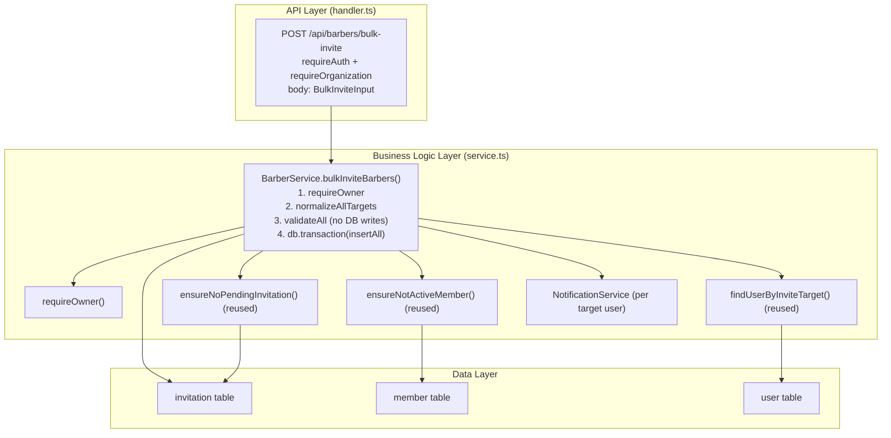

# Implementation Plan: Atomic Bulk Barber Invite

**Feature PRD:** [prd.md](./prd.md)
**Epic:** [Cukkr Step 2 - Backend Surface Completion & Contract Consolidation](../epic.md)

---

## Goal

Add a `POST /api/barbers/bulk-invite` endpoint that accepts an array of invite targets (each target having `email` and/or `phone`), validates the entire array before persisting any record, and creates all invitations in a single database transaction. If any target in the payload is invalid, duplicated within the request, already has a pending invitation, or is already an active member, the entire request is rejected and no invitations are created. A successful response returns the normalized list of created invitations, matching the shape of the single-invite response so existing invitation-management UI can consume it uniformly.

---

## Requirements

- New endpoint: `POST /api/barbers/bulk-invite` (owner-only, requires active organization).
- Request body: `{ targets: Array<{ email?: string; phone?: string }> }` with at least 1 target.
- Full validation of all targets runs before any database insert:
  - Each target must have a valid email and/or phone (same rules as single invite).
  - Duplicate normalized emails within the payload are rejected.
  - Targets already with a pending, non-expired invitation in the org are rejected.
  - Targets already active members of the org are rejected.
- If all validations pass, all invitations are inserted in a single `db.transaction`.
- On any validation failure, the entire request fails with a descriptive error; zero invitations are created.
- Success response: `{ invitations: BarberInviteResponse[] }` — array of all created invitations.
- Existing single `POST /api/barbers/invite`, cancel, and accept/decline flows remain unchanged.
- Notification is sent to each resolved target user (best-effort, same as single invite).
- Integration tests: success batch, single-invalid target, duplicate email in payload, already-member target, already-pending target, rollback verification.

---

## Technical Considerations

### System Architecture Overview



### API Design

**Endpoint:** `POST /api/barbers/bulk-invite`

**Request body:**
```typescript
{
  targets: Array<{
    email?: string   // optional, email format
    phone?: string   // optional, E.164 format
  }>                 // minItems: 1
}
```

**Success response (201):**
```typescript
{
  invitations: Array<{
    id: string
    email: string
    phone: string | null
    role: string
    status: string
    expiresAt: Date
    expired: false
  }>
}
```

**Error responses:**
- `403` — caller is not an owner.
- `400` — any target has invalid email/phone format.
- `409` — any target is already a member or already has a pending invitation.
- `400` — duplicate emails found within the payload.

### Validation Strategy

All validation runs before the transaction opens. Internally, the service collects errors across all targets in one pass:

1. Normalize each target (email lowercase, phone to E.164).
2. Check for within-payload duplicate emails (Set-based check after normalization).
3. For each target: resolve the invite email (phone lookup if phone-only). Fail fast if phone lookup fails.
4. For each resolved email: call `ensureNoPendingInvitation` and `ensureNotActiveMember`. These checks run sequentially but outside the transaction.
5. If any single check throws, the error propagates immediately — the transaction never opens.

### Security & Performance

- Only organization owners can call this endpoint (`requireOwner` guard reused from single invite).
- Tenant isolation: all invitation inserts use `organizationId` from the session.
- Batch size: no explicit limit in Step 2, but the existing `AppError` propagation handles abusive payloads by failing fast on first invalid target.
- Notifications are sent after the transaction commits (best-effort, not rolled back on notification failure).

---

## Implementation Steps

1. **Model** (`src/modules/barbers/model.ts`)
   - Add `BulkInviteInput = t.Object({ targets: t.Array(BarberInviteInput, { minItems: 1 }) })`.
   - Add `BulkInviteResponse = t.Object({ invitations: t.Array(BarberInviteResponse) })`.

2. **Service** (`src/modules/barbers/service.ts`)
   - Add `static async bulkInviteBarbers(organizationId, userId, input): Promise<BarberModel.BulkInviteResponse>`.
   - Internal flow:
     a. `requireOwner` check.
     b. Normalize all targets; collect resolved emails.
     c. Detect within-payload duplicate normalized emails → throw if any.
     d. For each target: resolve user (`findUserByInviteTarget`), `ensureNoPendingInvitation`, `ensureNotActiveMember`. Collect all checks before any insert.
     e. Open `db.transaction` → `tx.insert(invitation).values(allValues.map(...))` in one batch.
     f. After commit: send notifications for targets with a resolved user.
   - Return the array of created invitation objects.

3. **Handler** (`src/modules/barbers/handler.ts`)
   - Add `POST /bulk-invite` route using `BarberModel.BulkInviteInput` body and `BarberModel.BulkInviteResponse` response.
   - `requireAuth: true, requireOrganization: true`.

4. **Tests** (`tests/modules/barbers.test.ts` — extend existing)
   - Test: valid 2-target batch → 201, both invitations in response.
   - Test: batch with one invalid email target → 400, zero invitations created.
   - Test: batch with duplicate email entries → 400/409, zero invitations created.
   - Test: target already an active member → 409, zero invitations created.
   - Test: target already has a pending invitation → 409, zero invitations created.
   - Test: created bulk invitations appear in the barber list response.
   - Test: a bulk-created invitation can be cancelled via `DELETE /invite/:invitationId`.
