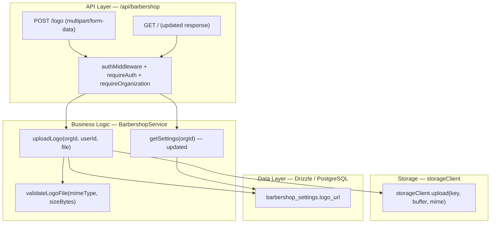
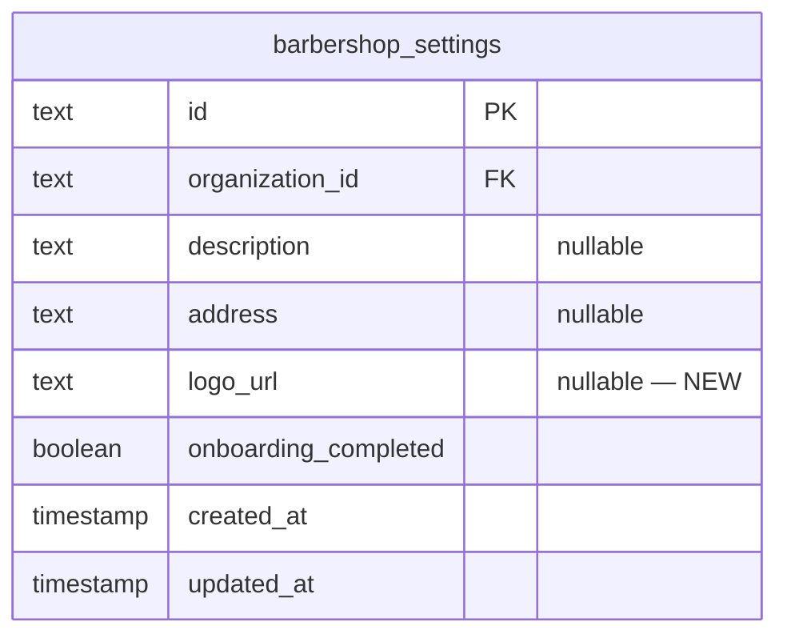

# Implementation Plan: Barbershop Logo Upload

**Feature PRD:** [barbershop-logo-upload/prd.md](./prd.md)
**Epic:** Cukkr Step 2 - Backend Surface Completion & Contract Consolidation
**Date:** April 28, 2026

---

## Goal

Add a dedicated logo upload endpoint for the active barbershop organization. A stable `logoUrl` field is persisted on the `barbershop_settings` table and returned by both the private `GET /api/barbershop` and the public slug-based read surface. Server-side MIME-type and file-size validation are enforced before storage. The same upload contract is usable from both onboarding and settings flows without backend branching.

---

## Requirements

- Add `logoUrl` column (nullable text) to `barbershop_settings` table with a migration.
- Expose `POST /api/barbershop/logo` endpoint for the active organization owner.
- Accept only `image/jpeg`, `image/png`, and `image/webp` MIME types.
- Reject files larger than 5 MB with an explicit validation error.
- On successful upload, store the file via `storageClient.upload(key, buffer, mimeType)` and persist the returned URL to `barbershop_settings.logoUrl`.
- Return the final `logoUrl` in the upload response.
- `GET /api/barbershop` must include `logoUrl` in the response.
- Public slug-based detail endpoint (implemented in the `Public Barbershop Landing And Read Surface` feature) must also include `logoUrl` — the field will be available on the settings row.
- Reject uploads from non-owner members (403).
- Reject uploads for organizations the caller does not belong to (organization scoping already handled by `requireOrganization`).
- Integration tests must cover:
  - Valid upload → `logoUrl` returned and persisted.
  - Invalid MIME type → 400.
  - File > 5 MB → 400.
  - `GET /api/barbershop` returns `logoUrl` after upload.
  - Non-owner upload → 403.

---

## Technical Considerations

### System Architecture Overview



### Database Schema Design



**Migration:** Generate with `bunx drizzle-kit generate --name add_logo_url_to_barbershop_settings`.

No new index required. `logoUrl` is a simple nullable text field read in point queries by `organizationId`.

### API Design

#### `POST /api/barbershop/logo`

- **Auth:** requireAuth + requireOrganization
- **Body:** multipart/form-data with field `file: File`
- **Validation:**
  - `file.type` must be one of `image/jpeg`, `image/png`, `image/webp`
  - `file.size` must be ≤ 5,242,880 bytes (5 MB)
- **Storage key:** `barbershops/{organizationId}/logo/{nanoid()}.{ext}`
- **Response (200):**
  ```
  {
    logoUrl: string
  }
  ```
- **Error codes:** 400 (invalid mime/size), 403 (not owner), 404 (org not found)

#### `GET /api/barbershop` — updated response

Add `logoUrl: string | null` field to `BarbershopResponse`.

**Updated `BarbershopResponse`:**
```
{
  id: string
  name: string
  slug: string
  description: string | null
  address: string | null
  logoUrl: string | null    ← NEW
  onboardingCompleted: boolean
}
```

### Security & Performance

- Only org owners may upload (enforced in service via `requireOwner` check, same pattern as `updateSettings`).
- MIME validation uses `file.type` (from the `File` object in Elysia multipart); additionally validate by checking magic bytes if needed (not required for Step 2).
- File size validation uses `file.size`.
- Storage key includes `nanoid()` to avoid cache collisions when replacing a logo.
- Old logo URL is replaced on every upload; no file deletion from storage required for Step 2.

---

## Implementation Steps

### Step 1 — Update `barbershop/schema.ts`

1. Add `logoUrl: text('logo_url')` (nullable, no default) to `barbershopSettings` table definition.

### Step 2 — Generate and apply migration

1. Run `bunx drizzle-kit generate --name add_logo_url_to_barbershop_settings`.
2. Run `bunx drizzle-kit migrate`.
3. Register schema export in `drizzle/schemas.ts` if not already present (it is already exported via `barbershop/schema`).

### Step 3 — Update `barbershop/model.ts`

1. Add `logoUrl: t.Nullable(t.String())` to `BarbershopResponse`.
2. Add `LogoUploadInput = t.Object({ file: t.File() })`.
3. Add `LogoUploadResponse = t.Object({ logoUrl: t.String() })`.

### Step 4 — Update `barbershop/service.ts`

1. Update `getSettings` SELECT query to include `barbershopSettings.logoUrl` and include it in the return object.
2. Update `listBarbershops` to include `logoUrl` in the returned items.
3. Update `updateSettings` to handle `logoUrl` field if passed (not in input body, but keep consistent with `getSettings` return).
4. Add private `validateLogoFile(mimeType: string, sizeBytes: number): void`:
   - Throw `AppError('Unsupported file type. Use JPEG, PNG, or WebP.', 'BAD_REQUEST')` if not allowed.
   - Throw `AppError('File size must not exceed 5 MB.', 'BAD_REQUEST')` if oversized.
5. Add `uploadLogo(organizationId, userId, file: File): Promise<{ logoUrl: string }>`:
   - Call `requireOwner(organizationId, userId)`.
   - Call `validateLogoFile(file.type, file.size)`.
   - Determine extension from mimeType (`jpeg/png/webp`).
   - Generate storage key: `barbershops/${organizationId}/logo/${nanoid()}.${ext}`.
   - Read file as `Uint8Array` via `Buffer.from(await file.arrayBuffer())`.
   - Call `storageClient.upload(key, buffer, file.type)`.
   - Update `barbershop_settings.logoUrl` for the organization.
   - Return `{ logoUrl }`.

### Step 5 — Update `barbershop/handler.ts`

1. Add `POST /logo` route:
   ```
   .post('/logo', async ({ body, path, user, activeOrganizationId }) => { ... },
   {
     requireAuth: true,
     requireOrganization: true,
     body: BarbershopModel.LogoUploadInput,
     response: FormatResponseSchema(BarbershopModel.LogoUploadResponse)
   })
   ```

### Step 6 — Update `drizzle/schemas.ts`

Confirm `barbershopSettings` is already re-exported (it is via the existing import). No change needed unless the file needs updating.

### Step 7 — Update Tests

1. In `tests/modules/barbershop-settings.test.ts` (or new `barbershop-logo.test.ts`):
   - Upload valid PNG (mocked via `new File([...], 'logo.png', { type: 'image/png' })`) → 200, `logoUrl` returned.
   - `GET /api/barbershop` after upload → includes same `logoUrl`.
   - Upload with `image/gif` → 400.
   - Upload with file > 5 MB → 400.
   - Upload as non-owner (barber role) → 403.

---

## Files To Change

| File | Change |
|---|---|
| `src/modules/barbershop/schema.ts` | Add `logoUrl` column |
| `src/modules/barbershop/model.ts` | Add `logoUrl` to `BarbershopResponse`; add `LogoUploadInput`, `LogoUploadResponse` |
| `src/modules/barbershop/service.ts` | Add `uploadLogo`; update `getSettings` and `listBarbershops` to include `logoUrl` |
| `src/modules/barbershop/handler.ts` | Add `POST /logo` route |
| `drizzle/` | New migration file (auto-generated) |
| `tests/modules/barbershop-settings.test.ts` | Logo upload test cases |
