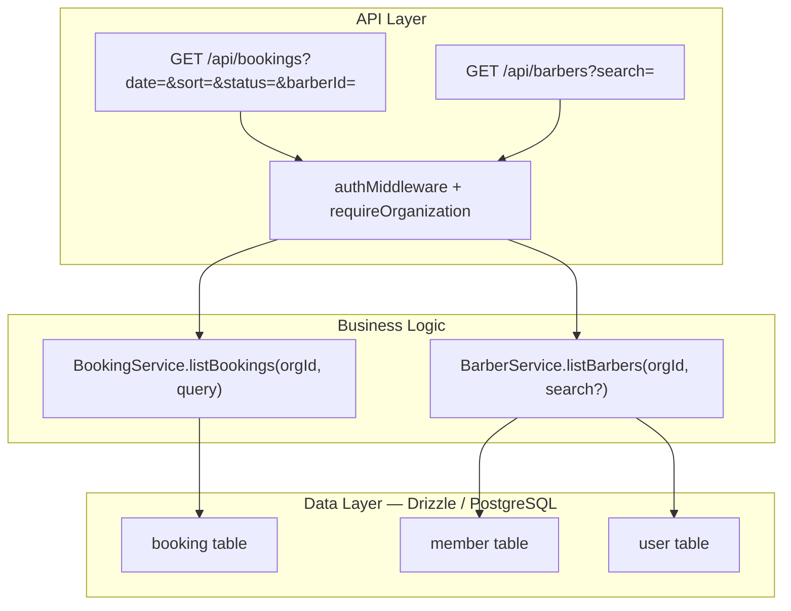

# Implementation Plan: Booking List Sorting And Barber Search

**Feature PRD:** [booking-list-sorting-and-barber-search/prd.md](./prd.md)
**Epic:** Cukkr Step 2 - Backend Surface Completion & Contract Consolidation
**Date:** April 28, 2026

---

## Goal

Add explicit, documented sort options to `GET /api/bookings` and server-side partial-match barber search to `GET /api/barbers`. The booking list currently applies an implicit sort by scheduled/created time ascending; this feature formalizes that as `oldest_first` (the default) and adds `recently_added` (descending). The barber list will accept an optional `search` query string and return only organization-scoped barbers whose name matches the query using case-insensitive partial matching.

---

## Requirements

- `GET /api/bookings` must accept an optional `sort` query parameter with values `recently_added` (descending by time) and `oldest_first` (ascending by time, default).
- The default sort when `sort` is omitted must be `oldest_first`.
- Sorting must apply to the same time key already used for ordering: `scheduledAt` for appointments, `createdAt` for walk-ins.
- Sort results must be deterministic for the same dataset.
- `GET /api/barbers` must accept an optional `search` query parameter.
- When `search` is provided, the results must be limited to organization-scoped members whose `name` contains the search string (case-insensitive partial match).
- When `search` matches nothing, return an empty list with status 200.
- Barber search must never expose members from another organization.
- Both endpoints remain protected by auth and organization scoping.
- Integration tests must verify:
  - Default booking ordering.
  - `recently_added` sort order.
  - `oldest_first` sort order.
  - Barber search with a match.
  - Barber search with no match.

---

## Technical Considerations

### System Architecture Overview



### Database Schema Design

No schema changes. Sorting uses existing columns. Barber search uses `ILIKE` against the joined `user.name` column.

Relevant existing indexes:
- `booking_organizationId_createdAt_idx` — supports createdAt sort.
- `booking_organizationId_scheduledAt_idx` — supports scheduledAt sort.

No new indexes required for these query patterns given the dataset sizes expected in Step 2.

### API Design

#### `GET /api/bookings`

**Updated query schema (`BookingListQuery`):**

```
{
  date:     string (YYYY-MM-DD, required)
  status?:  BookingListStatusEnum
  barberId?: string
  sort?:    'recently_added' | 'oldest_first'   ← NEW
}
```

**Sort behavior:**

| `sort` value | Ordering |
|---|---|
| `oldest_first` (default) | Ascending by effective time (scheduledAt for appointments, createdAt for walk-ins) |
| `recently_added` | Descending by effective time |

The current implicit `left - right` sort in `listBookings` maps directly to `oldest_first`. When `recently_added`, reverse the comparator to `right - left`.

#### `GET /api/barbers`

**Updated query schema:**

```
{
  search?: string   ← NEW (optional, partial match)
}
```

**Search behavior:**
- Applied against `user.name` for active members.
- Case-insensitive contains match (SQL `ILIKE '%query%'` or application-layer filter).
- Pending invitation items are also filtered by `invitedUser.name` or `invitation.email` when a known user exists.
- When `search` is absent, return full list (current behavior preserved).

**Implementation approach:**
Since the current `listBarbers` fetches all active members and then merges pending invitations in memory, the search filter can be applied at the application layer after mapping to `BarberListItem` records. This avoids introducing complex SQL for Step 2 scale. Filter `activeItems` by `item.name.toLowerCase().includes(search.toLowerCase())` and similarly filter `pendingItems`.

If performance requirements evolve, the search can be moved to the DB query level using `ilike` from drizzle-orm.

### Security & Performance

- No auth changes. Both endpoints already require session + organization.
- In-memory filtering for barber search is acceptable for Step 2 team sizes.
- Booking sort is a comparator swap — O(n log n), same as current behavior.

---

## Implementation Steps

### Step 1 — Update `bookings/model.ts`

1. Add `BookingSortEnum = t.Union([t.Literal('recently_added'), t.Literal('oldest_first')])`.
2. Add `sort: t.Optional(BookingSortEnum)` to `BookingListQuery`.
3. Export `BookingSortEnum` type.

### Step 2 — Update `bookings/service.ts`

1. In `listBookings`, after building the rows array, check `query.sort`:
   - If `recently_added`, sort descending (`rightTime - leftTime`).
   - Otherwise (default), sort ascending (`leftTime - rightTime`).
2. No other changes to the method.

### Step 3 — Update `barbers/model.ts`

1. Add `BarberListQuery = t.Object({ search: t.Optional(t.String({ minLength: 1, maxLength: 100 })) })`.
2. Export the type.

### Step 4 — Update `barbers/service.ts`

1. Update `listBarbers(organizationId, search?: string)` signature.
2. After building `activeItems` and `pendingItems`, if `search` is provided:
   - Filter `activeItems` to items where `item.name.toLowerCase().includes(search.toLowerCase())`.
   - Filter `pendingItems` similarly.
3. Return filtered (or unfiltered when no search) combined list.

### Step 5 — Update `barbers/handler.ts`

1. Add `.query(BarberModel.BarberListQuery)` to the `GET /` route.
2. Pass `query.search` to `BarberService.listBarbers`.

### Step 6 — Update `bookings/handler.ts`

Handler already uses `query: BookingModel.BookingListQuery`. No handler change required beyond the model update propagating automatically.

### Step 7 — Update Tests

1. In `tests/modules/bookings.test.ts`:
   - Create two bookings with different times.
   - Assert `recently_added` returns newer booking first.
   - Assert `oldest_first` (or no sort param) returns older booking first.
2. In `tests/modules/barbers.test.ts`:
   - Invite/add a barber named "Alice".
   - Search `?search=ali` → returns Alice.
   - Search `?search=xyz` → returns empty list.
   - No `search` param → returns full list.

---

## Files To Change

| File | Change |
|---|---|
| `src/modules/bookings/model.ts` | Add `BookingSortEnum`; add `sort` to `BookingListQuery` |
| `src/modules/bookings/service.ts` | Apply sort direction from query |
| `src/modules/barbers/model.ts` | Add `BarberListQuery` with optional `search` |
| `src/modules/barbers/service.ts` | Accept and apply `search` filter |
| `src/modules/barbers/handler.ts` | Bind `BarberListQuery` to GET / route |
| `tests/modules/bookings.test.ts` | Sort order test cases |
| `tests/modules/barbers.test.ts` | Search match and no-match test cases |
