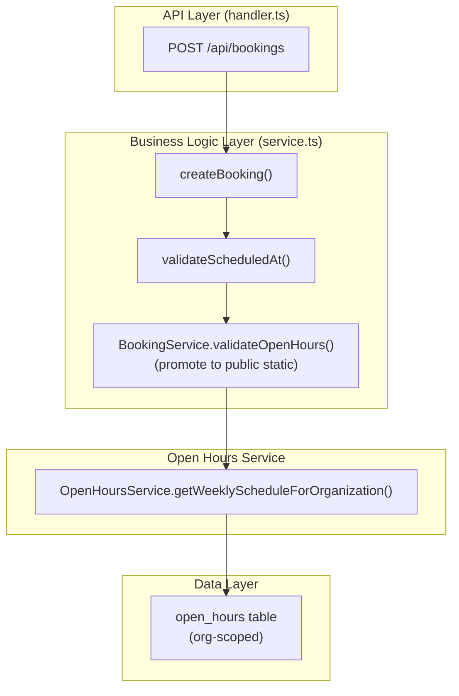

# Implementation Plan: Booking Open Hours Only Validation

**Feature PRD:** [prd.md](./prd.md)
**Epic:** [Cukkr Step 2 - Backend Surface Completion & Contract Consolidation](../epic.md)

---

## Goal

Confirm and formalize that organization open hours are the single Step 2 time-eligibility gate for booking creation. The internal booking path already calls a private `validateOpenHours` method; this implementation makes that validation reusable by promoting it to a public static on `BookingService` and confirms that no occupancy-based rejection exists anywhere in the create path. Integration tests are added to explicitly verify in-hours acceptance, out-of-hours rejection, and the absence of overlap blocking.

---

## Requirements

- `BookingService.validateOpenHours` must be `public static` so Phase 3 (public appointment create) can reuse it without duplication.
- Internal `createBooking` (appointment type) must reject requests outside configured open hours with error `"Appointment scheduledAt must fall within open hours"`.
- Internal `createBooking` (appointment type) must NOT reject requests solely because another booking already occupies the same time slot.
- Walk-in bookings are exempt from open-hours validation because they have no `scheduledAt`.
- Open-hours record used for validation must be scoped to the booking's organization only.
- Integration tests must cover:
  - Appointment in open hours → 201 success.
  - Appointment outside open hours → 422/400 explicit error.
  - Two appointments at the same time slot → both accepted (no overlap rejection).
  - Walk-in creation ignores open-hours check entirely.

---

## Technical Considerations

### System Architecture Overview



### Validation Logic

The existing `validateOpenHours` compares the WIB (UTC+7) day-of-week and time-of-day against the stored open/close windows. The check is:

```
daySchedule.isOpen
  AND timeValue >= daySchedule.openTime
  AND timeValue < daySchedule.closeTime
```

No additional occupancy query is involved. This implementation confirms and tests that behavior.

### API Design

No new endpoints. Changes are internal to `BookingService`:

- `validateOpenHours(organizationId, scheduledAt): Promise<void>` → promoted from `private static` to `public static`.
- Accessible to Phase 3 features (`PublicService`, `WalkInPinService`) without code duplication.

**Error response (unchanged):**
```
400 Bad Request
{ "error": "Appointment scheduledAt must fall within open hours" }
```

### Security & Performance

- No new auth requirements.
- The open-hours query is a lightweight single-org lookup; no caching required at Step 2 scale.
- Making the method public is the only surface area change — no schema or migration required.

---

## Implementation Steps

1. **Service** (`src/modules/bookings/service.ts`)
   - Change `private static async validateOpenHours` to `static async validateOpenHours` (remove `private` modifier).
   - No logic changes — behavior is already correct.

2. **Tests** (`tests/modules/bookings.test.ts` — create or extend)
   - Setup: ensure the test organization has a defined open-hours schedule (e.g., Monday–Friday 09:00–17:00 WIB).
   - Test A: POST appointment with `scheduledAt` inside open hours → 201.
   - Test B: POST appointment with `scheduledAt` outside open hours (e.g., Sunday midnight) → 400 with explicit message.
   - Test C: POST two appointments with identical `scheduledAt` inside open hours → both return 201 (no overlap error).
   - Test D: POST walk-in with no `scheduledAt` → 201 regardless of open hours.
