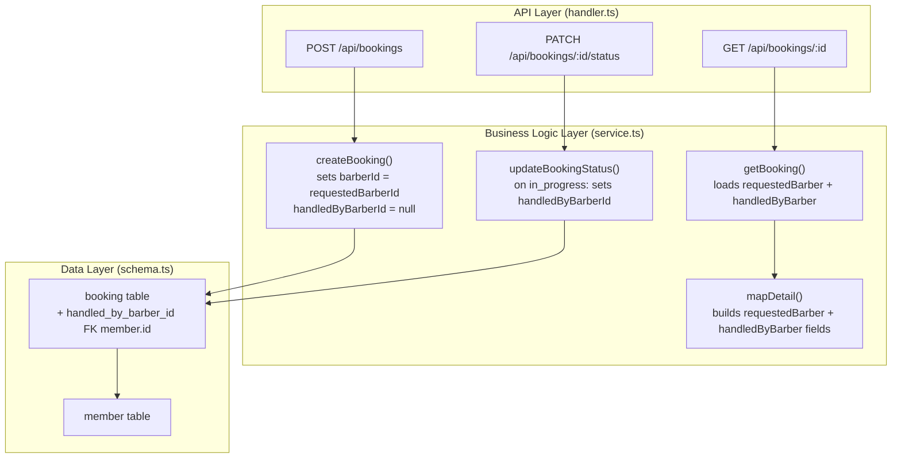
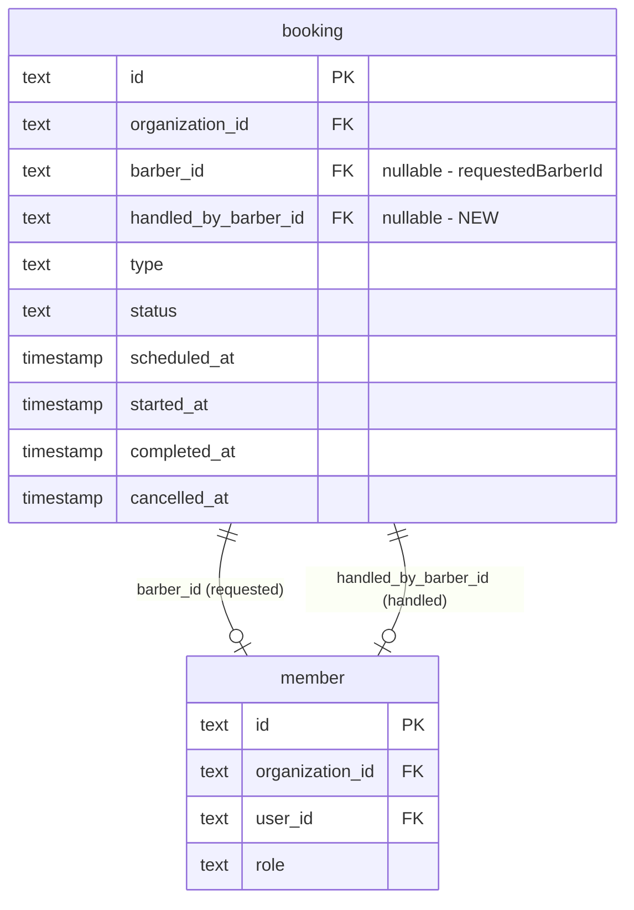

# Implementation Plan: Booking Requested Vs Handled Barber Detail

**Feature PRD:** [prd.md](./prd.md)
**Epic:** [Cukkr Step 2 - Backend Surface Completion & Contract Consolidation](../epic.md)

---

## Goal

Extend the booking schema and detail contract so that `requestedBarber` (the barber chosen at booking-creation time) and `handledByBarber` (the barber who actually starts servicing the booking) are persisted and returned as separate fields. The current `barberId` column already captures the requested barber intent; a new `handledByBarberId` column is added to capture operational ownership when the booking transitions to `in_progress`. The single `barber` field in `BookingDetailResponse` is replaced by the two distinct fields. The `BookingSummaryResponse` (list view) keeps a single `barber` field pointing to the requested barber for backward compatibility.

---

## Requirements

- Add `handled_by_barber_id` (nullable FK → `member.id`, `onDelete: set null`) to the `booking` table.
- Generate and apply a migration for the new column.
- On booking creation, `barberId` (requestedBarberId) is set from the input; `handledByBarberId` is `null`.
- When a booking status transitions to `in_progress`, set `handledByBarberId = booking.barberId` unless it is already populated.
- `requestedBarber` in the detail response is derived from `barberId`.
- `handledByBarber` in the detail response is derived from `handledByBarberId`.
- For walk-ins without barber preference, both `requestedBarber` and `handledByBarber` can be `null`.
- Update `checkSingleInProgress` to check `handledByBarberId` (the active handler) instead of `barberId`.
- Replace the single `barber` field in `BookingDetailResponse` with `requestedBarber` and `handledByBarber`.
- Keep the `barber` field in `BookingSummaryResponse` pointing to `requestedBarber` (the assigned barber) — no change to list contract.
- Update all service reads and mapper functions to populate the two new fields.
- Add integration tests covering: appointment with requested barber, walk-in with `null` requestedBarber, and post-`in_progress` detail showing both fields.

---

## Technical Considerations

### System Architecture Overview



### Database Schema Design



**Migration strategy:**
- `bunx drizzle-kit generate --name add-handled-by-barber-id-to-booking`
- Apply with `bunx drizzle-kit migrate`
- New column is nullable with `SET NULL` on member delete — safe for existing rows.

### API Design

**`BookingDetailResponse` (updated):**

```typescript
// Remove: barber: BarberSummaryResponse | null
// Add:
requestedBarber: BarberSummaryResponse | null
handledByBarber: BarberSummaryResponse | null
```

**`BookingSummaryResponse` (unchanged):**
```typescript
barber: BarberSummaryResponse | null  // still shows requestedBarber
```

All booking-detail-returning endpoints (`POST /`, `GET /:id`, `PATCH /:id/status`, `POST /:id/accept`, `POST /:id/decline`) automatically reflect the new shape through `mapDetail`.

### Security & Performance

- No new auth requirements; existing `requireAuth + requireOrganization` macros apply.
- The new column has the same FK constraints as `barberId`, so data integrity is maintained.
- The `in_progress` transition adds a single `SET` on `handledByBarberId` — no extra query round-trip.
- Add index `booking_organizationId_handledByBarberId_status_idx` for `checkSingleInProgress` efficiency.

---

## Implementation Steps

1. **Schema** (`src/modules/bookings/schema.ts`)
   - Add `handledByBarberId` field to the `booking` table definition.
   - Add FK constraint referencing `member.id` with `onDelete: 'set null'`.
   - Add index on `(organizationId, handledByBarberId, status)`.
   - Update `bookingRelations` to include `handledByBarber` relation.
   - Export updated `Booking` type.

2. **Migration**
   - Run `bunx drizzle-kit generate --name add-handled-by-barber-id-to-booking`.
   - Run `bunx drizzle-kit migrate`.

3. **Model** (`src/modules/bookings/model.ts`)
   - Remove `barber` field from `BookingDetailResponse`.
   - Add `requestedBarber: t.Nullable(BarberSummaryResponse)` and `handledByBarber: t.Nullable(BarberSummaryResponse)`.

4. **Service** (`src/modules/bookings/service.ts`)
   - Update `BookingReadRow` type to include `handledByBarber`.
   - Update `db.query.booking.findMany` and `findFirst` `with` clauses to eagerly load `handledByBarber.user`.
   - Update `mapDetail` to populate `requestedBarber` (from `row.barber`) and `handledByBarber` (from `row.handledByBarber`).
   - Update `buildStatusUpdate`: when `nextStatus === 'in_progress'`, include `handledByBarberId: current.handledByBarberId ?? current.barberId` to default to the requested barber.
   - Update `checkSingleInProgress` to filter by `handledByBarberId` instead of `barberId`.

5. **Tests** (`tests/modules/bookings.test.ts` — create or extend)
   - Test: appointment booking created with `barberId` → detail has `requestedBarber` populated, `handledByBarber` null.
   - Test: walk-in without barberId → detail has `requestedBarber: null`, `handledByBarber: null`.
   - Test: appointment/walk-in transitioned to `in_progress` → detail has `handledByBarber` populated.
   - Test: `handledByBarber` population does not overwrite `requestedBarber`.
