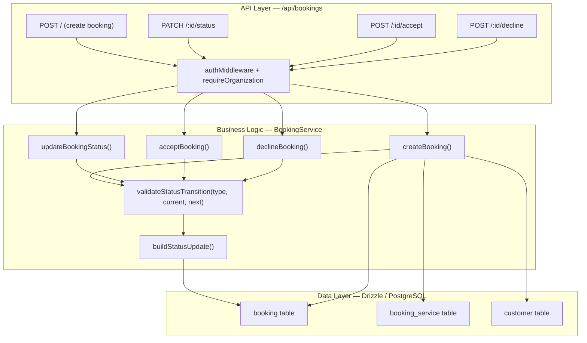
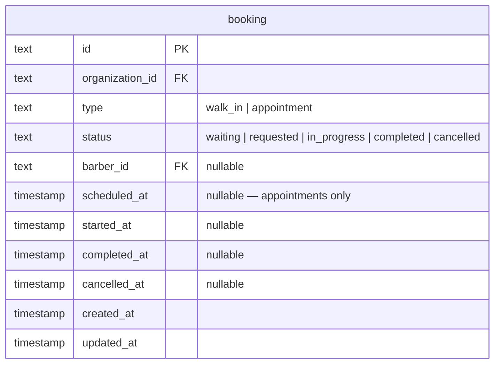

# Implementation Plan: Booking State Machine By Type

**Feature PRD:** [booking-state-machine-by-type/prd.md](./prd.md)
**Epic:** Cukkr Step 2 - Backend Surface Completion & Contract Consolidation
**Date:** April 28, 2026

---

## Goal

Enforce separate, explicit booking lifecycle state machines for `walk_in` and `appointment` bookings. Walk-in bookings must begin in `waiting`; appointments must begin in `requested`. A new `requested` status is introduced for appointments, with dedicated `accept` and `decline` actions resolving it to `waiting` or `cancelled`. All transition validation is centralized in the booking service layer so notification-driven and direct actions share the same rules. The legacy `pending` status is retired from Step 2 creation flows.

---

## Requirements

- Add `requested` to the booking status vocabulary in the model and remove `pending` from Step 2 creation paths.
- New walk-in bookings must be created with status `waiting`.
- New appointment bookings must be created with status `requested`.
- Valid transitions per type:
  - `walk_in`: `waiting → in_progress → completed`; cancellable from `waiting` or `in_progress`.
  - `appointment`: `requested → waiting → in_progress → completed`; cancellable from `requested`, `waiting`, or `in_progress`.
- Appointment `accept` moves `requested → waiting`.
- Appointment `decline` moves `requested → cancelled`.
- `Handle this` (`waiting → in_progress`) must be validated against booking type; it is only valid for `walk_in`.
- Transition validation must be centralized — a single private service method used by all action paths including notification-triggered ones.
- Terminal bookings (`completed`, `cancelled`) may not transition further.
- Add `POST /api/bookings/:id/accept` and `POST /api/bookings/:id/decline` action endpoints.
- Update the existing `PATCH /api/bookings/:id/status` to use the new type-aware rules.
- Integration tests must cover:
  - Walk-in initial status.
  - Appointment initial status.
  - All valid transitions per type.
  - Invalid transition rejection for each type.
  - Accept/decline happy paths.
  - Accept/decline on expired (non-`requested`) appointments.
  - Terminal-state protection.

---

## Technical Considerations

### System Architecture Overview



### Database Schema Design

No new tables required. The `booking.status` column is already `text` and accepts any string value. The `requested` status is introduced purely at the application layer.



**Status vocabulary after this feature:**

| Status | Applicable types | Terminal |
|---|---|---|
| `waiting` | walk_in, appointment | No |
| `requested` | appointment only | No |
| `in_progress` | walk_in, appointment | No |
| `completed` | walk_in, appointment | Yes |
| `cancelled` | walk_in, appointment | Yes |

`pending` is removed from new creation flows. It remains in the DB enum constants for backward data compatibility but no new row will be created with it.

### API Design

#### Existing endpoints — updated behavior

**`POST /api/bookings/`**
- walk_in body → `status = 'waiting'` on insert (already correct).
- appointment body → `status = 'requested'` on insert (change from current `'waiting'`).
- No request/response shape change; the `BookingDetailResponse` already exposes `status`.

**`PATCH /api/bookings/:id/status`**
- `BookingStatusUpdateInput.status` must now include `requested` as a valid enum member.
- Transition is validated with the new type-aware function.
- Generic status patch remains for internal/admin usage (e.g. reverting `in_progress → waiting`).

#### New endpoints

**`POST /api/bookings/:id/accept`**
- Auth: requireAuth + requireOrganization
- Params: `{ id: string }`
- Body: none
- Logic: load booking, assert type === `appointment`, assert status === `requested`, call `validateStatusTransition`, update to `waiting`.
- Response: `BookingDetailResponse`
- Errors: `NOT_FOUND`, `BAD_REQUEST` (wrong type or invalid transition)

**`POST /api/bookings/:id/decline`**
- Auth: requireAuth + requireOrganization
- Params: `{ id: string }`
- Body: optional `{ cancelReason?: string }`
- Logic: load booking, assert type === `appointment`, assert status === `requested`, update to `cancelled`.
- Response: `BookingDetailResponse`
- Errors: `NOT_FOUND`, `BAD_REQUEST`

#### Type-aware transition table (centralized in service)

```
WALK_IN_TRANSITIONS = {
  waiting:     ['in_progress', 'cancelled'],
  in_progress: ['completed', 'cancelled'],
  completed:   [],
  cancelled:   []
}

APPOINTMENT_TRANSITIONS = {
  requested:   ['waiting', 'cancelled'],   // waiting = accept, cancelled = decline
  waiting:     ['in_progress', 'cancelled'],
  in_progress: ['completed', 'cancelled'],
  completed:   [],
  cancelled:   []
}
```

The `validateStatusTransition(type, currentStatus, nextStatus)` function looks up the appropriate map and throws `AppError('BAD_REQUEST')` when the transition is not found.

### Security & Performance

- All mutation endpoints remain behind `requireAuth` + `requireOrganization`.
- No new indexes required; existing `booking_organizationId_status_idx` covers status-based queries.
- Transition validation is O(1) map lookup — no additional DB queries.
- `checkSingleInProgress` guard remains on `in_progress` transitions.

---

## Implementation Steps

### Step 1 — Update `model.ts`

1. Add `'requested'` to `BOOKING_STATUSES` array constant.
2. Update `BookingStatusEnum` TypeBox union to include `t.Literal('requested')`.
3. Add `BookingDeclineInput = t.Object({ cancelReason: t.Optional(t.Nullable(t.String({ maxLength: 500 }))) })`.
4. Keep `BOOKING_LIST_STATUSES` unchanged (do not expose `requested` as a filter option unless needed by the UI — check PRD; it is not mentioned, so skip for now).

### Step 2 — Update `service.ts`

1. Replace the flat `STATUS_TRANSITIONS` record with two separate maps: `WALK_IN_TRANSITIONS` and `APPOINTMENT_TRANSITIONS`.
2. Update `validateStatusTransition` signature to `(type: BookingType, currentStatus: BookingStatus, nextStatus: BookingStatus): void`.
3. Update `createBooking` to set `status: input.type === 'appointment' ? 'requested' : 'waiting'`.
4. Update `updateBookingStatus` to pass `existing.type` to `validateStatusTransition`.
5. Add `acceptBooking(organizationId, id)`:
   - Load booking.
   - Assert type === `appointment` and status === `requested`.
   - Call `validateStatusTransition('appointment', 'requested', 'waiting')`.
   - Update status to `waiting`.
   - Return updated booking detail.
6. Add `declineBooking(organizationId, id, input)`:
   - Load booking.
   - Assert type === `appointment` and status === `requested`.
   - Update status to `cancelled`, set `cancelledAt = now`.
   - Return updated booking detail.

### Step 3 — Update `handler.ts`

1. Add `POST /:id/accept` route wired to `BookingService.acceptBooking`.
2. Add `POST /:id/decline` route wired to `BookingService.declineBooking` with body `BookingModel.BookingDeclineInput`.

### Step 4 — Update Tests (`tests/modules/bookings.test.ts`)

1. Add test: create walk-in → assert status is `waiting`.
2. Add test: create appointment → assert status is `requested`.
3. Add test: appointment accept → assert status becomes `waiting`.
4. Add test: appointment decline → assert status becomes `cancelled`.
5. Add test: accept on non-appointment booking → 400.
6. Add test: accept when status is not `requested` → 400.
7. Add test: walk-in direct status patch `waiting → in_progress → completed` → succeeds.
8. Add test: walk-in skip `requested` state → ensure `requested` is not accepted as initial.
9. Add test: terminal booking status patch → 400.

---

## Files To Change

| File | Change |
|---|---|
| `src/modules/bookings/model.ts` | Add `requested` to status enum; add `BookingDeclineInput` |
| `src/modules/bookings/service.ts` | Type-aware transitions; `requested` initial status for appointments; `acceptBooking`; `declineBooking` |
| `src/modules/bookings/handler.ts` | Add `POST /:id/accept` and `POST /:id/decline` routes |
| `tests/modules/bookings.test.ts` | New lifecycle test cases per type |
