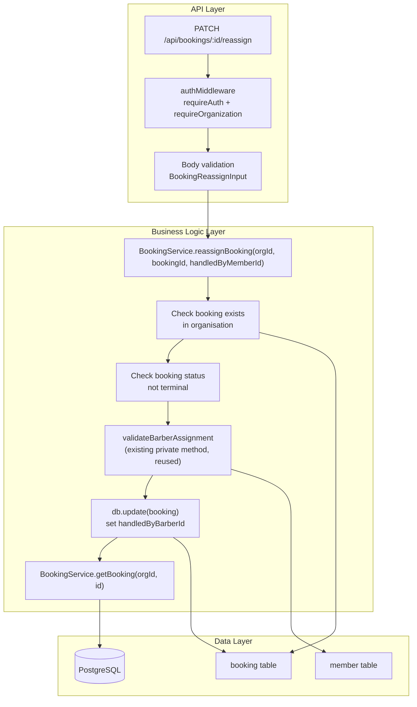

# Implementation Plan: Booking Take Over And Reassignment

**Feature PRD:** [prd.md](./prd.md)
**Epic:** [Cukkr Step 2 - Backend Surface Completion & Contract Consolidation](../epic.md)
**Date:** April 28, 2026

---

## Goal

Introduce a dedicated `PATCH /api/bookings/:id/reassign` action inside the existing `bookings` module. The action updates `handledByBarberId` without touching `barberId` (the originally requested barber), is restricted to active (non-terminal) bookings, enforces organisation scoping for both the booking and the target barber, and returns a full `BookingDetailResponse` so the UI can refresh current handler state.

No new tables or migrations are required. All work is contained in `model.ts`, `service.ts`, and `handler.ts` of the bookings module, plus the test file.

---

## Requirements

- `PATCH /api/bookings/:id/reassign` accepts `{ handledByMemberId: string }` in the request body.
- The endpoint requires `requireAuth: true` and `requireOrganization: true`.
- Service validates the target booking exists in the active organisation — throw `NOT_FOUND` if absent.
- Service validates the booking is not in a terminal state (`completed` or `cancelled`) — throw `BAD_REQUEST` if it is.
- Service validates that the target member (`handledByMemberId`) belongs to the same organisation and has role `owner` or `barber` — throw `BAD_REQUEST` if invalid.
- Service sets `handledByBarberId = handledByMemberId` and `updatedAt = now()`. No other fields are mutated.
- `barberId` (requestedBarber) remains unchanged.
- Returns a full `BookingDetailResponse` (reuse `getBooking`).
- Integration tests cover: successful reassignment, cross-org member rejection, terminal-state rejection (completed), terminal-state rejection (cancelled).

---

## Technical Considerations

### System Architecture Overview



### Database Schema Design

No schema changes. The `booking` table already has `handledByBarberId text references member(id) on delete set null`. No migration needed.

### API Design

#### Endpoint

```
PATCH /api/bookings/:id/reassign
```

**Authentication:** `requireAuth: true`, `requireOrganization: true`

**URL params:** `id` — booking id (minLength: 1)

**Request body:**
```typescript
{
  handledByMemberId: string   // minLength: 1 — target member to handle the booking
}
```

**Success response (200):** Full `BookingDetailResponse` (existing type) wrapped in `FormatResponseSchema`.

**Error cases:**
| Condition | Status |
|---|---|
| Booking not found in organisation | 404 Not Found |
| Booking is `completed` or `cancelled` | 400 Bad Request |
| `handledByMemberId` is not an owner/barber in the organisation | 400 Bad Request |
| Not authenticated | 401 Unauthorized |
| No active organisation | 403 Forbidden |

#### Model changes (`model.ts`)

Add inside `BookingModel` namespace:

```typescript
BookingReassignInput = t.Object({
  handledByMemberId: t.String({ minLength: 1 })
}, { additionalProperties: false })
type BookingReassignInput = typeof BookingReassignInput.static
```

#### Service changes (`service.ts`)

Add public static method `reassignBooking(organizationId, id, input)`:

```
1. Fetch existing booking (org-scoped) — NOT_FOUND if missing
2. If status is 'completed' or 'cancelled' → throw BAD_REQUEST "Cannot reassign a booking in terminal state"
3. Call existing private validateBarberAssignment(organizationId, input.handledByMemberId) to verify target member
4. db.update(booking).set({ handledByBarberId: input.handledByMemberId, updatedAt: now })
   .where(and(eq(booking.id, id), eq(booking.organizationId, organizationId)))
5. Return getBooking(organizationId, id)
```

The private `validateBarberAssignment` already checks org membership and role — reuse it directly.

#### Handler changes (`handler.ts`)

Append a new route to `bookingsHandler`:

```
.patch('/:id/reassign', handler, {
  requireAuth: true,
  requireOrganization: true,
  params: BookingModel.BookingIdParam,
  body: BookingModel.BookingReassignInput,
  response: FormatResponseSchema(BookingModel.BookingDetailResponse)
})
```

### Security & Performance

- Scoped by `activeOrganizationId` via `requireOrganization` — cross-org access blocked at middleware level and service level.
- Member validation in the same DB call path as existing `validateBarberAssignment` — no extra round trips beyond the existing pattern.
- No caching required — bookings are real-time operational data.
- No new indexes required — `booking.id` + `booking.organizationId` covered by existing index; `member.id` + `member.organizationId` covered by existing index.

---

## Integration Tests (`tests/modules/bookings.test.ts`)

Add a new `describe` block "Booking Reassignment" inside the existing test file:

1. **Setup:** Create owner + org, create appointment booking in `requested` state, create a second barber member in the same org.
2. **Test: successful reassignment** — `PATCH /api/bookings/:id/reassign` with valid `handledByMemberId` → 200, response `handledByBarber.memberId` equals target, `requestedBarber` unchanged.
3. **Test: cross-org member rejection** — Use a `handledByMemberId` from a different org → 400.
4. **Test: terminal state (completed) rejection** — Advance booking to `completed`, attempt reassign → 400.
5. **Test: terminal state (cancelled) rejection** — Decline booking to `cancelled`, attempt reassign → 400.
6. **Test: unauthenticated** — No cookie → 401.

---

## Checklist

- [ ] `BookingModel.BookingReassignInput` added to `model.ts`
- [ ] `BookingService.reassignBooking` implemented in `service.ts`
- [ ] Route `PATCH /:id/reassign` added to `handler.ts`
- [ ] Integration tests written and passing
- [ ] `bun run lint:fix` and `bun run format` pass
- [ ] `bun run build` passes
- [ ] `bun test --env-file=.env` full suite passes
