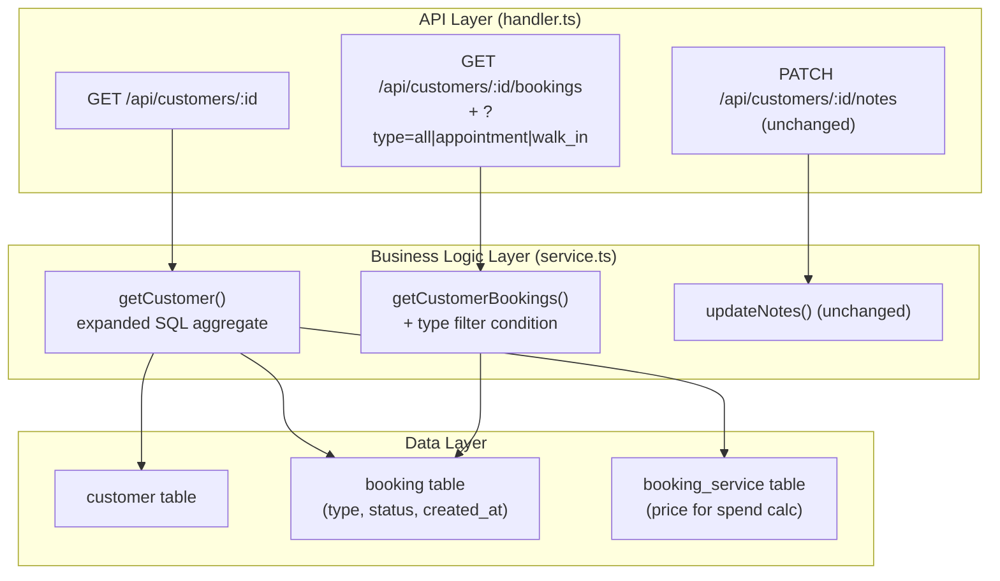

# Implementation Plan: Customer Detail Stats And Booking Type Filter

**Feature PRD:** [prd.md](./prd.md)
**Epic:** [Cukkr Step 2 - Backend Surface Completion & Contract Consolidation](../epic.md)

---

## Goal

Extend `GET /api/customers/:id` with richer aggregate statistics (appointment count, walk-in count, completed count, cancelled count in addition to the existing total bookings, total spend, and last visit), and add an optional `type` filter (`all`, `appointment`, `walk_in`) to `GET /api/customers/:id/bookings`. All changes are additive — existing pagination behavior and notes update flow remain unchanged, and the expanded stats are computed server-side using SQL aggregation already established for the list query.

---

## Requirements

- `GET /api/customers/:id` must return: `totalBookings`, `appointmentCount`, `walkInCount`, `completedCount`, `cancelledCount`, `totalSpend`, `lastVisitAt`, `notes`, `createdAt` (and existing identity fields).
- Aggregate stats are scoped to the customer's organization only.
- `GET /api/customers/:id/bookings` accepts optional `type` query param (`all` | `appointment` | `walk_in`), defaulting to `all`.
- Filtered history returns only bookings of the requested type.
- Pagination behavior (page, limit, totalItems) remains unchanged.
- `PATCH /api/customers/:id/notes` remains unchanged.
- Integration tests must cover:
  - Customer detail returns correct counts for a mixed appointment + walk-in history.
  - `GET /:id/bookings?type=appointment` returns only appointments.
  - `GET /:id/bookings?type=walk_in` returns only walk-ins.
  - `GET /:id/bookings` (no type) returns all bookings.
  - Stats reflect cancelled counts correctly.

---

## Technical Considerations

### System Architecture Overview



### Database Query Design

**Expanded `getCustomer` SQL aggregates** (all in one query, grouped by customer):

```sql
-- New aggregates added to existing SELECT:
COUNT(DISTINCT CASE WHEN booking.type = 'appointment'
  AND booking.status IN ('waiting','in_progress','completed') THEN booking.id END)  AS appointment_count

COUNT(DISTINCT CASE WHEN booking.type = 'walk_in'
  AND booking.status IN ('waiting','in_progress','completed') THEN booking.id END)  AS walk_in_count

COUNT(DISTINCT CASE WHEN booking.status = 'completed' THEN booking.id END)          AS completed_count

COUNT(DISTINCT CASE WHEN booking.status = 'cancelled' THEN booking.id END)          AS cancelled_count
```

These are all computable within the existing LEFT JOIN against `booking` and `booking_service` — no extra table scan needed.

**Type filter on `getCustomerBookings`:**

```sql
-- Added to WHERE when type !== 'all':
AND booking.type = :type
```

### API Design

**`GET /api/customers/:id` — updated response:**
```typescript
{
  id: string
  name: string
  email: string | null
  phone: string | null
  isVerified: boolean
  notes: string | null
  createdAt: Date
  totalBookings: number        // existing
  appointmentCount: number     // NEW
  walkInCount: number          // NEW
  completedCount: number       // NEW
  cancelledCount: number       // NEW
  totalSpend: number           // existing
  lastVisitAt: Date | null     // existing
}
```

**`GET /api/customers/:id/bookings` — updated query params:**
```typescript
{
  page?: number
  limit?: number
  type?: 'all' | 'appointment' | 'walk_in'   // NEW, defaults to 'all'
}
```

### Security & Performance

- No new auth requirements; existing `requireAuth + requireOrganization` macros apply.
- All new aggregate expressions use conditional `COUNT(DISTINCT ...)` — they run in the same query as the existing stats; no extra round-trips.
- The type filter adds a single equality condition on an already-indexed `(organizationId, customerId)` booking lookup — negligible performance impact.
- No schema migration required (stats are derived from existing data).

---

## Implementation Steps

1. **Model** (`src/modules/customer-management/model.ts`)
   - Add `appointmentCount`, `walkInCount`, `completedCount`, `cancelledCount` fields to `CustomerDetailResponse`.
   - Add `BookingTypeFilterEnum = t.Union([t.Literal('all'), t.Literal('appointment'), t.Literal('walk_in')])`.
   - Update the `/:id/bookings` query schema in the handler to include the new `type` param.

2. **Service** (`src/modules/customer-management/service.ts`)
   - Update `getCustomer`:
     - Add four new `sql<number>` aggregate expressions for `appointmentCount`, `walkInCount`, `completedCount`, `cancelledCount`.
     - Include them in the `.select()` and the return object.
   - Update `getCustomerBookings(orgId, customerId, query)`:
     - Accept `type?: 'all' | 'appointment' | 'walk_in'` in the query parameter.
     - When `type` is `appointment` or `walk_in`, add `eq(booking.type, type)` to the where clause.

3. **Handler** (`src/modules/customer-management/handler.ts`)
   - Update `GET /:id/bookings` query schema to include `type: t.Optional(BookingTypeFilterEnum)`.
   - Pass `query.type` to `CustomerManagementService.getCustomerBookings`.

4. **Tests** (`tests/modules/customer-management.test.ts` — extend existing)
   - Setup: create a customer with 2 appointments (1 completed, 1 cancelled) and 1 walk-in (completed).
   - Test: `GET /customers/:id` → `appointmentCount = 2`, `walkInCount = 1`, `completedCount = 2`, `cancelledCount = 1`.
   - Test: `GET /customers/:id/bookings?type=appointment` → only appointment bookings returned.
   - Test: `GET /customers/:id/bookings?type=walk_in` → only walk-in bookings returned.
   - Test: `GET /customers/:id/bookings` (no type) → all bookings returned.
   - Test: notes update still works after stats expansion.
