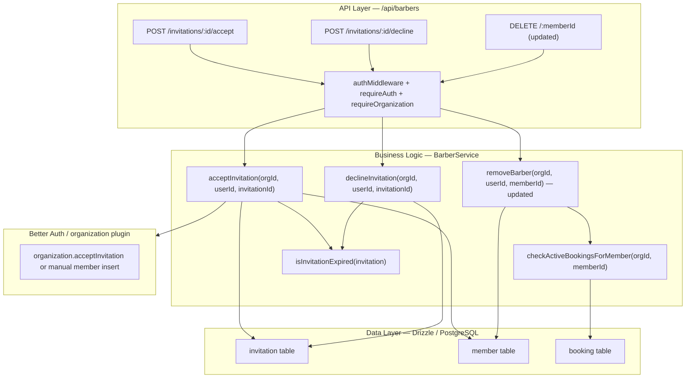
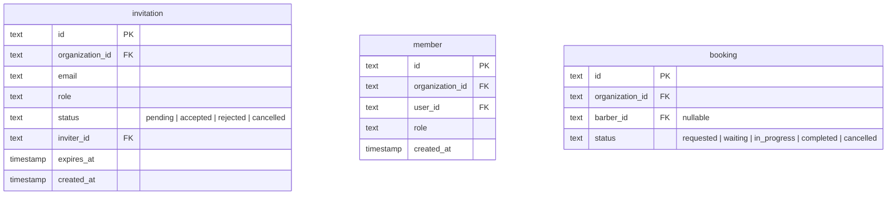

# Implementation Plan: Invitation Actions Expiry And Removal Safety

**Feature PRD:** [invitation-actions-expiry-and-removal-safety/prd.md](./prd.md)
**Epic:** Cukkr Step 2 - Backend Surface Completion & Contract Consolidation
**Date:** April 28, 2026

---

## Goal

Normalize barber invitation lifecycle by adding dedicated accept and decline action endpoints with explicit expiry semantics. Invitation payloads will expose `expiresAt` and an `expired` boolean so the frontend can determine actionability. Attempts to act on expired invitations return explicit errors. The barber removal flow is hardened to block removal when the target member has active bookings in `requested`, `waiting`, or `in_progress`, returning a clear error that instructs the caller to resolve or reassign those bookings first.

---

## Requirements

- Expose `POST /api/barbers/invitations/:invitationId/accept` for the authenticated invitee.
- Expose `POST /api/barbers/invitations/:invitationId/decline` for the authenticated invitee.
- Invitation list/detail responses must include `expiresAt` (timestamp) and `expired` (boolean).
- Accept/decline attempts on expired invitations must return an explicit error (400 or 422).
- Accept/decline attempts on non-pending invitations must return explicit errors.
- Only the intended invitee may accept or decline (verified by matching invitation email to authenticated user email).
- `DELETE /api/barbers/:memberId` must check for active bookings (`requested`, `waiting`, `in_progress`) belonging to the member before deleting.
- If active bookings exist, the removal must not proceed and must return a 409 Conflict or 422 response with a message instructing the caller to resolve or reassign.
- All invitation and booking-dependency checks must be scoped to the active organization.
- Integration tests must cover:
  - Accept valid invitation → member added, invitation status updated.
  - Decline valid invitation → invitation status updated.
  - Accept expired invitation → explicit error.
  - Decline expired invitation → explicit error.
  - Accept invitation that belongs to another user → 403.
  - Remove barber with no active bookings → succeeds.
  - Remove barber with active bookings → 409/422 with message.

---

## Technical Considerations

### System Architecture Overview



### Database Schema Design

No new tables. The `invitation` table (managed by Better Auth) already has `expiresAt`. The `expired` field is derived at read time: `new Date() > invitation.expiresAt`.

The `booking` table already has `status` and `barberId` columns sufficient for the active-bookings check.



### API Design

#### `POST /api/barbers/invitations/:invitationId/accept`

- **Auth:** requireAuth (no requireOrganization — invitee may not yet have an active org)
- **Params:** `{ invitationId: string }`
- **Body:** none
- **Logic:**
  1. Find invitation by `invitationId`.
  2. Verify `invitation.email === user.email` (case-insensitive).
  3. Check `invitation.status === 'pending'` → else 400.
  4. Check `new Date() <= invitation.expiresAt` → else 400 "Invitation has expired".
  5. Update `invitation.status = 'accepted'`.
  6. Insert into `member` table: `{ organizationId, userId: user.id, role: invitation.role }`.
- **Response (200):** `{ message: 'Invitation accepted' }`
- **Errors:** 400 (expired, not pending), 403 (email mismatch), 404 (not found)

**Note on Better Auth:** Better Auth's organization plugin may provide a built-in `acceptInvitation` call. Evaluate whether to delegate to it or implement manually via direct DB operations for predictability. Prefer the existing `db` client approach consistent with the rest of the codebase.

#### `POST /api/barbers/invitations/:invitationId/decline`

- **Auth:** requireAuth
- **Params:** `{ invitationId: string }`
- **Body:** none
- **Logic:**
  1. Find invitation by `invitationId`.
  2. Verify `invitation.email === user.email`.
  3. Check `invitation.status === 'pending'` → else 400.
  4. Check not expired → else 400 "Invitation has expired".
  5. Update `invitation.status = 'rejected'`.
- **Response (200):** `{ message: 'Invitation declined' }`

#### `DELETE /api/barbers/:memberId` — updated

Add active-booking check before deletion:
1. Count bookings where `barberId = memberId` and `status IN ('requested', 'waiting', 'in_progress')` scoped to `organizationId`.
2. If count > 0, throw `AppError('Barber has active bookings. Resolve or reassign them before removing.', 'CONFLICT')`.

#### Updated invitation payloads

The `BarberInviteResponse` and `BarberListItem` (for pending invitations) must expose:
- `expiresAt: Date`
- `expired: boolean` (derived: `new Date() > expiresAt`)

Update `BarberInviteResponse` and the pending items in `listBarbers`.

### Security & Performance

- Accept/decline require `requireAuth` but not `requireOrganization` (invitee may not belong to any org yet).
- Email ownership check (invitation.email === user.email) prevents unauthorized acceptance.
- Active-booking count query uses `barberId` index: `booking_organizationId_barberId_scheduledAt_idx` covers the filter.
- No new indexes required.

---

## Implementation Steps

### Step 1 — Update `barbers/model.ts`

1. Add `expired: t.Boolean()` and ensure `expiresAt: t.Date()` is present in `BarberInviteResponse`.
2. Add `InvitationActionResponse = t.Object({ message: t.String() })`.
3. Add `InvitationIdParam = t.Object({ invitationId: t.String({ minLength: 1 }) })` (may already exist).

### Step 2 — Update `barbers/service.ts`

1. Update `inviteBarber` return to include `expired: false` (new invitations are never expired at creation).
2. Update `listBarbers` pending invitation mapping to include `expiresAt` and `expired: new Date() > row.expiresAt`.
3. Add `acceptInvitation(organizationId: string, userId: string, invitationId: string)`:
   - Load invitation by id (no org filter — invitee may not be in org yet).
   - Verify invitation org matches the provided organizationId.
   - Load `user` by userId, verify `user.email.toLowerCase() === invitation.email.toLowerCase()`.
   - Check `invitation.status === 'pending'` else throw BAD_REQUEST.
   - Check `new Date() <= invitation.expiresAt` else throw BAD_REQUEST 'Invitation has expired'.
   - In transaction: update `invitation.status = 'accepted'`, insert `member` row.
   - Return `{ message: 'Invitation accepted' }`.
4. Add `declineInvitation(organizationId: string, userId: string, invitationId: string)`:
   - Load invitation, verify ownership (email match), status, expiry.
   - Update `invitation.status = 'rejected'`.
   - Return `{ message: 'Invitation declined' }`.
5. Update `removeBarber`:
   - Before `db.delete(member)`, query `count` of bookings with `barberId = targetMember.id`, `organizationId`, status IN `('requested', 'waiting', 'in_progress')`.
   - If count > 0, throw `AppError('Barber has active bookings. Resolve or reassign them before removing.', 'CONFLICT')`.

### Step 3 — Update `barbers/handler.ts`

1. Add `POST /invitations/:invitationId/accept`:
   ```
   .post('/invitations/:invitationId/accept',
     async ({ params, path, user, activeOrganizationId }) => {
       const data = await BarberService.acceptInvitation(activeOrganizationId, user.id, params.invitationId)
       return formatResponse({ path, data, message: data.message })
     },
     {
       requireAuth: true,
       requireOrganization: true,
       params: BarberModel.InvitationIdParam,
       response: FormatResponseSchema(BarberModel.InvitationActionResponse)
     }
   )
   ```
2. Add `POST /invitations/:invitationId/decline` similarly.

**Note:** For `accept`, `requireOrganization` is used to get `activeOrganizationId` for scoping the invitation lookup. The invitee must set an active org to call this endpoint, OR the `invitationId` is used to resolve the org. Evaluate whether to require the org in context or derive it from the invitation. Prefer requiring `requireOrganization: false` and deriving org from the invitation record to allow invitees to accept without having an existing active org set. In that case, load the invitation first, then verify the org.

**Revised approach for accept/decline:** Do NOT use `requireOrganization: true`. Instead, load the invitation by `invitationId`, verify it exists, verify the email matches the authenticated user, then check status and expiry. Pass the invitation's `organizationId` to the service. This allows a user who doesn't yet have an active org to accept the invitation.

### Step 4 — Update Tests

1. In `tests/modules/barbers.test.ts`:
   - Create invitation for a test user's email.
   - Accept it as that user → 200, user becomes member.
   - Create another invitation, decline it → 200, invitation status = rejected.
   - Create expired invitation (mock expiry), try to accept → 400.
   - Try to accept invitation with wrong user → 403.
   - Remove barber with no active bookings → 200.
   - Create active booking for barber, attempt remove → 409.

---

## Files To Change

| File | Change |
|---|---|
| `src/modules/barbers/model.ts` | Add `expired` to invite response; add `InvitationActionResponse`; add `InvitationIdParam` if missing |
| `src/modules/barbers/service.ts` | Add `acceptInvitation`; add `declineInvitation`; update `removeBarber` with safety check; update `listBarbers` with `expired` field |
| `src/modules/barbers/handler.ts` | Add `POST /invitations/:id/accept` and `POST /invitations/:id/decline` routes |
| `tests/modules/barbers.test.ts` | New test cases for accept, decline, expired, removal safety |
