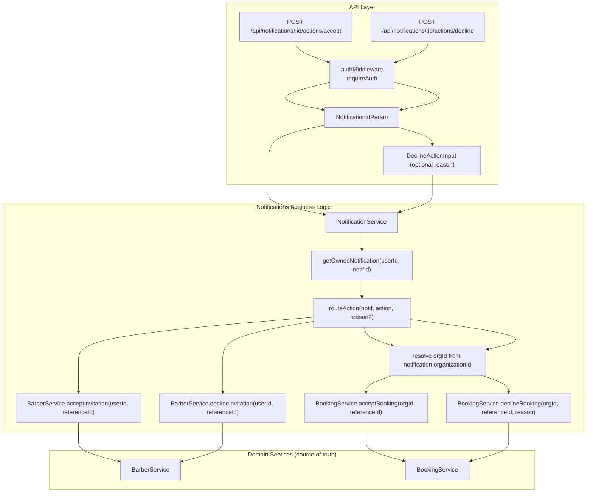

# Implementation Plan: Notification Action Mutations

**Feature PRD:** [prd.md](./prd.md)
**Epic:** [Cukkr Step 2 - Backend Surface Completion & Contract Consolidation](../epic.md)
**Date:** April 28, 2026

---

## Goal

Enrich the existing `notifications` module so that notifications carry enough action metadata for CTAs, and add two dedicated mutation endpoints that let authenticated users execute invitation accept/decline and appointment-request accept/decline actions directly from the notifications surface. The notifications module orchestrates routing; the owning domain services (`BarberService`, `BookingService`) remain the source of truth for business rules.

No new DB tables are needed. Changes are confined to `model.ts`, `service.ts`, and `handler.ts` of the notifications module, plus the test file.

---

## Requirements

- `NotificationListItem` must include `actionType` derived from the notification `type` field indicating which CTA (if any) is available: `accept_invite`, `decline_invite`, `accept_appointment`, `decline_appointment`, or `null` when no action is supported.
- Add `POST /api/notifications/:id/actions/accept` — executes the contextual accept action based on `referenceType` and `type`.
- Add `POST /api/notifications/:id/actions/decline` — executes the contextual decline action; accepts optional `{ reason: string }` body for appointment declines.
- Both endpoints require `requireAuth: true`.
- Service looks up the notification, verifies it belongs to the requesting user (ownership check, same as `getOwnedNotification`), then delegates to the appropriate domain service.
- For `referenceType = 'invitation'`: delegate to `BarberService.acceptInvitation` / `BarberService.declineInvitation`.
- For `referenceType = 'booking'` with `type = 'appointment_requested'`: delegate to `BookingService.acceptBooking` / `BookingService.declineBooking`.
- After successful delegation, mark the notification as read (or the caller can do so separately — keep the two concerns independent, do NOT auto-mark; rely on existing mark-as-read).
- Unsupported `referenceType` or `type` combinations return explicit 400 Bad Request.
- If `referenceId` is null on an actionable notification, return 400.
- Generic mark-as-read endpoints must continue to work unchanged.
- Integration tests cover: invitation accept, invitation decline, appointment accept, appointment decline, unsupported type, ownership enforcement.

---

## Technical Considerations

### System Architecture Overview



### actionType derivation

The `actionType` field on `NotificationListItem` is a **derived, computed field** — not stored in DB. It is computed in `toNotificationListItem` based on the notification's `type`:

| `notification.type` | `actionType` |
|---|---|
| `appointment_requested` | `accept_decline_appointment` |
| `barbershop_invitation` | `accept_decline_invite` |
| `walk_in_arrival` | `null` |

This is a simple mapping. No schema change.

### orgId for booking actions

`BookingService.acceptBooking` / `declineBooking` requires `organizationId`. The `notification` row already has `organizationId` — use it directly.

### Database Schema Design

No new tables. No migrations.

Existing tables used:
- `notification` — ownership check + referenceType/referenceId/organizationId lookup
- `invitation` — acted on via `BarberService` (existing)
- `booking` — acted on via `BookingService` (existing)

### API Design

#### Accept Action

```
POST /api/notifications/:id/actions/accept
```

**Authentication:** `requireAuth: true`

**URL params:** `id` (notificationId, minLength: 1)

**Request body:** none

**Success response (200):**
```typescript
{
  notificationId: string
  action: 'accepted'
  referenceType: 'booking' | 'invitation'
  referenceId: string
}
```

**Error cases:**
| Condition | Status |
|---|---|
| Notification not found / not owned | 404 |
| referenceId is null | 400 |
| Unsupported referenceType/type for accept | 400 |
| Domain-level failure (already accepted, expired, etc.) | propagated from domain service |

#### Decline Action

```
POST /api/notifications/:id/actions/decline
```

**Authentication:** `requireAuth: true`

**URL params:** `id` (notificationId, minLength: 1)

**Request body:**
```typescript
{
  reason?: string   // maxLength: 500, used for appointment decline
}
```

**Success response (200):**
```typescript
{
  notificationId: string
  action: 'declined'
  referenceType: 'booking' | 'invitation'
  referenceId: string
}
```

#### Model changes (`notifications/model.ts`)

1. Add `NotificationActionTypeEnum`:
```typescript
t.Union([
  t.Literal('accept_decline_appointment'),
  t.Literal('accept_decline_invite'),
  t.Null()
])
```

2. Extend `NotificationListItem` with:
```typescript
actionType: NotificationActionTypeEnum
```

3. Add new schemas:
```typescript
NotificationActionResponse = t.Object({
  notificationId: t.String(),
  action: t.Union([t.Literal('accepted'), t.Literal('declined')]),
  referenceType: NotificationReferenceTypeEnum,
  referenceId: t.String()
})

NotificationDeclineActionInput = t.Object({
  reason: t.Optional(t.String({ maxLength: 500 }))
}, { additionalProperties: false })
```

#### Service changes (`notifications/service.ts`)

1. Extend `toNotificationListItem` to compute and include `actionType` from `row.type`:
```
'appointment_requested' → 'accept_decline_appointment'
'barbershop_invitation' → 'accept_decline_invite'
otherwise → null
```

2. Add `executeAcceptAction(userId, notificationId)`:
```
1. getOwnedNotification(userId, notificationId) → NotificationRow
2. If referenceId is null → throw BAD_REQUEST "Notification has no reference"
3. Switch on referenceType:
   - 'invitation' → BarberService.acceptInvitation(userId, referenceId)
   - 'booking' (type = 'appointment_requested') → BookingService.acceptBooking(notif.organizationId, referenceId)
   - other → throw BAD_REQUEST "Action not supported for this notification type"
4. Return NotificationActionResponse { notificationId, action: 'accepted', referenceType, referenceId }
```

3. Add `executeDeclineAction(userId, notificationId, reason?)`:
```
1. getOwnedNotification(userId, notificationId) → NotificationRow
2. If referenceId is null → throw BAD_REQUEST
3. Switch on referenceType:
   - 'invitation' → BarberService.declineInvitation(userId, referenceId)
   - 'booking' (type = 'appointment_requested') → BookingService.declineBooking(orgId, referenceId, { reason: reason ?? '' })
     Note: reason is required by BookingService.declineBooking — use empty string fallback or require reason when declining appointments
   - other → throw BAD_REQUEST
4. Return NotificationActionResponse { notificationId, action: 'declined', referenceType, referenceId }
```

**Note on decline reason:** `BookingService.declineBooking` takes `{ reason: string }` (minLength: 1). The notification action decline should require `reason` when `referenceType = 'booking'`. Validate this in service: if `referenceType === 'booking'` and `!reason` → throw BAD_REQUEST "reason is required to decline an appointment".

#### Handler changes (`notifications/handler.ts`)

Append two routes:

```
.post('/:id/actions/accept', acceptActionHandler, {
  requireAuth: true,
  params: NotificationModel.NotificationIdParam,
  response: FormatResponseSchema(NotificationModel.NotificationActionResponse)
})

.post('/:id/actions/decline', declineActionHandler, {
  requireAuth: true,
  params: NotificationModel.NotificationIdParam,
  body: NotificationModel.NotificationDeclineActionInput,
  response: FormatResponseSchema(NotificationModel.NotificationActionResponse)
})
```

### Security & Performance

- Ownership enforced via `getOwnedNotification` (existing private method) — no cross-user action possible.
- Domain validation fully delegated — `BarberService` and `BookingService` enforce all their own rules; no duplication.
- `organizationId` taken from the notification row itself — no client-supplied org context needed for booking actions.
- Tenant isolation: invitation actions are user-scoped (Better Auth), booking actions are org-scoped using the notification's stored `organizationId`.
- Mark-as-read is kept separate — callers can mark read independently after action.

---

## Integration Tests (`tests/modules/notifications.test.ts`)

Add a new `describe` block "Notification Action Mutations":

**Setup:**
- Create owner user + org.
- Create a barber user.
- Owner invites barber → seeds a `barbershop_invitation` notification for barber with `referenceType: 'invitation'`.
- Owner creates an appointment booking → seeds an `appointment_requested` notification for owner with `referenceType: 'booking'`.

1. **`GET /api/notifications` includes `actionType` field** — verify `accept_decline_invite` for invitation notification, `accept_decline_appointment` for appointment notification, `null` for walk_in_arrival.
2. **Accept invitation from notification** — barber calls `POST /api/notifications/:inviteNotifId/actions/accept` → 200, `action: 'accepted'`, `referenceType: 'invitation'`.
3. **Decline invitation from notification** — create new invite, barber calls decline → 200, `action: 'declined'`.
4. **Accept appointment from notification** — owner calls `POST /api/notifications/:apptNotifId/actions/accept` → 200, booking advances to `waiting`.
5. **Decline appointment from notification** — create new appointment, owner calls decline with `{ reason: 'No slots' }` → 200, booking `cancelled`.
6. **Decline appointment without reason** → 400.
7. **Unsupported notification type (walk_in_arrival)** — attempt accept → 400.
8. **Cross-user notification action** → 404 (ownership enforced).
9. **Mark-as-read still works independently** — `PATCH /:id/read` after action → 200 unaffected.

---

## Checklist

- [ ] `NotificationModel` extended with `actionType`, `NotificationActionResponse`, `NotificationDeclineActionInput`
- [ ] `toNotificationListItem` computes `actionType`
- [ ] `NotificationService.executeAcceptAction` implemented
- [ ] `NotificationService.executeDeclineAction` implemented
- [ ] Routes `POST /:id/actions/accept` and `POST /:id/actions/decline` added to `handler.ts`
- [ ] Integration tests written and passing
- [ ] `bun run lint:fix` and `bun run format` pass
- [ ] `bun run build` passes
- [ ] `bun test --env-file=.env` full suite passes
