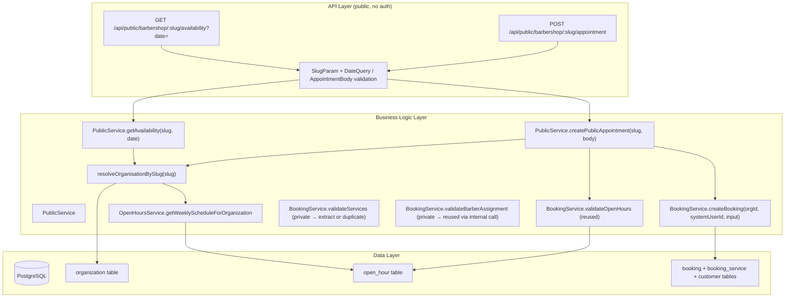

# Implementation Plan: Public Appointment Booking Flow

**Feature PRD:** [prd.md](./prd.md)
**Epic:** [Cukkr Step 2 - Backend Surface Completion & Contract Consolidation](../epic.md)
**Date:** April 28, 2026

---

## Goal

Extend the existing `public` module (no auth required) with two new endpoints:

1. `GET /api/public/barbershop/:slug/availability?date=YYYY-MM-DD` — returns available time windows derived from organisation open hours for the requested date.
2. `POST /api/public/barbershop/:slug/appointment` — creates an appointment booking with type `appointment` and initial status `requested`, validating against open hours and the existing booking lifecycle.

The feature reuses `BookingService.validateOpenHours` and `BookingService.createBooking` internally so that public appointments enter the same state machine as internal ones. No new tables or migrations are required.

---

## Requirements

- **Availability endpoint** resolves the organisation by slug; invalid slug → 404.
- Availability is derived from the organisation's weekly open-hours schedule for the requested date (single day). Returns `isOpen`, `openTime`, `closeTime` for that day.
- **Appointment submission endpoint** resolves organisation by slug; invalid slug → 404.
- Body fields: `customerName` (required), `customerPhone` (optional), `customerEmail` (optional), `serviceIds` (required, ≥1), `barberId` (optional, member in org with role owner/barber), `scheduledAt` (required ISO-8601), `notes` (optional).
- `scheduledAt` must be in the future and must fall within organisation open hours — throw 400 if outside.
- Step 2 does NOT reject based on slot overlap or occupancy.
- Service IDs must be active services belonging to the resolved organisation.
- Optional `barberId` must be an owner or barber in the resolved organisation if provided.
- On success, creates booking with `type = 'appointment'`, `status = 'requested'`.
- `createdById` is set to a system-placeholder user ID or the anonymous public user convention (see technical notes below).
- Returns a `PublicAppointmentCreatedResponse` with enough data for the UI to confirm the booking.
- Integration tests cover: valid create, invalid slug, out-of-open-hours rejection, subsequent accept/decline lifecycle.

---

## Technical Considerations

### System Architecture Overview



### createdById for Public Bookings

`booking.createdById` is `NOT NULL` and references `user.id`. Public appointments have no authenticated user. Two options:

**Option A (recommended):** During public appointment creation, pass the organisation's owner member `userId` as `createdById`. Retrieve it via `member` table (`role = 'owner'` for the resolved org). This requires no schema changes and no system user seeding.

**Option B:** Seed a global `system` user once in migrations. More complex.

**Use Option A.** `PublicService.createPublicAppointment` will resolve the owner `userId` from the `member` table and pass it as `createdById`. This is auditable and consistent.

### Reusing BookingService internals

`BookingService.validateOpenHours` is already `public static` — reuse directly.

`BookingService.createBooking` is `public static` — call it from `PublicService` directly. The input type is `BookingModel.BookingCreateInput` (discriminated union), so pass `type: 'appointment'`.

This ensures: customer dedup, reference number generation, service price snapshot, notification dispatch — all happen identically to internal appointments.

### Database Schema Design

No new tables. No migrations.

Existing tables used:
- `organization` — slug lookup
- `open_hour` — availability derivation
- `member` — barber/owner validation + owner userId for `createdById`
- `customer` — dedup or creation inside `BookingService.createBooking`
- `booking`, `booking_service`, `booking_daily_counter` — all handled by `createBooking`

### API Design

#### Availability Endpoint

```
GET /api/public/barbershop/:slug/availability?date=YYYY-MM-DD
```

**Authentication:** None

**URL params:** `slug` string (minLength: 1)

**Query params:** `date` string matching `^\d{4}-\d{2}-\d{2}$` (required)

**Success response (200):**
```typescript
{
  date: string        // echo of requested date
  isOpen: boolean
  openTime: string | null    // "HH:MM" WIB
  closeTime: string | null   // "HH:MM" WIB
}
```

**Error cases:** 404 if slug not found, 400 if date format invalid.

#### Appointment Create Endpoint

```
POST /api/public/barbershop/:slug/appointment
```

**Authentication:** None

**URL params:** `slug` string (minLength: 1)

**Request body:**
```typescript
{
  customerName: string          // minLength: 1, maxLength: 100
  customerPhone?: string | null // maxLength: 20
  customerEmail?: string | null // email format, maxLength: 254
  serviceIds: string[]          // minItems: 1, uniqueItems: true
  barberId?: string | null      // optional barber preference
  scheduledAt: string           // ISO-8601 date-time
  notes?: string | null         // maxLength: 500
}
```

**Success response (201):**
```typescript
{
  id: string
  referenceNumber: string
  type: 'appointment'
  status: 'requested'
  scheduledAt: Date
  customerName: string
  serviceNames: string[]
  requestedBarber: { memberId, name } | null
}
```

**Error cases:**
| Condition | Status |
|---|---|
| Slug not found | 404 |
| `scheduledAt` outside open hours | 400 |
| `scheduledAt` in the past | 400 |
| Invalid/inactive serviceIds | 400 |
| Invalid `barberId` | 400 |
| Body validation failure | 422 |

#### Model changes (`public/model.ts`)

Add inside `PublicModel` namespace:

```typescript
PublicAvailabilityQuery = t.Object({
  date: t.String({ pattern: '^\\d{4}-\\d{2}-\\d{2}$' })
})

PublicAvailabilityResponse = t.Object({
  date: t.String(),
  isOpen: t.Boolean(),
  openTime: t.Nullable(t.String()),
  closeTime: t.Nullable(t.String())
})

PublicAppointmentCreateInput = t.Object({
  customerName: t.String({ minLength: 1, maxLength: 100 }),
  customerPhone: t.Optional(t.Nullable(t.String({ minLength: 1, maxLength: 20 }))),
  customerEmail: t.Optional(t.Nullable(t.String({ format: 'email', maxLength: 254 }))),
  serviceIds: t.Array(t.String({ minLength: 1 }), { minItems: 1, uniqueItems: true }),
  barberId: t.Optional(t.Nullable(t.String({ minLength: 1 }))),
  scheduledAt: t.String({ format: 'date-time' }),
  notes: t.Optional(t.Nullable(t.String({ maxLength: 500 })))
}, { additionalProperties: false })

PublicAppointmentCreatedResponse = t.Object({
  id: t.String(),
  referenceNumber: t.String(),
  type: t.Literal('appointment'),
  status: t.Literal('requested'),
  scheduledAt: t.Date(),
  customerName: t.String(),
  serviceNames: t.Array(t.String()),
  requestedBarber: t.Nullable(t.Object({ memberId: t.String(), name: t.String() }))
})
```

#### Service changes (`public/service.ts`)

Add two methods to `PublicService`:

**`getAvailability(slug, date)`:**
```
1. Resolve org by slug → NOT_FOUND if absent
2. Parse date string; invalid → BAD_REQUEST
3. Call OpenHoursService.getWeeklyScheduleForOrganization(org.id)
4. Determine dayOfWeek from the date (WIB offset: +7h, same as BookingService)
5. Return { date, isOpen, openTime, closeTime } from schedule[dayOfWeek]
```

**`createPublicAppointment(slug, input)`:**
```
1. Resolve org by slug → NOT_FOUND if absent
2. Fetch owner member userId (member where organizationId = org.id AND role = 'owner' LIMIT 1) → BAD_REQUEST if none found
3. Call BookingService.createBooking(org.id, ownerUserId, { type: 'appointment', ...input })
   — this internally validates scheduledAt, open hours, services, barberId
4. Map returned BookingDetailResponse → PublicAppointmentCreatedResponse
```

#### Handler changes (`public/handler.ts`)

Extend `publicHandler` with two new routes chained to the existing `.get('/barbershop/:slug', ...)`:

```
.get('/barbershop/:slug/availability', availabilityHandler, { params, query, response })
.post('/barbershop/:slug/appointment', appointmentHandler, { params, body, response, set.status = 201 })
```

### Security & Performance

- No authentication required — public surface. All tenant scoping is via slug resolution (slug → organizationId).
- `createdById` set to owner user — no anonymous user footprint, auditable.
- No new indexes needed — `organization.slug` already has a unique index.
- `BookingService.createBooking` sends booking notifications to org staff after creation — this is intentional and correct for public appointments.

---

## Integration Tests (`tests/modules/public-barbershop.test.ts`)

Add a new `describe` block "Public Appointment Booking Flow":

**Setup:** Create owner + org, configure open hours (e.g. Monday–Saturday 09:00–17:00), create a test service (active), obtain a future scheduledAt on an open day within hours.

1. **Availability: valid slug + open day** → 200, `isOpen: true`, openTime/closeTime populated.
2. **Availability: valid slug + closed day** → 200, `isOpen: false`.
3. **Availability: invalid slug** → 404.
4. **Appointment create: valid** → 201, booking has `type: 'appointment'`, `status: 'requested'`, `referenceNumber` present, `serviceNames` correct.
5. **Appointment create: invalid slug** → 404.
6. **Appointment create: scheduledAt outside open hours** → 400.
7. **Appointment create: scheduledAt in the past** → 400.
8. **Appointment create: invalid serviceId** → 400.
9. **Lifecycle: accept created appointment** → Use existing `POST /api/bookings/:id/accept` with owner cookie; expect 200 and `status: 'waiting'`.
10. **Lifecycle: decline created appointment** → Create another appointment, use `POST /api/bookings/:id/decline`; expect 200 and `status: 'cancelled'`.

---

## Checklist

- [ ] `PublicModel` extended with availability and appointment types in `model.ts`
- [ ] `PublicService.getAvailability` implemented in `service.ts`
- [ ] `PublicService.createPublicAppointment` implemented in `service.ts`
- [ ] Two new routes added to `handler.ts`
- [ ] Integration tests written and passing
- [ ] `bun run lint:fix` and `bun run format` pass
- [ ] `bun run build` passes
- [ ] `bun test --env-file=.env` full suite passes
