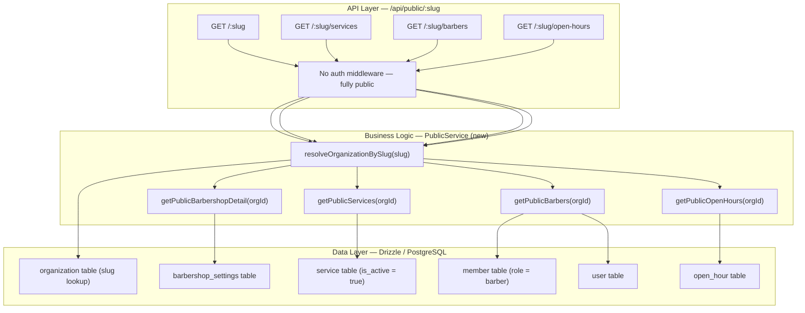

# Implementation Plan: Public Barbershop Landing And Read Surface

**Feature PRD:** [public-barbershop-landing-and-read-surface/prd.md](./prd.md)
**Epic:** Cukkr Step 2 - Backend Surface Completion & Contract Consolidation
**Date:** April 28, 2026

---

## Goal

Expose a fully public, unauthenticated read surface anchored by barbershop slug. Customers can view barbershop branding and metadata, active services, customer-visible barbers, and open-hours scheduling data before submitting a booking. Every downstream query resolves the organization from the slug and scopes results to that organization only. Responses exclude internal-only fields, inactive entries, and sensitive membership metadata. Invalid slugs return an explicit not-found response.

---

## Requirements

- Expose `GET /api/public/:slug` — public barbershop detail (name, description, address, slug, logoUrl, open-status metadata).
- Expose `GET /api/public/:slug/services` — active services only (no inactive services).
- Expose `GET /api/public/:slug/barbers` — active, customer-visible barbers only (excludes pending invitations, excludes internal notes).
- Expose `GET /api/public/:slug/open-hours` — open-hours schedule for the barbershop.
- All four endpoints are unauthenticated (no auth middleware required).
- All four endpoints resolve the organization from the slug and scope all downstream queries to that organization.
- An invalid slug returns a 404 not-found response.
- Public responses must not expose: internal notes, inactive services, sensitive member metadata, or `organizationId` where not needed.
- Integration tests must cover:
  - Valid slug → barbershop detail returned.
  - Invalid slug → 404.
  - Active-only services for a resolved organization.
  - Active-only barbers for a resolved organization.
  - Open-hours for a resolved organization.
  - Cross-organization isolation (slug of org A does not return data from org B).

---

## Technical Considerations

### System Architecture Overview



### Database Schema Design

No new tables or columns. This feature reads from existing tables using public-safe projections.

Relevant tables:
- `organization`: slug, name (lookup + detail)
- `barbershop_settings`: description, address, logoUrl (after logo-upload feature adds it)
- `service`: id, name, description, price, duration, discount, imageUrl, isActive (filter to true)
- `member`: id, userId, role (filter to 'barber'), organizationId
- `user`: name, image (avatarUrl) — exposed for public barber cards
- `open_hour`: dayOfWeek, isOpen, openTime, closeTime

### API Design

All endpoints share a `SlugParam = t.Object({ slug: t.String({ minLength: 3, maxLength: 60 }) })`.

#### `GET /api/public/:slug`

- **Auth:** None
- **Response (200):**
  ```
  {
    id: string
    name: string
    slug: string
    description: string | null
    address: string | null
    logoUrl: string | null
    isCurrentlyOpen: boolean          // derived from open hours + current WIB time
    todayOpenTime: string | null      // e.g. "09:00"
    todayCloseTime: string | null     // e.g. "21:00"
  }
  ```
- **Error:** 404 if slug not found

#### `GET /api/public/:slug/services`

- **Auth:** None
- **Response (200):** Array of:
  ```
  {
    id: string
    name: string
    description: string | null
    price: number
    duration: number
    discount: number
    imageUrl: string | null
  }
  ```
  Filtered to `isActive = true`. Ordered by name ascending.

#### `GET /api/public/:slug/barbers`

- **Auth:** None
- **Response (200):** Array of:
  ```
  {
    id: string       // member.id
    name: string     // user.name
    avatarUrl: string | null  // user.image
  }
  ```
  Filtered to active members with role `barber`. Ordered by name ascending. Excludes owners and pending invitations. No email, phone, or internal metadata exposed.

#### `GET /api/public/:slug/open-hours`

- **Auth:** None
- **Response (200):** Array of:
  ```
  {
    dayOfWeek: number   // 0 = Sunday, 6 = Saturday
    isOpen: boolean
    openTime: string | null
    closeTime: string | null
  }
  ```
  All 7 days returned (some may have isOpen: false). Ordered by dayOfWeek ascending.

### Module Architecture

Create a new `public` module at `src/modules/public/`:
- `handler.ts` — Elysia group with prefix `/public`, no auth middleware
- `model.ts` — Public-safe response types
- `service.ts` — `PublicService` abstract class with all public query methods

Register `publicHandler` in `src/app.ts` under the `/api` group.

**Slug resolution helper:**
```
static async resolveOrganizationBySlug(slug: string): Promise<string>
```
- Query `organization` where `slug = slug`.
- Return `organization.id`.
- Throw `AppError('Barbershop not found', 'NOT_FOUND')` if not found.

This is similar to `WalkInPinService.resolveOrganizationBySlug`. Consider extracting to a shared util or reusing the walk-in pin service method if it's accessible without circular dependency. Otherwise, implement independently in `PublicService`.

### Security & Performance

- No authentication required — these are fully public read endpoints.
- Public responses are read-only and expose only safe customer-facing fields.
- `isCurrentlyOpen` is computed server-side from the open-hours schedule and the current WIB time (reuse the time utility functions from `BookingService` or extract to `src/utils/time.ts`).
- Slug lookup uses `organization.slug` which has a unique index.
- Service and member queries are filtered by `organizationId` — no cross-org leakage is possible.
- Rate limiting is inherited from the global app rate limiter (100 req/IP). No additional rate limiting needed for Step 2.

---

## Implementation Steps

### Step 1 — Create `src/modules/public/model.ts`

Define:
- `PublicSlugParam`
- `PublicBarbershopDetailResponse`
- `PublicServiceItem`
- `PublicBarberItem`
- `PublicOpenHourItem`

### Step 2 — Create `src/modules/public/service.ts`

Implement `PublicService` with:
1. `resolveOrganizationBySlug(slug)` — reuse pattern from `WalkInPinService`.
2. `getPublicBarbershopDetail(organizationId)` — join `organization` + `barbershopSettings`, compute `isCurrentlyOpen` / `todayOpenTime` / `todayCloseTime` using open-hours data.
3. `getPublicServices(organizationId)` — query `service` where `organizationId` and `isActive = true`, order by name.
4. `getPublicBarbers(organizationId)` — query `member` where `organizationId` and `role = 'barber'`, join `user`, map to public barber items.
5. `getPublicOpenHours(organizationId)` — query `openHour` where `organizationId`, order by `dayOfWeek`.

### Step 3 — Create `src/modules/public/handler.ts`

```
export const publicHandler = new Elysia({ prefix: '/public', tags: ['Public'] })
  .get('/:slug', ...)
  .get('/:slug/services', ...)
  .get('/:slug/barbers', ...)
  .get('/:slug/open-hours', ...)
```

No auth middleware applied.

### Step 4 — Register in `src/app.ts`

Import `publicHandler` and add `.use(publicHandler)` inside the `/api` group.

### Step 5 — Create `tests/modules/public-barbershop.test.ts`

Test cases:
1. Setup: create a barbershop org with slug, add services (active + inactive), add barber member, configure open hours.
2. `GET /api/public/:slug` → 200, correct fields returned.
3. `GET /api/public/invalid-slug-xyz` → 404.
4. `GET /api/public/:slug/services` → only active services.
5. `GET /api/public/:slug/barbers` → only active barbers (member with role barber), no email/phone exposed.
6. `GET /api/public/:slug/open-hours` → all 7 days returned.
7. Create org B with slug B; `GET /api/public/slugA/services` must not return org B's services.

---

## Files To Create

| File | Description |
|---|---|
| `src/modules/public/model.ts` | Public response type schemas |
| `src/modules/public/service.ts` | `PublicService` with all public query methods |
| `src/modules/public/handler.ts` | Elysia route group `/public/:slug` |
| `tests/modules/public-barbershop.test.ts` | Integration tests for public surface |

## Files To Change

| File | Change |
|---|---|
| `src/app.ts` | Import and register `publicHandler` |
