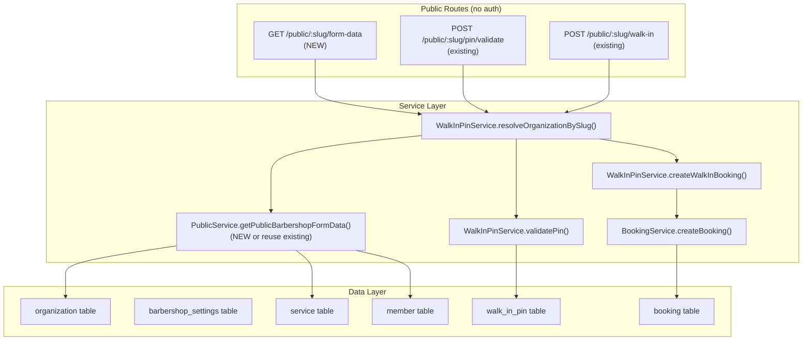

# Implementation Plan: Public Walk In Support Data

**Feature PRD:** [prd.md](./prd.md)
**Epic:** [Cukkr Step 2 - Backend Surface Completion & Contract Consolidation](../epic.md)

---

## Goal

Formalize and test the complete public walk-in journey by confirming the three existing endpoints (`GET /public/barbershop/:slug` for form data, `POST /public/:slug/pin/validate`, `POST /public/:slug/walk-in`) work together end-to-end with proper slug-based tenant isolation and token gating. A dedicated `GET /public/:slug/form-data` endpoint is added so the walk-in form can resolve services and barbers through the same slug-namespaced path used by PIN validation and walk-in submission. Integration tests cover PIN validation, form data fetch, end-to-end submission, and rejection of invalid tokens.

---

## Requirements

- `POST /public/:slug/pin/validate` — remains unchanged, already implemented.
- `POST /public/:slug/walk-in` — remains unchanged, already implemented.
- `GET /public/:slug/form-data` — NEW endpoint that returns the services and barbers needed to populate the walk-in form, scoped to the slug's organization.
- Walk-in submission must require a valid, unconsumed PIN-validation token.
- Successful walk-in creation must produce a booking with `type = walk_in` and initial `status = waiting`.
- Invalid slug returns 404 on all public endpoints.
- Invalid or expired PIN returns an explicit 400 error.
- Integration tests must cover:
  - `GET /public/:slug/form-data` returns services and barbers.
  - Invalid slug returns 404.
  - `POST /public/:slug/pin/validate` succeeds with correct PIN.
  - `POST /public/:slug/pin/validate` returns 400 with wrong PIN.
  - `POST /public/:slug/walk-in` with valid token and payload creates booking (walk_in, waiting).
  - `POST /public/:slug/walk-in` without valid token returns 401.
  - Token replay is rejected (token cannot be used twice).

---

## Technical Considerations

### System Architecture Overview



### API Design

**`GET /public/:slug/form-data`**

No authentication required.

**Response:**
```typescript
{
  services: Array<{
    id: string
    name: string
    description: string | null
    price: number
    duration: number
    discount: number
    imageUrl: string | null
    isDefault: boolean
  }>
  barbers: Array<{
    id: string
    name: string
    avatarUrl: string | null
  }>
}
```

**Error:** 404 if slug not found.

**Implementation note:** Reuse `PublicService.getPublicBarbershop` internally and project only the `services` and `barbers` fields, OR add a slim `getWalkInFormData(slug)` method that performs a targeted query for active services and active barbers for the org.

### Security & Performance

- All three public endpoints resolve the organization by slug; if the slug is not found, `NOT_FOUND` is thrown before any data is returned — tenant isolation is enforced.
- `POST /public/:slug/walk-in` verifies the JWT token is signed with the organization's secret and that the `org` claim matches the resolved org ID.
- Token replay protection: `tokenConsumedAt` is set atomically in the same transaction as booking creation; a second attempt with the same token fails the `isNull(walkInPin.tokenConsumedAt)` check.
- Form data endpoint returns only `isActive = true` services and `role = barber` members — no internal data leaks.
- No rate limiting added at Step 2 (the PIN brute-force guard on `POST /pin/validate` already exists via `ipFailureGuard`).

---

## Implementation Steps

1. **Service** (`src/modules/public/service.ts`)
   - Add `static async getWalkInFormData(slug: string)` that returns `{ services, barbers }`.
   - This method resolves the org by slug, queries active services and barbers, and returns the walk-in-form shape.
   - Can share internal logic with `getPublicBarbershop` (extract slug-to-org + data queries as private helper).

2. **Model** (`src/modules/public/model.ts`)
   - Add `WalkInFormDataResponse` schema with `services` and `barbers` arrays (reuse existing item schemas).
   - Export it via `PublicModel.Schemas`.

3. **Handler** (`src/modules/walk-in-pin/handler.ts`)
   - Add `GET /:slug/form-data` route to `publicWalkInHandler` (the handler already has prefix `/public/:slug`).
   - No auth — unauthenticated public endpoint.
   - Calls `PublicService.getWalkInFormData(params.slug)`.
   - Response schema: `PublicModel.Schemas.WalkInFormDataResponse`.

4. **App registration** — confirm `publicWalkInHandler` is already registered in `src/app.ts`. If not, add it.

5. **Tests** (`tests/modules/walk-in-pin.test.ts` — extend existing)
   - Test: `GET /public/:slug/form-data` returns services and barbers for valid slug.
   - Test: `GET /public/:slug/form-data` returns 404 for unknown slug.
   - Test: full flow — validate PIN → get token → POST walk-in with valid token → booking created (walk_in, waiting).
   - Test: POST walk-in with invalid/tampered token → 401.
   - Test: token replay — second POST with same token → 401.
   - Test: POST walk-in with invalid serviceIds → 400.
