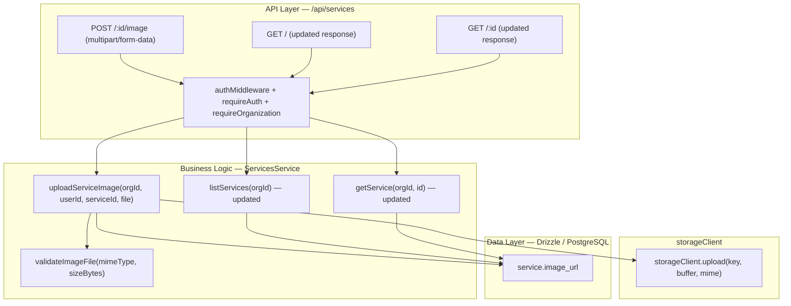
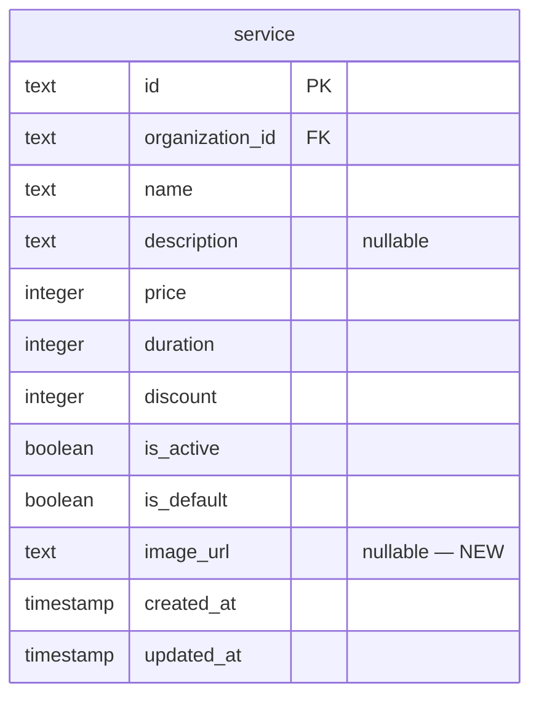

# Implementation Plan: Service Thumbnail Upload

**Feature PRD:** [service-thumbnail-upload/prd.md](./prd.md)
**Epic:** Cukkr Step 2 - Backend Surface Completion & Contract Consolidation
**Date:** April 28, 2026

---

## Goal

Add an optional `imageUrl` field to the `service` table and expose a dedicated upload endpoint so owners can attach a thumbnail to individual services. The image URL is returned from service list and detail contracts. Upload validation mirrors the barbershop logo rules: JPEG, PNG, or WebP only, 5 MB maximum. Services without images remain valid and fully readable.

---

## Requirements

- Add `imageUrl` column (nullable text) to the `service` table with a migration.
- Expose `POST /api/services/:id/image` endpoint for the active organization owner.
- Accept only `image/jpeg`, `image/png`, and `image/webp`.
- Reject files larger than 5 MB.
- On upload, store the file via `storageClient.upload` and persist the URL to `service.imageUrl`.
- Return the final `imageUrl` in the upload response.
- `GET /api/services` must include `imageUrl` for each service (null when absent).
- `GET /api/services/:id` must include `imageUrl` (null when absent).
- Service creation and update flows must continue to work when no image is provided.
- Reject uploads for services that do not belong to the caller's active organization (404).
- Reject uploads from non-owner members (403).
- Integration tests must cover:
  - Valid upload → `imageUrl` returned and persisted.
  - Invalid MIME type → 400.
  - File > 5 MB → 400.
  - `GET /api/services` includes `imageUrl` after upload.
  - `GET /api/services/:id` includes `imageUrl` after upload.
  - Service without image → `imageUrl` is null in list/detail response.
  - Upload against service not in active org → 404.

---

## Technical Considerations

### System Architecture Overview



### Database Schema Design



**Migration:** Generate with `bunx drizzle-kit generate --name add_image_url_to_service`.

No new index required for the `imageUrl` column.

### API Design

#### `POST /api/services/:id/image`

- **Auth:** requireAuth + requireOrganization
- **Params:** `{ id: string }`
- **Body:** multipart/form-data with field `file: File`
- **Validation:**
  - `file.type` ∈ `{ image/jpeg, image/png, image/webp }`
  - `file.size` ≤ 5,242,880 bytes
- **Storage key:** `services/{organizationId}/{serviceId}/thumbnail/{nanoid()}.{ext}`
- **Logic:**
  1. Verify service exists and belongs to `organizationId` (throw 404 otherwise).
  2. Validate file.
  3. Upload to storage.
  4. Update `service.imageUrl`.
  5. Return response.
- **Response (200):**
  ```
  {
    imageUrl: string
  }
  ```
- **Error codes:** 400 (invalid mime/size), 403 (not owner), 404 (service not in org)

#### Updated `GET /api/services` and `GET /api/services/:id` responses

Add `imageUrl: string | null` to the service response model used by list and detail endpoints.

**Existing `ServiceResponse` (inferred from service module) — after change:**
```
{
  id: string
  name: string
  description: string | null
  price: number
  duration: number
  discount: number
  isActive: boolean
  isDefault: boolean
  imageUrl: string | null    ← NEW
  createdAt: Date
  updatedAt: Date
}
```

### Security & Performance

- Only org owners may upload (enforced in service layer via owner role check).
- MIME and size validation before storage — same rules as barbershop logo.
- Storage key includes `nanoid()` for cache-bust on re-upload.
- Old image URL is silently replaced; no storage deletion required for Step 2.

---

## Implementation Steps

### Step 1 — Update `services/schema.ts`

1. Add `imageUrl: text('image_url')` (nullable) to `service` table definition.

### Step 2 — Generate and apply migration

1. Run `bunx drizzle-kit generate --name add_image_url_to_service`.
2. Run `bunx drizzle-kit migrate`.

### Step 3 — Update `services/model.ts`

1. Inspect the existing service response schema (likely in `ServiceResponse` or similar).
2. Add `imageUrl: t.Nullable(t.String())` to the service list and detail response types.
3. Add `ServiceImageUploadInput = t.Object({ file: t.File() })`.
4. Add `ServiceImageUploadResponse = t.Object({ imageUrl: t.String() })`.
5. Add `ServiceIdParam = t.Object({ id: t.String({ minLength: 1 }) })` if not already present.

### Step 4 — Update `services/service.ts`

1. Inspect existing service layer methods (`listServices`, `getService`, and any create/update methods).
2. Update all SELECT queries to include `service.imageUrl` in the returned fields.
3. Update mapping functions to include `imageUrl: row.imageUrl ?? null` in response objects.
4. Add private `validateImageFile(mimeType: string, sizeBytes: number): void` (same logic as barbershop logo — consider extracting to a shared util if reuse is clean).
5. Add private helper `requireOwnerMember(organizationId, userId)` or reuse existing pattern.
6. Add `uploadServiceImage(organizationId, userId, serviceId, file: File): Promise<{ imageUrl: string }>`:
   - Assert caller is owner.
   - Find service by id + organizationId; throw NOT_FOUND if missing.
   - Call `validateImageFile`.
   - Determine extension from mimeType.
   - Generate storage key.
   - Upload via `storageClient`.
   - Update `service.imageUrl`.
   - Return `{ imageUrl }`.

### Step 5 — Update `services/handler.ts`

1. Add `POST /:id/image` route:
   ```
   .post('/:id/image', async ({ params, body, path, user, activeOrganizationId }) => { ... },
   {
     requireAuth: true,
     requireOrganization: true,
     params: ServiceModel.ServiceIdParam,
     body: ServiceModel.ServiceImageUploadInput,
     response: FormatResponseSchema(ServiceModel.ServiceImageUploadResponse)
   })
   ```

### Step 6 — Update Tests

1. In `tests/modules/service-management.test.ts`:
   - Upload valid WebP → 200, `imageUrl` returned.
   - `GET /api/services` → `imageUrl` present for updated service.
   - `GET /api/services/:id` → `imageUrl` present.
   - Service without image → `imageUrl` is null.
   - Upload with `image/gif` → 400.
   - Upload with file > 5 MB → 400.
   - Upload against non-existent service → 404.

---

## Files To Change

| File | Change |
|---|---|
| `src/modules/services/schema.ts` | Add `imageUrl` column |
| `src/modules/services/model.ts` | Add `imageUrl` to response types; add upload input/response models |
| `src/modules/services/service.ts` | Add `uploadServiceImage`; update list/detail mappers |
| `src/modules/services/handler.ts` | Add `POST /:id/image` route |
| `drizzle/` | New migration file (auto-generated) |
| `tests/modules/service-management.test.ts` | Image upload test cases |
