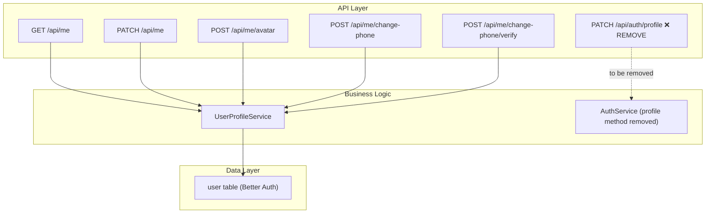

# Implementation Plan: Unified Profile Contract

**Feature PRD:** [unified-profile-contract/prd.md](./prd.md)
**Epic:** Cukkr Step 2 - Backend Surface Completion & Contract Consolidation
**Date:** April 28, 2026

---

## Goal

Make `/api/me` the single authoritative profile contract for Step 2. The `PATCH /api/auth/profile` route currently duplicates profile mutation functionality and creates ambiguity for mobile integration. This feature removes that legacy route from the active surface, verifies that all mobile profile use cases are covered by the existing `/api/me` family, and updates integration tests to prove the canonical contract without any dependency on the deprecated endpoint.

---

## Requirements

- `PATCH /api/auth/profile` must be removed from `src/modules/auth/handler.ts`.
- `GET /api/me` must return all fields required by the mobile profile screen.
- `PATCH /api/me` must accept editable profile fields (name, bio/other) and return the updated profile.
- `/api/me/avatar`, `/api/me/change-phone`, and `/api/me/change-phone/verify` must remain intact and reachable.
- Verify the `UserProfileService.updateProfile` implementation covers the fields previously handled by `AuthService.updateProfile`.
- If `AuthService.updateProfile` handles any field not yet covered by `/api/me`, port that field to `UserProfileService` before removing the legacy route.
- Remove or update any test that calls `PATCH /api/auth/profile` — replace with equivalent `/api/me` coverage.
- All unauthenticated access to `/api/me*` endpoints must return 401.

---

## Technical Considerations

### System Architecture Overview

### Database Schema Design

No schema changes required. Profile data is stored in the Better Auth `user` table which already contains all necessary fields.

### API Design

#### Removed endpoint

`PATCH /api/auth/profile` — deleted from `src/modules/auth/handler.ts`.

No deprecation notice is required since this is an internal contract consolidation, not a public API removal.

#### Canonical endpoints (unchanged, verified)

| Method | Path | Description |
|---|---|---|
| `GET` | `/api/me` | Read authenticated user profile |
| `PATCH` | `/api/me` | Update editable profile fields |
| `POST` | `/api/me/avatar` | Upload avatar image |
| `POST` | `/api/me/change-phone` | Initiate phone change OTP |
| `POST` | `/api/me/change-phone/verify` | Verify OTP and apply phone change |

**`PATCH /api/me` request fields (verify coverage vs legacy `PATCH /api/auth/profile`):**

Check `AuthModel.Schemas.UpdateProfileBody` and `UserProfileModel.UpdateProfileInput`. If the legacy route exposed a field not present in `UpdateProfileInput`, add that field to `UserProfileModel.UpdateProfileInput` and `UserProfileService.updateProfile` before removing the route.

**`GET /api/me` response:**
Must include: `id`, `name`, `email`, `phone`, `image` (avatarUrl), `role` (active org role), and any bio field.

### Security & Performance

- All `/api/me` routes already use `requireAuth`.
- No new indexes needed.
- The removal of `PATCH /api/auth/profile` does not affect performance.

---

## Implementation Steps

### Step 1 — Audit legacy vs canonical profile fields

1. Open `src/modules/auth/model.ts` → inspect `UpdateProfileBody`.
2. Open `src/modules/user-profile/model.ts` → inspect `UpdateProfileInput`.
3. If `UpdateProfileBody` contains fields absent from `UpdateProfileInput`:
   - Add those fields to `UserProfileModel.UpdateProfileInput`.
   - Add handling for those fields in `UserProfileService.updateProfile`.
4. Open `src/modules/auth/service.ts` → inspect `updateProfile` method. Confirm no unique side-effects exist that `UserProfileService` does not replicate.

### Step 2 — Remove legacy route

1. In `src/modules/auth/handler.ts`, delete the `PATCH /profile` route block (the `.patch('/profile', ...)` call).
2. If `AuthService.updateProfile` is no longer called from anywhere after this deletion, remove the method from `src/modules/auth/service.ts` to avoid dead code.
3. If `AuthModel.Schemas.UpdateProfileBody` and `UpdateProfileResponse` are no longer used anywhere, remove them from `src/modules/auth/model.ts`.

### Step 3 — Verify `/api/me` handler completeness

1. Confirm all five endpoints are present in `src/modules/user-profile/handler.ts`.
2. Confirm `PATCH /` endpoint returns a full `UserProfileResponse` matching what the mobile profile screen requires.

### Step 4 — Update tests

1. Open `tests/modules/auth.test.ts` and `tests/modules/user-profile.test.ts`.
2. If any test calls `PATCH /api/auth/profile`, replace it with `PATCH /api/me` using the same payload.
3. Add or verify integration test coverage for:
   - `PATCH /api/me` with valid name update → returns updated profile.
   - `PATCH /api/me` unauthenticated → 401.
   - `GET /api/me` authenticated → returns profile with required fields.
   - `GET /api/me` unauthenticated → 401.

---

## Files To Change

| File | Change |
|---|---|
| `src/modules/auth/handler.ts` | Remove `PATCH /profile` route |
| `src/modules/auth/service.ts` | Remove `updateProfile` method if no longer referenced |
| `src/modules/auth/model.ts` | Remove `UpdateProfileBody` / `UpdateProfileResponse` if orphaned |
| `src/modules/user-profile/model.ts` | Add any missing fields from legacy auth profile body |
| `src/modules/user-profile/service.ts` | Handle any newly added fields |
| `tests/modules/auth.test.ts` | Remove or replace `PATCH /api/auth/profile` calls |
| `tests/modules/user-profile.test.ts` | Add/verify canonical profile coverage |
